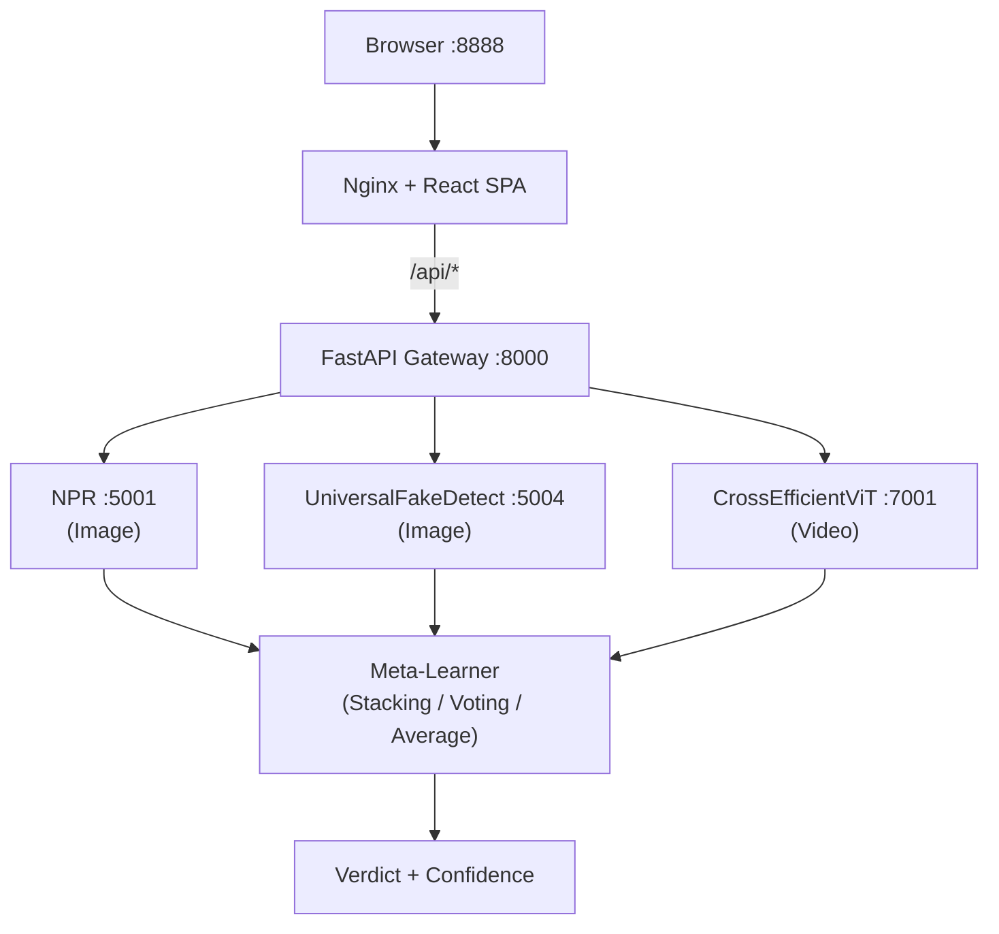

# 🛡 AmsR DeepShield

### Enterprise-grade deepfake detection across image, video, and audio

> Local host-based execution, AI text/code detection, file safety scanning, website trust analysis, and dual SQLite + MongoDB persistence are now supported. See [docs/local_setup.md](docs/local_setup.md).

DeepFake is a **modular, production-ready platform** designed to detect synthetic media with high confidence. It combines multiple state-of-the-art detection models into a unified **ensemble intelligence system**.

Each model runs in an isolated Docker container, while a centralized **API Gateway** orchestrates inference, aggregates predictions, and produces a final verdict using advanced fusion strategies.

> ⚡ Add a new model in minutes. Retrain the entire ensemble in a single command.

---

<div align="center">
  <table>
    <tr>
      <td width="50%">
        
      </td>
      <td width="50%">
        
      </td>
    </tr>
    <tr>
      <td width="50%">
        
      </td>
      <td width="50%">
        
      </td>
    </tr>
  </table>
</div>

---

<div align="center">
<h3>V2 of DeepShield - some chnages in ui ux and all stuff</h3>
  
</div>

  
## 🚀 Why AmsR DeepShield?

- 🧩 **Plug-and-play architecture** — easily integrate new detection models  
- 🐳 **Fully containerized** — clean, scalable, production-ready  
- 🧠 **Ensemble intelligence** — stronger than any single model  
- ⚡ **Fast API gateway** — optimized orchestration with FastAPI  
- 🔁 **Continuous improvement** — retrain anytime with one command  

---

## 🏗️ Architecture



### 🧠 Core Idea

Each model exposes:
- `GET /health` → service health check  
- `POST /predict` → inference endpoint  

The gateway dynamically reads model configs and handles routing, aggregation, and response generation — **no manual wiring needed**.

---

## ⚡ Quick Start

```bash
git clone https://github.com/aryan-maurya-developer/DeepFake or (https://github.com/aryan0-1maurya/DeepFake)
cd DeepFake
make start
```

| URL | Description |
|-----|------------|
| http://localhost:8888 | 🌐 Web dashboard |
| http://localhost:8000/docs | 📘 API (Swagger UI) |

---

## 🤖 Active Models

| Model | Type | Port | Description |
|------|------|------|-------------|
| **NPR Deepfake** | Image | 5001 | Detects subtle artifacts using neural patterns |
| **UniversalFakeDetect** | Image | 5004 | CLIP-based generalizable detector |
| **Cross-Efficient ViT** | Video | 7001 | Hybrid EfficientNet + Transformer |

> 📦 All model weights are mirrored on HuggingFace for reliability and fast access.

---

## 🧠 Ensemble Intelligence

DeepFake supports multiple fusion strategies:

| Method | Description |
|--------|------------|
| **Voting** | Majority decision across models |
| **Average** | Mean probability aggregation |
| **Stacking** | Meta-learner trained on model outputs |

Stacking uses trained artifacts stored in:
```
api/meta_model_artifacts/
```

Retrain anytime:
```bash
make retrain MEDIA_TYPE=image
```

---

## ➕ Add a New Model (2 Minutes Setup)

DeepFake provides an SDK that abstracts:
- HTTP serving  
- input decoding  
- thread safety  
- lifecycle management  

You only write inference logic.

### 🔧 Automated Setup

```bash
make add-model NAME=my_detector MEDIA_TYPE=image PORT=5008
make start
make retrain MEDIA_TYPE=image
```

### 🧩 Minimal Implementation

```python
import torch
from deepfake_sdk import ImageModel, PredictionResult

class MyDetector(ImageModel):
    def load(self):
        self.model = torch.load(self.weights_path("weights/model.pth"))
        self.model.eval()

    def predict(self, input_data: str, threshold: float) -> PredictionResult:
        image = self.decode_image(input_data)
        prob = self.run_inference(image)
        return self.make_result(probability=prob, threshold=threshold)
```

---

## 🔁 Retraining Pipeline

DeepFake includes a full training pipeline:

```bash
make retrain MEDIA_TYPE=image
```

Advanced tuning with Optuna:

```bash
make retrain MEDIA_TYPE=image OPTIMIZER=optuna TRIALS=100
```

What happens under the hood:

1. ✅ Health-check all models  
2. 📊 Run inference on benchmark dataset  
3. 🧮 Generate feature matrix  
4. 🤖 Train multiple classifiers:
   - Logistic Regression
   - Random Forest
   - Gradient Boosting
   - SVM, KNN, Naive Bayes
   - XGBoost, LightGBM  
5. 🏆 Select best performer automatically  

---

## 📊 Benchmark Dataset

Available on HuggingFace:

| Modality | Real | Fake | Total |
|----------|------|------|-------|
| Images | 2,000 | 2,000 | 4,000 |
| Audio | 1,000 | 1,000 | 2,000 |
| Video | 100 | 100 | 200 |

Supports **30+ generation techniques**, including:
- Stable Diffusion, Midjourney, DALL·E  
- Voice synthesis (HiFiGAN, WaveGlow)  
- Video generators (Sora, Gen-2, etc.)  

---

## 🔌 API Usage

### Predict (Base64)

```bash
curl -X POST http://localhost:8000/predict \
  -H "Content-Type: application/json" \
  -d '{"media_type": "image", "image_data": "<base64>", "ensemble_method": "voting"}'
```

### Upload File

```bash
curl -X POST http://localhost:8000/detect \
  -F "file=@photo.jpg" \
  -F "ensemble_method=stacking"
```

### Sample Response

```json
{
  "verdict": "fake",
  "confidence_in_verdict": 0.92,
  "ensemble_score_is_fake": 0.92,
  "ensemble_method_used": "stacking"
}
```

---

## 🔐 Authentication

```bash
# Register
curl -X POST http://localhost:8000/register

# Login
curl -X POST http://localhost:8000/token

# Access protected routes
curl -H "Authorization: Bearer <token>" http://localhost:8000/history
```

---

## 🛠️ Commands

```bash
make start         # Start services
make stop          # Stop services
make health        # Check model health
make test          # Run tests
make lint          # Code quality checks
make add-model     # Add new model
make retrain       # Retrain ensemble
make clean         # Cleanup containers
```

---

## 📁 Project Structure

```
DeepFake
    ├── .github
    │   ├── ISSUE_TEMPLATE
    │   │   ├── bug_report.md
    │   │   └── feature_request.md
    │   ├── workflows
    │   │   └── ci.yml
    │   └── PULL_REQUEST_TEMPLATE.md
    ├── api
    │   ├── meta_model_artifacts
    │   │   ├── image
    │   │   │   ├── deepfake_meta_feature_columns.json
    │   │   │   ├── deepfake_meta_imputer.joblib
    │   │   │   ├── deepfake_meta_learner.joblib
    │   │   │   └── deepfake_meta_scaler.joblib
    │   │   ├── video
    │   │   │   ├── deepfake_meta_feature_columns.json
    │   │   │   ├── deepfake_meta_imputer.joblib
    │   │   │   ├── deepfake_meta_learner.joblib
    │   │   │   └── deepfake_meta_scaler.joblib
    │   │   └── optimized_grid_average_weights_video.json
    │   ├── venv310
    │   │   ├── bin
    │   │   │   ├── activate
    │   │   │   ├── activate.csh
    │   │   │   ├── activate.fish
    │   │   │   ├── Activate.ps1
    │   │   │   ├── f2py
    │   │   │   ├── markdown-it
    │   │   │   ├── normalizer
    │   │   │   ├── numpy-config
    │   │   │   ├── pip
    │   │   │   ├── pip3
    │   │   │   ├── pip3.10
    │   │   │   ├── pygmentize
    │   │   │   ├── pyrsa-decrypt
    │   │   │   ├── pyrsa-encrypt
    │   │   │   ├── pyrsa-keygen
    │   │   │   ├── pyrsa-priv2pub
    │   │   │   ├── pyrsa-sign
    │   │   │   ├── pyrsa-verify
    │   │   │   ├── python
    │   │   │   ├── python3
    │   │   │   ├── python3.10
    │   │   │   └── uvicorn
    │   │   ├── include
    │   │   │   └── site
    │   │   │       └── python3.10
    │   │   │           └── greenlet
    │   │   │               └── greenlet.h
    │   │   ├── lib
    │   │   │   └── python3.10
    │   │   │       └── site-packages
    │   │   │           ├── _distutils_hack
    │   │   │           │   ├── __init__.py
    │   │   │           │   └── override.py
    │   │   │           ├── aiohttp
    │   │   │           │   ├── .hash
    │   │   │           │   │   ├── _cparser.pxd.hash
    │   │   │           │   │   ├── _find_header.pxd.hash
    │   │   │           │   │   ├── _helpers.pyi.hash
    │   │   │           │   │   ├── _helpers.pyx.hash
    │   │   │           │   │   ├── _http_parser.pyx.hash
    │   │   │           │   │   ├── _http_writer.pyx.hash
    │   │   │           │   │   ├── _websocket.pyx.hash
    │   │   │           │   │   └── hdrs.py.hash
    │   │   │           │   ├── __init__.py
    │   │   │           │   ├── _cparser.pxd
    │   │   │           │   ├── _find_header.pxd
    │   │   │           │   ├── _headers.pxi
    │   │   │           │   ├── _helpers.cpython-310-x86_64-linux-gnu.so
    │   │   │           │   ├── _helpers.pyi
    │   │   │           │   ├── _helpers.pyx
    │   │   │           │   ├── _http_parser.cpython-310-x86_64-linux-gnu.so
    │   │   │           │   ├── _http_parser.pyx
    │   │   │           │   ├── _http_writer.cpython-310-x86_64-linux-gnu.so
    │   │   │           │   ├── _http_writer.pyx
    │   │   │           │   ├── _websocket.cpython-310-x86_64-linux-gnu.so
    │   │   │           │   ├── _websocket.pyx
    │   │   │           │   ├── abc.py
    │   │   │           │   ├── base_protocol.py
    │   │   │           │   ├── client_exceptions.py
    │   │   │           │   ├── client_proto.py
    │   │   │           │   ├── client_reqrep.py
    │   │   │           │   ├── client_ws.py
    │   │   │           │   ├── client.py
    │   │   │           │   ├── connector.py
    │   │   │           │   ├── cookiejar.py
    │   │   │           │   ├── formdata.py
    │   │   │           │   ├── hdrs.py
    │   │   │           │   ├── helpers.py
    │   │   │           │   ├── http_exceptions.py
    │   │   │           │   ├── http_parser.py
    │   │   │           │   ├── http_websocket.py
    │   │   │           │   ├── http_writer.py
    │   │   │           │   ├── http.py
    │   │   │           │   ├── locks.py
    │   │   │           │   ├── log.py
    │   │   │           │   ├── multipart.py
    │   │   │           │   ├── payload_streamer.py
    │   │   │           │   ├── payload.py
    │   │   │           │   ├── py.typed
    │   │   │           │   ├── pytest_plugin.py
    │   │   │           │   ├── resolver.py
    │   │   │           │   ├── streams.py
    │   │   │           │   ├── tcp_helpers.py
    │   │   │           │   ├── test_utils.py
    │   │   │           │   ├── tracing.py
    │   │   │           │   ├── typedefs.py
    │   │   │           │   ├── web_app.py
    │   │   │           │   ├── web_exceptions.py
    │   │   │           │   ├── web_fileresponse.py
    │   │   │           │   ├── web_log.py
    │   │   │           │   ├── web_middlewares.py
    │   │   │           │   ├── web_protocol.py
    │   │   │           │   ├── web_request.py
    │   │   │           │   ├── web_response.py
    │   │   │           │   ├── web_routedef.py
    │   │   │           │   ├── web_runner.py
    │   │   │           │   ├── web_server.py
    │   │   │           │   ├── web_urldispatcher.py
    │   │   │           │   ├── web_ws.py
    │   │   │           │   ├── web.py
    │   │   │           │   └── worker.py
    │   │   │           ├── aiohttp-3.8.5.dist-info
    │   │   │           │   ├── INSTALLER
    │   │   │           │   ├── LICENSE.txt
    │   │   │           │   ├── METADATA
    │   │   │           │   ├── RECORD
    │   │   │           │   ├── REQUESTED
    │   │   │           │   ├── top_level.txt
    │   │   │           │   └── WHEEL
    │   │   │           ├── aiosignal
    │   │   │           │   ├── __init__.py
    │   │   │           │   └── py.typed
    │   │   │           ├── aiosignal-1.4.0.dist-info
    │   │   │           │   ├── licenses
    │   │   │           │   │   └── LICENSE
    │   │   │           │   ├── INSTALLER
    │   │   │           │   ├── METADATA
    │   │   │           │   ├── RECORD
    │   │   │           │   ├── top_level.txt
    │   │   │           │   └── WHEEL
    │   │   │           ├── annotated_types
    │   │   │           │   ├── __init__.py
    │   │   │           │   ├── py.typed
    │   │   │           │   └── test_cases.py
    │   │   │           ├── annotated_types-0.7.0.dist-info
    │   │   │           │   ├── licenses
    │   │   │           │   │   └── LICENSE
    │   │   │           │   ├── INSTALLER
    │   │   │           │   ├── METADATA
    │   │   │           │   ├── RECORD
    │   │   │           │   └── WHEEL
    │   │   │           ├── anyio
    │   │   │           │   ├── _backends
    │   │   │           │   │   ├── __init__.py
    │   │   │           │   │   ├── _asyncio.py
    │   │   │           │   │   └── _trio.py
    │   │   │           │   ├── _core
    │   │   │           │   │   ├── __init__.py
    │   │   │           │   │   ├── _compat.py
    │   │   │           │   │   ├── _eventloop.py
    │   │   │           │   │   ├── _exceptions.py
    │   │   │           │   │   ├── _fileio.py
    │   │   │           │   │   ├── _resources.py
    │   │   │           │   │   ├── _signals.py
    │   │   │           │   │   ├── _sockets.py
    │   │   │           │   │   ├── _streams.py
    │   │   │           │   │   ├── _subprocesses.py
    │   │   │           │   │   ├── _synchronization.py
    │   │   │           │   │   ├── _tasks.py
    │   │   │           │   │   ├── _testing.py
    │   │   │           │   │   └── _typedattr.py
    │   │   │           │   ├── abc
    │   │   │           │   │   ├── __init__.py
    │   │   │           │   │   ├── _resources.py
    │   │   │           │   │   ├── _sockets.py
    │   │   │           │   │   ├── _streams.py
    │   │   │           │   │   ├── _subprocesses.py
    │   │   │           │   │   ├── _tasks.py
    │   │   │           │   │   └── _testing.py
    │   │   │           │   ├── streams
    │   │   │           │   │   ├── __init__.py
    │   │   │           │   │   ├── buffered.py
    │   │   │           │   │   ├── file.py
    │   │   │           │   │   ├── memory.py
    │   │   │           │   │   ├── stapled.py
    │   │   │           │   │   ├── text.py
    │   │   │           │   │   └── tls.py
    │   │   │           │   ├── __init__.py
    │   │   │           │   ├── from_thread.py
    │   │   │           │   ├── lowlevel.py
    │   │   │           │   ├── py.typed
    │   │   │           │   ├── pytest_plugin.py
    │   │   │           │   ├── to_process.py
    │   │   │           │   └── to_thread.py
    │   │   │           ├── anyio-3.7.1.dist-info
    │   │   │           │   ├── entry_points.txt
    │   │   │           │   ├── INSTALLER
    │   │   │           │   ├── LICENSE
    │   │   │           │   ├── METADATA
    │   │   │           │   ├── RECORD
    │   │   │           │   ├── top_level.txt
    │   │   │           │   └── WHEEL
    │   │   │           ├── async_timeout
    │   │   │           │   ├── __init__.py
    │   │   │           │   └── py.typed
    │   │   │           ├── async_timeout-4.0.3.dist-info
    │   │   │           │   ├── INSTALLER
    │   │   │           │   ├── LICENSE
    │   │   │           │   ├── METADATA
    │   │   │           │   ├── RECORD
    │   │   │           │   ├── top_level.txt
    │   │   │           │   ├── WHEEL
    │   │   │           │   └── zip-safe
    │   │   │           ├── attr
    │   │   │           │   ├── __init__.py
    │   │   │           │   ├── __init__.pyi
    │   │   │           │   ├── _cmp.py
    │   │   │           │   ├── _cmp.pyi
    │   │   │           │   ├── _compat.py
    │   │   │           │   ├── _config.py
    │   │   │           │   ├── _funcs.py
    │   │   │           │   ├── _make.py
    │   │   │           │   ├── _next_gen.py
    │   │   │           │   ├── _typing_compat.pyi
    │   │   │           │   ├── _version_info.py
    │   │   │           │   ├── _version_info.pyi
    │   │   │           │   ├── converters.py
    │   │   │           │   ├── converters.pyi
    │   │   │           │   ├── exceptions.py
    │   │   │           │   ├── exceptions.pyi
    │   │   │           │   ├── filters.py
    │   │   │           │   ├── filters.pyi
    │   │   │           │   ├── py.typed
    │   │   │           │   ├── setters.py
    │   │   │           │   ├── setters.pyi
    │   │   │           │   ├── validators.py
    │   │   │           │   └── validators.pyi
    │   │   │           ├── attrs
    │   │   │           │   ├── __init__.py
    │   │   │           │   ├── __init__.pyi
    │   │   │           │   ├── converters.py
    │   │   │           │   ├── exceptions.py
    │   │   │           │   ├── filters.py
    │   │   │           │   ├── py.typed
    │   │   │           │   ├── setters.py
    │   │   │           │   └── validators.py
    │   │   │           ├── attrs-26.1.0.dist-info
    │   │   │           │   ├── licenses
    │   │   │           │   │   └── LICENSE
    │   │   │           │   ├── INSTALLER
    │   │   │           │   ├── METADATA
    │   │   │           │   ├── RECORD
    │   │   │           │   └── WHEEL
    │   │   │           ├── bcrypt
    │   │   │           │   ├── __init__.py
    │   │   │           │   ├── __init__.pyi
    │   │   │           │   ├── _bcrypt.abi3.so
    │   │   │           │   └── py.typed
    │   │   │           ├── bcrypt-5.0.0.dist-info
    │   │   │           │   ├── licenses
    │   │   │           │   │   └── LICENSE
    │   │   │           │   ├── INSTALLER
    │   │   │           │   ├── METADATA
    │   │   │           │   ├── RECORD
    │   │   │           │   ├── top_level.txt
    │   │   │           │   └── WHEEL
    │   │   │           ├── certifi
    │   │   │           │   ├── __init__.py
    │   │   │           │   ├── __main__.py
    │   │   │           │   ├── cacert.pem
    │   │   │           │   ├── core.py
    │   │   │           │   └── py.typed
    │   │   │           ├── certifi-2026.4.22.dist-info
    │   │   │           │   ├── licenses
    │   │   │           │   │   └── LICENSE
    │   │   │           │   ├── INSTALLER
    │   │   │           │   ├── METADATA
    │   │   │           │   ├── RECORD
    │   │   │           │   ├── top_level.txt
    │   │   │           │   └── WHEEL
    │   │   │           ├── cffi
    │   │   │           │   ├── __init__.py
    │   │   │           │   ├── _cffi_errors.h
    │   │   │           │   ├── _cffi_include.h
    │   │   │           │   ├── _embedding.h
    │   │   │           │   ├── _imp_emulation.py
    │   │   │           │   ├── _shimmed_dist_utils.py
    │   │   │           │   ├── api.py
    │   │   │           │   ├── backend_ctypes.py
    │   │   │           │   ├── cffi_opcode.py
    │   │   │           │   ├── commontypes.py
    │   │   │           │   ├── cparser.py
    │   │   │           │   ├── error.py
    │   │   │           │   ├── ffiplatform.py
    │   │   │           │   ├── lock.py
    │   │   │           │   ├── model.py
    │   │   │           │   ├── parse_c_type.h
    │   │   │           │   ├── pkgconfig.py
    │   │   │           │   ├── recompiler.py
    │   │   │           │   ├── setuptools_ext.py
    │   │   │           │   ├── vengine_cpy.py
    │   │   │           │   ├── vengine_gen.py
    │   │   │           │   └── verifier.py
    │   │   │           ├── cffi-2.0.0.dist-info
    │   │   │           │   ├── licenses
    │   │   │           │   │   ├── AUTHORS
    │   │   │           │   │   └── LICENSE
    │   │   │           │   ├── entry_points.txt
    │   │   │           │   ├── INSTALLER
    │   │   │           │   ├── METADATA
    │   │   │           │   ├── RECORD
    │   │   │           │   ├── top_level.txt
    │   │   │           │   └── WHEEL
    │   │   │           ├── charset_normalizer
    │   │   │           │   ├── cli
    │   │   │           │   │   ├── __init__.py
    │   │   │           │   │   └── __main__.py
    │   │   │           │   ├── __init__.py
    │   │   │           │   ├── __main__.py
    │   │   │           │   ├── api.py
    │   │   │           │   ├── cd.cpython-310-x86_64-linux-gnu.so
    │   │   │           │   ├── cd.py
    │   │   │           │   ├── constant.py
    │   │   │           │   ├── legacy.py
    │   │   │           │   ├── md.cpython-310-x86_64-linux-gnu.so
    │   │   │           │   ├── md.py
    │   │   │           │   ├── models.py
    │   │   │           │   ├── py.typed
    │   │   │           │   ├── utils.py
    │   │   │           │   └── version.py
    │   │   │           ├── charset_normalizer-3.4.7.dist-info
    │   │   │           │   ├── licenses
    │   │   │           │   │   └── LICENSE
    │   │   │           │   ├── entry_points.txt
    │   │   │           │   ├── INSTALLER
    │   │   │           │   ├── METADATA
    │   │   │           │   ├── RECORD
    │   │   │           │   ├── top_level.txt
    │   │   │           │   └── WHEEL
    │   │   │           ├── click
    │   │   │           │   ├── __init__.py
    │   │   │           │   ├── _compat.py
    │   │   │           │   ├── _termui_impl.py
    │   │   │           │   ├── _textwrap.py
    │   │   │           │   ├── _utils.py
    │   │   │           │   ├── _winconsole.py
    │   │   │           │   ├── core.py
    │   │   │           │   ├── decorators.py
    │   │   │           │   ├── exceptions.py
    │   │   │           │   ├── formatting.py
    │   │   │           │   ├── globals.py
    │   │   │           │   ├── parser.py
    │   │   │           │   ├── py.typed
    │   │   │           │   ├── shell_completion.py
    │   │   │           │   ├── termui.py
    │   │   │           │   ├── testing.py
    │   │   │           │   ├── types.py
    │   │   │           │   └── utils.py
    │   │   │           ├── click-8.3.3.dist-info
    │   │   │           │   ├── licenses
    │   │   │           │   │   └── LICENSE.txt
    │   │   │           │   ├── INSTALLER
    │   │   │           │   ├── METADATA
    │   │   │           │   ├── RECORD
    │   │   │           │   └── WHEEL
    │   │   │           ├── cryptography
    │   │   │           │   ├── hazmat
    │   │   │           │   │   ├── asn1
    │   │   │           │   │   │   ├── __init__.py
    │   │   │           │   │   │   └── asn1.py
    │   │   │           │   │   ├── backends
    │   │   │           │   │   │   ├── openssl
    │   │   │           │   │   │   │   ├── __init__.py
    │   │   │           │   │   │   │   └── backend.py
    │   │   │           │   │   │   └── __init__.py
    │   │   │           │   │   ├── bindings
    │   │   │           │   │   │   ├── _rust
    │   │   │           │   │   │   │   ├── openssl
    │   │   │           │   │   │   │   │   ├── __init__.pyi
    │   │   │           │   │   │   │   │   ├── aead.pyi
    │   │   │           │   │   │   │   │   ├── ciphers.pyi
    │   │   │           │   │   │   │   │   ├── cmac.pyi
    │   │   │           │   │   │   │   │   ├── dh.pyi
    │   │   │           │   │   │   │   │   ├── dsa.pyi
    │   │   │           │   │   │   │   │   ├── ec.pyi
    │   │   │           │   │   │   │   │   ├── ed25519.pyi
    │   │   │           │   │   │   │   │   ├── ed448.pyi
    │   │   │           │   │   │   │   │   ├── hashes.pyi
    │   │   │           │   │   │   │   │   ├── hmac.pyi
    │   │   │           │   │   │   │   │   ├── hpke.pyi
    │   │   │           │   │   │   │   │   ├── kdf.pyi
    │   │   │           │   │   │   │   │   ├── keys.pyi
    │   │   │           │   │   │   │   │   ├── mldsa.pyi
    │   │   │           │   │   │   │   │   ├── mlkem.pyi
    │   │   │           │   │   │   │   │   ├── poly1305.pyi
    │   │   │           │   │   │   │   │   ├── rsa.pyi
    │   │   │           │   │   │   │   │   ├── x25519.pyi
    │   │   │           │   │   │   │   │   └── x448.pyi
    │   │   │           │   │   │   │   ├── __init__.pyi
    │   │   │           │   │   │   │   ├── _openssl.pyi
    │   │   │           │   │   │   │   ├── asn1.pyi
    │   │   │           │   │   │   │   ├── declarative_asn1.pyi
    │   │   │           │   │   │   │   ├── exceptions.pyi
    │   │   │           │   │   │   │   ├── ocsp.pyi
    │   │   │           │   │   │   │   ├── pkcs12.pyi
    │   │   │           │   │   │   │   ├── pkcs7.pyi
    │   │   │           │   │   │   │   ├── test_support.pyi
    │   │   │           │   │   │   │   └── x509.pyi
    │   │   │           │   │   │   ├── openssl
    │   │   │           │   │   │   │   ├── __init__.py
    │   │   │           │   │   │   │   ├── _conditional.py
    │   │   │           │   │   │   │   └── binding.py
    │   │   │           │   │   │   ├── __init__.py
    │   │   │           │   │   │   └── _rust.abi3.so
    │   │   │           │   │   ├── decrepit
    │   │   │           │   │   │   ├── ciphers
    │   │   │           │   │   │   │   ├── __init__.py
    │   │   │           │   │   │   │   ├── algorithms.py
    │   │   │           │   │   │   │   └── modes.py
    │   │   │           │   │   │   └── __init__.py
    │   │   │           │   │   ├── primitives
    │   │   │           │   │   │   ├── asymmetric
    │   │   │           │   │   │   │   ├── __init__.py
    │   │   │           │   │   │   │   ├── dh.py
    │   │   │           │   │   │   │   ├── dsa.py
    │   │   │           │   │   │   │   ├── ec.py
    │   │   │           │   │   │   │   ├── ed25519.py
    │   │   │           │   │   │   │   ├── ed448.py
    │   │   │           │   │   │   │   ├── mldsa.py
    │   │   │           │   │   │   │   ├── mlkem.py
    │   │   │           │   │   │   │   ├── padding.py
    │   │   │           │   │   │   │   ├── rsa.py
    │   │   │           │   │   │   │   ├── types.py
    │   │   │           │   │   │   │   ├── utils.py
    │   │   │           │   │   │   │   ├── x25519.py
    │   │   │           │   │   │   │   └── x448.py
    │   │   │           │   │   │   ├── ciphers
    │   │   │           │   │   │   │   ├── __init__.py
    │   │   │           │   │   │   │   ├── aead.py
    │   │   │           │   │   │   │   ├── algorithms.py
    │   │   │           │   │   │   │   ├── base.py
    │   │   │           │   │   │   │   └── modes.py
    │   │   │           │   │   │   ├── kdf
    │   │   │           │   │   │   │   ├── __init__.py
    │   │   │           │   │   │   │   ├── argon2.py
    │   │   │           │   │   │   │   ├── concatkdf.py
    │   │   │           │   │   │   │   ├── hkdf.py
    │   │   │           │   │   │   │   ├── kbkdf.py
    │   │   │           │   │   │   │   ├── pbkdf2.py
    │   │   │           │   │   │   │   ├── scrypt.py
    │   │   │           │   │   │   │   └── x963kdf.py
    │   │   │           │   │   │   ├── serialization
    │   │   │           │   │   │   │   ├── __init__.py
    │   │   │           │   │   │   │   ├── base.py
    │   │   │           │   │   │   │   ├── pkcs12.py
    │   │   │           │   │   │   │   ├── pkcs7.py
    │   │   │           │   │   │   │   └── ssh.py
    │   │   │           │   │   │   ├── twofactor
    │   │   │           │   │   │   │   ├── __init__.py
    │   │   │           │   │   │   │   ├── hotp.py
    │   │   │           │   │   │   │   └── totp.py
    │   │   │           │   │   │   ├── __init__.py
    │   │   │           │   │   │   ├── _asymmetric.py
    │   │   │           │   │   │   ├── _cipheralgorithm.py
    │   │   │           │   │   │   ├── _modes.py
    │   │   │           │   │   │   ├── _serialization.py
    │   │   │           │   │   │   ├── cmac.py
    │   │   │           │   │   │   ├── constant_time.py
    │   │   │           │   │   │   ├── hashes.py
    │   │   │           │   │   │   ├── hmac.py
    │   │   │           │   │   │   ├── hpke.py
    │   │   │           │   │   │   ├── keywrap.py
    │   │   │           │   │   │   ├── padding.py
    │   │   │           │   │   │   └── poly1305.py
    │   │   │           │   │   ├── __init__.py
    │   │   │           │   │   └── _oid.py
    │   │   │           │   ├── x509
    │   │   │           │   │   ├── __init__.py
    │   │   │           │   │   ├── base.py
    │   │   │           │   │   ├── certificate_transparency.py
    │   │   │           │   │   ├── extensions.py
    │   │   │           │   │   ├── general_name.py
    │   │   │           │   │   ├── name.py
    │   │   │           │   │   ├── ocsp.py
    │   │   │           │   │   ├── oid.py
    │   │   │           │   │   └── verification.py
    │   │   │           │   ├── __about__.py
    │   │   │           │   ├── __init__.py
    │   │   │           │   ├── exceptions.py
    │   │   │           │   ├── fernet.py
    │   │   │           │   ├── py.typed
    │   │   │           │   └── utils.py
    │   │   │           ├── cryptography-48.0.0.dist-info
    │   │   │           │   ├── licenses
    │   │   │           │   │   ├── LICENSE
    │   │   │           │   │   ├── LICENSE.APACHE
    │   │   │           │   │   └── LICENSE.BSD
    │   │   │           │   ├── sboms
    │   │   │           │   │   ├── cryptography-rust.cyclonedx.json
    │   │   │           │   │   └── sbom.json
    │   │   │           │   ├── INSTALLER
    │   │   │           │   ├── METADATA
    │   │   │           │   ├── RECORD
    │   │   │           │   └── WHEEL
    │   │   │           ├── dateutil
    │   │   │           │   ├── parser
    │   │   │           │   │   ├── __init__.py
    │   │   │           │   │   ├── _parser.py
    │   │   │           │   │   └── isoparser.py
    │   │   │           │   ├── tz
    │   │   │           │   │   ├── __init__.py
    │   │   │           │   │   ├── _common.py
    │   │   │           │   │   ├── _factories.py
    │   │   │           │   │   ├── tz.py
    │   │   │           │   │   └── win.py
    │   │   │           │   ├── zoneinfo
    │   │   │           │   │   ├── __init__.py
    │   │   │           │   │   ├── dateutil-zoneinfo.tar.gz
    │   │   │           │   │   └── rebuild.py
    │   │   │           │   ├── __init__.py
    │   │   │           │   ├── _common.py
    │   │   │           │   ├── _version.py
    │   │   │           │   ├── easter.py
    │   │   │           │   ├── relativedelta.py
    │   │   │           │   ├── rrule.py
    │   │   │           │   ├── tzwin.py
    │   │   │           │   └── utils.py
    │   │   │           ├── ecdsa
    │   │   │           │   ├── __init__.py
    │   │   │           │   ├── _compat.py
    │   │   │           │   ├── _rwlock.py
    │   │   │           │   ├── _sha3.py
    │   │   │           │   ├── _version.py
    │   │   │           │   ├── curves.py
    │   │   │           │   ├── der.py
    │   │   │           │   ├── ecdh.py
    │   │   │           │   ├── ecdsa.py
    │   │   │           │   ├── eddsa.py
    │   │   │           │   ├── ellipticcurve.py
    │   │   │           │   ├── errors.py
    │   │   │           │   ├── keys.py
    │   │   │           │   ├── numbertheory.py
    │   │   │           │   ├── rfc6979.py
    │   │   │           │   ├── ssh.py
    │   │   │           │   ├── test_curves.py
    │   │   │           │   ├── test_der.py
    │   │   │           │   ├── test_ecdh.py
    │   │   │           │   ├── test_ecdsa.py
    │   │   │           │   ├── test_eddsa.py
    │   │   │           │   ├── test_ellipticcurve.py
    │   │   │           │   ├── test_jacobi.py
    │   │   │           │   ├── test_keys.py
    │   │   │           │   ├── test_malformed_sigs.py
    │   │   │           │   ├── test_numbertheory.py
    │   │   │           │   ├── test_pyecdsa.py
    │   │   │           │   ├── test_rw_lock.py
    │   │   │           │   ├── test_sha3.py
    │   │   │           │   └── util.py
    │   │   │           ├── ecdsa-0.19.2.dist-info
    │   │   │           │   ├── INSTALLER
    │   │   │           │   ├── LICENSE
    │   │   │           │   ├── METADATA
    │   │   │           │   ├── RECORD
    │   │   │           │   ├── top_level.txt
    │   │   │           │   └── WHEEL
    │   │   │           ├── exceptiongroup
    │   │   │           │   ├── __init__.py
    │   │   │           │   ├── _catch.py
    │   │   │           │   ├── _exceptions.py
    │   │   │           │   ├── _formatting.py
    │   │   │           │   ├── _suppress.py
    │   │   │           │   ├── _version.py
    │   │   │           │   └── py.typed
    │   │   │           ├── exceptiongroup-1.3.1.dist-info
    │   │   │           │   ├── licenses
    │   │   │           │   │   └── LICENSE
    │   │   │           │   ├── INSTALLER
    │   │   │           │   ├── METADATA
    │   │   │           │   ├── RECORD
    │   │   │           │   └── WHEEL
    │   │   │           ├── fastapi
    │   │   │           │   ├── dependencies
    │   │   │           │   │   ├── __init__.py
    │   │   │           │   │   ├── models.py
    │   │   │           │   │   └── utils.py
    │   │   │           │   ├── middleware
    │   │   │           │   │   ├── __init__.py
    │   │   │           │   │   ├── asyncexitstack.py
    │   │   │           │   │   ├── cors.py
    │   │   │           │   │   ├── gzip.py
    │   │   │           │   │   ├── httpsredirect.py
    │   │   │           │   │   ├── trustedhost.py
    │   │   │           │   │   └── wsgi.py
    │   │   │           │   ├── openapi
    │   │   │           │   │   ├── __init__.py
    │   │   │           │   │   ├── constants.py
    │   │   │           │   │   ├── docs.py
    │   │   │           │   │   ├── models.py
    │   │   │           │   │   └── utils.py
    │   │   │           │   ├── security
    │   │   │           │   │   ├── __init__.py
    │   │   │           │   │   ├── api_key.py
    │   │   │           │   │   ├── base.py
    │   │   │           │   │   ├── http.py
    │   │   │           │   │   ├── oauth2.py
    │   │   │           │   │   ├── open_id_connect_url.py
    │   │   │           │   │   └── utils.py
    │   │   │           │   ├── __init__.py
    │   │   │           │   ├── _compat.py
    │   │   │           │   ├── applications.py
    │   │   │           │   ├── background.py
    │   │   │           │   ├── concurrency.py
    │   │   │           │   ├── datastructures.py
    │   │   │           │   ├── encoders.py
    │   │   │           │   ├── exception_handlers.py
    │   │   │           │   ├── exceptions.py
    │   │   │           │   ├── logger.py
    │   │   │           │   ├── param_functions.py
    │   │   │           │   ├── params.py
    │   │   │           │   ├── py.typed
    │   │   │           │   ├── requests.py
    │   │   │           │   ├── responses.py
    │   │   │           │   ├── routing.py
    │   │   │           │   ├── staticfiles.py
    │   │   │           │   ├── templating.py
    │   │   │           │   ├── testclient.py
    │   │   │           │   ├── types.py
    │   │   │           │   ├── utils.py
    │   │   │           │   └── websockets.py
    │   │   │           ├── fastapi-0.103.1.dist-info
    │   │   │           │   ├── licenses
    │   │   │           │   │   └── LICENSE
    │   │   │           │   ├── INSTALLER
    │   │   │           │   ├── METADATA
    │   │   │           │   ├── RECORD
    │   │   │           │   ├── REQUESTED
    │   │   │           │   └── WHEEL
    │   │   │           ├── frozenlist
    │   │   │           │   ├── __init__.py
    │   │   │           │   ├── __init__.pyi
    │   │   │           │   ├── _frozenlist.cpython-310-x86_64-linux-gnu.so
    │   │   │           │   ├── _frozenlist.pyx
    │   │   │           │   └── py.typed
    │   │   │           ├── frozenlist-1.8.0.dist-info
    │   │   │           │   ├── licenses
    │   │   │           │   │   └── LICENSE
    │   │   │           │   ├── INSTALLER
    │   │   │           │   ├── METADATA
    │   │   │           │   ├── RECORD
    │   │   │           │   ├── top_level.txt
    │   │   │           │   └── WHEEL
    │   │   │           ├── greenlet
    │   │   │           │   ├── platform
    │   │   │           │   │   ├── __init__.py
    │   │   │           │   │   ├── setup_switch_x64_masm.cmd
    │   │   │           │   │   ├── switch_aarch64_gcc.h
    │   │   │           │   │   ├── switch_alpha_unix.h
    │   │   │           │   │   ├── switch_amd64_unix.h
    │   │   │           │   │   ├── switch_arm32_gcc.h
    │   │   │           │   │   ├── switch_arm32_ios.h
    │   │   │           │   │   ├── switch_arm64_masm.asm
    │   │   │           │   │   ├── switch_arm64_masm.obj
    │   │   │           │   │   ├── switch_arm64_msvc.h
    │   │   │           │   │   ├── switch_csky_gcc.h
    │   │   │           │   │   ├── switch_loongarch64_linux.h
    │   │   │           │   │   ├── switch_m68k_gcc.h
    │   │   │           │   │   ├── switch_mips_unix.h
    │   │   │           │   │   ├── switch_ppc_aix.h
    │   │   │           │   │   ├── switch_ppc_linux.h
    │   │   │           │   │   ├── switch_ppc_macosx.h
    │   │   │           │   │   ├── switch_ppc_unix.h
    │   │   │           │   │   ├── switch_ppc64_aix.h
    │   │   │           │   │   ├── switch_ppc64_linux.h
    │   │   │           │   │   ├── switch_riscv_unix.h
    │   │   │           │   │   ├── switch_s390_unix.h
    │   │   │           │   │   ├── switch_sh_gcc.h
    │   │   │           │   │   ├── switch_sparc_sun_gcc.h
    │   │   │           │   │   ├── switch_x32_unix.h
    │   │   │           │   │   ├── switch_x64_masm.asm
    │   │   │           │   │   ├── switch_x64_masm.obj
    │   │   │           │   │   ├── switch_x64_msvc.h
    │   │   │           │   │   ├── switch_x86_msvc.h
    │   │   │           │   │   └── switch_x86_unix.h
    │   │   │           │   ├── tests
    │   │   │           │   │   ├── __init__.py
    │   │   │           │   │   ├── _test_extension_cpp.cpp
    │   │   │           │   │   ├── _test_extension_cpp.cpython-310-x86_64-linux-gnu.so
    │   │   │           │   │   ├── _test_extension.c
    │   │   │           │   │   ├── _test_extension.cpython-310-x86_64-linux-gnu.so
    │   │   │           │   │   ├── fail_clearing_run_switches.py
    │   │   │           │   │   ├── fail_cpp_exception.py
    │   │   │           │   │   ├── fail_initialstub_already_started.py
    │   │   │           │   │   ├── fail_slp_switch.py
    │   │   │           │   │   ├── fail_switch_three_greenlets.py
    │   │   │           │   │   ├── fail_switch_three_greenlets2.py
    │   │   │           │   │   ├── fail_switch_two_greenlets.py
    │   │   │           │   │   ├── leakcheck.py
    │   │   │           │   │   ├── test_contextvars.py
    │   │   │           │   │   ├── test_cpp.py
    │   │   │           │   │   ├── test_extension_interface.py
    │   │   │           │   │   ├── test_gc.py
    │   │   │           │   │   ├── test_generator_nested.py
    │   │   │           │   │   ├── test_generator.py
    │   │   │           │   │   ├── test_greenlet_trash.py
    │   │   │           │   │   ├── test_greenlet.py
    │   │   │           │   │   ├── test_interpreter_shutdown.py
    │   │   │           │   │   ├── test_leaks.py
    │   │   │           │   │   ├── test_stack_saved.py
    │   │   │           │   │   ├── test_throw.py
    │   │   │           │   │   ├── test_tracing.py
    │   │   │           │   │   ├── test_version.py
    │   │   │           │   │   └── test_weakref.py
    │   │   │           │   ├── __init__.py
    │   │   │           │   ├── _greenlet.cpython-310-x86_64-linux-gnu.so
    │   │   │           │   ├── CObjects.cpp
    │   │   │           │   ├── greenlet_allocator.hpp
    │   │   │           │   ├── greenlet_compiler_compat.hpp
    │   │   │           │   ├── greenlet_cpython_compat.hpp
    │   │   │           │   ├── greenlet_exceptions.hpp
    │   │   │           │   ├── greenlet_internal.hpp
    │   │   │           │   ├── greenlet_msvc_compat.hpp
    │   │   │           │   ├── greenlet_refs.hpp
    │   │   │           │   ├── greenlet_slp_switch.hpp
    │   │   │           │   ├── greenlet_thread_support.hpp
    │   │   │           │   ├── greenlet.cpp
    │   │   │           │   ├── greenlet.h
    │   │   │           │   ├── PyGreenlet.cpp
    │   │   │           │   ├── PyGreenlet.hpp
    │   │   │           │   ├── PyGreenletUnswitchable.cpp
    │   │   │           │   ├── PyModule.cpp
    │   │   │           │   ├── slp_platformselect.h
    │   │   │           │   ├── TBrokenGreenlet.cpp
    │   │   │           │   ├── TExceptionState.cpp
    │   │   │           │   ├── TGreenlet.cpp
    │   │   │           │   ├── TGreenlet.hpp
    │   │   │           │   ├── TGreenletGlobals.cpp
    │   │   │           │   ├── TMainGreenlet.cpp
    │   │   │           │   ├── TPythonState.cpp
    │   │   │           │   ├── TStackState.cpp
    │   │   │           │   ├── TThreadState.hpp
    │   │   │           │   ├── TThreadStateCreator.hpp
    │   │   │           │   ├── TThreadStateDestroy.cpp
    │   │   │           │   └── TUserGreenlet.cpp
    │   │   │           ├── greenlet-3.5.0.dist-info
    │   │   │           │   ├── licenses
    │   │   │           │   │   ├── LICENSE
    │   │   │           │   │   └── LICENSE.PSF
    │   │   │           │   ├── INSTALLER
    │   │   │           │   ├── METADATA
    │   │   │           │   ├── RECORD
    │   │   │           │   ├── top_level.txt
    │   │   │           │   └── WHEEL
    │   │   │           ├── h11
    │   │   │           │   ├── __init__.py
    │   │   │           │   ├── _abnf.py
    │   │   │           │   ├── _connection.py
    │   │   │           │   ├── _events.py
    │   │   │           │   ├── _headers.py
    │   │   │           │   ├── _readers.py
    │   │   │           │   ├── _receivebuffer.py
    │   │   │           │   ├── _state.py
    │   │   │           │   ├── _util.py
    │   │   │           │   ├── _version.py
    │   │   │           │   ├── _writers.py
    │   │   │           │   └── py.typed
    │   │   │           ├── h11-0.16.0.dist-info
    │   │   │           │   ├── licenses
    │   │   │           │   │   └── LICENSE.txt
    │   │   │           │   ├── INSTALLER
    │   │   │           │   ├── METADATA
    │   │   │           │   ├── RECORD
    │   │   │           │   ├── top_level.txt
    │   │   │           │   └── WHEEL
    │   │   │           ├── idna
    │   │   │           │   ├── __init__.py
    │   │   │           │   ├── codec.py
    │   │   │           │   ├── compat.py
    │   │   │           │   ├── core.py
    │   │   │           │   ├── idnadata.py
    │   │   │           │   ├── intranges.py
    │   │   │           │   ├── package_data.py
    │   │   │           │   ├── py.typed
    │   │   │           │   └── uts46data.py
    │   │   │           ├── idna-3.14.dist-info
    │   │   │           │   ├── licenses
    │   │   │           │   │   └── LICENSE.md
    │   │   │           │   ├── INSTALLER
    │   │   │           │   ├── METADATA
    │   │   │           │   ├── RECORD
    │   │   │           │   └── WHEEL
    │   │   │           ├── joblib
    │   │   │           │   ├── externals
    │   │   │           │   │   ├── cloudpickle
    │   │   │           │   │   │   ├── __init__.py
    │   │   │           │   │   │   ├── cloudpickle_fast.py
    │   │   │           │   │   │   └── cloudpickle.py
    │   │   │           │   │   ├── loky
    │   │   │           │   │   │   ├── backend
    │   │   │           │   │   │   │   ├── __init__.py
    │   │   │           │   │   │   │   ├── _posix_reduction.py
    │   │   │           │   │   │   │   ├── _win_reduction.py
    │   │   │           │   │   │   │   ├── context.py
    │   │   │           │   │   │   │   ├── fork_exec.py
    │   │   │           │   │   │   │   ├── popen_loky_posix.py
    │   │   │           │   │   │   │   ├── popen_loky_win32.py
    │   │   │           │   │   │   │   ├── process.py
    │   │   │           │   │   │   │   ├── queues.py
    │   │   │           │   │   │   │   ├── reduction.py
    │   │   │           │   │   │   │   ├── resource_tracker.py
    │   │   │           │   │   │   │   ├── spawn.py
    │   │   │           │   │   │   │   ├── synchronize.py
    │   │   │           │   │   │   │   └── utils.py
    │   │   │           │   │   │   ├── __init__.py
    │   │   │           │   │   │   ├── _base.py
    │   │   │           │   │   │   ├── cloudpickle_wrapper.py
    │   │   │           │   │   │   ├── initializers.py
    │   │   │           │   │   │   ├── process_executor.py
    │   │   │           │   │   │   └── reusable_executor.py
    │   │   │           │   │   └── __init__.py
    │   │   │           │   ├── test
    │   │   │           │   │   ├── data
    │   │   │           │   │   │   ├── __init__.py
    │   │   │           │   │   │   ├── create_numpy_pickle.py
    │   │   │           │   │   │   ├── joblib_0.10.0_compressed_pickle_py27_np16.gz
    │   │   │           │   │   │   ├── joblib_0.10.0_compressed_pickle_py27_np17.gz
    │   │   │           │   │   │   ├── joblib_0.10.0_compressed_pickle_py33_np18.gz
    │   │   │           │   │   │   ├── joblib_0.10.0_compressed_pickle_py34_np19.gz
    │   │   │           │   │   │   ├── joblib_0.10.0_compressed_pickle_py35_np19.gz
    │   │   │           │   │   │   ├── joblib_0.10.0_pickle_py27_np17.pkl
    │   │   │           │   │   │   ├── joblib_0.10.0_pickle_py27_np17.pkl.bz2
    │   │   │           │   │   │   ├── joblib_0.10.0_pickle_py27_np17.pkl.gzip
    │   │   │           │   │   │   ├── joblib_0.10.0_pickle_py27_np17.pkl.lzma
    │   │   │           │   │   │   ├── joblib_0.10.0_pickle_py27_np17.pkl.xz
    │   │   │           │   │   │   ├── joblib_0.10.0_pickle_py33_np18.pkl
    │   │   │           │   │   │   ├── joblib_0.10.0_pickle_py33_np18.pkl.bz2
    │   │   │           │   │   │   ├── joblib_0.10.0_pickle_py33_np18.pkl.gzip
    │   │   │           │   │   │   ├── joblib_0.10.0_pickle_py33_np18.pkl.lzma
    │   │   │           │   │   │   ├── joblib_0.10.0_pickle_py33_np18.pkl.xz
    │   │   │           │   │   │   ├── joblib_0.10.0_pickle_py34_np19.pkl
    │   │   │           │   │   │   ├── joblib_0.10.0_pickle_py34_np19.pkl.bz2
    │   │   │           │   │   │   ├── joblib_0.10.0_pickle_py34_np19.pkl.gzip
    │   │   │           │   │   │   ├── joblib_0.10.0_pickle_py34_np19.pkl.lzma
    │   │   │           │   │   │   ├── joblib_0.10.0_pickle_py34_np19.pkl.xz
    │   │   │           │   │   │   ├── joblib_0.10.0_pickle_py35_np19.pkl
    │   │   │           │   │   │   ├── joblib_0.10.0_pickle_py35_np19.pkl.bz2
    │   │   │           │   │   │   ├── joblib_0.10.0_pickle_py35_np19.pkl.gzip
    │   │   │           │   │   │   ├── joblib_0.10.0_pickle_py35_np19.pkl.lzma
    │   │   │           │   │   │   ├── joblib_0.10.0_pickle_py35_np19.pkl.xz
    │   │   │           │   │   │   ├── joblib_0.11.0_compressed_pickle_py36_np111.gz
    │   │   │           │   │   │   ├── joblib_0.11.0_pickle_py36_np111.pkl
    │   │   │           │   │   │   ├── joblib_0.11.0_pickle_py36_np111.pkl.bz2
    │   │   │           │   │   │   ├── joblib_0.11.0_pickle_py36_np111.pkl.gzip
    │   │   │           │   │   │   ├── joblib_0.11.0_pickle_py36_np111.pkl.lzma
    │   │   │           │   │   │   ├── joblib_0.11.0_pickle_py36_np111.pkl.xz
    │   │   │           │   │   │   ├── joblib_0.8.4_compressed_pickle_py27_np17.gz
    │   │   │           │   │   │   ├── joblib_0.9.2_compressed_pickle_py27_np16.gz
    │   │   │           │   │   │   ├── joblib_0.9.2_compressed_pickle_py27_np17.gz
    │   │   │           │   │   │   ├── joblib_0.9.2_compressed_pickle_py34_np19.gz
    │   │   │           │   │   │   ├── joblib_0.9.2_compressed_pickle_py35_np19.gz
    │   │   │           │   │   │   ├── joblib_0.9.2_pickle_py27_np16.pkl
    │   │   │           │   │   │   ├── joblib_0.9.2_pickle_py27_np16.pkl_01.npy
    │   │   │           │   │   │   ├── joblib_0.9.2_pickle_py27_np16.pkl_02.npy
    │   │   │           │   │   │   ├── joblib_0.9.2_pickle_py27_np16.pkl_03.npy
    │   │   │           │   │   │   ├── joblib_0.9.2_pickle_py27_np16.pkl_04.npy
    │   │   │           │   │   │   ├── joblib_0.9.2_pickle_py27_np17.pkl
    │   │   │           │   │   │   ├── joblib_0.9.2_pickle_py27_np17.pkl_01.npy
    │   │   │           │   │   │   ├── joblib_0.9.2_pickle_py27_np17.pkl_02.npy
    │   │   │           │   │   │   ├── joblib_0.9.2_pickle_py27_np17.pkl_03.npy
    │   │   │           │   │   │   ├── joblib_0.9.2_pickle_py27_np17.pkl_04.npy
    │   │   │           │   │   │   ├── joblib_0.9.2_pickle_py33_np18.pkl
    │   │   │           │   │   │   ├── joblib_0.9.2_pickle_py33_np18.pkl_01.npy
    │   │   │           │   │   │   ├── joblib_0.9.2_pickle_py33_np18.pkl_02.npy
    │   │   │           │   │   │   ├── joblib_0.9.2_pickle_py33_np18.pkl_03.npy
    │   │   │           │   │   │   ├── joblib_0.9.2_pickle_py33_np18.pkl_04.npy
    │   │   │           │   │   │   ├── joblib_0.9.2_pickle_py34_np19.pkl
    │   │   │           │   │   │   ├── joblib_0.9.2_pickle_py34_np19.pkl_01.npy
    │   │   │           │   │   │   ├── joblib_0.9.2_pickle_py34_np19.pkl_02.npy
    │   │   │           │   │   │   ├── joblib_0.9.2_pickle_py34_np19.pkl_03.npy
    │   │   │           │   │   │   ├── joblib_0.9.2_pickle_py34_np19.pkl_04.npy
    │   │   │           │   │   │   ├── joblib_0.9.2_pickle_py35_np19.pkl
    │   │   │           │   │   │   ├── joblib_0.9.2_pickle_py35_np19.pkl_01.npy
    │   │   │           │   │   │   ├── joblib_0.9.2_pickle_py35_np19.pkl_02.npy
    │   │   │           │   │   │   ├── joblib_0.9.2_pickle_py35_np19.pkl_03.npy
    │   │   │           │   │   │   ├── joblib_0.9.2_pickle_py35_np19.pkl_04.npy
    │   │   │           │   │   │   ├── joblib_0.9.4.dev0_compressed_cache_size_pickle_py35_np19.gz
    │   │   │           │   │   │   ├── joblib_0.9.4.dev0_compressed_cache_size_pickle_py35_np19.gz_01.npy.z
    │   │   │           │   │   │   ├── joblib_0.9.4.dev0_compressed_cache_size_pickle_py35_np19.gz_02.npy.z
    │   │   │           │   │   │   └── joblib_0.9.4.dev0_compressed_cache_size_pickle_py35_np19.gz_03.npy.z
    │   │   │           │   │   ├── __init__.py
    │   │   │           │   │   ├── common.py
    │   │   │           │   │   ├── test_backports.py
    │   │   │           │   │   ├── test_cloudpickle_wrapper.py
    │   │   │           │   │   ├── test_config.py
    │   │   │           │   │   ├── test_dask.py
    │   │   │           │   │   ├── test_disk.py
    │   │   │           │   │   ├── test_func_inspect_special_encoding.py
    │   │   │           │   │   ├── test_func_inspect.py
    │   │   │           │   │   ├── test_hashing.py
    │   │   │           │   │   ├── test_init.py
    │   │   │           │   │   ├── test_logger.py
    │   │   │           │   │   ├── test_memmapping.py
    │   │   │           │   │   ├── test_memory_async.py
    │   │   │           │   │   ├── test_memory.py
    │   │   │           │   │   ├── test_missing_multiprocessing.py
    │   │   │           │   │   ├── test_module.py
    │   │   │           │   │   ├── test_numpy_pickle_compat.py
    │   │   │           │   │   ├── test_numpy_pickle_utils.py
    │   │   │           │   │   ├── test_numpy_pickle.py
    │   │   │           │   │   ├── test_parallel.py
    │   │   │           │   │   ├── test_store_backends.py
    │   │   │           │   │   ├── test_testing.py
    │   │   │           │   │   ├── test_utils.py
    │   │   │           │   │   └── testutils.py
    │   │   │           │   ├── __init__.py
    │   │   │           │   ├── _cloudpickle_wrapper.py
    │   │   │           │   ├── _dask.py
    │   │   │           │   ├── _memmapping_reducer.py
    │   │   │           │   ├── _multiprocessing_helpers.py
    │   │   │           │   ├── _parallel_backends.py
    │   │   │           │   ├── _store_backends.py
    │   │   │           │   ├── _utils.py
    │   │   │           │   ├── backports.py
    │   │   │           │   ├── compressor.py
    │   │   │           │   ├── disk.py
    │   │   │           │   ├── executor.py
    │   │   │           │   ├── func_inspect.py
    │   │   │           │   ├── hashing.py
    │   │   │           │   ├── logger.py
    │   │   │           │   ├── memory.py
    │   │   │           │   ├── numpy_pickle_compat.py
    │   │   │           │   ├── numpy_pickle_utils.py
    │   │   │           │   ├── numpy_pickle.py
    │   │   │           │   ├── parallel.py
    │   │   │           │   ├── pool.py
    │   │   │           │   └── testing.py
    │   │   │           ├── joblib-1.5.3.dist-info
    │   │   │           │   ├── licenses
    │   │   │           │   │   └── LICENSE.txt
    │   │   │           │   ├── INSTALLER
    │   │   │           │   ├── METADATA
    │   │   │           │   ├── RECORD
    │   │   │           │   ├── REQUESTED
    │   │   │           │   ├── top_level.txt
    │   │   │           │   └── WHEEL
    │   │   │           ├── jose
    │   │   │           │   ├── backends
    │   │   │           │   │   ├── __init__.py
    │   │   │           │   │   ├── _asn1.py
    │   │   │           │   │   ├── base.py
    │   │   │           │   │   ├── cryptography_backend.py
    │   │   │           │   │   ├── ecdsa_backend.py
    │   │   │           │   │   ├── native.py
    │   │   │           │   │   └── rsa_backend.py
    │   │   │           │   ├── __init__.py
    │   │   │           │   ├── constants.py
    │   │   │           │   ├── exceptions.py
    │   │   │           │   ├── jwe.py
    │   │   │           │   ├── jwk.py
    │   │   │           │   ├── jws.py
    │   │   │           │   ├── jwt.py
    │   │   │           │   └── utils.py
    │   │   │           ├── lightgbm
    │   │   │           │   ├── lib
    │   │   │           │   │   └── lib_lightgbm.so
    │   │   │           │   ├── __init__.py
    │   │   │           │   ├── basic.py
    │   │   │           │   ├── callback.py
    │   │   │           │   ├── compat.py
    │   │   │           │   ├── dask.py
    │   │   │           │   ├── engine.py
    │   │   │           │   ├── libpath.py
    │   │   │           │   ├── plotting.py
    │   │   │           │   ├── py.typed
    │   │   │           │   ├── sklearn.py
    │   │   │           │   └── VERSION.txt
    │   │   │           ├── lightgbm-4.6.0.dist-info
    │   │   │           │   ├── licenses
    │   │   │           │   │   └── LICENSE
    │   │   │           │   ├── INSTALLER
    │   │   │           │   ├── METADATA
    │   │   │           │   ├── RECORD
    │   │   │           │   ├── REQUESTED
    │   │   │           │   └── WHEEL
    │   │   │           ├── markdown_it
    │   │   │           │   ├── cli
    │   │   │           │   │   ├── __init__.py
    │   │   │           │   │   └── parse.py
    │   │   │           │   ├── common
    │   │   │           │   │   ├── __init__.py
    │   │   │           │   │   ├── entities.py
    │   │   │           │   │   ├── html_blocks.py
    │   │   │           │   │   ├── html_re.py
    │   │   │           │   │   ├── normalize_url.py
    │   │   │           │   │   └── utils.py
    │   │   │           │   ├── helpers
    │   │   │           │   │   ├── __init__.py
    │   │   │           │   │   ├── parse_link_destination.py
    │   │   │           │   │   ├── parse_link_label.py
    │   │   │           │   │   └── parse_link_title.py
    │   │   │           │   ├── presets
    │   │   │           │   │   ├── __init__.py
    │   │   │           │   │   ├── commonmark.py
    │   │   │           │   │   ├── default.py
    │   │   │           │   │   └── zero.py
    │   │   │           │   ├── rules_block
    │   │   │           │   │   ├── __init__.py
    │   │   │           │   │   ├── blockquote.py
    │   │   │           │   │   ├── code.py
    │   │   │           │   │   ├── fence.py
    │   │   │           │   │   ├── heading.py
    │   │   │           │   │   ├── hr.py
    │   │   │           │   │   ├── html_block.py
    │   │   │           │   │   ├── lheading.py
    │   │   │           │   │   ├── list.py
    │   │   │           │   │   ├── paragraph.py
    │   │   │           │   │   ├── reference.py
    │   │   │           │   │   ├── state_block.py
    │   │   │           │   │   └── table.py
    │   │   │           │   ├── rules_core
    │   │   │           │   │   ├── __init__.py
    │   │   │           │   │   ├── block.py
    │   │   │           │   │   ├── inline.py
    │   │   │           │   │   ├── linkify.py
    │   │   │           │   │   ├── normalize.py
    │   │   │           │   │   ├── replacements.py
    │   │   │           │   │   ├── smartquotes.py
    │   │   │           │   │   ├── state_core.py
    │   │   │           │   │   └── text_join.py
    │   │   │           │   ├── rules_inline
    │   │   │           │   │   ├── __init__.py
    │   │   │           │   │   ├── autolink.py
    │   │   │           │   │   ├── backticks.py
    │   │   │           │   │   ├── balance_pairs.py
    │   │   │           │   │   ├── emphasis.py
    │   │   │           │   │   ├── entity.py
    │   │   │           │   │   ├── escape.py
    │   │   │           │   │   ├── fragments_join.py
    │   │   │           │   │   ├── html_inline.py
    │   │   │           │   │   ├── image.py
    │   │   │           │   │   ├── link.py
    │   │   │           │   │   ├── linkify.py
    │   │   │           │   │   ├── newline.py
    │   │   │           │   │   ├── state_inline.py
    │   │   │           │   │   ├── strikethrough.py
    │   │   │           │   │   └── text.py
    │   │   │           │   ├── __init__.py
    │   │   │           │   ├── _compat.py
    │   │   │           │   ├── _punycode.py
    │   │   │           │   ├── main.py
    │   │   │           │   ├── parser_block.py
    │   │   │           │   ├── parser_core.py
    │   │   │           │   ├── parser_inline.py
    │   │   │           │   ├── port.yaml
    │   │   │           │   ├── py.typed
    │   │   │           │   ├── renderer.py
    │   │   │           │   ├── ruler.py
    │   │   │           │   ├── token.py
    │   │   │           │   ├── tree.py
    │   │   │           │   └── utils.py
    │   │   │           ├── markdown_it_py-4.2.0.dist-info
    │   │   │           │   ├── licenses
    │   │   │           │   │   ├── LICENSE
    │   │   │           │   │   └── LICENSE.markdown-it
    │   │   │           │   ├── entry_points.txt
    │   │   │           │   ├── INSTALLER
    │   │   │           │   ├── METADATA
    │   │   │           │   ├── RECORD
    │   │   │           │   └── WHEEL
    │   │   │           ├── mdurl
    │   │   │           │   ├── __init__.py
    │   │   │           │   ├── _decode.py
    │   │   │           │   ├── _encode.py
    │   │   │           │   ├── _format.py
    │   │   │           │   ├── _parse.py
    │   │   │           │   ├── _url.py
    │   │   │           │   └── py.typed
    │   │   │           ├── mdurl-0.1.2.dist-info
    │   │   │           │   ├── INSTALLER
    │   │   │           │   ├── LICENSE
    │   │   │           │   ├── METADATA
    │   │   │           │   ├── RECORD
    │   │   │           │   └── WHEEL
    │   │   │           ├── multidict
    │   │   │           │   ├── __init__.py
    │   │   │           │   ├── _abc.py
    │   │   │           │   ├── _compat.py
    │   │   │           │   ├── _multidict_py.py
    │   │   │           │   ├── _multidict.cpython-310-x86_64-linux-gnu.so
    │   │   │           │   └── py.typed
    │   │   │           ├── multidict-6.7.1.dist-info
    │   │   │           │   ├── licenses
    │   │   │           │   │   └── LICENSE
    │   │   │           │   ├── INSTALLER
    │   │   │           │   ├── METADATA
    │   │   │           │   ├── RECORD
    │   │   │           │   ├── top_level.txt
    │   │   │           │   └── WHEEL
    │   │   │           ├── multipart
    │   │   │           │   ├── tests
    │   │   │           │   │   ├── test_data
    │   │   │           │   │   │   └── http
    │   │   │           │   │   │       ├── almost_match_boundary_without_CR.http
    │   │   │           │   │   │       ├── almost_match_boundary_without_CR.yaml
    │   │   │           │   │   │       ├── almost_match_boundary_without_final_hyphen.http
    │   │   │           │   │   │       ├── almost_match_boundary_without_final_hyphen.yaml
    │   │   │           │   │   │       ├── almost_match_boundary_without_LF.http
    │   │   │           │   │   │       ├── almost_match_boundary_without_LF.yaml
    │   │   │           │   │   │       ├── almost_match_boundary.http
    │   │   │           │   │   │       ├── almost_match_boundary.yaml
    │   │   │           │   │   │       ├── bad_end_of_headers.http
    │   │   │           │   │   │       ├── bad_end_of_headers.yaml
    │   │   │           │   │   │       ├── bad_header_char.http
    │   │   │           │   │   │       ├── bad_header_char.yaml
    │   │   │           │   │   │       ├── bad_initial_boundary.http
    │   │   │           │   │   │       ├── bad_initial_boundary.yaml
    │   │   │           │   │   │       ├── base64_encoding.http
    │   │   │           │   │   │       ├── base64_encoding.yaml
    │   │   │           │   │   │       ├── CR_in_header_value.http
    │   │   │           │   │   │       ├── CR_in_header_value.yaml
    │   │   │           │   │   │       ├── CR_in_header.http
    │   │   │           │   │   │       ├── CR_in_header.yaml
    │   │   │           │   │   │       ├── empty_header.http
    │   │   │           │   │   │       ├── empty_header.yaml
    │   │   │           │   │   │       ├── multiple_fields.http
    │   │   │           │   │   │       ├── multiple_fields.yaml
    │   │   │           │   │   │       ├── multiple_files.http
    │   │   │           │   │   │       ├── multiple_files.yaml
    │   │   │           │   │   │       ├── quoted_printable_encoding.http
    │   │   │           │   │   │       ├── quoted_printable_encoding.yaml
    │   │   │           │   │   │       ├── single_field_blocks.http
    │   │   │           │   │   │       ├── single_field_blocks.yaml
    │   │   │           │   │   │       ├── single_field_longer.http
    │   │   │           │   │   │       ├── single_field_longer.yaml
    │   │   │           │   │   │       ├── single_field_single_file.http
    │   │   │           │   │   │       ├── single_field_single_file.yaml
    │   │   │           │   │   │       ├── single_field_with_leading_newlines.http
    │   │   │           │   │   │       ├── single_field_with_leading_newlines.yaml
    │   │   │           │   │   │       ├── single_field.http
    │   │   │           │   │   │       ├── single_field.yaml
    │   │   │           │   │   │       ├── single_file.http
    │   │   │           │   │   │       ├── single_file.yaml
    │   │   │           │   │   │       ├── utf8_filename.http
    │   │   │           │   │   │       └── utf8_filename.yaml
    │   │   │           │   │   ├── __init__.py
    │   │   │           │   │   ├── compat.py
    │   │   │           │   │   └── test_multipart.py
    │   │   │           │   ├── __init__.py
    │   │   │           │   ├── decoders.py
    │   │   │           │   ├── exceptions.py
    │   │   │           │   └── multipart.py
    │   │   │           ├── numpy
    │   │   │           │   ├── _core
    │   │   │           │   │   ├── include
    │   │   │           │   │   │   └── numpy
    │   │   │           │   │   │       ├── random
    │   │   │           │   │   │       │   ├── bitgen.h
    │   │   │           │   │   │       │   ├── distributions.h
    │   │   │           │   │   │       │   ├── libdivide.h
    │   │   │           │   │   │       │   └── LICENSE.txt
    │   │   │           │   │   │       ├── __multiarray_api.c
    │   │   │           │   │   │       ├── __multiarray_api.h
    │   │   │           │   │   │       ├── __ufunc_api.c
    │   │   │           │   │   │       ├── __ufunc_api.h
    │   │   │           │   │   │       ├── _neighborhood_iterator_imp.h
    │   │   │           │   │   │       ├── _numpyconfig.h
    │   │   │           │   │   │       ├── _public_dtype_api_table.h
    │   │   │           │   │   │       ├── arrayobject.h
    │   │   │           │   │   │       ├── arrayscalars.h
    │   │   │           │   │   │       ├── dtype_api.h
    │   │   │           │   │   │       ├── halffloat.h
    │   │   │           │   │   │       ├── ndarrayobject.h
    │   │   │           │   │   │       ├── ndarraytypes.h
    │   │   │           │   │   │       ├── npy_1_7_deprecated_api.h
    │   │   │           │   │   │       ├── npy_2_compat.h
    │   │   │           │   │   │       ├── npy_2_complexcompat.h
    │   │   │           │   │   │       ├── npy_3kcompat.h
    │   │   │           │   │   │       ├── npy_common.h
    │   │   │           │   │   │       ├── npy_cpu.h
    │   │   │           │   │   │       ├── npy_endian.h
    │   │   │           │   │   │       ├── npy_math.h
    │   │   │           │   │   │       ├── npy_no_deprecated_api.h
    │   │   │           │   │   │       ├── npy_os.h
    │   │   │           │   │   │       ├── numpyconfig.h
    │   │   │           │   │   │       ├── ufuncobject.h
    │   │   │           │   │   │       └── utils.h
    │   │   │           │   │   ├── lib
    │   │   │           │   │   │   ├── npy-pkg-config
    │   │   │           │   │   │   │   ├── mlib.ini
    │   │   │           │   │   │   │   └── npymath.ini
    │   │   │           │   │   │   ├── pkgconfig
    │   │   │           │   │   │   │   └── numpy.pc
    │   │   │           │   │   │   └── libnpymath.a
    │   │   │           │   │   ├── tests
    │   │   │           │   │   │   ├── data
    │   │   │           │   │   │   │   ├── astype_copy.pkl
    │   │   │           │   │   │   │   ├── generate_umath_validation_data.cpp
    │   │   │           │   │   │   │   ├── recarray_from_file.fits
    │   │   │           │   │   │   │   ├── umath-validation-set-arccos.csv
    │   │   │           │   │   │   │   ├── umath-validation-set-arccosh.csv
    │   │   │           │   │   │   │   ├── umath-validation-set-arcsin.csv
    │   │   │           │   │   │   │   ├── umath-validation-set-arcsinh.csv
    │   │   │           │   │   │   │   ├── umath-validation-set-arctan.csv
    │   │   │           │   │   │   │   ├── umath-validation-set-arctanh.csv
    │   │   │           │   │   │   │   ├── umath-validation-set-cbrt.csv
    │   │   │           │   │   │   │   ├── umath-validation-set-cos.csv
    │   │   │           │   │   │   │   ├── umath-validation-set-cosh.csv
    │   │   │           │   │   │   │   ├── umath-validation-set-exp.csv
    │   │   │           │   │   │   │   ├── umath-validation-set-exp2.csv
    │   │   │           │   │   │   │   ├── umath-validation-set-expm1.csv
    │   │   │           │   │   │   │   ├── umath-validation-set-log.csv
    │   │   │           │   │   │   │   ├── umath-validation-set-log10.csv
    │   │   │           │   │   │   │   ├── umath-validation-set-log1p.csv
    │   │   │           │   │   │   │   ├── umath-validation-set-log2.csv
    │   │   │           │   │   │   │   ├── umath-validation-set-README.txt
    │   │   │           │   │   │   │   ├── umath-validation-set-sin.csv
    │   │   │           │   │   │   │   ├── umath-validation-set-sinh.csv
    │   │   │           │   │   │   │   ├── umath-validation-set-tan.csv
    │   │   │           │   │   │   │   └── umath-validation-set-tanh.csv
    │   │   │           │   │   │   ├── examples
    │   │   │           │   │   │   │   ├── cython
    │   │   │           │   │   │   │   │   ├── checks.pyx
    │   │   │           │   │   │   │   │   ├── meson.build
    │   │   │           │   │   │   │   │   └── setup.py
    │   │   │           │   │   │   │   └── limited_api
    │   │   │           │   │   │   │       ├── limited_api_latest.c
    │   │   │           │   │   │   │       ├── limited_api1.c
    │   │   │           │   │   │   │       ├── limited_api2.pyx
    │   │   │           │   │   │   │       ├── meson.build
    │   │   │           │   │   │   │       └── setup.py
    │   │   │           │   │   │   ├── _locales.py
    │   │   │           │   │   │   ├── _natype.py
    │   │   │           │   │   │   ├── test__exceptions.py
    │   │   │           │   │   │   ├── test_abc.py
    │   │   │           │   │   │   ├── test_api.py
    │   │   │           │   │   │   ├── test_argparse.py
    │   │   │           │   │   │   ├── test_array_api_info.py
    │   │   │           │   │   │   ├── test_array_coercion.py
    │   │   │           │   │   │   ├── test_array_interface.py
    │   │   │           │   │   │   ├── test_arraymethod.py
    │   │   │           │   │   │   ├── test_arrayobject.py
    │   │   │           │   │   │   ├── test_arrayprint.py
    │   │   │           │   │   │   ├── test_casting_floatingpoint_errors.py
    │   │   │           │   │   │   ├── test_casting_unittests.py
    │   │   │           │   │   │   ├── test_conversion_utils.py
    │   │   │           │   │   │   ├── test_cpu_dispatcher.py
    │   │   │           │   │   │   ├── test_cpu_features.py
    │   │   │           │   │   │   ├── test_custom_dtypes.py
    │   │   │           │   │   │   ├── test_cython.py
    │   │   │           │   │   │   ├── test_datetime.py
    │   │   │           │   │   │   ├── test_defchararray.py
    │   │   │           │   │   │   ├── test_deprecations.py
    │   │   │           │   │   │   ├── test_dlpack.py
    │   │   │           │   │   │   ├── test_dtype.py
    │   │   │           │   │   │   ├── test_einsum.py
    │   │   │           │   │   │   ├── test_errstate.py
    │   │   │           │   │   │   ├── test_extint128.py
    │   │   │           │   │   │   ├── test_function_base.py
    │   │   │           │   │   │   ├── test_getlimits.py
    │   │   │           │   │   │   ├── test_half.py
    │   │   │           │   │   │   ├── test_hashtable.py
    │   │   │           │   │   │   ├── test_indexerrors.py
    │   │   │           │   │   │   ├── test_indexing.py
    │   │   │           │   │   │   ├── test_item_selection.py
    │   │   │           │   │   │   ├── test_limited_api.py
    │   │   │           │   │   │   ├── test_longdouble.py
    │   │   │           │   │   │   ├── test_machar.py
    │   │   │           │   │   │   ├── test_mem_overlap.py
    │   │   │           │   │   │   ├── test_mem_policy.py
    │   │   │           │   │   │   ├── test_memmap.py
    │   │   │           │   │   │   ├── test_multiarray.py
    │   │   │           │   │   │   ├── test_multithreading.py
    │   │   │           │   │   │   ├── test_nditer.py
    │   │   │           │   │   │   ├── test_nep50_promotions.py
    │   │   │           │   │   │   ├── test_numeric.py
    │   │   │           │   │   │   ├── test_numerictypes.py
    │   │   │           │   │   │   ├── test_overrides.py
    │   │   │           │   │   │   ├── test_print.py
    │   │   │           │   │   │   ├── test_protocols.py
    │   │   │           │   │   │   ├── test_records.py
    │   │   │           │   │   │   ├── test_regression.py
    │   │   │           │   │   │   ├── test_scalar_ctors.py
    │   │   │           │   │   │   ├── test_scalar_methods.py
    │   │   │           │   │   │   ├── test_scalarbuffer.py
    │   │   │           │   │   │   ├── test_scalarinherit.py
    │   │   │           │   │   │   ├── test_scalarmath.py
    │   │   │           │   │   │   ├── test_scalarprint.py
    │   │   │           │   │   │   ├── test_shape_base.py
    │   │   │           │   │   │   ├── test_simd_module.py
    │   │   │           │   │   │   ├── test_simd.py
    │   │   │           │   │   │   ├── test_stringdtype.py
    │   │   │           │   │   │   ├── test_strings.py
    │   │   │           │   │   │   ├── test_ufunc.py
    │   │   │           │   │   │   ├── test_umath_accuracy.py
    │   │   │           │   │   │   ├── test_umath_complex.py
    │   │   │           │   │   │   ├── test_umath.py
    │   │   │           │   │   │   └── test_unicode.py
    │   │   │           │   │   ├── __init__.py
    │   │   │           │   │   ├── __init__.pyi
    │   │   │           │   │   ├── _add_newdocs_scalars.py
    │   │   │           │   │   ├── _add_newdocs_scalars.pyi
    │   │   │           │   │   ├── _add_newdocs.py
    │   │   │           │   │   ├── _add_newdocs.pyi
    │   │   │           │   │   ├── _asarray.py
    │   │   │           │   │   ├── _asarray.pyi
    │   │   │           │   │   ├── _dtype_ctypes.py
    │   │   │           │   │   ├── _dtype_ctypes.pyi
    │   │   │           │   │   ├── _dtype.py
    │   │   │           │   │   ├── _dtype.pyi
    │   │   │           │   │   ├── _exceptions.py
    │   │   │           │   │   ├── _exceptions.pyi
    │   │   │           │   │   ├── _internal.py
    │   │   │           │   │   ├── _internal.pyi
    │   │   │           │   │   ├── _machar.py
    │   │   │           │   │   ├── _machar.pyi
    │   │   │           │   │   ├── _methods.py
    │   │   │           │   │   ├── _methods.pyi
    │   │   │           │   │   ├── _multiarray_tests.cpython-310-x86_64-linux-gnu.so
    │   │   │           │   │   ├── _multiarray_umath.cpython-310-x86_64-linux-gnu.so
    │   │   │           │   │   ├── _operand_flag_tests.cpython-310-x86_64-linux-gnu.so
    │   │   │           │   │   ├── _rational_tests.cpython-310-x86_64-linux-gnu.so
    │   │   │           │   │   ├── _simd.cpython-310-x86_64-linux-gnu.so
    │   │   │           │   │   ├── _simd.pyi
    │   │   │           │   │   ├── _string_helpers.py
    │   │   │           │   │   ├── _string_helpers.pyi
    │   │   │           │   │   ├── _struct_ufunc_tests.cpython-310-x86_64-linux-gnu.so
    │   │   │           │   │   ├── _type_aliases.py
    │   │   │           │   │   ├── _type_aliases.pyi
    │   │   │           │   │   ├── _ufunc_config.py
    │   │   │           │   │   ├── _ufunc_config.pyi
    │   │   │           │   │   ├── _umath_tests.cpython-310-x86_64-linux-gnu.so
    │   │   │           │   │   ├── arrayprint.py
    │   │   │           │   │   ├── arrayprint.pyi
    │   │   │           │   │   ├── cversions.py
    │   │   │           │   │   ├── defchararray.py
    │   │   │           │   │   ├── defchararray.pyi
    │   │   │           │   │   ├── einsumfunc.py
    │   │   │           │   │   ├── einsumfunc.pyi
    │   │   │           │   │   ├── fromnumeric.py
    │   │   │           │   │   ├── fromnumeric.pyi
    │   │   │           │   │   ├── function_base.py
    │   │   │           │   │   ├── function_base.pyi
    │   │   │           │   │   ├── getlimits.py
    │   │   │           │   │   ├── getlimits.pyi
    │   │   │           │   │   ├── memmap.py
    │   │   │           │   │   ├── memmap.pyi
    │   │   │           │   │   ├── multiarray.py
    │   │   │           │   │   ├── multiarray.pyi
    │   │   │           │   │   ├── numeric.py
    │   │   │           │   │   ├── numeric.pyi
    │   │   │           │   │   ├── numerictypes.py
    │   │   │           │   │   ├── numerictypes.pyi
    │   │   │           │   │   ├── overrides.py
    │   │   │           │   │   ├── overrides.pyi
    │   │   │           │   │   ├── printoptions.py
    │   │   │           │   │   ├── printoptions.pyi
    │   │   │           │   │   ├── records.py
    │   │   │           │   │   ├── records.pyi
    │   │   │           │   │   ├── shape_base.py
    │   │   │           │   │   ├── shape_base.pyi
    │   │   │           │   │   ├── strings.py
    │   │   │           │   │   ├── strings.pyi
    │   │   │           │   │   ├── umath.py
    │   │   │           │   │   └── umath.pyi
    │   │   │           │   ├── _pyinstaller
    │   │   │           │   │   ├── tests
    │   │   │           │   │   │   ├── __init__.py
    │   │   │           │   │   │   ├── pyinstaller-smoke.py
    │   │   │           │   │   │   └── test_pyinstaller.py
    │   │   │           │   │   ├── __init__.py
    │   │   │           │   │   ├── __init__.pyi
    │   │   │           │   │   ├── hook-numpy.py
    │   │   │           │   │   └── hook-numpy.pyi
    │   │   │           │   ├── _typing
    │   │   │           │   │   ├── __init__.py
    │   │   │           │   │   ├── _add_docstring.py
    │   │   │           │   │   ├── _array_like.py
    │   │   │           │   │   ├── _callable.pyi
    │   │   │           │   │   ├── _char_codes.py
    │   │   │           │   │   ├── _dtype_like.py
    │   │   │           │   │   ├── _extended_precision.py
    │   │   │           │   │   ├── _nbit_base.py
    │   │   │           │   │   ├── _nbit.py
    │   │   │           │   │   ├── _nested_sequence.py
    │   │   │           │   │   ├── _scalars.py
    │   │   │           │   │   ├── _shape.py
    │   │   │           │   │   ├── _ufunc.py
    │   │   │           │   │   └── _ufunc.pyi
    │   │   │           │   ├── _utils
    │   │   │           │   │   ├── __init__.py
    │   │   │           │   │   ├── __init__.pyi
    │   │   │           │   │   ├── _convertions.py
    │   │   │           │   │   ├── _convertions.pyi
    │   │   │           │   │   ├── _inspect.py
    │   │   │           │   │   ├── _inspect.pyi
    │   │   │           │   │   ├── _pep440.py
    │   │   │           │   │   └── _pep440.pyi
    │   │   │           │   ├── char
    │   │   │           │   │   ├── __init__.py
    │   │   │           │   │   └── __init__.pyi
    │   │   │           │   ├── compat
    │   │   │           │   │   ├── tests
    │   │   │           │   │   │   └── __init__.py
    │   │   │           │   │   ├── __init__.py
    │   │   │           │   │   └── py3k.py
    │   │   │           │   ├── core
    │   │   │           │   │   ├── __init__.py
    │   │   │           │   │   ├── __init__.pyi
    │   │   │           │   │   ├── _dtype_ctypes.py
    │   │   │           │   │   ├── _dtype_ctypes.pyi
    │   │   │           │   │   ├── _dtype.py
    │   │   │           │   │   ├── _dtype.pyi
    │   │   │           │   │   ├── _internal.py
    │   │   │           │   │   ├── _multiarray_umath.py
    │   │   │           │   │   ├── _utils.py
    │   │   │           │   │   ├── arrayprint.py
    │   │   │           │   │   ├── defchararray.py
    │   │   │           │   │   ├── einsumfunc.py
    │   │   │           │   │   ├── fromnumeric.py
    │   │   │           │   │   ├── function_base.py
    │   │   │           │   │   ├── getlimits.py
    │   │   │           │   │   ├── multiarray.py
    │   │   │           │   │   ├── numeric.py
    │   │   │           │   │   ├── numerictypes.py
    │   │   │           │   │   ├── overrides.py
    │   │   │           │   │   ├── overrides.pyi
    │   │   │           │   │   ├── records.py
    │   │   │           │   │   ├── shape_base.py
    │   │   │           │   │   └── umath.py
    │   │   │           │   ├── distutils
    │   │   │           │   │   ├── checks
    │   │   │           │   │   │   ├── cpu_asimd.c
    │   │   │           │   │   │   ├── cpu_asimddp.c
    │   │   │           │   │   │   ├── cpu_asimdfhm.c
    │   │   │           │   │   │   ├── cpu_asimdhp.c
    │   │   │           │   │   │   ├── cpu_avx.c
    │   │   │           │   │   │   ├── cpu_avx2.c
    │   │   │           │   │   │   ├── cpu_avx512_clx.c
    │   │   │           │   │   │   ├── cpu_avx512_cnl.c
    │   │   │           │   │   │   ├── cpu_avx512_icl.c
    │   │   │           │   │   │   ├── cpu_avx512_knl.c
    │   │   │           │   │   │   ├── cpu_avx512_knm.c
    │   │   │           │   │   │   ├── cpu_avx512_skx.c
    │   │   │           │   │   │   ├── cpu_avx512_spr.c
    │   │   │           │   │   │   ├── cpu_avx512cd.c
    │   │   │           │   │   │   ├── cpu_avx512f.c
    │   │   │           │   │   │   ├── cpu_f16c.c
    │   │   │           │   │   │   ├── cpu_fma3.c
    │   │   │           │   │   │   ├── cpu_fma4.c
    │   │   │           │   │   │   ├── cpu_neon_fp16.c
    │   │   │           │   │   │   ├── cpu_neon_vfpv4.c
    │   │   │           │   │   │   ├── cpu_neon.c
    │   │   │           │   │   │   ├── cpu_popcnt.c
    │   │   │           │   │   │   ├── cpu_rvv.c
    │   │   │           │   │   │   ├── cpu_sse.c
    │   │   │           │   │   │   ├── cpu_sse2.c
    │   │   │           │   │   │   ├── cpu_sse3.c
    │   │   │           │   │   │   ├── cpu_sse41.c
    │   │   │           │   │   │   ├── cpu_sse42.c
    │   │   │           │   │   │   ├── cpu_ssse3.c
    │   │   │           │   │   │   ├── cpu_sve.c
    │   │   │           │   │   │   ├── cpu_vsx.c
    │   │   │           │   │   │   ├── cpu_vsx2.c
    │   │   │           │   │   │   ├── cpu_vsx3.c
    │   │   │           │   │   │   ├── cpu_vsx4.c
    │   │   │           │   │   │   ├── cpu_vx.c
    │   │   │           │   │   │   ├── cpu_vxe.c
    │   │   │           │   │   │   ├── cpu_vxe2.c
    │   │   │           │   │   │   ├── cpu_xop.c
    │   │   │           │   │   │   ├── extra_avx512bw_mask.c
    │   │   │           │   │   │   ├── extra_avx512dq_mask.c
    │   │   │           │   │   │   ├── extra_avx512f_reduce.c
    │   │   │           │   │   │   ├── extra_vsx_asm.c
    │   │   │           │   │   │   ├── extra_vsx3_half_double.c
    │   │   │           │   │   │   ├── extra_vsx4_mma.c
    │   │   │           │   │   │   └── test_flags.c
    │   │   │           │   │   ├── command
    │   │   │           │   │   │   ├── __init__.py
    │   │   │           │   │   │   ├── autodist.py
    │   │   │           │   │   │   ├── bdist_rpm.py
    │   │   │           │   │   │   ├── build_clib.py
    │   │   │           │   │   │   ├── build_ext.py
    │   │   │           │   │   │   ├── build_py.py
    │   │   │           │   │   │   ├── build_scripts.py
    │   │   │           │   │   │   ├── build_src.py
    │   │   │           │   │   │   ├── build.py
    │   │   │           │   │   │   ├── config_compiler.py
    │   │   │           │   │   │   ├── config.py
    │   │   │           │   │   │   ├── develop.py
    │   │   │           │   │   │   ├── egg_info.py
    │   │   │           │   │   │   ├── install_clib.py
    │   │   │           │   │   │   ├── install_data.py
    │   │   │           │   │   │   ├── install_headers.py
    │   │   │           │   │   │   ├── install.py
    │   │   │           │   │   │   └── sdist.py
    │   │   │           │   │   ├── fcompiler
    │   │   │           │   │   │   ├── __init__.py
    │   │   │           │   │   │   ├── absoft.py
    │   │   │           │   │   │   ├── arm.py
    │   │   │           │   │   │   ├── compaq.py
    │   │   │           │   │   │   ├── environment.py
    │   │   │           │   │   │   ├── fujitsu.py
    │   │   │           │   │   │   ├── g95.py
    │   │   │           │   │   │   ├── gnu.py
    │   │   │           │   │   │   ├── hpux.py
    │   │   │           │   │   │   ├── ibm.py
    │   │   │           │   │   │   ├── intel.py
    │   │   │           │   │   │   ├── lahey.py
    │   │   │           │   │   │   ├── mips.py
    │   │   │           │   │   │   ├── nag.py
    │   │   │           │   │   │   ├── none.py
    │   │   │           │   │   │   ├── nv.py
    │   │   │           │   │   │   ├── pathf95.py
    │   │   │           │   │   │   ├── pg.py
    │   │   │           │   │   │   ├── sun.py
    │   │   │           │   │   │   └── vast.py
    │   │   │           │   │   ├── mingw
    │   │   │           │   │   │   └── gfortran_vs2003_hack.c
    │   │   │           │   │   ├── tests
    │   │   │           │   │   │   ├── __init__.py
    │   │   │           │   │   │   ├── test_build_ext.py
    │   │   │           │   │   │   ├── test_ccompiler_opt_conf.py
    │   │   │           │   │   │   ├── test_ccompiler_opt.py
    │   │   │           │   │   │   ├── test_exec_command.py
    │   │   │           │   │   │   ├── test_fcompiler_gnu.py
    │   │   │           │   │   │   ├── test_fcompiler_intel.py
    │   │   │           │   │   │   ├── test_fcompiler_nagfor.py
    │   │   │           │   │   │   ├── test_fcompiler.py
    │   │   │           │   │   │   ├── test_from_template.py
    │   │   │           │   │   │   ├── test_log.py
    │   │   │           │   │   │   ├── test_mingw32ccompiler.py
    │   │   │           │   │   │   ├── test_misc_util.py
    │   │   │           │   │   │   ├── test_npy_pkg_config.py
    │   │   │           │   │   │   ├── test_shell_utils.py
    │   │   │           │   │   │   ├── test_system_info.py
    │   │   │           │   │   │   └── utilities.py
    │   │   │           │   │   ├── __init__.py
    │   │   │           │   │   ├── __init__.pyi
    │   │   │           │   │   ├── _shell_utils.py
    │   │   │           │   │   ├── armccompiler.py
    │   │   │           │   │   ├── ccompiler_opt.py
    │   │   │           │   │   ├── ccompiler.py
    │   │   │           │   │   ├── conv_template.py
    │   │   │           │   │   ├── core.py
    │   │   │           │   │   ├── cpuinfo.py
    │   │   │           │   │   ├── exec_command.py
    │   │   │           │   │   ├── extension.py
    │   │   │           │   │   ├── from_template.py
    │   │   │           │   │   ├── fujitsuccompiler.py
    │   │   │           │   │   ├── intelccompiler.py
    │   │   │           │   │   ├── lib2def.py
    │   │   │           │   │   ├── line_endings.py
    │   │   │           │   │   ├── log.py
    │   │   │           │   │   ├── mingw32ccompiler.py
    │   │   │           │   │   ├── misc_util.py
    │   │   │           │   │   ├── msvc9compiler.py
    │   │   │           │   │   ├── msvccompiler.py
    │   │   │           │   │   ├── npy_pkg_config.py
    │   │   │           │   │   ├── numpy_distribution.py
    │   │   │           │   │   ├── pathccompiler.py
    │   │   │           │   │   ├── system_info.py
    │   │   │           │   │   └── unixccompiler.py
    │   │   │           │   ├── doc
    │   │   │           │   │   └── ufuncs.py
    │   │   │           │   ├── f2py
    │   │   │           │   │   ├── _backends
    │   │   │           │   │   │   ├── __init__.py
    │   │   │           │   │   │   ├── _backend.py
    │   │   │           │   │   │   ├── _distutils.py
    │   │   │           │   │   │   ├── _meson.py
    │   │   │           │   │   │   └── meson.build.template
    │   │   │           │   │   ├── src
    │   │   │           │   │   │   ├── fortranobject.c
    │   │   │           │   │   │   └── fortranobject.h
    │   │   │           │   │   ├── tests
    │   │   │           │   │   │   ├── src
    │   │   │           │   │   │   │   ├── abstract_interface
    │   │   │           │   │   │   │   │   ├── foo.f90
    │   │   │           │   │   │   │   │   └── gh18403_mod.f90
    │   │   │           │   │   │   │   ├── array_from_pyobj
    │   │   │           │   │   │   │   │   └── wrapmodule.c
    │   │   │           │   │   │   │   ├── assumed_shape
    │   │   │           │   │   │   │   │   ├── .f2py_f2cmap
    │   │   │           │   │   │   │   │   ├── foo_free.f90
    │   │   │           │   │   │   │   │   ├── foo_mod.f90
    │   │   │           │   │   │   │   │   ├── foo_use.f90
    │   │   │           │   │   │   │   │   └── precision.f90
    │   │   │           │   │   │   │   ├── block_docstring
    │   │   │           │   │   │   │   │   └── foo.f
    │   │   │           │   │   │   │   ├── callback
    │   │   │           │   │   │   │   │   ├── foo.f
    │   │   │           │   │   │   │   │   ├── gh17797.f90
    │   │   │           │   │   │   │   │   ├── gh18335.f90
    │   │   │           │   │   │   │   │   ├── gh25211.f
    │   │   │           │   │   │   │   │   ├── gh25211.pyf
    │   │   │           │   │   │   │   │   └── gh26681.f90
    │   │   │           │   │   │   │   ├── cli
    │   │   │           │   │   │   │   │   ├── gh_22819.pyf
    │   │   │           │   │   │   │   │   ├── hi77.f
    │   │   │           │   │   │   │   │   └── hiworld.f90
    │   │   │           │   │   │   │   ├── common
    │   │   │           │   │   │   │   │   ├── block.f
    │   │   │           │   │   │   │   │   └── gh19161.f90
    │   │   │           │   │   │   │   ├── crackfortran
    │   │   │           │   │   │   │   │   ├── accesstype.f90
    │   │   │           │   │   │   │   │   ├── common_with_division.f
    │   │   │           │   │   │   │   │   ├── data_common.f
    │   │   │           │   │   │   │   │   ├── data_multiplier.f
    │   │   │           │   │   │   │   │   ├── data_stmts.f90
    │   │   │           │   │   │   │   │   ├── data_with_comments.f
    │   │   │           │   │   │   │   │   ├── foo_deps.f90
    │   │   │           │   │   │   │   │   ├── gh15035.f
    │   │   │           │   │   │   │   │   ├── gh17859.f
    │   │   │           │   │   │   │   │   ├── gh22648.pyf
    │   │   │           │   │   │   │   │   ├── gh23533.f
    │   │   │           │   │   │   │   │   ├── gh23598.f90
    │   │   │           │   │   │   │   │   ├── gh23598Warn.f90
    │   │   │           │   │   │   │   │   ├── gh23879.f90
    │   │   │           │   │   │   │   │   ├── gh27697.f90
    │   │   │           │   │   │   │   │   ├── gh2848.f90
    │   │   │           │   │   │   │   │   ├── operators.f90
    │   │   │           │   │   │   │   │   ├── privatemod.f90
    │   │   │           │   │   │   │   │   ├── publicmod.f90
    │   │   │           │   │   │   │   │   ├── pubprivmod.f90
    │   │   │           │   │   │   │   │   └── unicode_comment.f90
    │   │   │           │   │   │   │   ├── f2cmap
    │   │   │           │   │   │   │   │   ├── .f2py_f2cmap
    │   │   │           │   │   │   │   │   └── isoFortranEnvMap.f90
    │   │   │           │   │   │   │   ├── isocintrin
    │   │   │           │   │   │   │   │   └── isoCtests.f90
    │   │   │           │   │   │   │   ├── kind
    │   │   │           │   │   │   │   │   └── foo.f90
    │   │   │           │   │   │   │   ├── mixed
    │   │   │           │   │   │   │   │   ├── foo_fixed.f90
    │   │   │           │   │   │   │   │   ├── foo_free.f90
    │   │   │           │   │   │   │   │   └── foo.f
    │   │   │           │   │   │   │   ├── modules
    │   │   │           │   │   │   │   │   ├── gh25337
    │   │   │           │   │   │   │   │   │   ├── data.f90
    │   │   │           │   │   │   │   │   │   └── use_data.f90
    │   │   │           │   │   │   │   │   ├── gh26920
    │   │   │           │   │   │   │   │   │   ├── two_mods_with_no_public_entities.f90
    │   │   │           │   │   │   │   │   │   └── two_mods_with_one_public_routine.f90
    │   │   │           │   │   │   │   │   ├── module_data_docstring.f90
    │   │   │           │   │   │   │   │   └── use_modules.f90
    │   │   │           │   │   │   │   ├── negative_bounds
    │   │   │           │   │   │   │   │   └── issue_20853.f90
    │   │   │           │   │   │   │   ├── parameter
    │   │   │           │   │   │   │   │   ├── constant_array.f90
    │   │   │           │   │   │   │   │   ├── constant_both.f90
    │   │   │           │   │   │   │   │   ├── constant_compound.f90
    │   │   │           │   │   │   │   │   ├── constant_integer.f90
    │   │   │           │   │   │   │   │   ├── constant_non_compound.f90
    │   │   │           │   │   │   │   │   └── constant_real.f90
    │   │   │           │   │   │   │   ├── quoted_character
    │   │   │           │   │   │   │   │   └── foo.f
    │   │   │           │   │   │   │   ├── regression
    │   │   │           │   │   │   │   │   ├── AB.inc
    │   │   │           │   │   │   │   │   ├── assignOnlyModule.f90
    │   │   │           │   │   │   │   │   ├── datonly.f90
    │   │   │           │   │   │   │   │   ├── f77comments.f
    │   │   │           │   │   │   │   │   ├── f77fixedform.f95
    │   │   │           │   │   │   │   │   ├── f90continuation.f90
    │   │   │           │   │   │   │   │   ├── incfile.f90
    │   │   │           │   │   │   │   │   ├── inout.f90
    │   │   │           │   │   │   │   │   └── lower_f2py_fortran.f90
    │   │   │           │   │   │   │   ├── return_character
    │   │   │           │   │   │   │   │   ├── foo77.f
    │   │   │           │   │   │   │   │   └── foo90.f90
    │   │   │           │   │   │   │   ├── return_complex
    │   │   │           │   │   │   │   │   ├── foo77.f
    │   │   │           │   │   │   │   │   └── foo90.f90
    │   │   │           │   │   │   │   ├── return_integer
    │   │   │           │   │   │   │   │   ├── foo77.f
    │   │   │           │   │   │   │   │   └── foo90.f90
    │   │   │           │   │   │   │   ├── return_logical
    │   │   │           │   │   │   │   │   ├── foo77.f
    │   │   │           │   │   │   │   │   └── foo90.f90
    │   │   │           │   │   │   │   ├── return_real
    │   │   │           │   │   │   │   │   ├── foo77.f
    │   │   │           │   │   │   │   │   └── foo90.f90
    │   │   │           │   │   │   │   ├── routines
    │   │   │           │   │   │   │   │   ├── funcfortranname.f
    │   │   │           │   │   │   │   │   ├── funcfortranname.pyf
    │   │   │           │   │   │   │   │   ├── subrout.f
    │   │   │           │   │   │   │   │   └── subrout.pyf
    │   │   │           │   │   │   │   ├── size
    │   │   │           │   │   │   │   │   └── foo.f90
    │   │   │           │   │   │   │   ├── string
    │   │   │           │   │   │   │   │   ├── char.f90
    │   │   │           │   │   │   │   │   ├── fixed_string.f90
    │   │   │           │   │   │   │   │   ├── gh24008.f
    │   │   │           │   │   │   │   │   ├── gh24662.f90
    │   │   │           │   │   │   │   │   ├── gh25286_bc.pyf
    │   │   │           │   │   │   │   │   ├── gh25286.f90
    │   │   │           │   │   │   │   │   ├── gh25286.pyf
    │   │   │           │   │   │   │   │   ├── scalar_string.f90
    │   │   │           │   │   │   │   │   └── string.f
    │   │   │           │   │   │   │   └── value_attrspec
    │   │   │           │   │   │   │       └── gh21665.f90
    │   │   │           │   │   │   ├── __init__.py
    │   │   │           │   │   │   ├── test_abstract_interface.py
    │   │   │           │   │   │   ├── test_array_from_pyobj.py
    │   │   │           │   │   │   ├── test_assumed_shape.py
    │   │   │           │   │   │   ├── test_block_docstring.py
    │   │   │           │   │   │   ├── test_callback.py
    │   │   │           │   │   │   ├── test_character.py
    │   │   │           │   │   │   ├── test_common.py
    │   │   │           │   │   │   ├── test_crackfortran.py
    │   │   │           │   │   │   ├── test_data.py
    │   │   │           │   │   │   ├── test_docs.py
    │   │   │           │   │   │   ├── test_f2cmap.py
    │   │   │           │   │   │   ├── test_f2py2e.py
    │   │   │           │   │   │   ├── test_isoc.py
    │   │   │           │   │   │   ├── test_kind.py
    │   │   │           │   │   │   ├── test_mixed.py
    │   │   │           │   │   │   ├── test_modules.py
    │   │   │           │   │   │   ├── test_parameter.py
    │   │   │           │   │   │   ├── test_pyf_src.py
    │   │   │           │   │   │   ├── test_quoted_character.py
    │   │   │           │   │   │   ├── test_regression.py
    │   │   │           │   │   │   ├── test_return_character.py
    │   │   │           │   │   │   ├── test_return_complex.py
    │   │   │           │   │   │   ├── test_return_integer.py
    │   │   │           │   │   │   ├── test_return_logical.py
    │   │   │           │   │   │   ├── test_return_real.py
    │   │   │           │   │   │   ├── test_routines.py
    │   │   │           │   │   │   ├── test_semicolon_split.py
    │   │   │           │   │   │   ├── test_size.py
    │   │   │           │   │   │   ├── test_string.py
    │   │   │           │   │   │   ├── test_symbolic.py
    │   │   │           │   │   │   ├── test_value_attrspec.py
    │   │   │           │   │   │   └── util.py
    │   │   │           │   │   ├── __init__.py
    │   │   │           │   │   ├── __init__.pyi
    │   │   │           │   │   ├── __main__.py
    │   │   │           │   │   ├── __version__.py
    │   │   │           │   │   ├── _isocbind.py
    │   │   │           │   │   ├── _src_pyf.py
    │   │   │           │   │   ├── auxfuncs.py
    │   │   │           │   │   ├── capi_maps.py
    │   │   │           │   │   ├── cb_rules.py
    │   │   │           │   │   ├── cfuncs.py
    │   │   │           │   │   ├── common_rules.py
    │   │   │           │   │   ├── crackfortran.py
    │   │   │           │   │   ├── diagnose.py
    │   │   │           │   │   ├── f2py2e.py
    │   │   │           │   │   ├── f90mod_rules.py
    │   │   │           │   │   ├── func2subr.py
    │   │   │           │   │   ├── rules.py
    │   │   │           │   │   ├── setup.cfg
    │   │   │           │   │   ├── symbolic.py
    │   │   │           │   │   └── use_rules.py
    │   │   │           │   ├── fft
    │   │   │           │   │   ├── tests
    │   │   │           │   │   │   ├── __init__.py
    │   │   │           │   │   │   ├── test_helper.py
    │   │   │           │   │   │   └── test_pocketfft.py
    │   │   │           │   │   ├── __init__.py
    │   │   │           │   │   ├── __init__.pyi
    │   │   │           │   │   ├── _helper.py
    │   │   │           │   │   ├── _helper.pyi
    │   │   │           │   │   ├── _pocketfft_umath.cpython-310-x86_64-linux-gnu.so
    │   │   │           │   │   ├── _pocketfft.py
    │   │   │           │   │   ├── _pocketfft.pyi
    │   │   │           │   │   ├── helper.py
    │   │   │           │   │   └── helper.pyi
    │   │   │           │   ├── lib
    │   │   │           │   │   ├── tests
    │   │   │           │   │   │   ├── data
    │   │   │           │   │   │   │   ├── py2-np0-objarr.npy
    │   │   │           │   │   │   │   ├── py2-objarr.npy
    │   │   │           │   │   │   │   ├── py2-objarr.npz
    │   │   │           │   │   │   │   ├── py3-objarr.npy
    │   │   │           │   │   │   │   ├── py3-objarr.npz
    │   │   │           │   │   │   │   ├── python3.npy
    │   │   │           │   │   │   │   └── win64python2.npy
    │   │   │           │   │   │   ├── __init__.py
    │   │   │           │   │   │   ├── test__datasource.py
    │   │   │           │   │   │   ├── test__iotools.py
    │   │   │           │   │   │   ├── test__version.py
    │   │   │           │   │   │   ├── test_array_utils.py
    │   │   │           │   │   │   ├── test_arraypad.py
    │   │   │           │   │   │   ├── test_arraysetops.py
    │   │   │           │   │   │   ├── test_arrayterator.py
    │   │   │           │   │   │   ├── test_format.py
    │   │   │           │   │   │   ├── test_function_base.py
    │   │   │           │   │   │   ├── test_histograms.py
    │   │   │           │   │   │   ├── test_index_tricks.py
    │   │   │           │   │   │   ├── test_io.py
    │   │   │           │   │   │   ├── test_loadtxt.py
    │   │   │           │   │   │   ├── test_mixins.py
    │   │   │           │   │   │   ├── test_nanfunctions.py
    │   │   │           │   │   │   ├── test_packbits.py
    │   │   │           │   │   │   ├── test_polynomial.py
    │   │   │           │   │   │   ├── test_recfunctions.py
    │   │   │           │   │   │   ├── test_regression.py
    │   │   │           │   │   │   ├── test_shape_base.py
    │   │   │           │   │   │   ├── test_stride_tricks.py
    │   │   │           │   │   │   ├── test_twodim_base.py
    │   │   │           │   │   │   ├── test_type_check.py
    │   │   │           │   │   │   ├── test_ufunclike.py
    │   │   │           │   │   │   └── test_utils.py
    │   │   │           │   │   ├── __init__.py
    │   │   │           │   │   ├── __init__.pyi
    │   │   │           │   │   ├── _array_utils_impl.py
    │   │   │           │   │   ├── _array_utils_impl.pyi
    │   │   │           │   │   ├── _arraypad_impl.py
    │   │   │           │   │   ├── _arraypad_impl.pyi
    │   │   │           │   │   ├── _arraysetops_impl.py
    │   │   │           │   │   ├── _arraysetops_impl.pyi
    │   │   │           │   │   ├── _arrayterator_impl.py
    │   │   │           │   │   ├── _arrayterator_impl.pyi
    │   │   │           │   │   ├── _datasource.py
    │   │   │           │   │   ├── _datasource.pyi
    │   │   │           │   │   ├── _function_base_impl.py
    │   │   │           │   │   ├── _function_base_impl.pyi
    │   │   │           │   │   ├── _histograms_impl.py
    │   │   │           │   │   ├── _histograms_impl.pyi
    │   │   │           │   │   ├── _index_tricks_impl.py
    │   │   │           │   │   ├── _index_tricks_impl.pyi
    │   │   │           │   │   ├── _iotools.py
    │   │   │           │   │   ├── _iotools.pyi
    │   │   │           │   │   ├── _nanfunctions_impl.py
    │   │   │           │   │   ├── _nanfunctions_impl.pyi
    │   │   │           │   │   ├── _npyio_impl.py
    │   │   │           │   │   ├── _npyio_impl.pyi
    │   │   │           │   │   ├── _polynomial_impl.py
    │   │   │           │   │   ├── _polynomial_impl.pyi
    │   │   │           │   │   ├── _scimath_impl.py
    │   │   │           │   │   ├── _scimath_impl.pyi
    │   │   │           │   │   ├── _shape_base_impl.py
    │   │   │           │   │   ├── _shape_base_impl.pyi
    │   │   │           │   │   ├── _stride_tricks_impl.py
    │   │   │           │   │   ├── _stride_tricks_impl.pyi
    │   │   │           │   │   ├── _twodim_base_impl.py
    │   │   │           │   │   ├── _twodim_base_impl.pyi
    │   │   │           │   │   ├── _type_check_impl.py
    │   │   │           │   │   ├── _type_check_impl.pyi
    │   │   │           │   │   ├── _ufunclike_impl.py
    │   │   │           │   │   ├── _ufunclike_impl.pyi
    │   │   │           │   │   ├── _user_array_impl.py
    │   │   │           │   │   ├── _user_array_impl.pyi
    │   │   │           │   │   ├── _utils_impl.py
    │   │   │           │   │   ├── _utils_impl.pyi
    │   │   │           │   │   ├── _version.py
    │   │   │           │   │   ├── _version.pyi
    │   │   │           │   │   ├── array_utils.py
    │   │   │           │   │   ├── array_utils.pyi
    │   │   │           │   │   ├── format.py
    │   │   │           │   │   ├── format.pyi
    │   │   │           │   │   ├── introspect.py
    │   │   │           │   │   ├── introspect.pyi
    │   │   │           │   │   ├── mixins.py
    │   │   │           │   │   ├── mixins.pyi
    │   │   │           │   │   ├── npyio.py
    │   │   │           │   │   ├── npyio.pyi
    │   │   │           │   │   ├── recfunctions.py
    │   │   │           │   │   ├── recfunctions.pyi
    │   │   │           │   │   ├── scimath.py
    │   │   │           │   │   ├── scimath.pyi
    │   │   │           │   │   ├── stride_tricks.py
    │   │   │           │   │   ├── stride_tricks.pyi
    │   │   │           │   │   ├── user_array.py
    │   │   │           │   │   └── user_array.pyi
    │   │   │           │   ├── linalg
    │   │   │           │   │   ├── tests
    │   │   │           │   │   │   ├── __init__.py
    │   │   │           │   │   │   ├── test_deprecations.py
    │   │   │           │   │   │   ├── test_linalg.py
    │   │   │           │   │   │   └── test_regression.py
    │   │   │           │   │   ├── __init__.py
    │   │   │           │   │   ├── __init__.pyi
    │   │   │           │   │   ├── _linalg.py
    │   │   │           │   │   ├── _linalg.pyi
    │   │   │           │   │   ├── _umath_linalg.cpython-310-x86_64-linux-gnu.so
    │   │   │           │   │   ├── _umath_linalg.pyi
    │   │   │           │   │   ├── lapack_lite.cpython-310-x86_64-linux-gnu.so
    │   │   │           │   │   ├── lapack_lite.pyi
    │   │   │           │   │   ├── linalg.py
    │   │   │           │   │   └── linalg.pyi
    │   │   │           │   ├── ma
    │   │   │           │   │   ├── tests
    │   │   │           │   │   │   ├── __init__.py
    │   │   │           │   │   │   ├── test_arrayobject.py
    │   │   │           │   │   │   ├── test_core.py
    │   │   │           │   │   │   ├── test_deprecations.py
    │   │   │           │   │   │   ├── test_extras.py
    │   │   │           │   │   │   ├── test_mrecords.py
    │   │   │           │   │   │   ├── test_old_ma.py
    │   │   │           │   │   │   ├── test_regression.py
    │   │   │           │   │   │   └── test_subclassing.py
    │   │   │           │   │   ├── __init__.py
    │   │   │           │   │   ├── __init__.pyi
    │   │   │           │   │   ├── API_CHANGES.txt
    │   │   │           │   │   ├── core.py
    │   │   │           │   │   ├── core.pyi
    │   │   │           │   │   ├── extras.py
    │   │   │           │   │   ├── extras.pyi
    │   │   │           │   │   ├── LICENSE
    │   │   │           │   │   ├── mrecords.py
    │   │   │           │   │   ├── mrecords.pyi
    │   │   │           │   │   ├── README.rst
    │   │   │           │   │   ├── testutils.py
    │   │   │           │   │   └── timer_comparison.py
    │   │   │           │   ├── matrixlib
    │   │   │           │   │   ├── tests
    │   │   │           │   │   │   ├── __init__.py
    │   │   │           │   │   │   ├── test_defmatrix.py
    │   │   │           │   │   │   ├── test_interaction.py
    │   │   │           │   │   │   ├── test_masked_matrix.py
    │   │   │           │   │   │   ├── test_matrix_linalg.py
    │   │   │           │   │   │   ├── test_multiarray.py
    │   │   │           │   │   │   ├── test_numeric.py
    │   │   │           │   │   │   └── test_regression.py
    │   │   │           │   │   ├── __init__.py
    │   │   │           │   │   ├── __init__.pyi
    │   │   │           │   │   ├── defmatrix.py
    │   │   │           │   │   └── defmatrix.pyi
    │   │   │           │   ├── polynomial
    │   │   │           │   │   ├── tests
    │   │   │           │   │   │   ├── __init__.py
    │   │   │           │   │   │   ├── test_chebyshev.py
    │   │   │           │   │   │   ├── test_classes.py
    │   │   │           │   │   │   ├── test_hermite_e.py
    │   │   │           │   │   │   ├── test_hermite.py
    │   │   │           │   │   │   ├── test_laguerre.py
    │   │   │           │   │   │   ├── test_legendre.py
    │   │   │           │   │   │   ├── test_polynomial.py
    │   │   │           │   │   │   ├── test_polyutils.py
    │   │   │           │   │   │   ├── test_printing.py
    │   │   │           │   │   │   └── test_symbol.py
    │   │   │           │   │   ├── __init__.py
    │   │   │           │   │   ├── __init__.pyi
    │   │   │           │   │   ├── _polybase.py
    │   │   │           │   │   ├── _polybase.pyi
    │   │   │           │   │   ├── _polytypes.pyi
    │   │   │           │   │   ├── chebyshev.py
    │   │   │           │   │   ├── chebyshev.pyi
    │   │   │           │   │   ├── hermite_e.py
    │   │   │           │   │   ├── hermite_e.pyi
    │   │   │           │   │   ├── hermite.py
    │   │   │           │   │   ├── hermite.pyi
    │   │   │           │   │   ├── laguerre.py
    │   │   │           │   │   ├── laguerre.pyi
    │   │   │           │   │   ├── legendre.py
    │   │   │           │   │   ├── legendre.pyi
    │   │   │           │   │   ├── polynomial.py
    │   │   │           │   │   ├── polynomial.pyi
    │   │   │           │   │   ├── polyutils.py
    │   │   │           │   │   └── polyutils.pyi
    │   │   │           │   ├── random
    │   │   │           │   │   ├── _examples
    │   │   │           │   │   │   ├── cffi
    │   │   │           │   │   │   │   ├── extending.py
    │   │   │           │   │   │   │   └── parse.py
    │   │   │           │   │   │   ├── cython
    │   │   │           │   │   │   │   ├── extending_distributions.pyx
    │   │   │           │   │   │   │   ├── extending.pyx
    │   │   │           │   │   │   │   └── meson.build
    │   │   │           │   │   │   └── numba
    │   │   │           │   │   │       ├── extending_distributions.py
    │   │   │           │   │   │       └── extending.py
    │   │   │           │   │   ├── lib
    │   │   │           │   │   │   └── libnpyrandom.a
    │   │   │           │   │   ├── tests
    │   │   │           │   │   │   ├── data
    │   │   │           │   │   │   │   ├── __init__.py
    │   │   │           │   │   │   │   ├── generator_pcg64_np121.pkl.gz
    │   │   │           │   │   │   │   ├── generator_pcg64_np126.pkl.gz
    │   │   │           │   │   │   │   ├── mt19937-testset-1.csv
    │   │   │           │   │   │   │   ├── mt19937-testset-2.csv
    │   │   │           │   │   │   │   ├── pcg64-testset-1.csv
    │   │   │           │   │   │   │   ├── pcg64-testset-2.csv
    │   │   │           │   │   │   │   ├── pcg64dxsm-testset-1.csv
    │   │   │           │   │   │   │   ├── pcg64dxsm-testset-2.csv
    │   │   │           │   │   │   │   ├── philox-testset-1.csv
    │   │   │           │   │   │   │   ├── philox-testset-2.csv
    │   │   │           │   │   │   │   ├── sfc64_np126.pkl.gz
    │   │   │           │   │   │   │   ├── sfc64-testset-1.csv
    │   │   │           │   │   │   │   └── sfc64-testset-2.csv
    │   │   │           │   │   │   ├── __init__.py
    │   │   │           │   │   │   ├── test_direct.py
    │   │   │           │   │   │   ├── test_extending.py
    │   │   │           │   │   │   ├── test_generator_mt19937_regressions.py
    │   │   │           │   │   │   ├── test_generator_mt19937.py
    │   │   │           │   │   │   ├── test_random.py
    │   │   │           │   │   │   ├── test_randomstate_regression.py
    │   │   │           │   │   │   ├── test_randomstate.py
    │   │   │           │   │   │   ├── test_regression.py
    │   │   │           │   │   │   ├── test_seed_sequence.py
    │   │   │           │   │   │   └── test_smoke.py
    │   │   │           │   │   ├── __init__.pxd
    │   │   │           │   │   ├── __init__.py
    │   │   │           │   │   ├── __init__.pyi
    │   │   │           │   │   ├── _bounded_integers.cpython-310-x86_64-linux-gnu.so
    │   │   │           │   │   ├── _bounded_integers.pxd
    │   │   │           │   │   ├── _common.cpython-310-x86_64-linux-gnu.so
    │   │   │           │   │   ├── _common.pxd
    │   │   │           │   │   ├── _generator.cpython-310-x86_64-linux-gnu.so
    │   │   │           │   │   ├── _generator.pyi
    │   │   │           │   │   ├── _mt19937.cpython-310-x86_64-linux-gnu.so
    │   │   │           │   │   ├── _mt19937.pyi
    │   │   │           │   │   ├── _pcg64.cpython-310-x86_64-linux-gnu.so
    │   │   │           │   │   ├── _pcg64.pyi
    │   │   │           │   │   ├── _philox.cpython-310-x86_64-linux-gnu.so
    │   │   │           │   │   ├── _philox.pyi
    │   │   │           │   │   ├── _pickle.py
    │   │   │           │   │   ├── _pickle.pyi
    │   │   │           │   │   ├── _sfc64.cpython-310-x86_64-linux-gnu.so
    │   │   │           │   │   ├── _sfc64.pyi
    │   │   │           │   │   ├── bit_generator.cpython-310-x86_64-linux-gnu.so
    │   │   │           │   │   ├── bit_generator.pxd
    │   │   │           │   │   ├── bit_generator.pyi
    │   │   │           │   │   ├── c_distributions.pxd
    │   │   │           │   │   ├── LICENSE.md
    │   │   │           │   │   ├── mtrand.cpython-310-x86_64-linux-gnu.so
    │   │   │           │   │   └── mtrand.pyi
    │   │   │           │   ├── rec
    │   │   │           │   │   ├── __init__.py
    │   │   │           │   │   └── __init__.pyi
    │   │   │           │   ├── strings
    │   │   │           │   │   ├── __init__.py
    │   │   │           │   │   └── __init__.pyi
    │   │   │           │   ├── testing
    │   │   │           │   │   ├── _private
    │   │   │           │   │   │   ├── __init__.py
    │   │   │           │   │   │   ├── __init__.pyi
    │   │   │           │   │   │   ├── extbuild.py
    │   │   │           │   │   │   ├── extbuild.pyi
    │   │   │           │   │   │   ├── utils.py
    │   │   │           │   │   │   └── utils.pyi
    │   │   │           │   │   ├── tests
    │   │   │           │   │   │   ├── __init__.py
    │   │   │           │   │   │   └── test_utils.py
    │   │   │           │   │   ├── __init__.py
    │   │   │           │   │   ├── __init__.pyi
    │   │   │           │   │   ├── overrides.py
    │   │   │           │   │   ├── overrides.pyi
    │   │   │           │   │   ├── print_coercion_tables.py
    │   │   │           │   │   └── print_coercion_tables.pyi
    │   │   │           │   ├── tests
    │   │   │           │   │   ├── __init__.py
    │   │   │           │   │   ├── test__all__.py
    │   │   │           │   │   ├── test_configtool.py
    │   │   │           │   │   ├── test_ctypeslib.py
    │   │   │           │   │   ├── test_lazyloading.py
    │   │   │           │   │   ├── test_matlib.py
    │   │   │           │   │   ├── test_numpy_config.py
    │   │   │           │   │   ├── test_numpy_version.py
    │   │   │           │   │   ├── test_public_api.py
    │   │   │           │   │   ├── test_reloading.py
    │   │   │           │   │   ├── test_scripts.py
    │   │   │           │   │   └── test_warnings.py
    │   │   │           │   ├── typing
    │   │   │           │   │   ├── tests
    │   │   │           │   │   │   ├── data
    │   │   │           │   │   │   │   ├── fail
    │   │   │           │   │   │   │   │   ├── arithmetic.pyi
    │   │   │           │   │   │   │   │   ├── array_constructors.pyi
    │   │   │           │   │   │   │   │   ├── array_like.pyi
    │   │   │           │   │   │   │   │   ├── array_pad.pyi
    │   │   │           │   │   │   │   │   ├── arrayprint.pyi
    │   │   │           │   │   │   │   │   ├── arrayterator.pyi
    │   │   │           │   │   │   │   │   ├── bitwise_ops.pyi
    │   │   │           │   │   │   │   │   ├── char.pyi
    │   │   │           │   │   │   │   │   ├── chararray.pyi
    │   │   │           │   │   │   │   │   ├── comparisons.pyi
    │   │   │           │   │   │   │   │   ├── constants.pyi
    │   │   │           │   │   │   │   │   ├── datasource.pyi
    │   │   │           │   │   │   │   │   ├── dtype.pyi
    │   │   │           │   │   │   │   │   ├── einsumfunc.pyi
    │   │   │           │   │   │   │   │   ├── flatiter.pyi
    │   │   │           │   │   │   │   │   ├── fromnumeric.pyi
    │   │   │           │   │   │   │   │   ├── histograms.pyi
    │   │   │           │   │   │   │   │   ├── index_tricks.pyi
    │   │   │           │   │   │   │   │   ├── lib_function_base.pyi
    │   │   │           │   │   │   │   │   ├── lib_polynomial.pyi
    │   │   │           │   │   │   │   │   ├── lib_utils.pyi
    │   │   │           │   │   │   │   │   ├── lib_version.pyi
    │   │   │           │   │   │   │   │   ├── linalg.pyi
    │   │   │           │   │   │   │   │   ├── memmap.pyi
    │   │   │           │   │   │   │   │   ├── modules.pyi
    │   │   │           │   │   │   │   │   ├── multiarray.pyi
    │   │   │           │   │   │   │   │   ├── ndarray_misc.pyi
    │   │   │           │   │   │   │   │   ├── ndarray.pyi
    │   │   │           │   │   │   │   │   ├── nditer.pyi
    │   │   │           │   │   │   │   │   ├── nested_sequence.pyi
    │   │   │           │   │   │   │   │   ├── npyio.pyi
    │   │   │           │   │   │   │   │   ├── numerictypes.pyi
    │   │   │           │   │   │   │   │   ├── random.pyi
    │   │   │           │   │   │   │   │   ├── rec.pyi
    │   │   │           │   │   │   │   │   ├── scalars.pyi
    │   │   │           │   │   │   │   │   ├── shape_base.pyi
    │   │   │           │   │   │   │   │   ├── shape.pyi
    │   │   │           │   │   │   │   │   ├── stride_tricks.pyi
    │   │   │           │   │   │   │   │   ├── strings.pyi
    │   │   │           │   │   │   │   │   ├── testing.pyi
    │   │   │           │   │   │   │   │   ├── twodim_base.pyi
    │   │   │           │   │   │   │   │   ├── type_check.pyi
    │   │   │           │   │   │   │   │   ├── ufunc_config.pyi
    │   │   │           │   │   │   │   │   ├── ufunclike.pyi
    │   │   │           │   │   │   │   │   ├── ufuncs.pyi
    │   │   │           │   │   │   │   │   └── warnings_and_errors.pyi
    │   │   │           │   │   │   │   ├── misc
    │   │   │           │   │   │   │   │   └── extended_precision.pyi
    │   │   │           │   │   │   │   ├── pass
    │   │   │           │   │   │   │   │   ├── arithmetic.py
    │   │   │           │   │   │   │   │   ├── array_constructors.py
    │   │   │           │   │   │   │   │   ├── array_like.py
    │   │   │           │   │   │   │   │   ├── arrayprint.py
    │   │   │           │   │   │   │   │   ├── arrayterator.py
    │   │   │           │   │   │   │   │   ├── bitwise_ops.py
    │   │   │           │   │   │   │   │   ├── comparisons.py
    │   │   │           │   │   │   │   │   ├── dtype.py
    │   │   │           │   │   │   │   │   ├── einsumfunc.py
    │   │   │           │   │   │   │   │   ├── flatiter.py
    │   │   │           │   │   │   │   │   ├── fromnumeric.py
    │   │   │           │   │   │   │   │   ├── index_tricks.py
    │   │   │           │   │   │   │   │   ├── lib_user_array.py
    │   │   │           │   │   │   │   │   ├── lib_utils.py
    │   │   │           │   │   │   │   │   ├── lib_version.py
    │   │   │           │   │   │   │   │   ├── literal.py
    │   │   │           │   │   │   │   │   ├── ma.py
    │   │   │           │   │   │   │   │   ├── mod.py
    │   │   │           │   │   │   │   │   ├── modules.py
    │   │   │           │   │   │   │   │   ├── multiarray.py
    │   │   │           │   │   │   │   │   ├── ndarray_conversion.py
    │   │   │           │   │   │   │   │   ├── ndarray_misc.py
    │   │   │           │   │   │   │   │   ├── ndarray_shape_manipulation.py
    │   │   │           │   │   │   │   │   ├── nditer.py
    │   │   │           │   │   │   │   │   ├── numeric.py
    │   │   │           │   │   │   │   │   ├── numerictypes.py
    │   │   │           │   │   │   │   │   ├── random.py
    │   │   │           │   │   │   │   │   ├── recfunctions.py
    │   │   │           │   │   │   │   │   ├── scalars.py
    │   │   │           │   │   │   │   │   ├── shape.py
    │   │   │           │   │   │   │   │   ├── simple_py3.py
    │   │   │           │   │   │   │   │   ├── simple.py
    │   │   │           │   │   │   │   │   ├── ufunc_config.py
    │   │   │           │   │   │   │   │   ├── ufunclike.py
    │   │   │           │   │   │   │   │   ├── ufuncs.py
    │   │   │           │   │   │   │   │   └── warnings_and_errors.py
    │   │   │           │   │   │   │   ├── reveal
    │   │   │           │   │   │   │   │   ├── arithmetic.pyi
    │   │   │           │   │   │   │   │   ├── array_api_info.pyi
    │   │   │           │   │   │   │   │   ├── array_constructors.pyi
    │   │   │           │   │   │   │   │   ├── arraypad.pyi
    │   │   │           │   │   │   │   │   ├── arrayprint.pyi
    │   │   │           │   │   │   │   │   ├── arraysetops.pyi
    │   │   │           │   │   │   │   │   ├── arrayterator.pyi
    │   │   │           │   │   │   │   │   ├── bitwise_ops.pyi
    │   │   │           │   │   │   │   │   ├── char.pyi
    │   │   │           │   │   │   │   │   ├── chararray.pyi
    │   │   │           │   │   │   │   │   ├── comparisons.pyi
    │   │   │           │   │   │   │   │   ├── constants.pyi
    │   │   │           │   │   │   │   │   ├── ctypeslib.pyi
    │   │   │           │   │   │   │   │   ├── datasource.pyi
    │   │   │           │   │   │   │   │   ├── dtype.pyi
    │   │   │           │   │   │   │   │   ├── einsumfunc.pyi
    │   │   │           │   │   │   │   │   ├── emath.pyi
    │   │   │           │   │   │   │   │   ├── fft.pyi
    │   │   │           │   │   │   │   │   ├── flatiter.pyi
    │   │   │           │   │   │   │   │   ├── fromnumeric.pyi
    │   │   │           │   │   │   │   │   ├── getlimits.pyi
    │   │   │           │   │   │   │   │   ├── histograms.pyi
    │   │   │           │   │   │   │   │   ├── index_tricks.pyi
    │   │   │           │   │   │   │   │   ├── lib_function_base.pyi
    │   │   │           │   │   │   │   │   ├── lib_polynomial.pyi
    │   │   │           │   │   │   │   │   ├── lib_utils.pyi
    │   │   │           │   │   │   │   │   ├── lib_version.pyi
    │   │   │           │   │   │   │   │   ├── linalg.pyi
    │   │   │           │   │   │   │   │   ├── matrix.pyi
    │   │   │           │   │   │   │   │   ├── memmap.pyi
    │   │   │           │   │   │   │   │   ├── mod.pyi
    │   │   │           │   │   │   │   │   ├── modules.pyi
    │   │   │           │   │   │   │   │   ├── multiarray.pyi
    │   │   │           │   │   │   │   │   ├── nbit_base_example.pyi
    │   │   │           │   │   │   │   │   ├── ndarray_assignability.pyi
    │   │   │           │   │   │   │   │   ├── ndarray_conversion.pyi
    │   │   │           │   │   │   │   │   ├── ndarray_misc.pyi
    │   │   │           │   │   │   │   │   ├── ndarray_shape_manipulation.pyi
    │   │   │           │   │   │   │   │   ├── nditer.pyi
    │   │   │           │   │   │   │   │   ├── nested_sequence.pyi
    │   │   │           │   │   │   │   │   ├── npyio.pyi
    │   │   │           │   │   │   │   │   ├── numeric.pyi
    │   │   │           │   │   │   │   │   ├── numerictypes.pyi
    │   │   │           │   │   │   │   │   ├── polynomial_polybase.pyi
    │   │   │           │   │   │   │   │   ├── polynomial_polyutils.pyi
    │   │   │           │   │   │   │   │   ├── polynomial_series.pyi
    │   │   │           │   │   │   │   │   ├── random.pyi
    │   │   │           │   │   │   │   │   ├── rec.pyi
    │   │   │           │   │   │   │   │   ├── scalars.pyi
    │   │   │           │   │   │   │   │   ├── shape_base.pyi
    │   │   │           │   │   │   │   │   ├── shape.pyi
    │   │   │           │   │   │   │   │   ├── stride_tricks.pyi
    │   │   │           │   │   │   │   │   ├── strings.pyi
    │   │   │           │   │   │   │   │   ├── testing.pyi
    │   │   │           │   │   │   │   │   ├── twodim_base.pyi
    │   │   │           │   │   │   │   │   ├── type_check.pyi
    │   │   │           │   │   │   │   │   ├── ufunc_config.pyi
    │   │   │           │   │   │   │   │   ├── ufunclike.pyi
    │   │   │           │   │   │   │   │   ├── ufuncs.pyi
    │   │   │           │   │   │   │   │   └── warnings_and_errors.pyi
    │   │   │           │   │   │   │   └── mypy.ini
    │   │   │           │   │   │   ├── __init__.py
    │   │   │           │   │   │   ├── test_isfile.py
    │   │   │           │   │   │   ├── test_runtime.py
    │   │   │           │   │   │   └── test_typing.py
    │   │   │           │   │   ├── __init__.py
    │   │   │           │   │   └── mypy_plugin.py
    │   │   │           │   ├── __config__.py
    │   │   │           │   ├── __config__.pyi
    │   │   │           │   ├── __init__.cython-30.pxd
    │   │   │           │   ├── __init__.pxd
    │   │   │           │   ├── __init__.py
    │   │   │           │   ├── __init__.pyi
    │   │   │           │   ├── _array_api_info.py
    │   │   │           │   ├── _array_api_info.pyi
    │   │   │           │   ├── _configtool.py
    │   │   │           │   ├── _configtool.pyi
    │   │   │           │   ├── _distributor_init.py
    │   │   │           │   ├── _distributor_init.pyi
    │   │   │           │   ├── _expired_attrs_2_0.py
    │   │   │           │   ├── _expired_attrs_2_0.pyi
    │   │   │           │   ├── _globals.py
    │   │   │           │   ├── _globals.pyi
    │   │   │           │   ├── _pytesttester.py
    │   │   │           │   ├── _pytesttester.pyi
    │   │   │           │   ├── conftest.py
    │   │   │           │   ├── ctypeslib.py
    │   │   │           │   ├── ctypeslib.pyi
    │   │   │           │   ├── dtypes.py
    │   │   │           │   ├── dtypes.pyi
    │   │   │           │   ├── exceptions.py
    │   │   │           │   ├── exceptions.pyi
    │   │   │           │   ├── matlib.py
    │   │   │           │   ├── matlib.pyi
    │   │   │           │   ├── py.typed
    │   │   │           │   ├── version.py
    │   │   │           │   └── version.pyi
    │   │   │           ├── numpy-2.2.6.dist-info
    │   │   │           │   ├── entry_points.txt
    │   │   │           │   ├── INSTALLER
    │   │   │           │   ├── LICENSE.txt
    │   │   │           │   ├── METADATA
    │   │   │           │   ├── RECORD
    │   │   │           │   └── WHEEL
    │   │   │           ├── numpy.libs
    │   │   │           │   ├── libgfortran-040039e1-0352e75f.so.5.0.0
    │   │   │           │   ├── libquadmath-96973f99-934c22de.so.0.0.0
    │   │   │           │   └── libscipy_openblas64_-56d6093b.so
    │   │   │           ├── nvidia
    │   │   │           │   └── nccl
    │   │   │           │       ├── include
    │   │   │           │       │   ├── nccl_device
    │   │   │           │       │   │   ├── gin
    │   │   │           │       │   │   │   ├── gdaki
    │   │   │           │       │   │   │   │   ├── doca_gpunetio
    │   │   │           │       │   │   │   │   │   ├── common
    │   │   │           │       │   │   │   │   │   │   ├── doca_gpunetio_verbs_def.h
    │   │   │           │       │   │   │   │   │   │   └── doca_gpunetio_verbs_dev.h
    │   │   │           │       │   │   │   │   │   ├── device
    │   │   │           │       │   │   │   │   │   │   ├── doca_gpunetio_dev_verbs_common.cuh
    │   │   │           │       │   │   │   │   │   │   ├── doca_gpunetio_dev_verbs_counter.cuh
    │   │   │           │       │   │   │   │   │   │   ├── doca_gpunetio_dev_verbs_cq.cuh
    │   │   │           │       │   │   │   │   │   │   ├── doca_gpunetio_dev_verbs_onesided.cuh
    │   │   │           │       │   │   │   │   │   │   └── doca_gpunetio_dev_verbs_qp.cuh
    │   │   │           │       │   │   │   │   │   └── doca_gpunetio_device.h
    │   │   │           │       │   │   │   │   ├── gin_gdaki_device_host_common.h
    │   │   │           │       │   │   │   │   └── gin_gdaki.h
    │   │   │           │       │   │   │   ├── proxy
    │   │   │           │       │   │   │   │   ├── gin_proxy_device_host_common.h
    │   │   │           │       │   │   │   │   └── gin_proxy.h
    │   │   │           │       │   │   │   ├── gin_device_api.h
    │   │   │           │       │   │   │   ├── gin_device_common.h
    │   │   │           │       │   │   │   └── gin_device_host_common.h
    │   │   │           │       │   │   ├── impl
    │   │   │           │       │   │   │   ├── barrier__funcs.h
    │   │   │           │       │   │   │   ├── barrier__types.h
    │   │   │           │       │   │   │   ├── comm__funcs.h
    │   │   │           │       │   │   │   ├── comm__types.h
    │   │   │           │       │   │   │   ├── core__funcs.h
    │   │   │           │       │   │   │   ├── core__types.h
    │   │   │           │       │   │   │   ├── gin__funcs.h
    │   │   │           │       │   │   │   ├── gin__types.h
    │   │   │           │       │   │   │   ├── gin_barrier__funcs.h
    │   │   │           │       │   │   │   ├── gin_barrier__types.h
    │   │   │           │       │   │   │   ├── ll_a2a__funcs.h
    │   │   │           │       │   │   │   ├── ll_a2a__types.h
    │   │   │           │       │   │   │   ├── lsa_barrier__funcs.h
    │   │   │           │       │   │   │   ├── lsa_barrier__types.h
    │   │   │           │       │   │   │   ├── multimem__funcs.h
    │   │   │           │       │   │   │   ├── ptr__funcs.h
    │   │   │           │       │   │   │   ├── ptr__types.h
    │   │   │           │       │   │   │   ├── reduce_copy__funcs.h
    │   │   │           │       │   │   │   ├── reduce_copy__impl.h
    │   │   │           │       │   │   │   ├── reduce_copy__types.h
    │   │   │           │       │   │   │   ├── vector__funcs.h
    │   │   │           │       │   │   │   └── vector__types.h
    │   │   │           │       │   │   ├── barrier.h
    │   │   │           │       │   │   ├── comm.h
    │   │   │           │       │   │   ├── coop.h
    │   │   │           │       │   │   ├── core.h
    │   │   │           │       │   │   ├── gin_barrier.h
    │   │   │           │       │   │   ├── gin_win_stub.h
    │   │   │           │       │   │   ├── gin.h
    │   │   │           │       │   │   ├── ll_a2a.h
    │   │   │           │       │   │   ├── lsa_barrier.h
    │   │   │           │       │   │   ├── net_device.h
    │   │   │           │       │   │   ├── ptr.h
    │   │   │           │       │   │   ├── reduce_copy.h
    │   │   │           │       │   │   └── utility.h
    │   │   │           │       │   ├── nccl_device_wrapper.h
    │   │   │           │       │   ├── nccl_device.h
    │   │   │           │       │   └── nccl.h
    │   │   │           │       └── lib
    │   │   │           │           ├── libnccl_device.bc
    │   │   │           │           └── libnccl.so.2
    │   │   │           ├── nvidia_nccl_cu12-2.30.4.dist-info
    │   │   │           │   ├── licenses
    │   │   │           │   │   └── License.txt
    │   │   │           │   ├── INSTALLER
    │   │   │           │   ├── METADATA
    │   │   │           │   ├── RECORD
    │   │   │           │   ├── top_level.txt
    │   │   │           │   └── WHEEL
    │   │   │           ├── pandas
    │   │   │           │   ├── _config
    │   │   │           │   │   ├── __init__.py
    │   │   │           │   │   ├── config.py
    │   │   │           │   │   ├── dates.py
    │   │   │           │   │   ├── display.py
    │   │   │           │   │   └── localization.py
    │   │   │           │   ├── _libs
    │   │   │           │   │   ├── tslibs
    │   │   │           │   │   │   ├── __init__.py
    │   │   │           │   │   │   ├── base.cpython-310-x86_64-linux-gnu.so
    │   │   │           │   │   │   ├── ccalendar.cpython-310-x86_64-linux-gnu.so
    │   │   │           │   │   │   ├── ccalendar.pyi
    │   │   │           │   │   │   ├── conversion.cpython-310-x86_64-linux-gnu.so
    │   │   │           │   │   │   ├── conversion.pyi
    │   │   │           │   │   │   ├── dtypes.cpython-310-x86_64-linux-gnu.so
    │   │   │           │   │   │   ├── dtypes.pyi
    │   │   │           │   │   │   ├── fields.cpython-310-x86_64-linux-gnu.so
    │   │   │           │   │   │   ├── fields.pyi
    │   │   │           │   │   │   ├── nattype.cpython-310-x86_64-linux-gnu.so
    │   │   │           │   │   │   ├── nattype.pyi
    │   │   │           │   │   │   ├── np_datetime.cpython-310-x86_64-linux-gnu.so
    │   │   │           │   │   │   ├── np_datetime.pyi
    │   │   │           │   │   │   ├── offsets.cpython-310-x86_64-linux-gnu.so
    │   │   │           │   │   │   ├── offsets.pyi
    │   │   │           │   │   │   ├── parsing.cpython-310-x86_64-linux-gnu.so
    │   │   │           │   │   │   ├── parsing.pyi
    │   │   │           │   │   │   ├── period.cpython-310-x86_64-linux-gnu.so
    │   │   │           │   │   │   ├── period.pyi
    │   │   │           │   │   │   ├── strptime.cpython-310-x86_64-linux-gnu.so
    │   │   │           │   │   │   ├── strptime.pyi
    │   │   │           │   │   │   ├── timedeltas.cpython-310-x86_64-linux-gnu.so
    │   │   │           │   │   │   ├── timedeltas.pyi
    │   │   │           │   │   │   ├── timestamps.cpython-310-x86_64-linux-gnu.so
    │   │   │           │   │   │   ├── timestamps.pyi
    │   │   │           │   │   │   ├── timezones.cpython-310-x86_64-linux-gnu.so
    │   │   │           │   │   │   ├── timezones.pyi
    │   │   │           │   │   │   ├── tzconversion.cpython-310-x86_64-linux-gnu.so
    │   │   │           │   │   │   ├── tzconversion.pyi
    │   │   │           │   │   │   ├── vectorized.cpython-310-x86_64-linux-gnu.so
    │   │   │           │   │   │   └── vectorized.pyi
    │   │   │           │   │   ├── window
    │   │   │           │   │   │   ├── __init__.py
    │   │   │           │   │   │   ├── aggregations.cpython-310-x86_64-linux-gnu.so
    │   │   │           │   │   │   ├── aggregations.pyi
    │   │   │           │   │   │   ├── indexers.cpython-310-x86_64-linux-gnu.so
    │   │   │           │   │   │   └── indexers.pyi
    │   │   │           │   │   ├── __init__.py
    │   │   │           │   │   ├── algos.cpython-310-x86_64-linux-gnu.so
    │   │   │           │   │   ├── algos.pyi
    │   │   │           │   │   ├── arrays.cpython-310-x86_64-linux-gnu.so
    │   │   │           │   │   ├── arrays.pyi
    │   │   │           │   │   ├── byteswap.cpython-310-x86_64-linux-gnu.so
    │   │   │           │   │   ├── byteswap.pyi
    │   │   │           │   │   ├── groupby.cpython-310-x86_64-linux-gnu.so
    │   │   │           │   │   ├── groupby.pyi
    │   │   │           │   │   ├── hashing.cpython-310-x86_64-linux-gnu.so
    │   │   │           │   │   ├── hashing.pyi
    │   │   │           │   │   ├── hashtable.cpython-310-x86_64-linux-gnu.so
    │   │   │           │   │   ├── hashtable.pyi
    │   │   │           │   │   ├── index.cpython-310-x86_64-linux-gnu.so
    │   │   │           │   │   ├── index.pyi
    │   │   │           │   │   ├── indexing.cpython-310-x86_64-linux-gnu.so
    │   │   │           │   │   ├── indexing.pyi
    │   │   │           │   │   ├── internals.cpython-310-x86_64-linux-gnu.so
    │   │   │           │   │   ├── internals.pyi
    │   │   │           │   │   ├── interval.cpython-310-x86_64-linux-gnu.so
    │   │   │           │   │   ├── interval.pyi
    │   │   │           │   │   ├── join.cpython-310-x86_64-linux-gnu.so
    │   │   │           │   │   ├── join.pyi
    │   │   │           │   │   ├── json.cpython-310-x86_64-linux-gnu.so
    │   │   │           │   │   ├── json.pyi
    │   │   │           │   │   ├── lib.cpython-310-x86_64-linux-gnu.so
    │   │   │           │   │   ├── lib.pyi
    │   │   │           │   │   ├── missing.cpython-310-x86_64-linux-gnu.so
    │   │   │           │   │   ├── missing.pyi
    │   │   │           │   │   ├── ops_dispatch.cpython-310-x86_64-linux-gnu.so
    │   │   │           │   │   ├── ops_dispatch.pyi
    │   │   │           │   │   ├── ops.cpython-310-x86_64-linux-gnu.so
    │   │   │           │   │   ├── ops.pyi
    │   │   │           │   │   ├── pandas_datetime.cpython-310-x86_64-linux-gnu.so
    │   │   │           │   │   ├── pandas_parser.cpython-310-x86_64-linux-gnu.so
    │   │   │           │   │   ├── parsers.cpython-310-x86_64-linux-gnu.so
    │   │   │           │   │   ├── parsers.pyi
    │   │   │           │   │   ├── properties.cpython-310-x86_64-linux-gnu.so
    │   │   │           │   │   ├── properties.pyi
    │   │   │           │   │   ├── reshape.cpython-310-x86_64-linux-gnu.so
    │   │   │           │   │   ├── reshape.pyi
    │   │   │           │   │   ├── sas.cpython-310-x86_64-linux-gnu.so
    │   │   │           │   │   ├── sas.pyi
    │   │   │           │   │   ├── sparse.cpython-310-x86_64-linux-gnu.so
    │   │   │           │   │   ├── sparse.pyi
    │   │   │           │   │   ├── testing.cpython-310-x86_64-linux-gnu.so
    │   │   │           │   │   ├── testing.pyi
    │   │   │           │   │   ├── tslib.cpython-310-x86_64-linux-gnu.so
    │   │   │           │   │   ├── tslib.pyi
    │   │   │           │   │   ├── writers.cpython-310-x86_64-linux-gnu.so
    │   │   │           │   │   └── writers.pyi
    │   │   │           │   ├── _testing
    │   │   │           │   │   ├── __init__.py
    │   │   │           │   │   ├── _hypothesis.py
    │   │   │           │   │   ├── _io.py
    │   │   │           │   │   ├── _warnings.py
    │   │   │           │   │   ├── asserters.py
    │   │   │           │   │   ├── compat.py
    │   │   │           │   │   └── contexts.py
    │   │   │           │   ├── api
    │   │   │           │   │   ├── extensions
    │   │   │           │   │   │   └── __init__.py
    │   │   │           │   │   ├── indexers
    │   │   │           │   │   │   └── __init__.py
    │   │   │           │   │   ├── interchange
    │   │   │           │   │   │   └── __init__.py
    │   │   │           │   │   ├── types
    │   │   │           │   │   │   └── __init__.py
    │   │   │           │   │   ├── typing
    │   │   │           │   │   │   └── __init__.py
    │   │   │           │   │   └── __init__.py
    │   │   │           │   ├── arrays
    │   │   │           │   │   └── __init__.py
    │   │   │           │   ├── compat
    │   │   │           │   │   ├── numpy
    │   │   │           │   │   │   ├── __init__.py
    │   │   │           │   │   │   └── function.py
    │   │   │           │   │   ├── __init__.py
    │   │   │           │   │   ├── _constants.py
    │   │   │           │   │   ├── _optional.py
    │   │   │           │   │   ├── compressors.py
    │   │   │           │   │   ├── pickle_compat.py
    │   │   │           │   │   └── pyarrow.py
    │   │   │           │   ├── core
    │   │   │           │   │   ├── _numba
    │   │   │           │   │   │   ├── kernels
    │   │   │           │   │   │   │   ├── __init__.py
    │   │   │           │   │   │   │   ├── mean_.py
    │   │   │           │   │   │   │   ├── min_max_.py
    │   │   │           │   │   │   │   ├── shared.py
    │   │   │           │   │   │   │   ├── sum_.py
    │   │   │           │   │   │   │   └── var_.py
    │   │   │           │   │   │   ├── __init__.py
    │   │   │           │   │   │   ├── executor.py
    │   │   │           │   │   │   └── extensions.py
    │   │   │           │   │   ├── array_algos
    │   │   │           │   │   │   ├── __init__.py
    │   │   │           │   │   │   ├── datetimelike_accumulations.py
    │   │   │           │   │   │   ├── masked_accumulations.py
    │   │   │           │   │   │   ├── masked_reductions.py
    │   │   │           │   │   │   ├── putmask.py
    │   │   │           │   │   │   ├── quantile.py
    │   │   │           │   │   │   ├── replace.py
    │   │   │           │   │   │   ├── take.py
    │   │   │           │   │   │   └── transforms.py
    │   │   │           │   │   ├── arrays
    │   │   │           │   │   │   ├── arrow
    │   │   │           │   │   │   │   ├── __init__.py
    │   │   │           │   │   │   │   ├── _arrow_utils.py
    │   │   │           │   │   │   │   ├── accessors.py
    │   │   │           │   │   │   │   ├── array.py
    │   │   │           │   │   │   │   └── extension_types.py
    │   │   │           │   │   │   ├── sparse
    │   │   │           │   │   │   │   ├── __init__.py
    │   │   │           │   │   │   │   ├── accessor.py
    │   │   │           │   │   │   │   ├── array.py
    │   │   │           │   │   │   │   └── scipy_sparse.py
    │   │   │           │   │   │   ├── __init__.py
    │   │   │           │   │   │   ├── _arrow_string_mixins.py
    │   │   │           │   │   │   ├── _mixins.py
    │   │   │           │   │   │   ├── _ranges.py
    │   │   │           │   │   │   ├── _utils.py
    │   │   │           │   │   │   ├── base.py
    │   │   │           │   │   │   ├── boolean.py
    │   │   │           │   │   │   ├── categorical.py
    │   │   │           │   │   │   ├── datetimelike.py
    │   │   │           │   │   │   ├── datetimes.py
    │   │   │           │   │   │   ├── floating.py
    │   │   │           │   │   │   ├── integer.py
    │   │   │           │   │   │   ├── interval.py
    │   │   │           │   │   │   ├── masked.py
    │   │   │           │   │   │   ├── numeric.py
    │   │   │           │   │   │   ├── numpy_.py
    │   │   │           │   │   │   ├── period.py
    │   │   │           │   │   │   ├── string_.py
    │   │   │           │   │   │   ├── string_arrow.py
    │   │   │           │   │   │   └── timedeltas.py
    │   │   │           │   │   ├── computation
    │   │   │           │   │   │   ├── __init__.py
    │   │   │           │   │   │   ├── align.py
    │   │   │           │   │   │   ├── api.py
    │   │   │           │   │   │   ├── check.py
    │   │   │           │   │   │   ├── common.py
    │   │   │           │   │   │   ├── engines.py
    │   │   │           │   │   │   ├── eval.py
    │   │   │           │   │   │   ├── expr.py
    │   │   │           │   │   │   ├── expressions.py
    │   │   │           │   │   │   ├── ops.py
    │   │   │           │   │   │   ├── parsing.py
    │   │   │           │   │   │   ├── pytables.py
    │   │   │           │   │   │   └── scope.py
    │   │   │           │   │   ├── dtypes
    │   │   │           │   │   │   ├── __init__.py
    │   │   │           │   │   │   ├── api.py
    │   │   │           │   │   │   ├── astype.py
    │   │   │           │   │   │   ├── base.py
    │   │   │           │   │   │   ├── cast.py
    │   │   │           │   │   │   ├── common.py
    │   │   │           │   │   │   ├── concat.py
    │   │   │           │   │   │   ├── dtypes.py
    │   │   │           │   │   │   ├── generic.py
    │   │   │           │   │   │   ├── inference.py
    │   │   │           │   │   │   └── missing.py
    │   │   │           │   │   ├── groupby
    │   │   │           │   │   │   ├── __init__.py
    │   │   │           │   │   │   ├── base.py
    │   │   │           │   │   │   ├── categorical.py
    │   │   │           │   │   │   ├── generic.py
    │   │   │           │   │   │   ├── groupby.py
    │   │   │           │   │   │   ├── grouper.py
    │   │   │           │   │   │   ├── indexing.py
    │   │   │           │   │   │   ├── numba_.py
    │   │   │           │   │   │   └── ops.py
    │   │   │           │   │   ├── indexers
    │   │   │           │   │   │   ├── __init__.py
    │   │   │           │   │   │   ├── objects.py
    │   │   │           │   │   │   └── utils.py
    │   │   │           │   │   ├── indexes
    │   │   │           │   │   │   ├── __init__.py
    │   │   │           │   │   │   ├── accessors.py
    │   │   │           │   │   │   ├── api.py
    │   │   │           │   │   │   ├── base.py
    │   │   │           │   │   │   ├── category.py
    │   │   │           │   │   │   ├── datetimelike.py
    │   │   │           │   │   │   ├── datetimes.py
    │   │   │           │   │   │   ├── extension.py
    │   │   │           │   │   │   ├── frozen.py
    │   │   │           │   │   │   ├── interval.py
    │   │   │           │   │   │   ├── multi.py
    │   │   │           │   │   │   ├── period.py
    │   │   │           │   │   │   ├── range.py
    │   │   │           │   │   │   └── timedeltas.py
    │   │   │           │   │   ├── interchange
    │   │   │           │   │   │   ├── __init__.py
    │   │   │           │   │   │   ├── buffer.py
    │   │   │           │   │   │   ├── column.py
    │   │   │           │   │   │   ├── dataframe_protocol.py
    │   │   │           │   │   │   ├── dataframe.py
    │   │   │           │   │   │   ├── from_dataframe.py
    │   │   │           │   │   │   └── utils.py
    │   │   │           │   │   ├── internals
    │   │   │           │   │   │   ├── __init__.py
    │   │   │           │   │   │   ├── api.py
    │   │   │           │   │   │   ├── array_manager.py
    │   │   │           │   │   │   ├── base.py
    │   │   │           │   │   │   ├── blocks.py
    │   │   │           │   │   │   ├── concat.py
    │   │   │           │   │   │   ├── construction.py
    │   │   │           │   │   │   ├── managers.py
    │   │   │           │   │   │   └── ops.py
    │   │   │           │   │   ├── methods
    │   │   │           │   │   │   ├── __init__.py
    │   │   │           │   │   │   ├── describe.py
    │   │   │           │   │   │   ├── selectn.py
    │   │   │           │   │   │   └── to_dict.py
    │   │   │           │   │   ├── ops
    │   │   │           │   │   │   ├── __init__.py
    │   │   │           │   │   │   ├── array_ops.py
    │   │   │           │   │   │   ├── common.py
    │   │   │           │   │   │   ├── dispatch.py
    │   │   │           │   │   │   ├── docstrings.py
    │   │   │           │   │   │   ├── invalid.py
    │   │   │           │   │   │   ├── mask_ops.py
    │   │   │           │   │   │   └── missing.py
    │   │   │           │   │   ├── reshape
    │   │   │           │   │   │   ├── __init__.py
    │   │   │           │   │   │   ├── api.py
    │   │   │           │   │   │   ├── concat.py
    │   │   │           │   │   │   ├── encoding.py
    │   │   │           │   │   │   ├── melt.py
    │   │   │           │   │   │   ├── merge.py
    │   │   │           │   │   │   ├── pivot.py
    │   │   │           │   │   │   ├── reshape.py
    │   │   │           │   │   │   ├── tile.py
    │   │   │           │   │   │   └── util.py
    │   │   │           │   │   ├── sparse
    │   │   │           │   │   │   ├── __init__.py
    │   │   │           │   │   │   └── api.py
    │   │   │           │   │   ├── strings
    │   │   │           │   │   │   ├── __init__.py
    │   │   │           │   │   │   ├── accessor.py
    │   │   │           │   │   │   ├── base.py
    │   │   │           │   │   │   └── object_array.py
    │   │   │           │   │   ├── tools
    │   │   │           │   │   │   ├── __init__.py
    │   │   │           │   │   │   ├── datetimes.py
    │   │   │           │   │   │   ├── numeric.py
    │   │   │           │   │   │   ├── timedeltas.py
    │   │   │           │   │   │   └── times.py
    │   │   │           │   │   ├── util
    │   │   │           │   │   │   ├── __init__.py
    │   │   │           │   │   │   ├── hashing.py
    │   │   │           │   │   │   └── numba_.py
    │   │   │           │   │   ├── window
    │   │   │           │   │   │   ├── __init__.py
    │   │   │           │   │   │   ├── common.py
    │   │   │           │   │   │   ├── doc.py
    │   │   │           │   │   │   ├── ewm.py
    │   │   │           │   │   │   ├── expanding.py
    │   │   │           │   │   │   ├── numba_.py
    │   │   │           │   │   │   ├── online.py
    │   │   │           │   │   │   └── rolling.py
    │   │   │           │   │   ├── __init__.py
    │   │   │           │   │   ├── accessor.py
    │   │   │           │   │   ├── algorithms.py
    │   │   │           │   │   ├── api.py
    │   │   │           │   │   ├── apply.py
    │   │   │           │   │   ├── arraylike.py
    │   │   │           │   │   ├── base.py
    │   │   │           │   │   ├── common.py
    │   │   │           │   │   ├── config_init.py
    │   │   │           │   │   ├── construction.py
    │   │   │           │   │   ├── flags.py
    │   │   │           │   │   ├── frame.py
    │   │   │           │   │   ├── generic.py
    │   │   │           │   │   ├── indexing.py
    │   │   │           │   │   ├── missing.py
    │   │   │           │   │   ├── nanops.py
    │   │   │           │   │   ├── resample.py
    │   │   │           │   │   ├── roperator.py
    │   │   │           │   │   ├── sample.py
    │   │   │           │   │   ├── series.py
    │   │   │           │   │   ├── shared_docs.py
    │   │   │           │   │   └── sorting.py
    │   │   │           │   ├── errors
    │   │   │           │   │   └── __init__.py
    │   │   │           │   ├── io
    │   │   │           │   │   ├── clipboard
    │   │   │           │   │   │   └── __init__.py
    │   │   │           │   │   ├── excel
    │   │   │           │   │   │   ├── __init__.py
    │   │   │           │   │   │   ├── _base.py
    │   │   │           │   │   │   ├── _calamine.py
    │   │   │           │   │   │   ├── _odfreader.py
    │   │   │           │   │   │   ├── _odswriter.py
    │   │   │           │   │   │   ├── _openpyxl.py
    │   │   │           │   │   │   ├── _pyxlsb.py
    │   │   │           │   │   │   ├── _util.py
    │   │   │           │   │   │   ├── _xlrd.py
    │   │   │           │   │   │   └── _xlsxwriter.py
    │   │   │           │   │   ├── formats
    │   │   │           │   │   │   ├── templates
    │   │   │           │   │   │   │   ├── html_style.tpl
    │   │   │           │   │   │   │   ├── html_table.tpl
    │   │   │           │   │   │   │   ├── html.tpl
    │   │   │           │   │   │   │   ├── latex_longtable.tpl
    │   │   │           │   │   │   │   ├── latex_table.tpl
    │   │   │           │   │   │   │   ├── latex.tpl
    │   │   │           │   │   │   │   └── string.tpl
    │   │   │           │   │   │   ├── __init__.py
    │   │   │           │   │   │   ├── _color_data.py
    │   │   │           │   │   │   ├── console.py
    │   │   │           │   │   │   ├── css.py
    │   │   │           │   │   │   ├── csvs.py
    │   │   │           │   │   │   ├── excel.py
    │   │   │           │   │   │   ├── format.py
    │   │   │           │   │   │   ├── html.py
    │   │   │           │   │   │   ├── info.py
    │   │   │           │   │   │   ├── printing.py
    │   │   │           │   │   │   ├── string.py
    │   │   │           │   │   │   ├── style_render.py
    │   │   │           │   │   │   ├── style.py
    │   │   │           │   │   │   └── xml.py
    │   │   │           │   │   ├── json
    │   │   │           │   │   │   ├── __init__.py
    │   │   │           │   │   │   ├── _json.py
    │   │   │           │   │   │   ├── _normalize.py
    │   │   │           │   │   │   └── _table_schema.py
    │   │   │           │   │   ├── parsers
    │   │   │           │   │   │   ├── __init__.py
    │   │   │           │   │   │   ├── arrow_parser_wrapper.py
    │   │   │           │   │   │   ├── base_parser.py
    │   │   │           │   │   │   ├── c_parser_wrapper.py
    │   │   │           │   │   │   ├── python_parser.py
    │   │   │           │   │   │   └── readers.py
    │   │   │           │   │   ├── sas
    │   │   │           │   │   │   ├── __init__.py
    │   │   │           │   │   │   ├── sas_constants.py
    │   │   │           │   │   │   ├── sas_xport.py
    │   │   │           │   │   │   ├── sas7bdat.py
    │   │   │           │   │   │   └── sasreader.py
    │   │   │           │   │   ├── __init__.py
    │   │   │           │   │   ├── _util.py
    │   │   │           │   │   ├── api.py
    │   │   │           │   │   ├── clipboards.py
    │   │   │           │   │   ├── common.py
    │   │   │           │   │   ├── feather_format.py
    │   │   │           │   │   ├── gbq.py
    │   │   │           │   │   ├── html.py
    │   │   │           │   │   ├── orc.py
    │   │   │           │   │   ├── parquet.py
    │   │   │           │   │   ├── pickle.py
    │   │   │           │   │   ├── pytables.py
    │   │   │           │   │   ├── spss.py
    │   │   │           │   │   ├── sql.py
    │   │   │           │   │   ├── stata.py
    │   │   │           │   │   └── xml.py
    │   │   │           │   ├── plotting
    │   │   │           │   │   ├── _matplotlib
    │   │   │           │   │   │   ├── __init__.py
    │   │   │           │   │   │   ├── boxplot.py
    │   │   │           │   │   │   ├── converter.py
    │   │   │           │   │   │   ├── core.py
    │   │   │           │   │   │   ├── groupby.py
    │   │   │           │   │   │   ├── hist.py
    │   │   │           │   │   │   ├── misc.py
    │   │   │           │   │   │   ├── style.py
    │   │   │           │   │   │   ├── timeseries.py
    │   │   │           │   │   │   └── tools.py
    │   │   │           │   │   ├── __init__.py
    │   │   │           │   │   ├── _core.py
    │   │   │           │   │   └── _misc.py
    │   │   │           │   ├── tests
    │   │   │           │   │   ├── api
    │   │   │           │   │   │   ├── __init__.py
    │   │   │           │   │   │   ├── test_api.py
    │   │   │           │   │   │   └── test_types.py
    │   │   │           │   │   ├── apply
    │   │   │           │   │   │   ├── __init__.py
    │   │   │           │   │   │   ├── common.py
    │   │   │           │   │   │   ├── test_frame_apply_relabeling.py
    │   │   │           │   │   │   ├── test_frame_apply.py
    │   │   │           │   │   │   ├── test_frame_transform.py
    │   │   │           │   │   │   ├── test_invalid_arg.py
    │   │   │           │   │   │   ├── test_numba.py
    │   │   │           │   │   │   ├── test_series_apply_relabeling.py
    │   │   │           │   │   │   ├── test_series_apply.py
    │   │   │           │   │   │   ├── test_series_transform.py
    │   │   │           │   │   │   └── test_str.py
    │   │   │           │   │   ├── arithmetic
    │   │   │           │   │   │   ├── __init__.py
    │   │   │           │   │   │   ├── common.py
    │   │   │           │   │   │   ├── conftest.py
    │   │   │           │   │   │   ├── test_array_ops.py
    │   │   │           │   │   │   ├── test_categorical.py
    │   │   │           │   │   │   ├── test_datetime64.py
    │   │   │           │   │   │   ├── test_interval.py
    │   │   │           │   │   │   ├── test_numeric.py
    │   │   │           │   │   │   ├── test_object.py
    │   │   │           │   │   │   ├── test_period.py
    │   │   │           │   │   │   └── test_timedelta64.py
    │   │   │           │   │   ├── arrays
    │   │   │           │   │   │   ├── boolean
    │   │   │           │   │   │   │   ├── __init__.py
    │   │   │           │   │   │   │   ├── test_arithmetic.py
    │   │   │           │   │   │   │   ├── test_astype.py
    │   │   │           │   │   │   │   ├── test_comparison.py
    │   │   │           │   │   │   │   ├── test_construction.py
    │   │   │           │   │   │   │   ├── test_function.py
    │   │   │           │   │   │   │   ├── test_indexing.py
    │   │   │           │   │   │   │   ├── test_logical.py
    │   │   │           │   │   │   │   ├── test_ops.py
    │   │   │           │   │   │   │   ├── test_reduction.py
    │   │   │           │   │   │   │   └── test_repr.py
    │   │   │           │   │   │   ├── categorical
    │   │   │           │   │   │   │   ├── __init__.py
    │   │   │           │   │   │   │   ├── test_algos.py
    │   │   │           │   │   │   │   ├── test_analytics.py
    │   │   │           │   │   │   │   ├── test_api.py
    │   │   │           │   │   │   │   ├── test_astype.py
    │   │   │           │   │   │   │   ├── test_constructors.py
    │   │   │           │   │   │   │   ├── test_dtypes.py
    │   │   │           │   │   │   │   ├── test_indexing.py
    │   │   │           │   │   │   │   ├── test_map.py
    │   │   │           │   │   │   │   ├── test_missing.py
    │   │   │           │   │   │   │   ├── test_operators.py
    │   │   │           │   │   │   │   ├── test_replace.py
    │   │   │           │   │   │   │   ├── test_repr.py
    │   │   │           │   │   │   │   ├── test_sorting.py
    │   │   │           │   │   │   │   ├── test_subclass.py
    │   │   │           │   │   │   │   ├── test_take.py
    │   │   │           │   │   │   │   └── test_warnings.py
    │   │   │           │   │   │   ├── datetimes
    │   │   │           │   │   │   │   ├── __init__.py
    │   │   │           │   │   │   │   ├── test_constructors.py
    │   │   │           │   │   │   │   ├── test_cumulative.py
    │   │   │           │   │   │   │   └── test_reductions.py
    │   │   │           │   │   │   ├── floating
    │   │   │           │   │   │   │   ├── __init__.py
    │   │   │           │   │   │   │   ├── conftest.py
    │   │   │           │   │   │   │   ├── test_arithmetic.py
    │   │   │           │   │   │   │   ├── test_astype.py
    │   │   │           │   │   │   │   ├── test_comparison.py
    │   │   │           │   │   │   │   ├── test_concat.py
    │   │   │           │   │   │   │   ├── test_construction.py
    │   │   │           │   │   │   │   ├── test_contains.py
    │   │   │           │   │   │   │   ├── test_function.py
    │   │   │           │   │   │   │   ├── test_repr.py
    │   │   │           │   │   │   │   └── test_to_numpy.py
    │   │   │           │   │   │   ├── integer
    │   │   │           │   │   │   │   ├── __init__.py
    │   │   │           │   │   │   │   ├── conftest.py
    │   │   │           │   │   │   │   ├── test_arithmetic.py
    │   │   │           │   │   │   │   ├── test_comparison.py
    │   │   │           │   │   │   │   ├── test_concat.py
    │   │   │           │   │   │   │   ├── test_construction.py
    │   │   │           │   │   │   │   ├── test_dtypes.py
    │   │   │           │   │   │   │   ├── test_function.py
    │   │   │           │   │   │   │   ├── test_indexing.py
    │   │   │           │   │   │   │   ├── test_reduction.py
    │   │   │           │   │   │   │   └── test_repr.py
    │   │   │           │   │   │   ├── interval
    │   │   │           │   │   │   │   ├── __init__.py
    │   │   │           │   │   │   │   ├── test_astype.py
    │   │   │           │   │   │   │   ├── test_formats.py
    │   │   │           │   │   │   │   ├── test_interval_pyarrow.py
    │   │   │           │   │   │   │   ├── test_interval.py
    │   │   │           │   │   │   │   └── test_overlaps.py
    │   │   │           │   │   │   ├── masked
    │   │   │           │   │   │   │   ├── __init__.py
    │   │   │           │   │   │   │   ├── test_arithmetic.py
    │   │   │           │   │   │   │   ├── test_arrow_compat.py
    │   │   │           │   │   │   │   ├── test_function.py
    │   │   │           │   │   │   │   └── test_indexing.py
    │   │   │           │   │   │   ├── numpy_
    │   │   │           │   │   │   │   ├── __init__.py
    │   │   │           │   │   │   │   ├── test_indexing.py
    │   │   │           │   │   │   │   └── test_numpy.py
    │   │   │           │   │   │   ├── period
    │   │   │           │   │   │   │   ├── __init__.py
    │   │   │           │   │   │   │   ├── test_arrow_compat.py
    │   │   │           │   │   │   │   ├── test_astype.py
    │   │   │           │   │   │   │   ├── test_constructors.py
    │   │   │           │   │   │   │   └── test_reductions.py
    │   │   │           │   │   │   ├── sparse
    │   │   │           │   │   │   │   ├── __init__.py
    │   │   │           │   │   │   │   ├── test_accessor.py
    │   │   │           │   │   │   │   ├── test_arithmetics.py
    │   │   │           │   │   │   │   ├── test_array.py
    │   │   │           │   │   │   │   ├── test_astype.py
    │   │   │           │   │   │   │   ├── test_combine_concat.py
    │   │   │           │   │   │   │   ├── test_constructors.py
    │   │   │           │   │   │   │   ├── test_dtype.py
    │   │   │           │   │   │   │   ├── test_indexing.py
    │   │   │           │   │   │   │   ├── test_libsparse.py
    │   │   │           │   │   │   │   ├── test_reductions.py
    │   │   │           │   │   │   │   └── test_unary.py
    │   │   │           │   │   │   ├── string_
    │   │   │           │   │   │   │   ├── __init__.py
    │   │   │           │   │   │   │   ├── test_concat.py
    │   │   │           │   │   │   │   ├── test_string_arrow.py
    │   │   │           │   │   │   │   └── test_string.py
    │   │   │           │   │   │   ├── timedeltas
    │   │   │           │   │   │   │   ├── __init__.py
    │   │   │           │   │   │   │   ├── test_constructors.py
    │   │   │           │   │   │   │   ├── test_cumulative.py
    │   │   │           │   │   │   │   └── test_reductions.py
    │   │   │           │   │   │   ├── __init__.py
    │   │   │           │   │   │   ├── masked_shared.py
    │   │   │           │   │   │   ├── test_array.py
    │   │   │           │   │   │   ├── test_datetimelike.py
    │   │   │           │   │   │   ├── test_datetimes.py
    │   │   │           │   │   │   ├── test_ndarray_backed.py
    │   │   │           │   │   │   ├── test_period.py
    │   │   │           │   │   │   └── test_timedeltas.py
    │   │   │           │   │   ├── base
    │   │   │           │   │   │   ├── __init__.py
    │   │   │           │   │   │   ├── common.py
    │   │   │           │   │   │   ├── test_constructors.py
    │   │   │           │   │   │   ├── test_conversion.py
    │   │   │           │   │   │   ├── test_fillna.py
    │   │   │           │   │   │   ├── test_misc.py
    │   │   │           │   │   │   ├── test_transpose.py
    │   │   │           │   │   │   ├── test_unique.py
    │   │   │           │   │   │   └── test_value_counts.py
    │   │   │           │   │   ├── computation
    │   │   │           │   │   │   ├── __init__.py
    │   │   │           │   │   │   ├── test_compat.py
    │   │   │           │   │   │   └── test_eval.py
    │   │   │           │   │   ├── config
    │   │   │           │   │   │   ├── __init__.py
    │   │   │           │   │   │   ├── test_config.py
    │   │   │           │   │   │   └── test_localization.py
    │   │   │           │   │   ├── construction
    │   │   │           │   │   │   ├── __init__.py
    │   │   │           │   │   │   └── test_extract_array.py
    │   │   │           │   │   ├── copy_view
    │   │   │           │   │   │   ├── index
    │   │   │           │   │   │   │   ├── __init__.py
    │   │   │           │   │   │   │   ├── test_datetimeindex.py
    │   │   │           │   │   │   │   ├── test_index.py
    │   │   │           │   │   │   │   ├── test_periodindex.py
    │   │   │           │   │   │   │   └── test_timedeltaindex.py
    │   │   │           │   │   │   ├── __init__.py
    │   │   │           │   │   │   ├── test_array.py
    │   │   │           │   │   │   ├── test_astype.py
    │   │   │           │   │   │   ├── test_chained_assignment_deprecation.py
    │   │   │           │   │   │   ├── test_clip.py
    │   │   │           │   │   │   ├── test_constructors.py
    │   │   │           │   │   │   ├── test_core_functionalities.py
    │   │   │           │   │   │   ├── test_functions.py
    │   │   │           │   │   │   ├── test_indexing.py
    │   │   │           │   │   │   ├── test_internals.py
    │   │   │           │   │   │   ├── test_interp_fillna.py
    │   │   │           │   │   │   ├── test_methods.py
    │   │   │           │   │   │   ├── test_replace.py
    │   │   │           │   │   │   ├── test_setitem.py
    │   │   │           │   │   │   ├── test_util.py
    │   │   │           │   │   │   └── util.py
    │   │   │           │   │   ├── dtypes
    │   │   │           │   │   │   ├── cast
    │   │   │           │   │   │   │   ├── __init__.py
    │   │   │           │   │   │   │   ├── test_can_hold_element.py
    │   │   │           │   │   │   │   ├── test_construct_from_scalar.py
    │   │   │           │   │   │   │   ├── test_construct_ndarray.py
    │   │   │           │   │   │   │   ├── test_construct_object_arr.py
    │   │   │           │   │   │   │   ├── test_dict_compat.py
    │   │   │           │   │   │   │   ├── test_downcast.py
    │   │   │           │   │   │   │   ├── test_find_common_type.py
    │   │   │           │   │   │   │   ├── test_infer_datetimelike.py
    │   │   │           │   │   │   │   ├── test_infer_dtype.py
    │   │   │           │   │   │   │   ├── test_maybe_box_native.py
    │   │   │           │   │   │   │   └── test_promote.py
    │   │   │           │   │   │   ├── __init__.py
    │   │   │           │   │   │   ├── test_common.py
    │   │   │           │   │   │   ├── test_concat.py
    │   │   │           │   │   │   ├── test_dtypes.py
    │   │   │           │   │   │   ├── test_generic.py
    │   │   │           │   │   │   ├── test_inference.py
    │   │   │           │   │   │   └── test_missing.py
    │   │   │           │   │   ├── extension
    │   │   │           │   │   │   ├── array_with_attr
    │   │   │           │   │   │   │   ├── __init__.py
    │   │   │           │   │   │   │   ├── array.py
    │   │   │           │   │   │   │   └── test_array_with_attr.py
    │   │   │           │   │   │   ├── base
    │   │   │           │   │   │   │   ├── __init__.py
    │   │   │           │   │   │   │   ├── accumulate.py
    │   │   │           │   │   │   │   ├── base.py
    │   │   │           │   │   │   │   ├── casting.py
    │   │   │           │   │   │   │   ├── constructors.py
    │   │   │           │   │   │   │   ├── dim2.py
    │   │   │           │   │   │   │   ├── dtype.py
    │   │   │           │   │   │   │   ├── getitem.py
    │   │   │           │   │   │   │   ├── groupby.py
    │   │   │           │   │   │   │   ├── index.py
    │   │   │           │   │   │   │   ├── interface.py
    │   │   │           │   │   │   │   ├── io.py
    │   │   │           │   │   │   │   ├── methods.py
    │   │   │           │   │   │   │   ├── missing.py
    │   │   │           │   │   │   │   ├── ops.py
    │   │   │           │   │   │   │   ├── printing.py
    │   │   │           │   │   │   │   ├── reduce.py
    │   │   │           │   │   │   │   ├── reshaping.py
    │   │   │           │   │   │   │   └── setitem.py
    │   │   │           │   │   │   ├── date
    │   │   │           │   │   │   │   ├── __init__.py
    │   │   │           │   │   │   │   └── array.py
    │   │   │           │   │   │   ├── decimal
    │   │   │           │   │   │   │   ├── __init__.py
    │   │   │           │   │   │   │   ├── array.py
    │   │   │           │   │   │   │   └── test_decimal.py
    │   │   │           │   │   │   ├── json
    │   │   │           │   │   │   │   ├── __init__.py
    │   │   │           │   │   │   │   ├── array.py
    │   │   │           │   │   │   │   └── test_json.py
    │   │   │           │   │   │   ├── list
    │   │   │           │   │   │   │   ├── __init__.py
    │   │   │           │   │   │   │   ├── array.py
    │   │   │           │   │   │   │   └── test_list.py
    │   │   │           │   │   │   ├── __init__.py
    │   │   │           │   │   │   ├── conftest.py
    │   │   │           │   │   │   ├── test_arrow.py
    │   │   │           │   │   │   ├── test_categorical.py
    │   │   │           │   │   │   ├── test_common.py
    │   │   │           │   │   │   ├── test_datetime.py
    │   │   │           │   │   │   ├── test_extension.py
    │   │   │           │   │   │   ├── test_interval.py
    │   │   │           │   │   │   ├── test_masked.py
    │   │   │           │   │   │   ├── test_numpy.py
    │   │   │           │   │   │   ├── test_period.py
    │   │   │           │   │   │   ├── test_sparse.py
    │   │   │           │   │   │   └── test_string.py
    │   │   │           │   │   ├── frame
    │   │   │           │   │   │   ├── constructors
    │   │   │           │   │   │   │   ├── __init__.py
    │   │   │           │   │   │   │   ├── test_from_dict.py
    │   │   │           │   │   │   │   └── test_from_records.py
    │   │   │           │   │   │   ├── indexing
    │   │   │           │   │   │   │   ├── __init__.py
    │   │   │           │   │   │   │   ├── test_coercion.py
    │   │   │           │   │   │   │   ├── test_delitem.py
    │   │   │           │   │   │   │   ├── test_get_value.py
    │   │   │           │   │   │   │   ├── test_get.py
    │   │   │           │   │   │   │   ├── test_getitem.py
    │   │   │           │   │   │   │   ├── test_indexing.py
    │   │   │           │   │   │   │   ├── test_insert.py
    │   │   │           │   │   │   │   ├── test_mask.py
    │   │   │           │   │   │   │   ├── test_set_value.py
    │   │   │           │   │   │   │   ├── test_setitem.py
    │   │   │           │   │   │   │   ├── test_take.py
    │   │   │           │   │   │   │   ├── test_where.py
    │   │   │           │   │   │   │   └── test_xs.py
    │   │   │           │   │   │   ├── methods
    │   │   │           │   │   │   │   ├── __init__.py
    │   │   │           │   │   │   │   ├── test_add_prefix_suffix.py
    │   │   │           │   │   │   │   ├── test_align.py
    │   │   │           │   │   │   │   ├── test_asfreq.py
    │   │   │           │   │   │   │   ├── test_asof.py
    │   │   │           │   │   │   │   ├── test_assign.py
    │   │   │           │   │   │   │   ├── test_astype.py
    │   │   │           │   │   │   │   ├── test_at_time.py
    │   │   │           │   │   │   │   ├── test_between_time.py
    │   │   │           │   │   │   │   ├── test_clip.py
    │   │   │           │   │   │   │   ├── test_combine_first.py
    │   │   │           │   │   │   │   ├── test_combine.py
    │   │   │           │   │   │   │   ├── test_compare.py
    │   │   │           │   │   │   │   ├── test_convert_dtypes.py
    │   │   │           │   │   │   │   ├── test_copy.py
    │   │   │           │   │   │   │   ├── test_count.py
    │   │   │           │   │   │   │   ├── test_cov_corr.py
    │   │   │           │   │   │   │   ├── test_describe.py
    │   │   │           │   │   │   │   ├── test_diff.py
    │   │   │           │   │   │   │   ├── test_dot.py
    │   │   │           │   │   │   │   ├── test_drop_duplicates.py
    │   │   │           │   │   │   │   ├── test_drop.py
    │   │   │           │   │   │   │   ├── test_droplevel.py
    │   │   │           │   │   │   │   ├── test_dropna.py
    │   │   │           │   │   │   │   ├── test_dtypes.py
    │   │   │           │   │   │   │   ├── test_duplicated.py
    │   │   │           │   │   │   │   ├── test_equals.py
    │   │   │           │   │   │   │   ├── test_explode.py
    │   │   │           │   │   │   │   ├── test_fillna.py
    │   │   │           │   │   │   │   ├── test_filter.py
    │   │   │           │   │   │   │   ├── test_first_and_last.py
    │   │   │           │   │   │   │   ├── test_first_valid_index.py
    │   │   │           │   │   │   │   ├── test_get_numeric_data.py
    │   │   │           │   │   │   │   ├── test_head_tail.py
    │   │   │           │   │   │   │   ├── test_infer_objects.py
    │   │   │           │   │   │   │   ├── test_info.py
    │   │   │           │   │   │   │   ├── test_interpolate.py
    │   │   │           │   │   │   │   ├── test_is_homogeneous_dtype.py
    │   │   │           │   │   │   │   ├── test_isetitem.py
    │   │   │           │   │   │   │   ├── test_isin.py
    │   │   │           │   │   │   │   ├── test_iterrows.py
    │   │   │           │   │   │   │   ├── test_join.py
    │   │   │           │   │   │   │   ├── test_map.py
    │   │   │           │   │   │   │   ├── test_matmul.py
    │   │   │           │   │   │   │   ├── test_nlargest.py
    │   │   │           │   │   │   │   ├── test_pct_change.py
    │   │   │           │   │   │   │   ├── test_pipe.py
    │   │   │           │   │   │   │   ├── test_pop.py
    │   │   │           │   │   │   │   ├── test_quantile.py
    │   │   │           │   │   │   │   ├── test_rank.py
    │   │   │           │   │   │   │   ├── test_reindex_like.py
    │   │   │           │   │   │   │   ├── test_reindex.py
    │   │   │           │   │   │   │   ├── test_rename_axis.py
    │   │   │           │   │   │   │   ├── test_rename.py
    │   │   │           │   │   │   │   ├── test_reorder_levels.py
    │   │   │           │   │   │   │   ├── test_replace.py
    │   │   │           │   │   │   │   ├── test_reset_index.py
    │   │   │           │   │   │   │   ├── test_round.py
    │   │   │           │   │   │   │   ├── test_sample.py
    │   │   │           │   │   │   │   ├── test_select_dtypes.py
    │   │   │           │   │   │   │   ├── test_set_axis.py
    │   │   │           │   │   │   │   ├── test_set_index.py
    │   │   │           │   │   │   │   ├── test_shift.py
    │   │   │           │   │   │   │   ├── test_size.py
    │   │   │           │   │   │   │   ├── test_sort_index.py
    │   │   │           │   │   │   │   ├── test_sort_values.py
    │   │   │           │   │   │   │   ├── test_swapaxes.py
    │   │   │           │   │   │   │   ├── test_swaplevel.py
    │   │   │           │   │   │   │   ├── test_to_csv.py
    │   │   │           │   │   │   │   ├── test_to_dict_of_blocks.py
    │   │   │           │   │   │   │   ├── test_to_dict.py
    │   │   │           │   │   │   │   ├── test_to_numpy.py
    │   │   │           │   │   │   │   ├── test_to_period.py
    │   │   │           │   │   │   │   ├── test_to_records.py
    │   │   │           │   │   │   │   ├── test_to_timestamp.py
    │   │   │           │   │   │   │   ├── test_transpose.py
    │   │   │           │   │   │   │   ├── test_truncate.py
    │   │   │           │   │   │   │   ├── test_tz_convert.py
    │   │   │           │   │   │   │   ├── test_tz_localize.py
    │   │   │           │   │   │   │   ├── test_update.py
    │   │   │           │   │   │   │   ├── test_value_counts.py
    │   │   │           │   │   │   │   └── test_values.py
    │   │   │           │   │   │   ├── __init__.py
    │   │   │           │   │   │   ├── common.py
    │   │   │           │   │   │   ├── conftest.py
    │   │   │           │   │   │   ├── test_alter_axes.py
    │   │   │           │   │   │   ├── test_api.py
    │   │   │           │   │   │   ├── test_arithmetic.py
    │   │   │           │   │   │   ├── test_arrow_interface.py
    │   │   │           │   │   │   ├── test_block_internals.py
    │   │   │           │   │   │   ├── test_constructors.py
    │   │   │           │   │   │   ├── test_cumulative.py
    │   │   │           │   │   │   ├── test_iteration.py
    │   │   │           │   │   │   ├── test_logical_ops.py
    │   │   │           │   │   │   ├── test_nonunique_indexes.py
    │   │   │           │   │   │   ├── test_npfuncs.py
    │   │   │           │   │   │   ├── test_query_eval.py
    │   │   │           │   │   │   ├── test_reductions.py
    │   │   │           │   │   │   ├── test_repr.py
    │   │   │           │   │   │   ├── test_stack_unstack.py
    │   │   │           │   │   │   ├── test_subclass.py
    │   │   │           │   │   │   ├── test_ufunc.py
    │   │   │           │   │   │   ├── test_unary.py
    │   │   │           │   │   │   └── test_validate.py
    │   │   │           │   │   ├── generic
    │   │   │           │   │   │   ├── __init__.py
    │   │   │           │   │   │   ├── test_duplicate_labels.py
    │   │   │           │   │   │   ├── test_finalize.py
    │   │   │           │   │   │   ├── test_frame.py
    │   │   │           │   │   │   ├── test_generic.py
    │   │   │           │   │   │   ├── test_label_or_level_utils.py
    │   │   │           │   │   │   ├── test_series.py
    │   │   │           │   │   │   └── test_to_xarray.py
    │   │   │           │   │   ├── groupby
    │   │   │           │   │   │   ├── aggregate
    │   │   │           │   │   │   │   ├── __init__.py
    │   │   │           │   │   │   │   ├── test_aggregate.py
    │   │   │           │   │   │   │   ├── test_cython.py
    │   │   │           │   │   │   │   ├── test_numba.py
    │   │   │           │   │   │   │   └── test_other.py
    │   │   │           │   │   │   ├── methods
    │   │   │           │   │   │   │   ├── __init__.py
    │   │   │           │   │   │   │   ├── test_corrwith.py
    │   │   │           │   │   │   │   ├── test_describe.py
    │   │   │           │   │   │   │   ├── test_groupby_shift_diff.py
    │   │   │           │   │   │   │   ├── test_is_monotonic.py
    │   │   │           │   │   │   │   ├── test_nlargest_nsmallest.py
    │   │   │           │   │   │   │   ├── test_nth.py
    │   │   │           │   │   │   │   ├── test_quantile.py
    │   │   │           │   │   │   │   ├── test_rank.py
    │   │   │           │   │   │   │   ├── test_sample.py
    │   │   │           │   │   │   │   ├── test_size.py
    │   │   │           │   │   │   │   ├── test_skew.py
    │   │   │           │   │   │   │   └── test_value_counts.py
    │   │   │           │   │   │   ├── transform
    │   │   │           │   │   │   │   ├── __init__.py
    │   │   │           │   │   │   │   ├── test_numba.py
    │   │   │           │   │   │   │   └── test_transform.py
    │   │   │           │   │   │   ├── __init__.py
    │   │   │           │   │   │   ├── conftest.py
    │   │   │           │   │   │   ├── test_all_methods.py
    │   │   │           │   │   │   ├── test_api.py
    │   │   │           │   │   │   ├── test_apply_mutate.py
    │   │   │           │   │   │   ├── test_apply.py
    │   │   │           │   │   │   ├── test_bin_groupby.py
    │   │   │           │   │   │   ├── test_categorical.py
    │   │   │           │   │   │   ├── test_counting.py
    │   │   │           │   │   │   ├── test_cumulative.py
    │   │   │           │   │   │   ├── test_filters.py
    │   │   │           │   │   │   ├── test_groupby_dropna.py
    │   │   │           │   │   │   ├── test_groupby_subclass.py
    │   │   │           │   │   │   ├── test_groupby.py
    │   │   │           │   │   │   ├── test_grouping.py
    │   │   │           │   │   │   ├── test_index_as_string.py
    │   │   │           │   │   │   ├── test_indexing.py
    │   │   │           │   │   │   ├── test_libgroupby.py
    │   │   │           │   │   │   ├── test_missing.py
    │   │   │           │   │   │   ├── test_numba.py
    │   │   │           │   │   │   ├── test_numeric_only.py
    │   │   │           │   │   │   ├── test_pipe.py
    │   │   │           │   │   │   ├── test_raises.py
    │   │   │           │   │   │   ├── test_reductions.py
    │   │   │           │   │   │   └── test_timegrouper.py
    │   │   │           │   │   ├── indexes
    │   │   │           │   │   │   ├── base_class
    │   │   │           │   │   │   │   ├── __init__.py
    │   │   │           │   │   │   │   ├── test_constructors.py
    │   │   │           │   │   │   │   ├── test_formats.py
    │   │   │           │   │   │   │   ├── test_indexing.py
    │   │   │           │   │   │   │   ├── test_pickle.py
    │   │   │           │   │   │   │   ├── test_reshape.py
    │   │   │           │   │   │   │   ├── test_setops.py
    │   │   │           │   │   │   │   └── test_where.py
    │   │   │           │   │   │   ├── categorical
    │   │   │           │   │   │   │   ├── __init__.py
    │   │   │           │   │   │   │   ├── test_append.py
    │   │   │           │   │   │   │   ├── test_astype.py
    │   │   │           │   │   │   │   ├── test_category.py
    │   │   │           │   │   │   │   ├── test_constructors.py
    │   │   │           │   │   │   │   ├── test_equals.py
    │   │   │           │   │   │   │   ├── test_fillna.py
    │   │   │           │   │   │   │   ├── test_formats.py
    │   │   │           │   │   │   │   ├── test_indexing.py
    │   │   │           │   │   │   │   ├── test_map.py
    │   │   │           │   │   │   │   ├── test_reindex.py
    │   │   │           │   │   │   │   └── test_setops.py
    │   │   │           │   │   │   ├── datetimelike_
    │   │   │           │   │   │   │   ├── __init__.py
    │   │   │           │   │   │   │   ├── test_drop_duplicates.py
    │   │   │           │   │   │   │   ├── test_equals.py
    │   │   │           │   │   │   │   ├── test_indexing.py
    │   │   │           │   │   │   │   ├── test_is_monotonic.py
    │   │   │           │   │   │   │   ├── test_nat.py
    │   │   │           │   │   │   │   ├── test_sort_values.py
    │   │   │           │   │   │   │   └── test_value_counts.py
    │   │   │           │   │   │   ├── datetimes
    │   │   │           │   │   │   │   ├── methods
    │   │   │           │   │   │   │   │   ├── __init__.py
    │   │   │           │   │   │   │   │   ├── test_asof.py
    │   │   │           │   │   │   │   │   ├── test_astype.py
    │   │   │           │   │   │   │   │   ├── test_delete.py
    │   │   │           │   │   │   │   │   ├── test_factorize.py
    │   │   │           │   │   │   │   │   ├── test_fillna.py
    │   │   │           │   │   │   │   │   ├── test_insert.py
    │   │   │           │   │   │   │   │   ├── test_isocalendar.py
    │   │   │           │   │   │   │   │   ├── test_map.py
    │   │   │           │   │   │   │   │   ├── test_normalize.py
    │   │   │           │   │   │   │   │   ├── test_repeat.py
    │   │   │           │   │   │   │   │   ├── test_resolution.py
    │   │   │           │   │   │   │   │   ├── test_round.py
    │   │   │           │   │   │   │   │   ├── test_shift.py
    │   │   │           │   │   │   │   │   ├── test_snap.py
    │   │   │           │   │   │   │   │   ├── test_to_frame.py
    │   │   │           │   │   │   │   │   ├── test_to_julian_date.py
    │   │   │           │   │   │   │   │   ├── test_to_period.py
    │   │   │           │   │   │   │   │   ├── test_to_pydatetime.py
    │   │   │           │   │   │   │   │   ├── test_to_series.py
    │   │   │           │   │   │   │   │   ├── test_tz_convert.py
    │   │   │           │   │   │   │   │   ├── test_tz_localize.py
    │   │   │           │   │   │   │   │   └── test_unique.py
    │   │   │           │   │   │   │   ├── __init__.py
    │   │   │           │   │   │   │   ├── test_arithmetic.py
    │   │   │           │   │   │   │   ├── test_constructors.py
    │   │   │           │   │   │   │   ├── test_date_range.py
    │   │   │           │   │   │   │   ├── test_datetime.py
    │   │   │           │   │   │   │   ├── test_formats.py
    │   │   │           │   │   │   │   ├── test_freq_attr.py
    │   │   │           │   │   │   │   ├── test_indexing.py
    │   │   │           │   │   │   │   ├── test_iter.py
    │   │   │           │   │   │   │   ├── test_join.py
    │   │   │           │   │   │   │   ├── test_npfuncs.py
    │   │   │           │   │   │   │   ├── test_ops.py
    │   │   │           │   │   │   │   ├── test_partial_slicing.py
    │   │   │           │   │   │   │   ├── test_pickle.py
    │   │   │           │   │   │   │   ├── test_reindex.py
    │   │   │           │   │   │   │   ├── test_scalar_compat.py
    │   │   │           │   │   │   │   ├── test_setops.py
    │   │   │           │   │   │   │   └── test_timezones.py
    │   │   │           │   │   │   ├── interval
    │   │   │           │   │   │   │   ├── __init__.py
    │   │   │           │   │   │   │   ├── test_astype.py
    │   │   │           │   │   │   │   ├── test_constructors.py
    │   │   │           │   │   │   │   ├── test_equals.py
    │   │   │           │   │   │   │   ├── test_formats.py
    │   │   │           │   │   │   │   ├── test_indexing.py
    │   │   │           │   │   │   │   ├── test_interval_range.py
    │   │   │           │   │   │   │   ├── test_interval_tree.py
    │   │   │           │   │   │   │   ├── test_interval.py
    │   │   │           │   │   │   │   ├── test_join.py
    │   │   │           │   │   │   │   ├── test_pickle.py
    │   │   │           │   │   │   │   └── test_setops.py
    │   │   │           │   │   │   ├── multi
    │   │   │           │   │   │   │   ├── __init__.py
    │   │   │           │   │   │   │   ├── conftest.py
    │   │   │           │   │   │   │   ├── test_analytics.py
    │   │   │           │   │   │   │   ├── test_astype.py
    │   │   │           │   │   │   │   ├── test_compat.py
    │   │   │           │   │   │   │   ├── test_constructors.py
    │   │   │           │   │   │   │   ├── test_conversion.py
    │   │   │           │   │   │   │   ├── test_copy.py
    │   │   │           │   │   │   │   ├── test_drop.py
    │   │   │           │   │   │   │   ├── test_duplicates.py
    │   │   │           │   │   │   │   ├── test_equivalence.py
    │   │   │           │   │   │   │   ├── test_formats.py
    │   │   │           │   │   │   │   ├── test_get_level_values.py
    │   │   │           │   │   │   │   ├── test_get_set.py
    │   │   │           │   │   │   │   ├── test_indexing.py
    │   │   │           │   │   │   │   ├── test_integrity.py
    │   │   │           │   │   │   │   ├── test_isin.py
    │   │   │           │   │   │   │   ├── test_join.py
    │   │   │           │   │   │   │   ├── test_lexsort.py
    │   │   │           │   │   │   │   ├── test_missing.py
    │   │   │           │   │   │   │   ├── test_monotonic.py
    │   │   │           │   │   │   │   ├── test_names.py
    │   │   │           │   │   │   │   ├── test_partial_indexing.py
    │   │   │           │   │   │   │   ├── test_pickle.py
    │   │   │           │   │   │   │   ├── test_reindex.py
    │   │   │           │   │   │   │   ├── test_reshape.py
    │   │   │           │   │   │   │   ├── test_setops.py
    │   │   │           │   │   │   │   ├── test_sorting.py
    │   │   │           │   │   │   │   └── test_take.py
    │   │   │           │   │   │   ├── numeric
    │   │   │           │   │   │   │   ├── __init__.py
    │   │   │           │   │   │   │   ├── test_astype.py
    │   │   │           │   │   │   │   ├── test_indexing.py
    │   │   │           │   │   │   │   ├── test_join.py
    │   │   │           │   │   │   │   ├── test_numeric.py
    │   │   │           │   │   │   │   └── test_setops.py
    │   │   │           │   │   │   ├── object
    │   │   │           │   │   │   │   ├── __init__.py
    │   │   │           │   │   │   │   ├── test_astype.py
    │   │   │           │   │   │   │   └── test_indexing.py
    │   │   │           │   │   │   ├── period
    │   │   │           │   │   │   │   ├── methods
    │   │   │           │   │   │   │   │   ├── __init__.py
    │   │   │           │   │   │   │   │   ├── test_asfreq.py
    │   │   │           │   │   │   │   │   ├── test_astype.py
    │   │   │           │   │   │   │   │   ├── test_factorize.py
    │   │   │           │   │   │   │   │   ├── test_fillna.py
    │   │   │           │   │   │   │   │   ├── test_insert.py
    │   │   │           │   │   │   │   │   ├── test_is_full.py
    │   │   │           │   │   │   │   │   ├── test_repeat.py
    │   │   │           │   │   │   │   │   ├── test_shift.py
    │   │   │           │   │   │   │   │   └── test_to_timestamp.py
    │   │   │           │   │   │   │   ├── __init__.py
    │   │   │           │   │   │   │   ├── test_constructors.py
    │   │   │           │   │   │   │   ├── test_formats.py
    │   │   │           │   │   │   │   ├── test_freq_attr.py
    │   │   │           │   │   │   │   ├── test_indexing.py
    │   │   │           │   │   │   │   ├── test_join.py
    │   │   │           │   │   │   │   ├── test_monotonic.py
    │   │   │           │   │   │   │   ├── test_partial_slicing.py
    │   │   │           │   │   │   │   ├── test_period_range.py
    │   │   │           │   │   │   │   ├── test_period.py
    │   │   │           │   │   │   │   ├── test_pickle.py
    │   │   │           │   │   │   │   ├── test_resolution.py
    │   │   │           │   │   │   │   ├── test_scalar_compat.py
    │   │   │           │   │   │   │   ├── test_searchsorted.py
    │   │   │           │   │   │   │   ├── test_setops.py
    │   │   │           │   │   │   │   └── test_tools.py
    │   │   │           │   │   │   ├── ranges
    │   │   │           │   │   │   │   ├── __init__.py
    │   │   │           │   │   │   │   ├── test_constructors.py
    │   │   │           │   │   │   │   ├── test_indexing.py
    │   │   │           │   │   │   │   ├── test_join.py
    │   │   │           │   │   │   │   ├── test_range.py
    │   │   │           │   │   │   │   └── test_setops.py
    │   │   │           │   │   │   ├── string
    │   │   │           │   │   │   │   ├── __init__.py
    │   │   │           │   │   │   │   ├── test_astype.py
    │   │   │           │   │   │   │   └── test_indexing.py
    │   │   │           │   │   │   ├── timedeltas
    │   │   │           │   │   │   │   ├── methods
    │   │   │           │   │   │   │   │   ├── __init__.py
    │   │   │           │   │   │   │   │   ├── test_astype.py
    │   │   │           │   │   │   │   │   ├── test_factorize.py
    │   │   │           │   │   │   │   │   ├── test_fillna.py
    │   │   │           │   │   │   │   │   ├── test_insert.py
    │   │   │           │   │   │   │   │   ├── test_repeat.py
    │   │   │           │   │   │   │   │   └── test_shift.py
    │   │   │           │   │   │   │   ├── __init__.py
    │   │   │           │   │   │   │   ├── test_arithmetic.py
    │   │   │           │   │   │   │   ├── test_constructors.py
    │   │   │           │   │   │   │   ├── test_delete.py
    │   │   │           │   │   │   │   ├── test_formats.py
    │   │   │           │   │   │   │   ├── test_freq_attr.py
    │   │   │           │   │   │   │   ├── test_indexing.py
    │   │   │           │   │   │   │   ├── test_join.py
    │   │   │           │   │   │   │   ├── test_ops.py
    │   │   │           │   │   │   │   ├── test_pickle.py
    │   │   │           │   │   │   │   ├── test_scalar_compat.py
    │   │   │           │   │   │   │   ├── test_searchsorted.py
    │   │   │           │   │   │   │   ├── test_setops.py
    │   │   │           │   │   │   │   ├── test_timedelta_range.py
    │   │   │           │   │   │   │   └── test_timedelta.py
    │   │   │           │   │   │   ├── __init__.py
    │   │   │           │   │   │   ├── conftest.py
    │   │   │           │   │   │   ├── test_any_index.py
    │   │   │           │   │   │   ├── test_base.py
    │   │   │           │   │   │   ├── test_common.py
    │   │   │           │   │   │   ├── test_datetimelike.py
    │   │   │           │   │   │   ├── test_engines.py
    │   │   │           │   │   │   ├── test_frozen.py
    │   │   │           │   │   │   ├── test_index_new.py
    │   │   │           │   │   │   ├── test_indexing.py
    │   │   │           │   │   │   ├── test_numpy_compat.py
    │   │   │           │   │   │   ├── test_old_base.py
    │   │   │           │   │   │   ├── test_setops.py
    │   │   │           │   │   │   └── test_subclass.py
    │   │   │           │   │   ├── indexing
    │   │   │           │   │   │   ├── interval
    │   │   │           │   │   │   │   ├── __init__.py
    │   │   │           │   │   │   │   ├── test_interval_new.py
    │   │   │           │   │   │   │   └── test_interval.py
    │   │   │           │   │   │   ├── multiindex
    │   │   │           │   │   │   │   ├── __init__.py
    │   │   │           │   │   │   │   ├── test_chaining_and_caching.py
    │   │   │           │   │   │   │   ├── test_datetime.py
    │   │   │           │   │   │   │   ├── test_getitem.py
    │   │   │           │   │   │   │   ├── test_iloc.py
    │   │   │           │   │   │   │   ├── test_indexing_slow.py
    │   │   │           │   │   │   │   ├── test_loc.py
    │   │   │           │   │   │   │   ├── test_multiindex.py
    │   │   │           │   │   │   │   ├── test_partial.py
    │   │   │           │   │   │   │   ├── test_setitem.py
    │   │   │           │   │   │   │   ├── test_slice.py
    │   │   │           │   │   │   │   └── test_sorted.py
    │   │   │           │   │   │   ├── __init__.py
    │   │   │           │   │   │   ├── common.py
    │   │   │           │   │   │   ├── conftest.py
    │   │   │           │   │   │   ├── test_at.py
    │   │   │           │   │   │   ├── test_categorical.py
    │   │   │           │   │   │   ├── test_chaining_and_caching.py
    │   │   │           │   │   │   ├── test_check_indexer.py
    │   │   │           │   │   │   ├── test_coercion.py
    │   │   │           │   │   │   ├── test_datetime.py
    │   │   │           │   │   │   ├── test_floats.py
    │   │   │           │   │   │   ├── test_iat.py
    │   │   │           │   │   │   ├── test_iloc.py
    │   │   │           │   │   │   ├── test_indexers.py
    │   │   │           │   │   │   ├── test_indexing.py
    │   │   │           │   │   │   ├── test_loc.py
    │   │   │           │   │   │   ├── test_na_indexing.py
    │   │   │           │   │   │   ├── test_partial.py
    │   │   │           │   │   │   └── test_scalar.py
    │   │   │           │   │   ├── interchange
    │   │   │           │   │   │   ├── __init__.py
    │   │   │           │   │   │   ├── test_impl.py
    │   │   │           │   │   │   ├── test_spec_conformance.py
    │   │   │           │   │   │   └── test_utils.py
    │   │   │           │   │   ├── internals
    │   │   │           │   │   │   ├── __init__.py
    │   │   │           │   │   │   ├── test_api.py
    │   │   │           │   │   │   ├── test_internals.py
    │   │   │           │   │   │   └── test_managers.py
    │   │   │           │   │   ├── io
    │   │   │           │   │   │   ├── excel
    │   │   │           │   │   │   │   ├── __init__.py
    │   │   │           │   │   │   │   ├── test_odf.py
    │   │   │           │   │   │   │   ├── test_odswriter.py
    │   │   │           │   │   │   │   ├── test_openpyxl.py
    │   │   │           │   │   │   │   ├── test_readers.py
    │   │   │           │   │   │   │   ├── test_style.py
    │   │   │           │   │   │   │   ├── test_writers.py
    │   │   │           │   │   │   │   ├── test_xlrd.py
    │   │   │           │   │   │   │   └── test_xlsxwriter.py
    │   │   │           │   │   │   ├── formats
    │   │   │           │   │   │   │   ├── style
    │   │   │           │   │   │   │   │   ├── __init__.py
    │   │   │           │   │   │   │   │   ├── test_bar.py
    │   │   │           │   │   │   │   │   ├── test_exceptions.py
    │   │   │           │   │   │   │   │   ├── test_format.py
    │   │   │           │   │   │   │   │   ├── test_highlight.py
    │   │   │           │   │   │   │   │   ├── test_html.py
    │   │   │           │   │   │   │   │   ├── test_matplotlib.py
    │   │   │           │   │   │   │   │   ├── test_non_unique.py
    │   │   │           │   │   │   │   │   ├── test_style.py
    │   │   │           │   │   │   │   │   ├── test_to_latex.py
    │   │   │           │   │   │   │   │   ├── test_to_string.py
    │   │   │           │   │   │   │   │   └── test_tooltip.py
    │   │   │           │   │   │   │   ├── __init__.py
    │   │   │           │   │   │   │   ├── test_console.py
    │   │   │           │   │   │   │   ├── test_css.py
    │   │   │           │   │   │   │   ├── test_eng_formatting.py
    │   │   │           │   │   │   │   ├── test_format.py
    │   │   │           │   │   │   │   ├── test_ipython_compat.py
    │   │   │           │   │   │   │   ├── test_printing.py
    │   │   │           │   │   │   │   ├── test_to_csv.py
    │   │   │           │   │   │   │   ├── test_to_excel.py
    │   │   │           │   │   │   │   ├── test_to_html.py
    │   │   │           │   │   │   │   ├── test_to_latex.py
    │   │   │           │   │   │   │   ├── test_to_markdown.py
    │   │   │           │   │   │   │   └── test_to_string.py
    │   │   │           │   │   │   ├── json
    │   │   │           │   │   │   │   ├── __init__.py
    │   │   │           │   │   │   │   ├── conftest.py
    │   │   │           │   │   │   │   ├── test_compression.py
    │   │   │           │   │   │   │   ├── test_deprecated_kwargs.py
    │   │   │           │   │   │   │   ├── test_json_table_schema_ext_dtype.py
    │   │   │           │   │   │   │   ├── test_json_table_schema.py
    │   │   │           │   │   │   │   ├── test_normalize.py
    │   │   │           │   │   │   │   ├── test_pandas.py
    │   │   │           │   │   │   │   ├── test_readlines.py
    │   │   │           │   │   │   │   └── test_ujson.py
    │   │   │           │   │   │   ├── parser
    │   │   │           │   │   │   │   ├── common
    │   │   │           │   │   │   │   │   ├── __init__.py
    │   │   │           │   │   │   │   │   ├── test_chunksize.py
    │   │   │           │   │   │   │   │   ├── test_common_basic.py
    │   │   │           │   │   │   │   │   ├── test_data_list.py
    │   │   │           │   │   │   │   │   ├── test_decimal.py
    │   │   │           │   │   │   │   │   ├── test_file_buffer_url.py
    │   │   │           │   │   │   │   │   ├── test_float.py
    │   │   │           │   │   │   │   │   ├── test_index.py
    │   │   │           │   │   │   │   │   ├── test_inf.py
    │   │   │           │   │   │   │   │   ├── test_ints.py
    │   │   │           │   │   │   │   │   ├── test_iterator.py
    │   │   │           │   │   │   │   │   ├── test_read_errors.py
    │   │   │           │   │   │   │   │   └── test_verbose.py
    │   │   │           │   │   │   │   ├── dtypes
    │   │   │           │   │   │   │   │   ├── __init__.py
    │   │   │           │   │   │   │   │   ├── test_categorical.py
    │   │   │           │   │   │   │   │   ├── test_dtypes_basic.py
    │   │   │           │   │   │   │   │   └── test_empty.py
    │   │   │           │   │   │   │   ├── usecols
    │   │   │           │   │   │   │   │   ├── __init__.py
    │   │   │           │   │   │   │   │   ├── test_parse_dates.py
    │   │   │           │   │   │   │   │   ├── test_strings.py
    │   │   │           │   │   │   │   │   └── test_usecols_basic.py
    │   │   │           │   │   │   │   ├── __init__.py
    │   │   │           │   │   │   │   ├── conftest.py
    │   │   │           │   │   │   │   ├── test_c_parser_only.py
    │   │   │           │   │   │   │   ├── test_comment.py
    │   │   │           │   │   │   │   ├── test_compression.py
    │   │   │           │   │   │   │   ├── test_concatenate_chunks.py
    │   │   │           │   │   │   │   ├── test_converters.py
    │   │   │           │   │   │   │   ├── test_dialect.py
    │   │   │           │   │   │   │   ├── test_encoding.py
    │   │   │           │   │   │   │   ├── test_header.py
    │   │   │           │   │   │   │   ├── test_index_col.py
    │   │   │           │   │   │   │   ├── test_mangle_dupes.py
    │   │   │           │   │   │   │   ├── test_multi_thread.py
    │   │   │           │   │   │   │   ├── test_na_values.py
    │   │   │           │   │   │   │   ├── test_network.py
    │   │   │           │   │   │   │   ├── test_parse_dates.py
    │   │   │           │   │   │   │   ├── test_python_parser_only.py
    │   │   │           │   │   │   │   ├── test_quoting.py
    │   │   │           │   │   │   │   ├── test_read_fwf.py
    │   │   │           │   │   │   │   ├── test_skiprows.py
    │   │   │           │   │   │   │   ├── test_textreader.py
    │   │   │           │   │   │   │   ├── test_unsupported.py
    │   │   │           │   │   │   │   └── test_upcast.py
    │   │   │           │   │   │   ├── pytables
    │   │   │           │   │   │   │   ├── __init__.py
    │   │   │           │   │   │   │   ├── common.py
    │   │   │           │   │   │   │   ├── conftest.py
    │   │   │           │   │   │   │   ├── test_append.py
    │   │   │           │   │   │   │   ├── test_categorical.py
    │   │   │           │   │   │   │   ├── test_compat.py
    │   │   │           │   │   │   │   ├── test_complex.py
    │   │   │           │   │   │   │   ├── test_errors.py
    │   │   │           │   │   │   │   ├── test_file_handling.py
    │   │   │           │   │   │   │   ├── test_keys.py
    │   │   │           │   │   │   │   ├── test_put.py
    │   │   │           │   │   │   │   ├── test_pytables_missing.py
    │   │   │           │   │   │   │   ├── test_read.py
    │   │   │           │   │   │   │   ├── test_retain_attributes.py
    │   │   │           │   │   │   │   ├── test_round_trip.py
    │   │   │           │   │   │   │   ├── test_select.py
    │   │   │           │   │   │   │   ├── test_store.py
    │   │   │           │   │   │   │   ├── test_subclass.py
    │   │   │           │   │   │   │   ├── test_time_series.py
    │   │   │           │   │   │   │   └── test_timezones.py
    │   │   │           │   │   │   ├── sas
    │   │   │           │   │   │   │   ├── __init__.py
    │   │   │           │   │   │   │   ├── test_byteswap.py
    │   │   │           │   │   │   │   ├── test_sas.py
    │   │   │           │   │   │   │   ├── test_sas7bdat.py
    │   │   │           │   │   │   │   └── test_xport.py
    │   │   │           │   │   │   ├── xml
    │   │   │           │   │   │   │   ├── __init__.py
    │   │   │           │   │   │   │   ├── conftest.py
    │   │   │           │   │   │   │   ├── test_to_xml.py
    │   │   │           │   │   │   │   ├── test_xml_dtypes.py
    │   │   │           │   │   │   │   └── test_xml.py
    │   │   │           │   │   │   ├── __init__.py
    │   │   │           │   │   │   ├── conftest.py
    │   │   │           │   │   │   ├── generate_legacy_storage_files.py
    │   │   │           │   │   │   ├── test_clipboard.py
    │   │   │           │   │   │   ├── test_common.py
    │   │   │           │   │   │   ├── test_compression.py
    │   │   │           │   │   │   ├── test_feather.py
    │   │   │           │   │   │   ├── test_fsspec.py
    │   │   │           │   │   │   ├── test_gbq.py
    │   │   │           │   │   │   ├── test_gcs.py
    │   │   │           │   │   │   ├── test_html.py
    │   │   │           │   │   │   ├── test_http_headers.py
    │   │   │           │   │   │   ├── test_orc.py
    │   │   │           │   │   │   ├── test_parquet.py
    │   │   │           │   │   │   ├── test_pickle.py
    │   │   │           │   │   │   ├── test_s3.py
    │   │   │           │   │   │   ├── test_spss.py
    │   │   │           │   │   │   ├── test_sql.py
    │   │   │           │   │   │   └── test_stata.py
    │   │   │           │   │   ├── libs
    │   │   │           │   │   │   ├── __init__.py
    │   │   │           │   │   │   ├── test_hashtable.py
    │   │   │           │   │   │   ├── test_join.py
    │   │   │           │   │   │   ├── test_lib.py
    │   │   │           │   │   │   └── test_libalgos.py
    │   │   │           │   │   ├── plotting
    │   │   │           │   │   │   ├── frame
    │   │   │           │   │   │   │   ├── __init__.py
    │   │   │           │   │   │   │   ├── test_frame_color.py
    │   │   │           │   │   │   │   ├── test_frame_groupby.py
    │   │   │           │   │   │   │   ├── test_frame_legend.py
    │   │   │           │   │   │   │   ├── test_frame_subplots.py
    │   │   │           │   │   │   │   ├── test_frame.py
    │   │   │           │   │   │   │   └── test_hist_box_by.py
    │   │   │           │   │   │   ├── __init__.py
    │   │   │           │   │   │   ├── common.py
    │   │   │           │   │   │   ├── conftest.py
    │   │   │           │   │   │   ├── test_backend.py
    │   │   │           │   │   │   ├── test_boxplot_method.py
    │   │   │           │   │   │   ├── test_common.py
    │   │   │           │   │   │   ├── test_converter.py
    │   │   │           │   │   │   ├── test_datetimelike.py
    │   │   │           │   │   │   ├── test_groupby.py
    │   │   │           │   │   │   ├── test_hist_method.py
    │   │   │           │   │   │   ├── test_misc.py
    │   │   │           │   │   │   ├── test_series.py
    │   │   │           │   │   │   └── test_style.py
    │   │   │           │   │   ├── reductions
    │   │   │           │   │   │   ├── __init__.py
    │   │   │           │   │   │   ├── test_reductions.py
    │   │   │           │   │   │   └── test_stat_reductions.py
    │   │   │           │   │   ├── resample
    │   │   │           │   │   │   ├── __init__.py
    │   │   │           │   │   │   ├── conftest.py
    │   │   │           │   │   │   ├── test_base.py
    │   │   │           │   │   │   ├── test_datetime_index.py
    │   │   │           │   │   │   ├── test_period_index.py
    │   │   │           │   │   │   ├── test_resample_api.py
    │   │   │           │   │   │   ├── test_resampler_grouper.py
    │   │   │           │   │   │   ├── test_time_grouper.py
    │   │   │           │   │   │   └── test_timedelta.py
    │   │   │           │   │   ├── reshape
    │   │   │           │   │   │   ├── concat
    │   │   │           │   │   │   │   ├── __init__.py
    │   │   │           │   │   │   │   ├── conftest.py
    │   │   │           │   │   │   │   ├── test_append_common.py
    │   │   │           │   │   │   │   ├── test_append.py
    │   │   │           │   │   │   │   ├── test_categorical.py
    │   │   │           │   │   │   │   ├── test_concat.py
    │   │   │           │   │   │   │   ├── test_dataframe.py
    │   │   │           │   │   │   │   ├── test_datetimes.py
    │   │   │           │   │   │   │   ├── test_empty.py
    │   │   │           │   │   │   │   ├── test_index.py
    │   │   │           │   │   │   │   ├── test_invalid.py
    │   │   │           │   │   │   │   ├── test_series.py
    │   │   │           │   │   │   │   └── test_sort.py
    │   │   │           │   │   │   ├── merge
    │   │   │           │   │   │   │   ├── __init__.py
    │   │   │           │   │   │   │   ├── test_join.py
    │   │   │           │   │   │   │   ├── test_merge_asof.py
    │   │   │           │   │   │   │   ├── test_merge_cross.py
    │   │   │           │   │   │   │   ├── test_merge_index_as_string.py
    │   │   │           │   │   │   │   ├── test_merge_ordered.py
    │   │   │           │   │   │   │   ├── test_merge.py
    │   │   │           │   │   │   │   └── test_multi.py
    │   │   │           │   │   │   ├── __init__.py
    │   │   │           │   │   │   ├── test_crosstab.py
    │   │   │           │   │   │   ├── test_cut.py
    │   │   │           │   │   │   ├── test_from_dummies.py
    │   │   │           │   │   │   ├── test_get_dummies.py
    │   │   │           │   │   │   ├── test_melt.py
    │   │   │           │   │   │   ├── test_pivot_multilevel.py
    │   │   │           │   │   │   ├── test_pivot.py
    │   │   │           │   │   │   ├── test_qcut.py
    │   │   │           │   │   │   ├── test_union_categoricals.py
    │   │   │           │   │   │   └── test_util.py
    │   │   │           │   │   ├── scalar
    │   │   │           │   │   │   ├── interval
    │   │   │           │   │   │   │   ├── __init__.py
    │   │   │           │   │   │   │   ├── test_arithmetic.py
    │   │   │           │   │   │   │   ├── test_constructors.py
    │   │   │           │   │   │   │   ├── test_contains.py
    │   │   │           │   │   │   │   ├── test_formats.py
    │   │   │           │   │   │   │   ├── test_interval.py
    │   │   │           │   │   │   │   └── test_overlaps.py
    │   │   │           │   │   │   ├── period
    │   │   │           │   │   │   │   ├── __init__.py
    │   │   │           │   │   │   │   ├── test_arithmetic.py
    │   │   │           │   │   │   │   ├── test_asfreq.py
    │   │   │           │   │   │   │   └── test_period.py
    │   │   │           │   │   │   ├── timedelta
    │   │   │           │   │   │   │   ├── methods
    │   │   │           │   │   │   │   │   ├── __init__.py
    │   │   │           │   │   │   │   │   ├── test_as_unit.py
    │   │   │           │   │   │   │   │   └── test_round.py
    │   │   │           │   │   │   │   ├── __init__.py
    │   │   │           │   │   │   │   ├── test_arithmetic.py
    │   │   │           │   │   │   │   ├── test_constructors.py
    │   │   │           │   │   │   │   ├── test_formats.py
    │   │   │           │   │   │   │   └── test_timedelta.py
    │   │   │           │   │   │   ├── timestamp
    │   │   │           │   │   │   │   ├── methods
    │   │   │           │   │   │   │   │   ├── __init__.py
    │   │   │           │   │   │   │   │   ├── test_as_unit.py
    │   │   │           │   │   │   │   │   ├── test_normalize.py
    │   │   │           │   │   │   │   │   ├── test_replace.py
    │   │   │           │   │   │   │   │   ├── test_round.py
    │   │   │           │   │   │   │   │   ├── test_timestamp_method.py
    │   │   │           │   │   │   │   │   ├── test_to_julian_date.py
    │   │   │           │   │   │   │   │   ├── test_to_pydatetime.py
    │   │   │           │   │   │   │   │   ├── test_tz_convert.py
    │   │   │           │   │   │   │   │   └── test_tz_localize.py
    │   │   │           │   │   │   │   ├── __init__.py
    │   │   │           │   │   │   │   ├── test_arithmetic.py
    │   │   │           │   │   │   │   ├── test_comparisons.py
    │   │   │           │   │   │   │   ├── test_constructors.py
    │   │   │           │   │   │   │   ├── test_formats.py
    │   │   │           │   │   │   │   ├── test_timestamp.py
    │   │   │           │   │   │   │   └── test_timezones.py
    │   │   │           │   │   │   ├── __init__.py
    │   │   │           │   │   │   ├── test_na_scalar.py
    │   │   │           │   │   │   └── test_nat.py
    │   │   │           │   │   ├── series
    │   │   │           │   │   │   ├── accessors
    │   │   │           │   │   │   │   ├── __init__.py
    │   │   │           │   │   │   │   ├── test_cat_accessor.py
    │   │   │           │   │   │   │   ├── test_dt_accessor.py
    │   │   │           │   │   │   │   ├── test_list_accessor.py
    │   │   │           │   │   │   │   ├── test_sparse_accessor.py
    │   │   │           │   │   │   │   ├── test_str_accessor.py
    │   │   │           │   │   │   │   └── test_struct_accessor.py
    │   │   │           │   │   │   ├── indexing
    │   │   │           │   │   │   │   ├── __init__.py
    │   │   │           │   │   │   │   ├── test_datetime.py
    │   │   │           │   │   │   │   ├── test_delitem.py
    │   │   │           │   │   │   │   ├── test_get.py
    │   │   │           │   │   │   │   ├── test_getitem.py
    │   │   │           │   │   │   │   ├── test_indexing.py
    │   │   │           │   │   │   │   ├── test_mask.py
    │   │   │           │   │   │   │   ├── test_set_value.py
    │   │   │           │   │   │   │   ├── test_setitem.py
    │   │   │           │   │   │   │   ├── test_take.py
    │   │   │           │   │   │   │   ├── test_where.py
    │   │   │           │   │   │   │   └── test_xs.py
    │   │   │           │   │   │   ├── methods
    │   │   │           │   │   │   │   ├── __init__.py
    │   │   │           │   │   │   │   ├── test_add_prefix_suffix.py
    │   │   │           │   │   │   │   ├── test_align.py
    │   │   │           │   │   │   │   ├── test_argsort.py
    │   │   │           │   │   │   │   ├── test_asof.py
    │   │   │           │   │   │   │   ├── test_astype.py
    │   │   │           │   │   │   │   ├── test_autocorr.py
    │   │   │           │   │   │   │   ├── test_between.py
    │   │   │           │   │   │   │   ├── test_case_when.py
    │   │   │           │   │   │   │   ├── test_clip.py
    │   │   │           │   │   │   │   ├── test_combine_first.py
    │   │   │           │   │   │   │   ├── test_combine.py
    │   │   │           │   │   │   │   ├── test_compare.py
    │   │   │           │   │   │   │   ├── test_convert_dtypes.py
    │   │   │           │   │   │   │   ├── test_copy.py
    │   │   │           │   │   │   │   ├── test_count.py
    │   │   │           │   │   │   │   ├── test_cov_corr.py
    │   │   │           │   │   │   │   ├── test_describe.py
    │   │   │           │   │   │   │   ├── test_diff.py
    │   │   │           │   │   │   │   ├── test_drop_duplicates.py
    │   │   │           │   │   │   │   ├── test_drop.py
    │   │   │           │   │   │   │   ├── test_dropna.py
    │   │   │           │   │   │   │   ├── test_dtypes.py
    │   │   │           │   │   │   │   ├── test_duplicated.py
    │   │   │           │   │   │   │   ├── test_equals.py
    │   │   │           │   │   │   │   ├── test_explode.py
    │   │   │           │   │   │   │   ├── test_fillna.py
    │   │   │           │   │   │   │   ├── test_get_numeric_data.py
    │   │   │           │   │   │   │   ├── test_head_tail.py
    │   │   │           │   │   │   │   ├── test_infer_objects.py
    │   │   │           │   │   │   │   ├── test_info.py
    │   │   │           │   │   │   │   ├── test_interpolate.py
    │   │   │           │   │   │   │   ├── test_is_monotonic.py
    │   │   │           │   │   │   │   ├── test_is_unique.py
    │   │   │           │   │   │   │   ├── test_isin.py
    │   │   │           │   │   │   │   ├── test_isna.py
    │   │   │           │   │   │   │   ├── test_item.py
    │   │   │           │   │   │   │   ├── test_map.py
    │   │   │           │   │   │   │   ├── test_matmul.py
    │   │   │           │   │   │   │   ├── test_nlargest.py
    │   │   │           │   │   │   │   ├── test_nunique.py
    │   │   │           │   │   │   │   ├── test_pct_change.py
    │   │   │           │   │   │   │   ├── test_pop.py
    │   │   │           │   │   │   │   ├── test_quantile.py
    │   │   │           │   │   │   │   ├── test_rank.py
    │   │   │           │   │   │   │   ├── test_reindex_like.py
    │   │   │           │   │   │   │   ├── test_reindex.py
    │   │   │           │   │   │   │   ├── test_rename_axis.py
    │   │   │           │   │   │   │   ├── test_rename.py
    │   │   │           │   │   │   │   ├── test_repeat.py
    │   │   │           │   │   │   │   ├── test_replace.py
    │   │   │           │   │   │   │   ├── test_reset_index.py
    │   │   │           │   │   │   │   ├── test_round.py
    │   │   │           │   │   │   │   ├── test_searchsorted.py
    │   │   │           │   │   │   │   ├── test_set_name.py
    │   │   │           │   │   │   │   ├── test_size.py
    │   │   │           │   │   │   │   ├── test_sort_index.py
    │   │   │           │   │   │   │   ├── test_sort_values.py
    │   │   │           │   │   │   │   ├── test_to_csv.py
    │   │   │           │   │   │   │   ├── test_to_dict.py
    │   │   │           │   │   │   │   ├── test_to_frame.py
    │   │   │           │   │   │   │   ├── test_to_numpy.py
    │   │   │           │   │   │   │   ├── test_tolist.py
    │   │   │           │   │   │   │   ├── test_truncate.py
    │   │   │           │   │   │   │   ├── test_tz_localize.py
    │   │   │           │   │   │   │   ├── test_unique.py
    │   │   │           │   │   │   │   ├── test_unstack.py
    │   │   │           │   │   │   │   ├── test_update.py
    │   │   │           │   │   │   │   ├── test_value_counts.py
    │   │   │           │   │   │   │   ├── test_values.py
    │   │   │           │   │   │   │   └── test_view.py
    │   │   │           │   │   │   ├── __init__.py
    │   │   │           │   │   │   ├── test_api.py
    │   │   │           │   │   │   ├── test_arithmetic.py
    │   │   │           │   │   │   ├── test_constructors.py
    │   │   │           │   │   │   ├── test_cumulative.py
    │   │   │           │   │   │   ├── test_formats.py
    │   │   │           │   │   │   ├── test_iteration.py
    │   │   │           │   │   │   ├── test_logical_ops.py
    │   │   │           │   │   │   ├── test_missing.py
    │   │   │           │   │   │   ├── test_npfuncs.py
    │   │   │           │   │   │   ├── test_reductions.py
    │   │   │           │   │   │   ├── test_subclass.py
    │   │   │           │   │   │   ├── test_ufunc.py
    │   │   │           │   │   │   ├── test_unary.py
    │   │   │           │   │   │   └── test_validate.py
    │   │   │           │   │   ├── strings
    │   │   │           │   │   │   ├── __init__.py
    │   │   │           │   │   │   ├── conftest.py
    │   │   │           │   │   │   ├── test_api.py
    │   │   │           │   │   │   ├── test_case_justify.py
    │   │   │           │   │   │   ├── test_cat.py
    │   │   │           │   │   │   ├── test_extract.py
    │   │   │           │   │   │   ├── test_find_replace.py
    │   │   │           │   │   │   ├── test_get_dummies.py
    │   │   │           │   │   │   ├── test_split_partition.py
    │   │   │           │   │   │   ├── test_string_array.py
    │   │   │           │   │   │   └── test_strings.py
    │   │   │           │   │   ├── tools
    │   │   │           │   │   │   ├── __init__.py
    │   │   │           │   │   │   ├── test_to_datetime.py
    │   │   │           │   │   │   ├── test_to_numeric.py
    │   │   │           │   │   │   ├── test_to_time.py
    │   │   │           │   │   │   └── test_to_timedelta.py
    │   │   │           │   │   ├── tseries
    │   │   │           │   │   │   ├── frequencies
    │   │   │           │   │   │   │   ├── __init__.py
    │   │   │           │   │   │   │   ├── test_freq_code.py
    │   │   │           │   │   │   │   ├── test_frequencies.py
    │   │   │           │   │   │   │   └── test_inference.py
    │   │   │           │   │   │   ├── holiday
    │   │   │           │   │   │   │   ├── __init__.py
    │   │   │           │   │   │   │   ├── test_calendar.py
    │   │   │           │   │   │   │   ├── test_federal.py
    │   │   │           │   │   │   │   ├── test_holiday.py
    │   │   │           │   │   │   │   └── test_observance.py
    │   │   │           │   │   │   ├── offsets
    │   │   │           │   │   │   │   ├── __init__.py
    │   │   │           │   │   │   │   ├── common.py
    │   │   │           │   │   │   │   ├── test_business_day.py
    │   │   │           │   │   │   │   ├── test_business_hour.py
    │   │   │           │   │   │   │   ├── test_business_month.py
    │   │   │           │   │   │   │   ├── test_business_quarter.py
    │   │   │           │   │   │   │   ├── test_business_year.py
    │   │   │           │   │   │   │   ├── test_common.py
    │   │   │           │   │   │   │   ├── test_custom_business_day.py
    │   │   │           │   │   │   │   ├── test_custom_business_hour.py
    │   │   │           │   │   │   │   ├── test_custom_business_month.py
    │   │   │           │   │   │   │   ├── test_dst.py
    │   │   │           │   │   │   │   ├── test_easter.py
    │   │   │           │   │   │   │   ├── test_fiscal.py
    │   │   │           │   │   │   │   ├── test_index.py
    │   │   │           │   │   │   │   ├── test_month.py
    │   │   │           │   │   │   │   ├── test_offsets_properties.py
    │   │   │           │   │   │   │   ├── test_offsets.py
    │   │   │           │   │   │   │   ├── test_quarter.py
    │   │   │           │   │   │   │   ├── test_ticks.py
    │   │   │           │   │   │   │   ├── test_week.py
    │   │   │           │   │   │   │   └── test_year.py
    │   │   │           │   │   │   └── __init__.py
    │   │   │           │   │   ├── tslibs
    │   │   │           │   │   │   ├── __init__.py
    │   │   │           │   │   │   ├── test_api.py
    │   │   │           │   │   │   ├── test_array_to_datetime.py
    │   │   │           │   │   │   ├── test_ccalendar.py
    │   │   │           │   │   │   ├── test_conversion.py
    │   │   │           │   │   │   ├── test_fields.py
    │   │   │           │   │   │   ├── test_libfrequencies.py
    │   │   │           │   │   │   ├── test_liboffsets.py
    │   │   │           │   │   │   ├── test_np_datetime.py
    │   │   │           │   │   │   ├── test_npy_units.py
    │   │   │           │   │   │   ├── test_parse_iso8601.py
    │   │   │           │   │   │   ├── test_parsing.py
    │   │   │           │   │   │   ├── test_period.py
    │   │   │           │   │   │   ├── test_resolution.py
    │   │   │           │   │   │   ├── test_strptime.py
    │   │   │           │   │   │   ├── test_timedeltas.py
    │   │   │           │   │   │   ├── test_timezones.py
    │   │   │           │   │   │   ├── test_to_offset.py
    │   │   │           │   │   │   └── test_tzconversion.py
    │   │   │           │   │   ├── util
    │   │   │           │   │   │   ├── __init__.py
    │   │   │           │   │   │   ├── conftest.py
    │   │   │           │   │   │   ├── test_assert_almost_equal.py
    │   │   │           │   │   │   ├── test_assert_attr_equal.py
    │   │   │           │   │   │   ├── test_assert_categorical_equal.py
    │   │   │           │   │   │   ├── test_assert_extension_array_equal.py
    │   │   │           │   │   │   ├── test_assert_frame_equal.py
    │   │   │           │   │   │   ├── test_assert_index_equal.py
    │   │   │           │   │   │   ├── test_assert_interval_array_equal.py
    │   │   │           │   │   │   ├── test_assert_numpy_array_equal.py
    │   │   │           │   │   │   ├── test_assert_produces_warning.py
    │   │   │           │   │   │   ├── test_assert_series_equal.py
    │   │   │           │   │   │   ├── test_deprecate_kwarg.py
    │   │   │           │   │   │   ├── test_deprecate_nonkeyword_arguments.py
    │   │   │           │   │   │   ├── test_deprecate.py
    │   │   │           │   │   │   ├── test_doc.py
    │   │   │           │   │   │   ├── test_hashing.py
    │   │   │           │   │   │   ├── test_numba.py
    │   │   │           │   │   │   ├── test_rewrite_warning.py
    │   │   │           │   │   │   ├── test_shares_memory.py
    │   │   │           │   │   │   ├── test_show_versions.py
    │   │   │           │   │   │   ├── test_util.py
    │   │   │           │   │   │   ├── test_validate_args_and_kwargs.py
    │   │   │           │   │   │   ├── test_validate_args.py
    │   │   │           │   │   │   ├── test_validate_inclusive.py
    │   │   │           │   │   │   └── test_validate_kwargs.py
    │   │   │           │   │   ├── window
    │   │   │           │   │   │   ├── moments
    │   │   │           │   │   │   │   ├── __init__.py
    │   │   │           │   │   │   │   ├── conftest.py
    │   │   │           │   │   │   │   ├── test_moments_consistency_ewm.py
    │   │   │           │   │   │   │   ├── test_moments_consistency_expanding.py
    │   │   │           │   │   │   │   └── test_moments_consistency_rolling.py
    │   │   │           │   │   │   ├── __init__.py
    │   │   │           │   │   │   ├── conftest.py
    │   │   │           │   │   │   ├── test_api.py
    │   │   │           │   │   │   ├── test_apply.py
    │   │   │           │   │   │   ├── test_base_indexer.py
    │   │   │           │   │   │   ├── test_cython_aggregations.py
    │   │   │           │   │   │   ├── test_dtypes.py
    │   │   │           │   │   │   ├── test_ewm.py
    │   │   │           │   │   │   ├── test_expanding.py
    │   │   │           │   │   │   ├── test_groupby.py
    │   │   │           │   │   │   ├── test_numba.py
    │   │   │           │   │   │   ├── test_online.py
    │   │   │           │   │   │   ├── test_pairwise.py
    │   │   │           │   │   │   ├── test_rolling_functions.py
    │   │   │           │   │   │   ├── test_rolling_quantile.py
    │   │   │           │   │   │   ├── test_rolling_skew_kurt.py
    │   │   │           │   │   │   ├── test_rolling.py
    │   │   │           │   │   │   ├── test_timeseries_window.py
    │   │   │           │   │   │   └── test_win_type.py
    │   │   │           │   │   ├── __init__.py
    │   │   │           │   │   ├── test_aggregation.py
    │   │   │           │   │   ├── test_algos.py
    │   │   │           │   │   ├── test_common.py
    │   │   │           │   │   ├── test_downstream.py
    │   │   │           │   │   ├── test_errors.py
    │   │   │           │   │   ├── test_expressions.py
    │   │   │           │   │   ├── test_flags.py
    │   │   │           │   │   ├── test_multilevel.py
    │   │   │           │   │   ├── test_nanops.py
    │   │   │           │   │   ├── test_optional_dependency.py
    │   │   │           │   │   ├── test_register_accessor.py
    │   │   │           │   │   ├── test_sorting.py
    │   │   │           │   │   └── test_take.py
    │   │   │           │   ├── tseries
    │   │   │           │   │   ├── __init__.py
    │   │   │           │   │   ├── api.py
    │   │   │           │   │   ├── frequencies.py
    │   │   │           │   │   ├── holiday.py
    │   │   │           │   │   └── offsets.py
    │   │   │           │   ├── util
    │   │   │           │   │   ├── version
    │   │   │           │   │   │   └── __init__.py
    │   │   │           │   │   ├── __init__.py
    │   │   │           │   │   ├── _decorators.py
    │   │   │           │   │   ├── _doctools.py
    │   │   │           │   │   ├── _exceptions.py
    │   │   │           │   │   ├── _print_versions.py
    │   │   │           │   │   ├── _test_decorators.py
    │   │   │           │   │   ├── _tester.py
    │   │   │           │   │   └── _validators.py
    │   │   │           │   ├── __init__.py
    │   │   │           │   ├── _typing.py
    │   │   │           │   ├── _version_meson.py
    │   │   │           │   ├── _version.py
    │   │   │           │   ├── conftest.py
    │   │   │           │   ├── pyproject.toml
    │   │   │           │   └── testing.py
    │   │   │           ├── pandas-2.3.3.dist-info
    │   │   │           │   ├── entry_points.txt
    │   │   │           │   ├── INSTALLER
    │   │   │           │   ├── LICENSE
    │   │   │           │   ├── METADATA
    │   │   │           │   ├── RECORD
    │   │   │           │   ├── REQUESTED
    │   │   │           │   └── WHEEL
    │   │   │           ├── passlib
    │   │   │           │   ├── _data
    │   │   │           │   │   └── wordsets
    │   │   │           │   │       ├── bip39.txt
    │   │   │           │   │       ├── eff_long.txt
    │   │   │           │   │       ├── eff_prefixed.txt
    │   │   │           │   │       └── eff_short.txt
    │   │   │           │   ├── crypto
    │   │   │           │   │   ├── _blowfish
    │   │   │           │   │   │   ├── __init__.py
    │   │   │           │   │   │   ├── _gen_files.py
    │   │   │           │   │   │   ├── base.py
    │   │   │           │   │   │   └── unrolled.py
    │   │   │           │   │   ├── scrypt
    │   │   │           │   │   │   ├── __init__.py
    │   │   │           │   │   │   ├── _builtin.py
    │   │   │           │   │   │   ├── _gen_files.py
    │   │   │           │   │   │   └── _salsa.py
    │   │   │           │   │   ├── __init__.py
    │   │   │           │   │   ├── _md4.py
    │   │   │           │   │   ├── des.py
    │   │   │           │   │   └── digest.py
    │   │   │           │   ├── ext
    │   │   │           │   │   ├── django
    │   │   │           │   │   │   ├── __init__.py
    │   │   │           │   │   │   ├── models.py
    │   │   │           │   │   │   └── utils.py
    │   │   │           │   │   └── __init__.py
    │   │   │           │   ├── handlers
    │   │   │           │   │   ├── __init__.py
    │   │   │           │   │   ├── argon2.py
    │   │   │           │   │   ├── bcrypt.py
    │   │   │           │   │   ├── cisco.py
    │   │   │           │   │   ├── des_crypt.py
    │   │   │           │   │   ├── digests.py
    │   │   │           │   │   ├── django.py
    │   │   │           │   │   ├── fshp.py
    │   │   │           │   │   ├── ldap_digests.py
    │   │   │           │   │   ├── md5_crypt.py
    │   │   │           │   │   ├── misc.py
    │   │   │           │   │   ├── mssql.py
    │   │   │           │   │   ├── mysql.py
    │   │   │           │   │   ├── oracle.py
    │   │   │           │   │   ├── pbkdf2.py
    │   │   │           │   │   ├── phpass.py
    │   │   │           │   │   ├── postgres.py
    │   │   │           │   │   ├── roundup.py
    │   │   │           │   │   ├── scram.py
    │   │   │           │   │   ├── scrypt.py
    │   │   │           │   │   ├── sha1_crypt.py
    │   │   │           │   │   ├── sha2_crypt.py
    │   │   │           │   │   ├── sun_md5_crypt.py
    │   │   │           │   │   └── windows.py
    │   │   │           │   ├── tests
    │   │   │           │   │   ├── __init__.py
    │   │   │           │   │   ├── __main__.py
    │   │   │           │   │   ├── _test_bad_register.py
    │   │   │           │   │   ├── backports.py
    │   │   │           │   │   ├── sample_config_1s.cfg
    │   │   │           │   │   ├── sample1.cfg
    │   │   │           │   │   ├── sample1b.cfg
    │   │   │           │   │   ├── sample1c.cfg
    │   │   │           │   │   ├── test_apache.py
    │   │   │           │   │   ├── test_apps.py
    │   │   │           │   │   ├── test_context_deprecated.py
    │   │   │           │   │   ├── test_context.py
    │   │   │           │   │   ├── test_crypto_builtin_md4.py
    │   │   │           │   │   ├── test_crypto_des.py
    │   │   │           │   │   ├── test_crypto_digest.py
    │   │   │           │   │   ├── test_crypto_scrypt.py
    │   │   │           │   │   ├── test_ext_django_source.py
    │   │   │           │   │   ├── test_ext_django.py
    │   │   │           │   │   ├── test_handlers_argon2.py
    │   │   │           │   │   ├── test_handlers_bcrypt.py
    │   │   │           │   │   ├── test_handlers_cisco.py
    │   │   │           │   │   ├── test_handlers_django.py
    │   │   │           │   │   ├── test_handlers_pbkdf2.py
    │   │   │           │   │   ├── test_handlers_scrypt.py
    │   │   │           │   │   ├── test_handlers.py
    │   │   │           │   │   ├── test_hosts.py
    │   │   │           │   │   ├── test_pwd.py
    │   │   │           │   │   ├── test_registry.py
    │   │   │           │   │   ├── test_totp.py
    │   │   │           │   │   ├── test_utils_handlers.py
    │   │   │           │   │   ├── test_utils_md4.py
    │   │   │           │   │   ├── test_utils_pbkdf2.py
    │   │   │           │   │   ├── test_utils.py
    │   │   │           │   │   ├── test_win32.py
    │   │   │           │   │   ├── tox_support.py
    │   │   │           │   │   └── utils.py
    │   │   │           │   ├── utils
    │   │   │           │   │   ├── compat
    │   │   │           │   │   │   ├── __init__.py
    │   │   │           │   │   │   └── _ordered_dict.py
    │   │   │           │   │   ├── __init__.py
    │   │   │           │   │   ├── binary.py
    │   │   │           │   │   ├── decor.py
    │   │   │           │   │   ├── des.py
    │   │   │           │   │   ├── handlers.py
    │   │   │           │   │   ├── md4.py
    │   │   │           │   │   └── pbkdf2.py
    │   │   │           │   ├── __init__.py
    │   │   │           │   ├── apache.py
    │   │   │           │   ├── apps.py
    │   │   │           │   ├── context.py
    │   │   │           │   ├── exc.py
    │   │   │           │   ├── hash.py
    │   │   │           │   ├── hosts.py
    │   │   │           │   ├── ifc.py
    │   │   │           │   ├── pwd.py
    │   │   │           │   ├── registry.py
    │   │   │           │   ├── totp.py
    │   │   │           │   └── win32.py
    │   │   │           ├── passlib-1.7.4.dist-info
    │   │   │           │   ├── INSTALLER
    │   │   │           │   ├── LICENSE
    │   │   │           │   ├── METADATA
    │   │   │           │   ├── RECORD
    │   │   │           │   ├── REQUESTED
    │   │   │           │   ├── top_level.txt
    │   │   │           │   ├── WHEEL
    │   │   │           │   └── zip-safe
    │   │   │           ├── PIL
    │   │   │           │   ├── __init__.py
    │   │   │           │   ├── __main__.py
    │   │   │           │   ├── _binary.py
    │   │   │           │   ├── _deprecate.py
    │   │   │           │   ├── _imaging.cpython-310-x86_64-linux-gnu.so
    │   │   │           │   ├── _imagingcms.cpython-310-x86_64-linux-gnu.so
    │   │   │           │   ├── _imagingft.cpython-310-x86_64-linux-gnu.so
    │   │   │           │   ├── _imagingmath.cpython-310-x86_64-linux-gnu.so
    │   │   │           │   ├── _imagingmorph.cpython-310-x86_64-linux-gnu.so
    │   │   │           │   ├── _imagingtk.cpython-310-x86_64-linux-gnu.so
    │   │   │           │   ├── _tkinter_finder.py
    │   │   │           │   ├── _util.py
    │   │   │           │   ├── _version.py
    │   │   │           │   ├── _webp.cpython-310-x86_64-linux-gnu.so
    │   │   │           │   ├── BdfFontFile.py
    │   │   │           │   ├── BlpImagePlugin.py
    │   │   │           │   ├── BmpImagePlugin.py
    │   │   │           │   ├── BufrStubImagePlugin.py
    │   │   │           │   ├── ContainerIO.py
    │   │   │           │   ├── CurImagePlugin.py
    │   │   │           │   ├── DcxImagePlugin.py
    │   │   │           │   ├── DdsImagePlugin.py
    │   │   │           │   ├── EpsImagePlugin.py
    │   │   │           │   ├── ExifTags.py
    │   │   │           │   ├── features.py
    │   │   │           │   ├── FitsImagePlugin.py
    │   │   │           │   ├── FliImagePlugin.py
    │   │   │           │   ├── FontFile.py
    │   │   │           │   ├── FpxImagePlugin.py
    │   │   │           │   ├── FtexImagePlugin.py
    │   │   │           │   ├── GbrImagePlugin.py
    │   │   │           │   ├── GdImageFile.py
    │   │   │           │   ├── GifImagePlugin.py
    │   │   │           │   ├── GimpGradientFile.py
    │   │   │           │   ├── GimpPaletteFile.py
    │   │   │           │   ├── GribStubImagePlugin.py
    │   │   │           │   ├── Hdf5StubImagePlugin.py
    │   │   │           │   ├── IcnsImagePlugin.py
    │   │   │           │   ├── IcoImagePlugin.py
    │   │   │           │   ├── Image.py
    │   │   │           │   ├── ImageChops.py
    │   │   │           │   ├── ImageCms.py
    │   │   │           │   ├── ImageColor.py
    │   │   │           │   ├── ImageDraw.py
    │   │   │           │   ├── ImageDraw2.py
    │   │   │           │   ├── ImageEnhance.py
    │   │   │           │   ├── ImageFile.py
    │   │   │           │   ├── ImageFilter.py
    │   │   │           │   ├── ImageFont.py
    │   │   │           │   ├── ImageGrab.py
    │   │   │           │   ├── ImageMath.py
    │   │   │           │   ├── ImageMode.py
    │   │   │           │   ├── ImageMorph.py
    │   │   │           │   ├── ImageOps.py
    │   │   │           │   ├── ImagePalette.py
    │   │   │           │   ├── ImagePath.py
    │   │   │           │   ├── ImageQt.py
    │   │   │           │   ├── ImageSequence.py
    │   │   │           │   ├── ImageShow.py
    │   │   │           │   ├── ImageStat.py
    │   │   │           │   ├── ImageTk.py
    │   │   │           │   ├── ImageTransform.py
    │   │   │           │   ├── ImageWin.py
    │   │   │           │   ├── ImImagePlugin.py
    │   │   │           │   ├── ImtImagePlugin.py
    │   │   │           │   ├── IptcImagePlugin.py
    │   │   │           │   ├── Jpeg2KImagePlugin.py
    │   │   │           │   ├── JpegImagePlugin.py
    │   │   │           │   ├── JpegPresets.py
    │   │   │           │   ├── McIdasImagePlugin.py
    │   │   │           │   ├── MicImagePlugin.py
    │   │   │           │   ├── MpegImagePlugin.py
    │   │   │           │   ├── MpoImagePlugin.py
    │   │   │           │   ├── MspImagePlugin.py
    │   │   │           │   ├── PaletteFile.py
    │   │   │           │   ├── PalmImagePlugin.py
    │   │   │           │   ├── PcdImagePlugin.py
    │   │   │           │   ├── PcfFontFile.py
    │   │   │           │   ├── PcxImagePlugin.py
    │   │   │           │   ├── PdfImagePlugin.py
    │   │   │           │   ├── PdfParser.py
    │   │   │           │   ├── PixarImagePlugin.py
    │   │   │           │   ├── PngImagePlugin.py
    │   │   │           │   ├── PpmImagePlugin.py
    │   │   │           │   ├── PsdImagePlugin.py
    │   │   │           │   ├── PSDraw.py
    │   │   │           │   ├── PyAccess.py
    │   │   │           │   ├── QoiImagePlugin.py
    │   │   │           │   ├── SgiImagePlugin.py
    │   │   │           │   ├── SpiderImagePlugin.py
    │   │   │           │   ├── SunImagePlugin.py
    │   │   │           │   ├── TarIO.py
    │   │   │           │   ├── TgaImagePlugin.py
    │   │   │           │   ├── TiffImagePlugin.py
    │   │   │           │   ├── TiffTags.py
    │   │   │           │   ├── WalImageFile.py
    │   │   │           │   ├── WebPImagePlugin.py
    │   │   │           │   ├── WmfImagePlugin.py
    │   │   │           │   ├── XbmImagePlugin.py
    │   │   │           │   ├── XpmImagePlugin.py
    │   │   │           │   └── XVThumbImagePlugin.py
    │   │   │           ├── Pillow-10.0.1.dist-info
    │   │   │           │   ├── INSTALLER
    │   │   │           │   ├── LICENSE
    │   │   │           │   ├── METADATA
    │   │   │           │   ├── RECORD
    │   │   │           │   ├── REQUESTED
    │   │   │           │   ├── top_level.txt
    │   │   │           │   ├── WHEEL
    │   │   │           │   └── zip-safe
    │   │   │           ├── Pillow.libs
    │   │   │           │   ├── libbrotlicommon-3ecfe81c.so.1
    │   │   │           │   ├── libbrotlidec-922c819b.so.1
    │   │   │           │   ├── libfreetype-82733d78.so.6.20.1
    │   │   │           │   ├── libharfbuzz-a8a034ff.so.0.60820.0
    │   │   │           │   ├── libjpeg-58afefff.so.62.4.0
    │   │   │           │   ├── liblcms2-0821774a.so.2.0.15
    │   │   │           │   ├── liblzma-1e44b93d.so.5.4.4
    │   │   │           │   ├── libopenjp2-20e347f0.so.2.5.0
    │   │   │           │   ├── libpng16-78d422d5.so.16.40.0
    │   │   │           │   ├── libsharpyuv-20f78091.so.0.0.1
    │   │   │           │   ├── libtiff-5bd7527b.so.6.0.1
    │   │   │           │   ├── libwebp-850e2bec.so.7.1.8
    │   │   │           │   ├── libwebpdemux-df9b36c7.so.2.0.14
    │   │   │           │   ├── libwebpmux-9fe05867.so.3.0.13
    │   │   │           │   ├── libXau-154567c4.so.6.0.0
    │   │   │           │   └── libxcb-f0538cc0.so.1.1.0
    │   │   │           ├── pip
    │   │   │           │   ├── _internal
    │   │   │           │   │   ├── cli
    │   │   │           │   │   │   ├── __init__.py
    │   │   │           │   │   │   ├── autocompletion.py
    │   │   │           │   │   │   ├── base_command.py
    │   │   │           │   │   │   ├── cmdoptions.py
    │   │   │           │   │   │   ├── command_context.py
    │   │   │           │   │   │   ├── main_parser.py
    │   │   │           │   │   │   ├── main.py
    │   │   │           │   │   │   ├── parser.py
    │   │   │           │   │   │   ├── progress_bars.py
    │   │   │           │   │   │   ├── req_command.py
    │   │   │           │   │   │   ├── spinners.py
    │   │   │           │   │   │   └── status_codes.py
    │   │   │           │   │   ├── commands
    │   │   │           │   │   │   ├── __init__.py
    │   │   │           │   │   │   ├── cache.py
    │   │   │           │   │   │   ├── check.py
    │   │   │           │   │   │   ├── completion.py
    │   │   │           │   │   │   ├── configuration.py
    │   │   │           │   │   │   ├── debug.py
    │   │   │           │   │   │   ├── download.py
    │   │   │           │   │   │   ├── freeze.py
    │   │   │           │   │   │   ├── hash.py
    │   │   │           │   │   │   ├── help.py
    │   │   │           │   │   │   ├── index.py
    │   │   │           │   │   │   ├── inspect.py
    │   │   │           │   │   │   ├── install.py
    │   │   │           │   │   │   ├── list.py
    │   │   │           │   │   │   ├── search.py
    │   │   │           │   │   │   ├── show.py
    │   │   │           │   │   │   ├── uninstall.py
    │   │   │           │   │   │   └── wheel.py
    │   │   │           │   │   ├── distributions
    │   │   │           │   │   │   ├── __init__.py
    │   │   │           │   │   │   ├── base.py
    │   │   │           │   │   │   ├── installed.py
    │   │   │           │   │   │   ├── sdist.py
    │   │   │           │   │   │   └── wheel.py
    │   │   │           │   │   ├── index
    │   │   │           │   │   │   ├── __init__.py
    │   │   │           │   │   │   ├── collector.py
    │   │   │           │   │   │   ├── package_finder.py
    │   │   │           │   │   │   └── sources.py
    │   │   │           │   │   ├── locations
    │   │   │           │   │   │   ├── __init__.py
    │   │   │           │   │   │   ├── _distutils.py
    │   │   │           │   │   │   ├── _sysconfig.py
    │   │   │           │   │   │   └── base.py
    │   │   │           │   │   ├── metadata
    │   │   │           │   │   │   ├── importlib
    │   │   │           │   │   │   │   ├── __init__.py
    │   │   │           │   │   │   │   ├── _compat.py
    │   │   │           │   │   │   │   ├── _dists.py
    │   │   │           │   │   │   │   └── _envs.py
    │   │   │           │   │   │   ├── __init__.py
    │   │   │           │   │   │   ├── _json.py
    │   │   │           │   │   │   ├── base.py
    │   │   │           │   │   │   └── pkg_resources.py
    │   │   │           │   │   ├── models
    │   │   │           │   │   │   ├── __init__.py
    │   │   │           │   │   │   ├── candidate.py
    │   │   │           │   │   │   ├── direct_url.py
    │   │   │           │   │   │   ├── format_control.py
    │   │   │           │   │   │   ├── index.py
    │   │   │           │   │   │   ├── installation_report.py
    │   │   │           │   │   │   ├── link.py
    │   │   │           │   │   │   ├── scheme.py
    │   │   │           │   │   │   ├── search_scope.py
    │   │   │           │   │   │   ├── selection_prefs.py
    │   │   │           │   │   │   ├── target_python.py
    │   │   │           │   │   │   └── wheel.py
    │   │   │           │   │   ├── network
    │   │   │           │   │   │   ├── __init__.py
    │   │   │           │   │   │   ├── auth.py
    │   │   │           │   │   │   ├── cache.py
    │   │   │           │   │   │   ├── download.py
    │   │   │           │   │   │   ├── lazy_wheel.py
    │   │   │           │   │   │   ├── session.py
    │   │   │           │   │   │   ├── utils.py
    │   │   │           │   │   │   └── xmlrpc.py
    │   │   │           │   │   ├── operations
    │   │   │           │   │   │   ├── install
    │   │   │           │   │   │   │   ├── __init__.py
    │   │   │           │   │   │   │   ├── editable_legacy.py
    │   │   │           │   │   │   │   ├── legacy.py
    │   │   │           │   │   │   │   └── wheel.py
    │   │   │           │   │   │   ├── __init__.py
    │   │   │           │   │   │   ├── check.py
    │   │   │           │   │   │   ├── freeze.py
    │   │   │           │   │   │   └── prepare.py
    │   │   │           │   │   ├── req
    │   │   │           │   │   │   ├── __init__.py
    │   │   │           │   │   │   ├── constructors.py
    │   │   │           │   │   │   ├── req_file.py
    │   │   │           │   │   │   ├── req_install.py
    │   │   │           │   │   │   ├── req_set.py
    │   │   │           │   │   │   └── req_uninstall.py
    │   │   │           │   │   ├── resolution
    │   │   │           │   │   │   ├── legacy
    │   │   │           │   │   │   │   ├── __init__.py
    │   │   │           │   │   │   │   └── resolver.py
    │   │   │           │   │   │   ├── resolvelib
    │   │   │           │   │   │   │   ├── __init__.py
    │   │   │           │   │   │   │   ├── base.py
    │   │   │           │   │   │   │   ├── candidates.py
    │   │   │           │   │   │   │   ├── factory.py
    │   │   │           │   │   │   │   ├── found_candidates.py
    │   │   │           │   │   │   │   ├── provider.py
    │   │   │           │   │   │   │   ├── reporter.py
    │   │   │           │   │   │   │   ├── requirements.py
    │   │   │           │   │   │   │   └── resolver.py
    │   │   │           │   │   │   ├── __init__.py
    │   │   │           │   │   │   └── base.py
    │   │   │           │   │   ├── utils
    │   │   │           │   │   │   ├── __init__.py
    │   │   │           │   │   │   ├── _log.py
    │   │   │           │   │   │   ├── appdirs.py
    │   │   │           │   │   │   ├── compat.py
    │   │   │           │   │   │   ├── compatibility_tags.py
    │   │   │           │   │   │   ├── datetime.py
    │   │   │           │   │   │   ├── deprecation.py
    │   │   │           │   │   │   ├── direct_url_helpers.py
    │   │   │           │   │   │   ├── distutils_args.py
    │   │   │           │   │   │   ├── egg_link.py
    │   │   │           │   │   │   ├── encoding.py
    │   │   │           │   │   │   ├── entrypoints.py
    │   │   │           │   │   │   ├── filesystem.py
    │   │   │           │   │   │   ├── filetypes.py
    │   │   │           │   │   │   ├── glibc.py
    │   │   │           │   │   │   ├── hashes.py
    │   │   │           │   │   │   ├── inject_securetransport.py
    │   │   │           │   │   │   ├── logging.py
    │   │   │           │   │   │   ├── misc.py
    │   │   │           │   │   │   ├── models.py
    │   │   │           │   │   │   ├── packaging.py
    │   │   │           │   │   │   ├── setuptools_build.py
    │   │   │           │   │   │   ├── subprocess.py
    │   │   │           │   │   │   ├── temp_dir.py
    │   │   │           │   │   │   ├── unpacking.py
    │   │   │           │   │   │   ├── urls.py
    │   │   │           │   │   │   ├── virtualenv.py
    │   │   │           │   │   │   └── wheel.py
    │   │   │           │   │   ├── vcs
    │   │   │           │   │   │   ├── __init__.py
    │   │   │           │   │   │   ├── bazaar.py
    │   │   │           │   │   │   ├── git.py
    │   │   │           │   │   │   ├── mercurial.py
    │   │   │           │   │   │   ├── subversion.py
    │   │   │           │   │   │   └── versioncontrol.py
    │   │   │           │   │   ├── __init__.py
    │   │   │           │   │   ├── build_env.py
    │   │   │           │   │   ├── cache.py
    │   │   │           │   │   ├── configuration.py
    │   │   │           │   │   ├── exceptions.py
    │   │   │           │   │   ├── main.py
    │   │   │           │   │   ├── pyproject.py
    │   │   │           │   │   ├── self_outdated_check.py
    │   │   │           │   │   └── wheel_builder.py
    │   │   │           │   ├── _vendor
    │   │   │           │   │   ├── cachecontrol
    │   │   │           │   │   │   ├── caches
    │   │   │           │   │   │   │   ├── __init__.py
    │   │   │           │   │   │   │   ├── file_cache.py
    │   │   │           │   │   │   │   └── redis_cache.py
    │   │   │           │   │   │   ├── __init__.py
    │   │   │           │   │   │   ├── _cmd.py
    │   │   │           │   │   │   ├── adapter.py
    │   │   │           │   │   │   ├── cache.py
    │   │   │           │   │   │   ├── compat.py
    │   │   │           │   │   │   ├── controller.py
    │   │   │           │   │   │   ├── filewrapper.py
    │   │   │           │   │   │   ├── heuristics.py
    │   │   │           │   │   │   ├── serialize.py
    │   │   │           │   │   │   └── wrapper.py
    │   │   │           │   │   ├── certifi
    │   │   │           │   │   │   ├── __init__.py
    │   │   │           │   │   │   ├── __main__.py
    │   │   │           │   │   │   ├── cacert.pem
    │   │   │           │   │   │   └── core.py
    │   │   │           │   │   ├── chardet
    │   │   │           │   │   │   ├── cli
    │   │   │           │   │   │   │   ├── __init__.py
    │   │   │           │   │   │   │   └── chardetect.py
    │   │   │           │   │   │   ├── metadata
    │   │   │           │   │   │   │   ├── __init__.py
    │   │   │           │   │   │   │   └── languages.py
    │   │   │           │   │   │   ├── __init__.py
    │   │   │           │   │   │   ├── big5freq.py
    │   │   │           │   │   │   ├── big5prober.py
    │   │   │           │   │   │   ├── chardistribution.py
    │   │   │           │   │   │   ├── charsetgroupprober.py
    │   │   │           │   │   │   ├── charsetprober.py
    │   │   │           │   │   │   ├── codingstatemachine.py
    │   │   │           │   │   │   ├── codingstatemachinedict.py
    │   │   │           │   │   │   ├── cp949prober.py
    │   │   │           │   │   │   ├── enums.py
    │   │   │           │   │   │   ├── escprober.py
    │   │   │           │   │   │   ├── escsm.py
    │   │   │           │   │   │   ├── eucjpprober.py
    │   │   │           │   │   │   ├── euckrfreq.py
    │   │   │           │   │   │   ├── euckrprober.py
    │   │   │           │   │   │   ├── euctwfreq.py
    │   │   │           │   │   │   ├── euctwprober.py
    │   │   │           │   │   │   ├── gb2312freq.py
    │   │   │           │   │   │   ├── gb2312prober.py
    │   │   │           │   │   │   ├── hebrewprober.py
    │   │   │           │   │   │   ├── jisfreq.py
    │   │   │           │   │   │   ├── johabfreq.py
    │   │   │           │   │   │   ├── johabprober.py
    │   │   │           │   │   │   ├── jpcntx.py
    │   │   │           │   │   │   ├── langbulgarianmodel.py
    │   │   │           │   │   │   ├── langgreekmodel.py
    │   │   │           │   │   │   ├── langhebrewmodel.py
    │   │   │           │   │   │   ├── langhungarianmodel.py
    │   │   │           │   │   │   ├── langrussianmodel.py
    │   │   │           │   │   │   ├── langthaimodel.py
    │   │   │           │   │   │   ├── langturkishmodel.py
    │   │   │           │   │   │   ├── latin1prober.py
    │   │   │           │   │   │   ├── macromanprober.py
    │   │   │           │   │   │   ├── mbcharsetprober.py
    │   │   │           │   │   │   ├── mbcsgroupprober.py
    │   │   │           │   │   │   ├── mbcssm.py
    │   │   │           │   │   │   ├── resultdict.py
    │   │   │           │   │   │   ├── sbcharsetprober.py
    │   │   │           │   │   │   ├── sbcsgroupprober.py
    │   │   │           │   │   │   ├── sjisprober.py
    │   │   │           │   │   │   ├── universaldetector.py
    │   │   │           │   │   │   ├── utf1632prober.py
    │   │   │           │   │   │   ├── utf8prober.py
    │   │   │           │   │   │   └── version.py
    │   │   │           │   │   ├── colorama
    │   │   │           │   │   │   ├── tests
    │   │   │           │   │   │   │   ├── __init__.py
    │   │   │           │   │   │   │   ├── ansi_test.py
    │   │   │           │   │   │   │   ├── ansitowin32_test.py
    │   │   │           │   │   │   │   ├── initialise_test.py
    │   │   │           │   │   │   │   ├── isatty_test.py
    │   │   │           │   │   │   │   ├── utils.py
    │   │   │           │   │   │   │   └── winterm_test.py
    │   │   │           │   │   │   ├── __init__.py
    │   │   │           │   │   │   ├── ansi.py
    │   │   │           │   │   │   ├── ansitowin32.py
    │   │   │           │   │   │   ├── initialise.py
    │   │   │           │   │   │   ├── win32.py
    │   │   │           │   │   │   └── winterm.py
    │   │   │           │   │   ├── distlib
    │   │   │           │   │   │   ├── __init__.py
    │   │   │           │   │   │   ├── compat.py
    │   │   │           │   │   │   ├── database.py
    │   │   │           │   │   │   ├── index.py
    │   │   │           │   │   │   ├── locators.py
    │   │   │           │   │   │   ├── manifest.py
    │   │   │           │   │   │   ├── markers.py
    │   │   │           │   │   │   ├── metadata.py
    │   │   │           │   │   │   ├── resources.py
    │   │   │           │   │   │   ├── scripts.py
    │   │   │           │   │   │   ├── t32.exe
    │   │   │           │   │   │   ├── t64-arm.exe
    │   │   │           │   │   │   ├── t64.exe
    │   │   │           │   │   │   ├── util.py
    │   │   │           │   │   │   ├── version.py
    │   │   │           │   │   │   ├── w32.exe
    │   │   │           │   │   │   ├── w64-arm.exe
    │   │   │           │   │   │   ├── w64.exe
    │   │   │           │   │   │   └── wheel.py
    │   │   │           │   │   ├── distro
    │   │   │           │   │   │   ├── __init__.py
    │   │   │           │   │   │   ├── __main__.py
    │   │   │           │   │   │   └── distro.py
    │   │   │           │   │   ├── idna
    │   │   │           │   │   │   ├── __init__.py
    │   │   │           │   │   │   ├── codec.py
    │   │   │           │   │   │   ├── compat.py
    │   │   │           │   │   │   ├── core.py
    │   │   │           │   │   │   ├── idnadata.py
    │   │   │           │   │   │   ├── intranges.py
    │   │   │           │   │   │   ├── package_data.py
    │   │   │           │   │   │   └── uts46data.py
    │   │   │           │   │   ├── msgpack
    │   │   │           │   │   │   ├── __init__.py
    │   │   │           │   │   │   ├── exceptions.py
    │   │   │           │   │   │   ├── ext.py
    │   │   │           │   │   │   └── fallback.py
    │   │   │           │   │   ├── packaging
    │   │   │           │   │   │   ├── __about__.py
    │   │   │           │   │   │   ├── __init__.py
    │   │   │           │   │   │   ├── _manylinux.py
    │   │   │           │   │   │   ├── _musllinux.py
    │   │   │           │   │   │   ├── _structures.py
    │   │   │           │   │   │   ├── markers.py
    │   │   │           │   │   │   ├── requirements.py
    │   │   │           │   │   │   ├── specifiers.py
    │   │   │           │   │   │   ├── tags.py
    │   │   │           │   │   │   ├── utils.py
    │   │   │           │   │   │   └── version.py
    │   │   │           │   │   ├── pkg_resources
    │   │   │           │   │   │   ├── __init__.py
    │   │   │           │   │   │   └── py31compat.py
    │   │   │           │   │   ├── platformdirs
    │   │   │           │   │   │   ├── __init__.py
    │   │   │           │   │   │   ├── __main__.py
    │   │   │           │   │   │   ├── android.py
    │   │   │           │   │   │   ├── api.py
    │   │   │           │   │   │   ├── macos.py
    │   │   │           │   │   │   ├── unix.py
    │   │   │           │   │   │   ├── version.py
    │   │   │           │   │   │   └── windows.py
    │   │   │           │   │   ├── pygments
    │   │   │           │   │   │   ├── filters
    │   │   │           │   │   │   │   └── __init__.py
    │   │   │           │   │   │   ├── formatters
    │   │   │           │   │   │   │   ├── __init__.py
    │   │   │           │   │   │   │   ├── _mapping.py
    │   │   │           │   │   │   │   ├── bbcode.py
    │   │   │           │   │   │   │   ├── groff.py
    │   │   │           │   │   │   │   ├── html.py
    │   │   │           │   │   │   │   ├── img.py
    │   │   │           │   │   │   │   ├── irc.py
    │   │   │           │   │   │   │   ├── latex.py
    │   │   │           │   │   │   │   ├── other.py
    │   │   │           │   │   │   │   ├── pangomarkup.py
    │   │   │           │   │   │   │   ├── rtf.py
    │   │   │           │   │   │   │   ├── svg.py
    │   │   │           │   │   │   │   ├── terminal.py
    │   │   │           │   │   │   │   └── terminal256.py
    │   │   │           │   │   │   ├── lexers
    │   │   │           │   │   │   │   ├── __init__.py
    │   │   │           │   │   │   │   ├── _mapping.py
    │   │   │           │   │   │   │   └── python.py
    │   │   │           │   │   │   ├── styles
    │   │   │           │   │   │   │   └── __init__.py
    │   │   │           │   │   │   ├── __init__.py
    │   │   │           │   │   │   ├── __main__.py
    │   │   │           │   │   │   ├── cmdline.py
    │   │   │           │   │   │   ├── console.py
    │   │   │           │   │   │   ├── filter.py
    │   │   │           │   │   │   ├── formatter.py
    │   │   │           │   │   │   ├── lexer.py
    │   │   │           │   │   │   ├── modeline.py
    │   │   │           │   │   │   ├── plugin.py
    │   │   │           │   │   │   ├── regexopt.py
    │   │   │           │   │   │   ├── scanner.py
    │   │   │           │   │   │   ├── sphinxext.py
    │   │   │           │   │   │   ├── style.py
    │   │   │           │   │   │   ├── token.py
    │   │   │           │   │   │   ├── unistring.py
    │   │   │           │   │   │   └── util.py
    │   │   │           │   │   ├── pyparsing
    │   │   │           │   │   │   ├── diagram
    │   │   │           │   │   │   │   └── __init__.py
    │   │   │           │   │   │   ├── __init__.py
    │   │   │           │   │   │   ├── actions.py
    │   │   │           │   │   │   ├── common.py
    │   │   │           │   │   │   ├── core.py
    │   │   │           │   │   │   ├── exceptions.py
    │   │   │           │   │   │   ├── helpers.py
    │   │   │           │   │   │   ├── results.py
    │   │   │           │   │   │   ├── testing.py
    │   │   │           │   │   │   ├── unicode.py
    │   │   │           │   │   │   └── util.py
    │   │   │           │   │   ├── pyproject_hooks
    │   │   │           │   │   │   ├── _in_process
    │   │   │           │   │   │   │   ├── __init__.py
    │   │   │           │   │   │   │   └── _in_process.py
    │   │   │           │   │   │   ├── __init__.py
    │   │   │           │   │   │   ├── _compat.py
    │   │   │           │   │   │   └── _impl.py
    │   │   │           │   │   ├── requests
    │   │   │           │   │   │   ├── __init__.py
    │   │   │           │   │   │   ├── __version__.py
    │   │   │           │   │   │   ├── _internal_utils.py
    │   │   │           │   │   │   ├── adapters.py
    │   │   │           │   │   │   ├── api.py
    │   │   │           │   │   │   ├── auth.py
    │   │   │           │   │   │   ├── certs.py
    │   │   │           │   │   │   ├── compat.py
    │   │   │           │   │   │   ├── cookies.py
    │   │   │           │   │   │   ├── exceptions.py
    │   │   │           │   │   │   ├── help.py
    │   │   │           │   │   │   ├── hooks.py
    │   │   │           │   │   │   ├── models.py
    │   │   │           │   │   │   ├── packages.py
    │   │   │           │   │   │   ├── sessions.py
    │   │   │           │   │   │   ├── status_codes.py
    │   │   │           │   │   │   ├── structures.py
    │   │   │           │   │   │   └── utils.py
    │   │   │           │   │   ├── resolvelib
    │   │   │           │   │   │   ├── compat
    │   │   │           │   │   │   │   ├── __init__.py
    │   │   │           │   │   │   │   └── collections_abc.py
    │   │   │           │   │   │   ├── __init__.py
    │   │   │           │   │   │   ├── providers.py
    │   │   │           │   │   │   ├── reporters.py
    │   │   │           │   │   │   ├── resolvers.py
    │   │   │           │   │   │   └── structs.py
    │   │   │           │   │   ├── rich
    │   │   │           │   │   │   ├── __init__.py
    │   │   │           │   │   │   ├── __main__.py
    │   │   │           │   │   │   ├── _cell_widths.py
    │   │   │           │   │   │   ├── _emoji_codes.py
    │   │   │           │   │   │   ├── _emoji_replace.py
    │   │   │           │   │   │   ├── _export_format.py
    │   │   │           │   │   │   ├── _extension.py
    │   │   │           │   │   │   ├── _inspect.py
    │   │   │           │   │   │   ├── _log_render.py
    │   │   │           │   │   │   ├── _loop.py
    │   │   │           │   │   │   ├── _null_file.py
    │   │   │           │   │   │   ├── _palettes.py
    │   │   │           │   │   │   ├── _pick.py
    │   │   │           │   │   │   ├── _ratio.py
    │   │   │           │   │   │   ├── _spinners.py
    │   │   │           │   │   │   ├── _stack.py
    │   │   │           │   │   │   ├── _timer.py
    │   │   │           │   │   │   ├── _win32_console.py
    │   │   │           │   │   │   ├── _windows_renderer.py
    │   │   │           │   │   │   ├── _windows.py
    │   │   │           │   │   │   ├── _wrap.py
    │   │   │           │   │   │   ├── abc.py
    │   │   │           │   │   │   ├── align.py
    │   │   │           │   │   │   ├── ansi.py
    │   │   │           │   │   │   ├── bar.py
    │   │   │           │   │   │   ├── box.py
    │   │   │           │   │   │   ├── cells.py
    │   │   │           │   │   │   ├── color_triplet.py
    │   │   │           │   │   │   ├── color.py
    │   │   │           │   │   │   ├── columns.py
    │   │   │           │   │   │   ├── console.py
    │   │   │           │   │   │   ├── constrain.py
    │   │   │           │   │   │   ├── containers.py
    │   │   │           │   │   │   ├── control.py
    │   │   │           │   │   │   ├── default_styles.py
    │   │   │           │   │   │   ├── diagnose.py
    │   │   │           │   │   │   ├── emoji.py
    │   │   │           │   │   │   ├── errors.py
    │   │   │           │   │   │   ├── file_proxy.py
    │   │   │           │   │   │   ├── filesize.py
    │   │   │           │   │   │   ├── highlighter.py
    │   │   │           │   │   │   ├── json.py
    │   │   │           │   │   │   ├── jupyter.py
    │   │   │           │   │   │   ├── layout.py
    │   │   │           │   │   │   ├── live_render.py
    │   │   │           │   │   │   ├── live.py
    │   │   │           │   │   │   ├── logging.py
    │   │   │           │   │   │   ├── markup.py
    │   │   │           │   │   │   ├── measure.py
    │   │   │           │   │   │   ├── padding.py
    │   │   │           │   │   │   ├── pager.py
    │   │   │           │   │   │   ├── palette.py
    │   │   │           │   │   │   ├── panel.py
    │   │   │           │   │   │   ├── pretty.py
    │   │   │           │   │   │   ├── progress_bar.py
    │   │   │           │   │   │   ├── progress.py
    │   │   │           │   │   │   ├── prompt.py
    │   │   │           │   │   │   ├── protocol.py
    │   │   │           │   │   │   ├── region.py
    │   │   │           │   │   │   ├── repr.py
    │   │   │           │   │   │   ├── rule.py
    │   │   │           │   │   │   ├── scope.py
    │   │   │           │   │   │   ├── screen.py
    │   │   │           │   │   │   ├── segment.py
    │   │   │           │   │   │   ├── spinner.py
    │   │   │           │   │   │   ├── status.py
    │   │   │           │   │   │   ├── style.py
    │   │   │           │   │   │   ├── styled.py
    │   │   │           │   │   │   ├── syntax.py
    │   │   │           │   │   │   ├── table.py
    │   │   │           │   │   │   ├── terminal_theme.py
    │   │   │           │   │   │   ├── text.py
    │   │   │           │   │   │   ├── theme.py
    │   │   │           │   │   │   ├── themes.py
    │   │   │           │   │   │   ├── traceback.py
    │   │   │           │   │   │   └── tree.py
    │   │   │           │   │   ├── tenacity
    │   │   │           │   │   │   ├── __init__.py
    │   │   │           │   │   │   ├── _asyncio.py
    │   │   │           │   │   │   ├── _utils.py
    │   │   │           │   │   │   ├── after.py
    │   │   │           │   │   │   ├── before_sleep.py
    │   │   │           │   │   │   ├── before.py
    │   │   │           │   │   │   ├── nap.py
    │   │   │           │   │   │   ├── retry.py
    │   │   │           │   │   │   ├── stop.py
    │   │   │           │   │   │   ├── tornadoweb.py
    │   │   │           │   │   │   └── wait.py
    │   │   │           │   │   ├── tomli
    │   │   │           │   │   │   ├── __init__.py
    │   │   │           │   │   │   ├── _parser.py
    │   │   │           │   │   │   ├── _re.py
    │   │   │           │   │   │   └── _types.py
    │   │   │           │   │   ├── urllib3
    │   │   │           │   │   │   ├── contrib
    │   │   │           │   │   │   │   ├── _securetransport
    │   │   │           │   │   │   │   │   ├── __init__.py
    │   │   │           │   │   │   │   │   ├── bindings.py
    │   │   │           │   │   │   │   │   └── low_level.py
    │   │   │           │   │   │   │   ├── __init__.py
    │   │   │           │   │   │   │   ├── _appengine_environ.py
    │   │   │           │   │   │   │   ├── appengine.py
    │   │   │           │   │   │   │   ├── ntlmpool.py
    │   │   │           │   │   │   │   ├── pyopenssl.py
    │   │   │           │   │   │   │   ├── securetransport.py
    │   │   │           │   │   │   │   └── socks.py
    │   │   │           │   │   │   ├── packages
    │   │   │           │   │   │   │   ├── backports
    │   │   │           │   │   │   │   │   ├── __init__.py
    │   │   │           │   │   │   │   │   └── makefile.py
    │   │   │           │   │   │   │   ├── __init__.py
    │   │   │           │   │   │   │   └── six.py
    │   │   │           │   │   │   ├── util
    │   │   │           │   │   │   │   ├── __init__.py
    │   │   │           │   │   │   │   ├── connection.py
    │   │   │           │   │   │   │   ├── proxy.py
    │   │   │           │   │   │   │   ├── queue.py
    │   │   │           │   │   │   │   ├── request.py
    │   │   │           │   │   │   │   ├── response.py
    │   │   │           │   │   │   │   ├── retry.py
    │   │   │           │   │   │   │   ├── ssl_.py
    │   │   │           │   │   │   │   ├── ssl_match_hostname.py
    │   │   │           │   │   │   │   ├── ssltransport.py
    │   │   │           │   │   │   │   ├── timeout.py
    │   │   │           │   │   │   │   ├── url.py
    │   │   │           │   │   │   │   └── wait.py
    │   │   │           │   │   │   ├── __init__.py
    │   │   │           │   │   │   ├── _collections.py
    │   │   │           │   │   │   ├── _version.py
    │   │   │           │   │   │   ├── connection.py
    │   │   │           │   │   │   ├── connectionpool.py
    │   │   │           │   │   │   ├── exceptions.py
    │   │   │           │   │   │   ├── fields.py
    │   │   │           │   │   │   ├── filepost.py
    │   │   │           │   │   │   ├── poolmanager.py
    │   │   │           │   │   │   ├── request.py
    │   │   │           │   │   │   └── response.py
    │   │   │           │   │   ├── webencodings
    │   │   │           │   │   │   ├── __init__.py
    │   │   │           │   │   │   ├── labels.py
    │   │   │           │   │   │   ├── mklabels.py
    │   │   │           │   │   │   ├── tests.py
    │   │   │           │   │   │   └── x_user_defined.py
    │   │   │           │   │   ├── __init__.py
    │   │   │           │   │   ├── six.py
    │   │   │           │   │   ├── typing_extensions.py
    │   │   │           │   │   └── vendor.txt
    │   │   │           │   ├── __init__.py
    │   │   │           │   ├── __main__.py
    │   │   │           │   ├── __pip-runner__.py
    │   │   │           │   └── py.typed
    │   │   │           ├── pip-23.0.1.dist-info
    │   │   │           │   ├── entry_points.txt
    │   │   │           │   ├── INSTALLER
    │   │   │           │   ├── LICENSE.txt
    │   │   │           │   ├── METADATA
    │   │   │           │   ├── RECORD
    │   │   │           │   ├── REQUESTED
    │   │   │           │   ├── top_level.txt
    │   │   │           │   └── WHEEL
    │   │   │           ├── pkg_resources
    │   │   │           │   ├── tests
    │   │   │           │   │   ├── data
    │   │   │           │   │   │   ├── my-test-package_unpacked-egg
    │   │   │           │   │   │   │   └── my_test_package-1.0-py3.7.egg
    │   │   │           │   │   │   │       └── EGG-INFO
    │   │   │           │   │   │   │           ├── dependency_links.txt
    │   │   │           │   │   │   │           ├── PKG-INFO
    │   │   │           │   │   │   │           ├── SOURCES.txt
    │   │   │           │   │   │   │           ├── top_level.txt
    │   │   │           │   │   │   │           └── zip-safe
    │   │   │           │   │   │   ├── my-test-package_zipped-egg
    │   │   │           │   │   │   │   └── my_test_package-1.0-py3.7.egg
    │   │   │           │   │   │   ├── my-test-package-source
    │   │   │           │   │   │   │   ├── setup.cfg
    │   │   │           │   │   │   │   └── setup.py
    │   │   │           │   │   │   └── my-test-package-zip
    │   │   │           │   │   │       └── my-test-package.zip
    │   │   │           │   │   ├── __init__.py
    │   │   │           │   │   ├── test_find_distributions.py
    │   │   │           │   │   ├── test_integration_zope_interface.py
    │   │   │           │   │   ├── test_markers.py
    │   │   │           │   │   ├── test_pkg_resources.py
    │   │   │           │   │   ├── test_resources.py
    │   │   │           │   │   └── test_working_set.py
    │   │   │           │   ├── __init__.py
    │   │   │           │   ├── api_tests.txt
    │   │   │           │   └── py.typed
    │   │   │           ├── propcache
    │   │   │           │   ├── __init__.py
    │   │   │           │   ├── _helpers_c.cpython-310-x86_64-linux-gnu.so
    │   │   │           │   ├── _helpers_c.pyx
    │   │   │           │   ├── _helpers_py.py
    │   │   │           │   ├── _helpers.py
    │   │   │           │   ├── api.py
    │   │   │           │   └── py.typed
    │   │   │           ├── propcache-0.5.2.dist-info
    │   │   │           │   ├── licenses
    │   │   │           │   │   ├── LICENSE
    │   │   │           │   │   └── NOTICE
    │   │   │           │   ├── INSTALLER
    │   │   │           │   ├── METADATA
    │   │   │           │   ├── RECORD
    │   │   │           │   ├── top_level.txt
    │   │   │           │   └── WHEEL
    │   │   │           ├── pyasn1
    │   │   │           │   ├── codec
    │   │   │           │   │   ├── ber
    │   │   │           │   │   │   ├── __init__.py
    │   │   │           │   │   │   ├── decoder.py
    │   │   │           │   │   │   ├── encoder.py
    │   │   │           │   │   │   └── eoo.py
    │   │   │           │   │   ├── cer
    │   │   │           │   │   │   ├── __init__.py
    │   │   │           │   │   │   ├── decoder.py
    │   │   │           │   │   │   └── encoder.py
    │   │   │           │   │   ├── der
    │   │   │           │   │   │   ├── __init__.py
    │   │   │           │   │   │   ├── decoder.py
    │   │   │           │   │   │   └── encoder.py
    │   │   │           │   │   ├── native
    │   │   │           │   │   │   ├── __init__.py
    │   │   │           │   │   │   ├── decoder.py
    │   │   │           │   │   │   └── encoder.py
    │   │   │           │   │   ├── __init__.py
    │   │   │           │   │   └── streaming.py
    │   │   │           │   ├── compat
    │   │   │           │   │   ├── __init__.py
    │   │   │           │   │   └── integer.py
    │   │   │           │   ├── type
    │   │   │           │   │   ├── __init__.py
    │   │   │           │   │   ├── base.py
    │   │   │           │   │   ├── char.py
    │   │   │           │   │   ├── constraint.py
    │   │   │           │   │   ├── error.py
    │   │   │           │   │   ├── namedtype.py
    │   │   │           │   │   ├── namedval.py
    │   │   │           │   │   ├── opentype.py
    │   │   │           │   │   ├── tag.py
    │   │   │           │   │   ├── tagmap.py
    │   │   │           │   │   ├── univ.py
    │   │   │           │   │   └── useful.py
    │   │   │           │   ├── __init__.py
    │   │   │           │   ├── debug.py
    │   │   │           │   └── error.py
    │   │   │           ├── pyasn1-0.6.3.dist-info
    │   │   │           │   ├── licenses
    │   │   │           │   │   └── LICENSE.rst
    │   │   │           │   ├── INSTALLER
    │   │   │           │   ├── METADATA
    │   │   │           │   ├── RECORD
    │   │   │           │   ├── top_level.txt
    │   │   │           │   ├── WHEEL
    │   │   │           │   └── zip-safe
    │   │   │           ├── pycparser
    │   │   │           │   ├── __init__.py
    │   │   │           │   ├── _ast_gen.py
    │   │   │           │   ├── _c_ast.cfg
    │   │   │           │   ├── ast_transforms.py
    │   │   │           │   ├── c_ast.py
    │   │   │           │   ├── c_generator.py
    │   │   │           │   ├── c_lexer.py
    │   │   │           │   └── c_parser.py
    │   │   │           ├── pycparser-3.0.dist-info
    │   │   │           │   ├── licenses
    │   │   │           │   │   └── LICENSE
    │   │   │           │   ├── INSTALLER
    │   │   │           │   ├── METADATA
    │   │   │           │   ├── RECORD
    │   │   │           │   ├── top_level.txt
    │   │   │           │   └── WHEEL
    │   │   │           ├── pydantic
    │   │   │           │   ├── _internal
    │   │   │           │   │   ├── __init__.py
    │   │   │           │   │   ├── _annotated_handlers.py
    │   │   │           │   │   ├── _config.py
    │   │   │           │   │   ├── _core_metadata.py
    │   │   │           │   │   ├── _core_utils.py
    │   │   │           │   │   ├── _dataclasses.py
    │   │   │           │   │   ├── _decorators_v1.py
    │   │   │           │   │   ├── _decorators.py
    │   │   │           │   │   ├── _discriminated_union.py
    │   │   │           │   │   ├── _fields.py
    │   │   │           │   │   ├── _forward_ref.py
    │   │   │           │   │   ├── _generate_schema.py
    │   │   │           │   │   ├── _generics.py
    │   │   │           │   │   ├── _internal_dataclass.py
    │   │   │           │   │   ├── _known_annotated_metadata.py
    │   │   │           │   │   ├── _mock_val_ser.py
    │   │   │           │   │   ├── _model_construction.py
    │   │   │           │   │   ├── _repr.py
    │   │   │           │   │   ├── _schema_generation_shared.py
    │   │   │           │   │   ├── _std_types_schema.py
    │   │   │           │   │   ├── _typing_extra.py
    │   │   │           │   │   ├── _utils.py
    │   │   │           │   │   ├── _validate_call.py
    │   │   │           │   │   └── _validators.py
    │   │   │           │   ├── deprecated
    │   │   │           │   │   ├── __init__.py
    │   │   │           │   │   ├── class_validators.py
    │   │   │           │   │   ├── config.py
    │   │   │           │   │   ├── copy_internals.py
    │   │   │           │   │   ├── decorator.py
    │   │   │           │   │   ├── json.py
    │   │   │           │   │   ├── parse.py
    │   │   │           │   │   └── tools.py
    │   │   │           │   ├── v1
    │   │   │           │   │   ├── __init__.py
    │   │   │           │   │   ├── _hypothesis_plugin.py
    │   │   │           │   │   ├── annotated_types.py
    │   │   │           │   │   ├── class_validators.py
    │   │   │           │   │   ├── color.py
    │   │   │           │   │   ├── config.py
    │   │   │           │   │   ├── dataclasses.py
    │   │   │           │   │   ├── datetime_parse.py
    │   │   │           │   │   ├── decorator.py
    │   │   │           │   │   ├── env_settings.py
    │   │   │           │   │   ├── error_wrappers.py
    │   │   │           │   │   ├── errors.py
    │   │   │           │   │   ├── fields.py
    │   │   │           │   │   ├── generics.py
    │   │   │           │   │   ├── json.py
    │   │   │           │   │   ├── main.py
    │   │   │           │   │   ├── mypy.py
    │   │   │           │   │   ├── networks.py
    │   │   │           │   │   ├── parse.py
    │   │   │           │   │   ├── py.typed
    │   │   │           │   │   ├── schema.py
    │   │   │           │   │   ├── tools.py
    │   │   │           │   │   ├── types.py
    │   │   │           │   │   ├── typing.py
    │   │   │           │   │   ├── utils.py
    │   │   │           │   │   ├── validators.py
    │   │   │           │   │   └── version.py
    │   │   │           │   ├── __init__.py
    │   │   │           │   ├── _migration.py
    │   │   │           │   ├── alias_generators.py
    │   │   │           │   ├── class_validators.py
    │   │   │           │   ├── color.py
    │   │   │           │   ├── config.py
    │   │   │           │   ├── dataclasses.py
    │   │   │           │   ├── datetime_parse.py
    │   │   │           │   ├── decorator.py
    │   │   │           │   ├── env_settings.py
    │   │   │           │   ├── error_wrappers.py
    │   │   │           │   ├── errors.py
    │   │   │           │   ├── fields.py
    │   │   │           │   ├── functional_serializers.py
    │   │   │           │   ├── functional_validators.py
    │   │   │           │   ├── generics.py
    │   │   │           │   ├── json_schema.py
    │   │   │           │   ├── json.py
    │   │   │           │   ├── main.py
    │   │   │           │   ├── mypy.py
    │   │   │           │   ├── networks.py
    │   │   │           │   ├── parse.py
    │   │   │           │   ├── py.typed
    │   │   │           │   ├── root_model.py
    │   │   │           │   ├── schema.py
    │   │   │           │   ├── tools.py
    │   │   │           │   ├── type_adapter.py
    │   │   │           │   ├── types.py
    │   │   │           │   ├── typing.py
    │   │   │           │   ├── utils.py
    │   │   │           │   ├── validate_call.py
    │   │   │           │   ├── validators.py
    │   │   │           │   ├── version.py
    │   │   │           │   └── warnings.py
    │   │   │           ├── pydantic_core
    │   │   │           │   ├── __init__.py
    │   │   │           │   ├── _pydantic_core.cpython-310-x86_64-linux-gnu.so
    │   │   │           │   ├── _pydantic_core.pyi
    │   │   │           │   ├── core_schema.py
    │   │   │           │   └── py.typed
    │   │   │           ├── pydantic_core-2.6.3.dist-info
    │   │   │           │   ├── license_files
    │   │   │           │   │   └── LICENSE
    │   │   │           │   ├── INSTALLER
    │   │   │           │   ├── METADATA
    │   │   │           │   ├── RECORD
    │   │   │           │   └── WHEEL
    │   │   │           ├── pydantic-2.3.0.dist-info
    │   │   │           │   ├── licenses
    │   │   │           │   │   └── LICENSE
    │   │   │           │   ├── INSTALLER
    │   │   │           │   ├── METADATA
    │   │   │           │   ├── RECORD
    │   │   │           │   ├── REQUESTED
    │   │   │           │   └── WHEEL
    │   │   │           ├── pygments
    │   │   │           │   ├── filters
    │   │   │           │   │   └── __init__.py
    │   │   │           │   ├── formatters
    │   │   │           │   │   ├── __init__.py
    │   │   │           │   │   ├── _mapping.py
    │   │   │           │   │   ├── bbcode.py
    │   │   │           │   │   ├── groff.py
    │   │   │           │   │   ├── html.py
    │   │   │           │   │   ├── img.py
    │   │   │           │   │   ├── irc.py
    │   │   │           │   │   ├── latex.py
    │   │   │           │   │   ├── other.py
    │   │   │           │   │   ├── pangomarkup.py
    │   │   │           │   │   ├── rtf.py
    │   │   │           │   │   ├── svg.py
    │   │   │           │   │   ├── terminal.py
    │   │   │           │   │   └── terminal256.py
    │   │   │           │   ├── lexers
    │   │   │           │   │   ├── __init__.py
    │   │   │           │   │   ├── _ada_builtins.py
    │   │   │           │   │   ├── _asy_builtins.py
    │   │   │           │   │   ├── _cl_builtins.py
    │   │   │           │   │   ├── _cocoa_builtins.py
    │   │   │           │   │   ├── _csound_builtins.py
    │   │   │           │   │   ├── _css_builtins.py
    │   │   │           │   │   ├── _googlesql_builtins.py
    │   │   │           │   │   ├── _julia_builtins.py
    │   │   │           │   │   ├── _lasso_builtins.py
    │   │   │           │   │   ├── _lilypond_builtins.py
    │   │   │           │   │   ├── _lua_builtins.py
    │   │   │           │   │   ├── _luau_builtins.py
    │   │   │           │   │   ├── _mapping.py
    │   │   │           │   │   ├── _mql_builtins.py
    │   │   │           │   │   ├── _mysql_builtins.py
    │   │   │           │   │   ├── _openedge_builtins.py
    │   │   │           │   │   ├── _php_builtins.py
    │   │   │           │   │   ├── _postgres_builtins.py
    │   │   │           │   │   ├── _qlik_builtins.py
    │   │   │           │   │   ├── _scheme_builtins.py
    │   │   │           │   │   ├── _scilab_builtins.py
    │   │   │           │   │   ├── _sourcemod_builtins.py
    │   │   │           │   │   ├── _sql_builtins.py
    │   │   │           │   │   ├── _stan_builtins.py
    │   │   │           │   │   ├── _stata_builtins.py
    │   │   │           │   │   ├── _tsql_builtins.py
    │   │   │           │   │   ├── _usd_builtins.py
    │   │   │           │   │   ├── _vbscript_builtins.py
    │   │   │           │   │   ├── _vim_builtins.py
    │   │   │           │   │   ├── actionscript.py
    │   │   │           │   │   ├── ada.py
    │   │   │           │   │   ├── agile.py
    │   │   │           │   │   ├── algebra.py
    │   │   │           │   │   ├── ambient.py
    │   │   │           │   │   ├── amdgpu.py
    │   │   │           │   │   ├── ampl.py
    │   │   │           │   │   ├── apdlexer.py
    │   │   │           │   │   ├── apl.py
    │   │   │           │   │   ├── archetype.py
    │   │   │           │   │   ├── arrow.py
    │   │   │           │   │   ├── arturo.py
    │   │   │           │   │   ├── asc.py
    │   │   │           │   │   ├── asm.py
    │   │   │           │   │   ├── asn1.py
    │   │   │           │   │   ├── automation.py
    │   │   │           │   │   ├── bare.py
    │   │   │           │   │   ├── basic.py
    │   │   │           │   │   ├── bdd.py
    │   │   │           │   │   ├── berry.py
    │   │   │           │   │   ├── bibtex.py
    │   │   │           │   │   ├── blueprint.py
    │   │   │           │   │   ├── boa.py
    │   │   │           │   │   ├── bqn.py
    │   │   │           │   │   ├── business.py
    │   │   │           │   │   ├── c_cpp.py
    │   │   │           │   │   ├── c_like.py
    │   │   │           │   │   ├── capnproto.py
    │   │   │           │   │   ├── carbon.py
    │   │   │           │   │   ├── cddl.py
    │   │   │           │   │   ├── chapel.py
    │   │   │           │   │   ├── clean.py
    │   │   │           │   │   ├── codeql.py
    │   │   │           │   │   ├── comal.py
    │   │   │           │   │   ├── compiled.py
    │   │   │           │   │   ├── configs.py
    │   │   │           │   │   ├── console.py
    │   │   │           │   │   ├── cplint.py
    │   │   │           │   │   ├── crystal.py
    │   │   │           │   │   ├── csound.py
    │   │   │           │   │   ├── css.py
    │   │   │           │   │   ├── d.py
    │   │   │           │   │   ├── dalvik.py
    │   │   │           │   │   ├── data.py
    │   │   │           │   │   ├── dax.py
    │   │   │           │   │   ├── devicetree.py
    │   │   │           │   │   ├── diff.py
    │   │   │           │   │   ├── dns.py
    │   │   │           │   │   ├── dotnet.py
    │   │   │           │   │   ├── dsls.py
    │   │   │           │   │   ├── dylan.py
    │   │   │           │   │   ├── ecl.py
    │   │   │           │   │   ├── eiffel.py
    │   │   │           │   │   ├── elm.py
    │   │   │           │   │   ├── elpi.py
    │   │   │           │   │   ├── email.py
    │   │   │           │   │   ├── erlang.py
    │   │   │           │   │   ├── esoteric.py
    │   │   │           │   │   ├── ezhil.py
    │   │   │           │   │   ├── factor.py
    │   │   │           │   │   ├── fantom.py
    │   │   │           │   │   ├── felix.py
    │   │   │           │   │   ├── fift.py
    │   │   │           │   │   ├── floscript.py
    │   │   │           │   │   ├── forth.py
    │   │   │           │   │   ├── fortran.py
    │   │   │           │   │   ├── foxpro.py
    │   │   │           │   │   ├── freefem.py
    │   │   │           │   │   ├── func.py
    │   │   │           │   │   ├── functional.py
    │   │   │           │   │   ├── futhark.py
    │   │   │           │   │   ├── gcodelexer.py
    │   │   │           │   │   ├── gdscript.py
    │   │   │           │   │   ├── gleam.py
    │   │   │           │   │   ├── go.py
    │   │   │           │   │   ├── grammar_notation.py
    │   │   │           │   │   ├── graph.py
    │   │   │           │   │   ├── graphics.py
    │   │   │           │   │   ├── graphql.py
    │   │   │           │   │   ├── graphviz.py
    │   │   │           │   │   ├── gsql.py
    │   │   │           │   │   ├── hare.py
    │   │   │           │   │   ├── haskell.py
    │   │   │           │   │   ├── haxe.py
    │   │   │           │   │   ├── hdl.py
    │   │   │           │   │   ├── hexdump.py
    │   │   │           │   │   ├── html.py
    │   │   │           │   │   ├── idl.py
    │   │   │           │   │   ├── igor.py
    │   │   │           │   │   ├── inferno.py
    │   │   │           │   │   ├── installers.py
    │   │   │           │   │   ├── int_fiction.py
    │   │   │           │   │   ├── iolang.py
    │   │   │           │   │   ├── j.py
    │   │   │           │   │   ├── javascript.py
    │   │   │           │   │   ├── jmespath.py
    │   │   │           │   │   ├── jslt.py
    │   │   │           │   │   ├── json5.py
    │   │   │           │   │   ├── jsonnet.py
    │   │   │           │   │   ├── jsx.py
    │   │   │           │   │   ├── julia.py
    │   │   │           │   │   ├── jvm.py
    │   │   │           │   │   ├── kuin.py
    │   │   │           │   │   ├── kusto.py
    │   │   │           │   │   ├── ldap.py
    │   │   │           │   │   ├── lean.py
    │   │   │           │   │   ├── lilypond.py
    │   │   │           │   │   ├── lisp.py
    │   │   │           │   │   ├── macaulay2.py
    │   │   │           │   │   ├── make.py
    │   │   │           │   │   ├── maple.py
    │   │   │           │   │   ├── markup.py
    │   │   │           │   │   ├── math.py
    │   │   │           │   │   ├── matlab.py
    │   │   │           │   │   ├── maxima.py
    │   │   │           │   │   ├── meson.py
    │   │   │           │   │   ├── mime.py
    │   │   │           │   │   ├── minecraft.py
    │   │   │           │   │   ├── mips.py
    │   │   │           │   │   ├── ml.py
    │   │   │           │   │   ├── modeling.py
    │   │   │           │   │   ├── modula2.py
    │   │   │           │   │   ├── mojo.py
    │   │   │           │   │   ├── monte.py
    │   │   │           │   │   ├── mosel.py
    │   │   │           │   │   ├── ncl.py
    │   │   │           │   │   ├── nimrod.py
    │   │   │           │   │   ├── nit.py
    │   │   │           │   │   ├── nix.py
    │   │   │           │   │   ├── numbair.py
    │   │   │           │   │   ├── oberon.py
    │   │   │           │   │   ├── objective.py
    │   │   │           │   │   ├── ooc.py
    │   │   │           │   │   ├── openscad.py
    │   │   │           │   │   ├── other.py
    │   │   │           │   │   ├── parasail.py
    │   │   │           │   │   ├── parsers.py
    │   │   │           │   │   ├── pascal.py
    │   │   │           │   │   ├── pawn.py
    │   │   │           │   │   ├── pddl.py
    │   │   │           │   │   ├── perl.py
    │   │   │           │   │   ├── phix.py
    │   │   │           │   │   ├── php.py
    │   │   │           │   │   ├── pointless.py
    │   │   │           │   │   ├── pony.py
    │   │   │           │   │   ├── praat.py
    │   │   │           │   │   ├── procfile.py
    │   │   │           │   │   ├── prolog.py
    │   │   │           │   │   ├── promql.py
    │   │   │           │   │   ├── prql.py
    │   │   │           │   │   ├── ptx.py
    │   │   │           │   │   ├── python.py
    │   │   │           │   │   ├── q.py
    │   │   │           │   │   ├── qlik.py
    │   │   │           │   │   ├── qvt.py
    │   │   │           │   │   ├── r.py
    │   │   │           │   │   ├── rdf.py
    │   │   │           │   │   ├── rebol.py
    │   │   │           │   │   ├── rego.py
    │   │   │           │   │   ├── rell.py
    │   │   │           │   │   ├── resource.py
    │   │   │           │   │   ├── ride.py
    │   │   │           │   │   ├── rita.py
    │   │   │           │   │   ├── rnc.py
    │   │   │           │   │   ├── roboconf.py
    │   │   │           │   │   ├── robotframework.py
    │   │   │           │   │   ├── ruby.py
    │   │   │           │   │   ├── rust.py
    │   │   │           │   │   ├── sas.py
    │   │   │           │   │   ├── savi.py
    │   │   │           │   │   ├── scdoc.py
    │   │   │           │   │   ├── scripting.py
    │   │   │           │   │   ├── sgf.py
    │   │   │           │   │   ├── shell.py
    │   │   │           │   │   ├── sieve.py
    │   │   │           │   │   ├── slash.py
    │   │   │           │   │   ├── smalltalk.py
    │   │   │           │   │   ├── smithy.py
    │   │   │           │   │   ├── smv.py
    │   │   │           │   │   ├── snobol.py
    │   │   │           │   │   ├── solidity.py
    │   │   │           │   │   ├── soong.py
    │   │   │           │   │   ├── sophia.py
    │   │   │           │   │   ├── special.py
    │   │   │           │   │   ├── spice.py
    │   │   │           │   │   ├── sql.py
    │   │   │           │   │   ├── srcinfo.py
    │   │   │           │   │   ├── stata.py
    │   │   │           │   │   ├── supercollider.py
    │   │   │           │   │   ├── tablegen.py
    │   │   │           │   │   ├── tact.py
    │   │   │           │   │   ├── tal.py
    │   │   │           │   │   ├── tcl.py
    │   │   │           │   │   ├── teal.py
    │   │   │           │   │   ├── templates.py
    │   │   │           │   │   ├── teraterm.py
    │   │   │           │   │   ├── testing.py
    │   │   │           │   │   ├── text.py
    │   │   │           │   │   ├── textedit.py
    │   │   │           │   │   ├── textfmts.py
    │   │   │           │   │   ├── theorem.py
    │   │   │           │   │   ├── thingsdb.py
    │   │   │           │   │   ├── tlb.py
    │   │   │           │   │   ├── tls.py
    │   │   │           │   │   ├── tnt.py
    │   │   │           │   │   ├── trafficscript.py
    │   │   │           │   │   ├── typoscript.py
    │   │   │           │   │   ├── typst.py
    │   │   │           │   │   ├── ul4.py
    │   │   │           │   │   ├── unicon.py
    │   │   │           │   │   ├── urbi.py
    │   │   │           │   │   ├── usd.py
    │   │   │           │   │   ├── varnish.py
    │   │   │           │   │   ├── verification.py
    │   │   │           │   │   ├── verifpal.py
    │   │   │           │   │   ├── vip.py
    │   │   │           │   │   ├── vyper.py
    │   │   │           │   │   ├── web.py
    │   │   │           │   │   ├── webassembly.py
    │   │   │           │   │   ├── webidl.py
    │   │   │           │   │   ├── webmisc.py
    │   │   │           │   │   ├── wgsl.py
    │   │   │           │   │   ├── whiley.py
    │   │   │           │   │   ├── wowtoc.py
    │   │   │           │   │   ├── wren.py
    │   │   │           │   │   ├── x10.py
    │   │   │           │   │   ├── xorg.py
    │   │   │           │   │   ├── yang.py
    │   │   │           │   │   ├── yara.py
    │   │   │           │   │   └── zig.py
    │   │   │           │   ├── styles
    │   │   │           │   │   ├── __init__.py
    │   │   │           │   │   ├── _mapping.py
    │   │   │           │   │   ├── abap.py
    │   │   │           │   │   ├── algol_nu.py
    │   │   │           │   │   ├── algol.py
    │   │   │           │   │   ├── arduino.py
    │   │   │           │   │   ├── autumn.py
    │   │   │           │   │   ├── borland.py
    │   │   │           │   │   ├── bw.py
    │   │   │           │   │   ├── coffee.py
    │   │   │           │   │   ├── colorful.py
    │   │   │           │   │   ├── default.py
    │   │   │           │   │   ├── dracula.py
    │   │   │           │   │   ├── emacs.py
    │   │   │           │   │   ├── friendly_grayscale.py
    │   │   │           │   │   ├── friendly.py
    │   │   │           │   │   ├── fruity.py
    │   │   │           │   │   ├── gh_dark.py
    │   │   │           │   │   ├── gruvbox.py
    │   │   │           │   │   ├── igor.py
    │   │   │           │   │   ├── inkpot.py
    │   │   │           │   │   ├── lightbulb.py
    │   │   │           │   │   ├── lilypond.py
    │   │   │           │   │   ├── lovelace.py
    │   │   │           │   │   ├── manni.py
    │   │   │           │   │   ├── material.py
    │   │   │           │   │   ├── monokai.py
    │   │   │           │   │   ├── murphy.py
    │   │   │           │   │   ├── native.py
    │   │   │           │   │   ├── nord.py
    │   │   │           │   │   ├── onedark.py
    │   │   │           │   │   ├── paraiso_dark.py
    │   │   │           │   │   ├── paraiso_light.py
    │   │   │           │   │   ├── pastie.py
    │   │   │           │   │   ├── perldoc.py
    │   │   │           │   │   ├── rainbow_dash.py
    │   │   │           │   │   ├── rrt.py
    │   │   │           │   │   ├── sas.py
    │   │   │           │   │   ├── solarized.py
    │   │   │           │   │   ├── staroffice.py
    │   │   │           │   │   ├── stata_dark.py
    │   │   │           │   │   ├── stata_light.py
    │   │   │           │   │   ├── tango.py
    │   │   │           │   │   ├── trac.py
    │   │   │           │   │   ├── vim.py
    │   │   │           │   │   ├── vs.py
    │   │   │           │   │   ├── xcode.py
    │   │   │           │   │   └── zenburn.py
    │   │   │           │   ├── __init__.py
    │   │   │           │   ├── __main__.py
    │   │   │           │   ├── cmdline.py
    │   │   │           │   ├── console.py
    │   │   │           │   ├── filter.py
    │   │   │           │   ├── formatter.py
    │   │   │           │   ├── lexer.py
    │   │   │           │   ├── modeline.py
    │   │   │           │   ├── plugin.py
    │   │   │           │   ├── regexopt.py
    │   │   │           │   ├── scanner.py
    │   │   │           │   ├── sphinxext.py
    │   │   │           │   ├── style.py
    │   │   │           │   ├── token.py
    │   │   │           │   ├── unistring.py
    │   │   │           │   └── util.py
    │   │   │           ├── pygments-2.20.0.dist-info
    │   │   │           │   ├── licenses
    │   │   │           │   │   ├── AUTHORS
    │   │   │           │   │   └── LICENSE
    │   │   │           │   ├── entry_points.txt
    │   │   │           │   ├── INSTALLER
    │   │   │           │   ├── METADATA
    │   │   │           │   ├── RECORD
    │   │   │           │   └── WHEEL
    │   │   │           ├── python_dateutil-2.9.0.post0.dist-info
    │   │   │           │   ├── INSTALLER
    │   │   │           │   ├── LICENSE
    │   │   │           │   ├── METADATA
    │   │   │           │   ├── RECORD
    │   │   │           │   ├── top_level.txt
    │   │   │           │   ├── WHEEL
    │   │   │           │   └── zip-safe
    │   │   │           ├── python_jose-3.5.0.dist-info
    │   │   │           │   ├── licenses
    │   │   │           │   │   └── LICENSE
    │   │   │           │   ├── INSTALLER
    │   │   │           │   ├── METADATA
    │   │   │           │   ├── RECORD
    │   │   │           │   ├── REQUESTED
    │   │   │           │   ├── top_level.txt
    │   │   │           │   └── WHEEL
    │   │   │           ├── python_multipart-0.0.6.dist-info
    │   │   │           │   ├── licenses
    │   │   │           │   │   └── LICENSE.txt
    │   │   │           │   ├── INSTALLER
    │   │   │           │   ├── METADATA
    │   │   │           │   ├── RECORD
    │   │   │           │   ├── REQUESTED
    │   │   │           │   └── WHEEL
    │   │   │           ├── pytz
    │   │   │           │   ├── zoneinfo
    │   │   │           │   │   ├── Africa
    │   │   │           │   │   │   ├── Abidjan
    │   │   │           │   │   │   ├── Accra
    │   │   │           │   │   │   ├── Addis_Ababa
    │   │   │           │   │   │   ├── Algiers
    │   │   │           │   │   │   ├── Asmara
    │   │   │           │   │   │   ├── Asmera
    │   │   │           │   │   │   ├── Bamako
    │   │   │           │   │   │   ├── Bangui
    │   │   │           │   │   │   ├── Banjul
    │   │   │           │   │   │   ├── Bissau
    │   │   │           │   │   │   ├── Blantyre
    │   │   │           │   │   │   ├── Brazzaville
    │   │   │           │   │   │   ├── Bujumbura
    │   │   │           │   │   │   ├── Cairo
    │   │   │           │   │   │   ├── Casablanca
    │   │   │           │   │   │   ├── Ceuta
    │   │   │           │   │   │   ├── Conakry
    │   │   │           │   │   │   ├── Dakar
    │   │   │           │   │   │   ├── Dar_es_Salaam
    │   │   │           │   │   │   ├── Djibouti
    │   │   │           │   │   │   ├── Douala
    │   │   │           │   │   │   ├── El_Aaiun
    │   │   │           │   │   │   ├── Freetown
    │   │   │           │   │   │   ├── Gaborone
    │   │   │           │   │   │   ├── Harare
    │   │   │           │   │   │   ├── Johannesburg
    │   │   │           │   │   │   ├── Juba
    │   │   │           │   │   │   ├── Kampala
    │   │   │           │   │   │   ├── Khartoum
    │   │   │           │   │   │   ├── Kigali
    │   │   │           │   │   │   ├── Kinshasa
    │   │   │           │   │   │   ├── Lagos
    │   │   │           │   │   │   ├── Libreville
    │   │   │           │   │   │   ├── Lome
    │   │   │           │   │   │   ├── Luanda
    │   │   │           │   │   │   ├── Lubumbashi
    │   │   │           │   │   │   ├── Lusaka
    │   │   │           │   │   │   ├── Malabo
    │   │   │           │   │   │   ├── Maputo
    │   │   │           │   │   │   ├── Maseru
    │   │   │           │   │   │   ├── Mbabane
    │   │   │           │   │   │   ├── Mogadishu
    │   │   │           │   │   │   ├── Monrovia
    │   │   │           │   │   │   ├── Nairobi
    │   │   │           │   │   │   ├── Ndjamena
    │   │   │           │   │   │   ├── Niamey
    │   │   │           │   │   │   ├── Nouakchott
    │   │   │           │   │   │   ├── Ouagadougou
    │   │   │           │   │   │   ├── Porto-Novo
    │   │   │           │   │   │   ├── Sao_Tome
    │   │   │           │   │   │   ├── Timbuktu
    │   │   │           │   │   │   ├── Tripoli
    │   │   │           │   │   │   ├── Tunis
    │   │   │           │   │   │   └── Windhoek
    │   │   │           │   │   ├── America
    │   │   │           │   │   │   ├── Argentina
    │   │   │           │   │   │   │   ├── Buenos_Aires
    │   │   │           │   │   │   │   ├── Catamarca
    │   │   │           │   │   │   │   ├── ComodRivadavia
    │   │   │           │   │   │   │   ├── Cordoba
    │   │   │           │   │   │   │   ├── Jujuy
    │   │   │           │   │   │   │   ├── La_Rioja
    │   │   │           │   │   │   │   ├── Mendoza
    │   │   │           │   │   │   │   ├── Rio_Gallegos
    │   │   │           │   │   │   │   ├── Salta
    │   │   │           │   │   │   │   ├── San_Juan
    │   │   │           │   │   │   │   ├── San_Luis
    │   │   │           │   │   │   │   ├── Tucuman
    │   │   │           │   │   │   │   └── Ushuaia
    │   │   │           │   │   │   ├── Indiana
    │   │   │           │   │   │   │   ├── Indianapolis
    │   │   │           │   │   │   │   ├── Knox
    │   │   │           │   │   │   │   ├── Marengo
    │   │   │           │   │   │   │   ├── Petersburg
    │   │   │           │   │   │   │   ├── Tell_City
    │   │   │           │   │   │   │   ├── Vevay
    │   │   │           │   │   │   │   ├── Vincennes
    │   │   │           │   │   │   │   └── Winamac
    │   │   │           │   │   │   ├── Kentucky
    │   │   │           │   │   │   │   ├── Louisville
    │   │   │           │   │   │   │   └── Monticello
    │   │   │           │   │   │   ├── North_Dakota
    │   │   │           │   │   │   │   ├── Beulah
    │   │   │           │   │   │   │   ├── Center
    │   │   │           │   │   │   │   └── New_Salem
    │   │   │           │   │   │   ├── Adak
    │   │   │           │   │   │   ├── Anchorage
    │   │   │           │   │   │   ├── Anguilla
    │   │   │           │   │   │   ├── Antigua
    │   │   │           │   │   │   ├── Araguaina
    │   │   │           │   │   │   ├── Aruba
    │   │   │           │   │   │   ├── Asuncion
    │   │   │           │   │   │   ├── Atikokan
    │   │   │           │   │   │   ├── Atka
    │   │   │           │   │   │   ├── Bahia
    │   │   │           │   │   │   ├── Bahia_Banderas
    │   │   │           │   │   │   ├── Barbados
    │   │   │           │   │   │   ├── Belem
    │   │   │           │   │   │   ├── Belize
    │   │   │           │   │   │   ├── Blanc-Sablon
    │   │   │           │   │   │   ├── Boa_Vista
    │   │   │           │   │   │   ├── Bogota
    │   │   │           │   │   │   ├── Boise
    │   │   │           │   │   │   ├── Buenos_Aires
    │   │   │           │   │   │   ├── Cambridge_Bay
    │   │   │           │   │   │   ├── Campo_Grande
    │   │   │           │   │   │   ├── Cancun
    │   │   │           │   │   │   ├── Caracas
    │   │   │           │   │   │   ├── Catamarca
    │   │   │           │   │   │   ├── Cayenne
    │   │   │           │   │   │   ├── Cayman
    │   │   │           │   │   │   ├── Chicago
    │   │   │           │   │   │   ├── Chihuahua
    │   │   │           │   │   │   ├── Ciudad_Juarez
    │   │   │           │   │   │   ├── Coral_Harbour
    │   │   │           │   │   │   ├── Cordoba
    │   │   │           │   │   │   ├── Costa_Rica
    │   │   │           │   │   │   ├── Coyhaique
    │   │   │           │   │   │   ├── Creston
    │   │   │           │   │   │   ├── Cuiaba
    │   │   │           │   │   │   ├── Curacao
    │   │   │           │   │   │   ├── Danmarkshavn
    │   │   │           │   │   │   ├── Dawson
    │   │   │           │   │   │   ├── Dawson_Creek
    │   │   │           │   │   │   ├── Denver
    │   │   │           │   │   │   ├── Detroit
    │   │   │           │   │   │   ├── Dominica
    │   │   │           │   │   │   ├── Edmonton
    │   │   │           │   │   │   ├── Eirunepe
    │   │   │           │   │   │   ├── El_Salvador
    │   │   │           │   │   │   ├── Ensenada
    │   │   │           │   │   │   ├── Fort_Nelson
    │   │   │           │   │   │   ├── Fort_Wayne
    │   │   │           │   │   │   ├── Fortaleza
    │   │   │           │   │   │   ├── Glace_Bay
    │   │   │           │   │   │   ├── Godthab
    │   │   │           │   │   │   ├── Goose_Bay
    │   │   │           │   │   │   ├── Grand_Turk
    │   │   │           │   │   │   ├── Grenada
    │   │   │           │   │   │   ├── Guadeloupe
    │   │   │           │   │   │   ├── Guatemala
    │   │   │           │   │   │   ├── Guayaquil
    │   │   │           │   │   │   ├── Guyana
    │   │   │           │   │   │   ├── Halifax
    │   │   │           │   │   │   ├── Havana
    │   │   │           │   │   │   ├── Hermosillo
    │   │   │           │   │   │   ├── Indianapolis
    │   │   │           │   │   │   ├── Inuvik
    │   │   │           │   │   │   ├── Iqaluit
    │   │   │           │   │   │   ├── Jamaica
    │   │   │           │   │   │   ├── Jujuy
    │   │   │           │   │   │   ├── Juneau
    │   │   │           │   │   │   ├── Knox_IN
    │   │   │           │   │   │   ├── Kralendijk
    │   │   │           │   │   │   ├── La_Paz
    │   │   │           │   │   │   ├── Lima
    │   │   │           │   │   │   ├── Los_Angeles
    │   │   │           │   │   │   ├── Louisville
    │   │   │           │   │   │   ├── Lower_Princes
    │   │   │           │   │   │   ├── Maceio
    │   │   │           │   │   │   ├── Managua
    │   │   │           │   │   │   ├── Manaus
    │   │   │           │   │   │   ├── Marigot
    │   │   │           │   │   │   ├── Martinique
    │   │   │           │   │   │   ├── Matamoros
    │   │   │           │   │   │   ├── Mazatlan
    │   │   │           │   │   │   ├── Mendoza
    │   │   │           │   │   │   ├── Menominee
    │   │   │           │   │   │   ├── Merida
    │   │   │           │   │   │   ├── Metlakatla
    │   │   │           │   │   │   ├── Mexico_City
    │   │   │           │   │   │   ├── Miquelon
    │   │   │           │   │   │   ├── Moncton
    │   │   │           │   │   │   ├── Monterrey
    │   │   │           │   │   │   ├── Montevideo
    │   │   │           │   │   │   ├── Montreal
    │   │   │           │   │   │   ├── Montserrat
    │   │   │           │   │   │   ├── Nassau
    │   │   │           │   │   │   ├── New_York
    │   │   │           │   │   │   ├── Nipigon
    │   │   │           │   │   │   ├── Nome
    │   │   │           │   │   │   ├── Noronha
    │   │   │           │   │   │   ├── Nuuk
    │   │   │           │   │   │   ├── Ojinaga
    │   │   │           │   │   │   ├── Panama
    │   │   │           │   │   │   ├── Pangnirtung
    │   │   │           │   │   │   ├── Paramaribo
    │   │   │           │   │   │   ├── Phoenix
    │   │   │           │   │   │   ├── Port_of_Spain
    │   │   │           │   │   │   ├── Port-au-Prince
    │   │   │           │   │   │   ├── Porto_Acre
    │   │   │           │   │   │   ├── Porto_Velho
    │   │   │           │   │   │   ├── Puerto_Rico
    │   │   │           │   │   │   ├── Punta_Arenas
    │   │   │           │   │   │   ├── Rainy_River
    │   │   │           │   │   │   ├── Rankin_Inlet
    │   │   │           │   │   │   ├── Recife
    │   │   │           │   │   │   ├── Regina
    │   │   │           │   │   │   ├── Resolute
    │   │   │           │   │   │   ├── Rio_Branco
    │   │   │           │   │   │   ├── Rosario
    │   │   │           │   │   │   ├── Santa_Isabel
    │   │   │           │   │   │   ├── Santarem
    │   │   │           │   │   │   ├── Santiago
    │   │   │           │   │   │   ├── Santo_Domingo
    │   │   │           │   │   │   ├── Sao_Paulo
    │   │   │           │   │   │   ├── Scoresbysund
    │   │   │           │   │   │   ├── Shiprock
    │   │   │           │   │   │   ├── Sitka
    │   │   │           │   │   │   ├── St_Barthelemy
    │   │   │           │   │   │   ├── St_Johns
    │   │   │           │   │   │   ├── St_Kitts
    │   │   │           │   │   │   ├── St_Lucia
    │   │   │           │   │   │   ├── St_Thomas
    │   │   │           │   │   │   ├── St_Vincent
    │   │   │           │   │   │   ├── Swift_Current
    │   │   │           │   │   │   ├── Tegucigalpa
    │   │   │           │   │   │   ├── Thule
    │   │   │           │   │   │   ├── Thunder_Bay
    │   │   │           │   │   │   ├── Tijuana
    │   │   │           │   │   │   ├── Toronto
    │   │   │           │   │   │   ├── Tortola
    │   │   │           │   │   │   ├── Vancouver
    │   │   │           │   │   │   ├── Virgin
    │   │   │           │   │   │   ├── Whitehorse
    │   │   │           │   │   │   ├── Winnipeg
    │   │   │           │   │   │   ├── Yakutat
    │   │   │           │   │   │   └── Yellowknife
    │   │   │           │   │   ├── Antarctica
    │   │   │           │   │   │   ├── Casey
    │   │   │           │   │   │   ├── Davis
    │   │   │           │   │   │   ├── DumontDUrville
    │   │   │           │   │   │   ├── Macquarie
    │   │   │           │   │   │   ├── Mawson
    │   │   │           │   │   │   ├── McMurdo
    │   │   │           │   │   │   ├── Palmer
    │   │   │           │   │   │   ├── Rothera
    │   │   │           │   │   │   ├── South_Pole
    │   │   │           │   │   │   ├── Syowa
    │   │   │           │   │   │   ├── Troll
    │   │   │           │   │   │   └── Vostok
    │   │   │           │   │   ├── Arctic
    │   │   │           │   │   │   └── Longyearbyen
    │   │   │           │   │   ├── Asia
    │   │   │           │   │   │   ├── Aden
    │   │   │           │   │   │   ├── Almaty
    │   │   │           │   │   │   ├── Amman
    │   │   │           │   │   │   ├── Anadyr
    │   │   │           │   │   │   ├── Aqtau
    │   │   │           │   │   │   ├── Aqtobe
    │   │   │           │   │   │   ├── Ashgabat
    │   │   │           │   │   │   ├── Ashkhabad
    │   │   │           │   │   │   ├── Atyrau
    │   │   │           │   │   │   ├── Baghdad
    │   │   │           │   │   │   ├── Bahrain
    │   │   │           │   │   │   ├── Baku
    │   │   │           │   │   │   ├── Bangkok
    │   │   │           │   │   │   ├── Barnaul
    │   │   │           │   │   │   ├── Beirut
    │   │   │           │   │   │   ├── Bishkek
    │   │   │           │   │   │   ├── Brunei
    │   │   │           │   │   │   ├── Calcutta
    │   │   │           │   │   │   ├── Chita
    │   │   │           │   │   │   ├── Choibalsan
    │   │   │           │   │   │   ├── Chongqing
    │   │   │           │   │   │   ├── Chungking
    │   │   │           │   │   │   ├── Colombo
    │   │   │           │   │   │   ├── Dacca
    │   │   │           │   │   │   ├── Damascus
    │   │   │           │   │   │   ├── Dhaka
    │   │   │           │   │   │   ├── Dili
    │   │   │           │   │   │   ├── Dubai
    │   │   │           │   │   │   ├── Dushanbe
    │   │   │           │   │   │   ├── Famagusta
    │   │   │           │   │   │   ├── Gaza
    │   │   │           │   │   │   ├── Harbin
    │   │   │           │   │   │   ├── Hebron
    │   │   │           │   │   │   ├── Ho_Chi_Minh
    │   │   │           │   │   │   ├── Hong_Kong
    │   │   │           │   │   │   ├── Hovd
    │   │   │           │   │   │   ├── Irkutsk
    │   │   │           │   │   │   ├── Istanbul
    │   │   │           │   │   │   ├── Jakarta
    │   │   │           │   │   │   ├── Jayapura
    │   │   │           │   │   │   ├── Jerusalem
    │   │   │           │   │   │   ├── Kabul
    │   │   │           │   │   │   ├── Kamchatka
    │   │   │           │   │   │   ├── Karachi
    │   │   │           │   │   │   ├── Kashgar
    │   │   │           │   │   │   ├── Kathmandu
    │   │   │           │   │   │   ├── Katmandu
    │   │   │           │   │   │   ├── Khandyga
    │   │   │           │   │   │   ├── Kolkata
    │   │   │           │   │   │   ├── Krasnoyarsk
    │   │   │           │   │   │   ├── Kuala_Lumpur
    │   │   │           │   │   │   ├── Kuching
    │   │   │           │   │   │   ├── Kuwait
    │   │   │           │   │   │   ├── Macao
    │   │   │           │   │   │   ├── Macau
    │   │   │           │   │   │   ├── Magadan
    │   │   │           │   │   │   ├── Makassar
    │   │   │           │   │   │   ├── Manila
    │   │   │           │   │   │   ├── Muscat
    │   │   │           │   │   │   ├── Nicosia
    │   │   │           │   │   │   ├── Novokuznetsk
    │   │   │           │   │   │   ├── Novosibirsk
    │   │   │           │   │   │   ├── Omsk
    │   │   │           │   │   │   ├── Oral
    │   │   │           │   │   │   ├── Phnom_Penh
    │   │   │           │   │   │   ├── Pontianak
    │   │   │           │   │   │   ├── Pyongyang
    │   │   │           │   │   │   ├── Qatar
    │   │   │           │   │   │   ├── Qostanay
    │   │   │           │   │   │   ├── Qyzylorda
    │   │   │           │   │   │   ├── Rangoon
    │   │   │           │   │   │   ├── Riyadh
    │   │   │           │   │   │   ├── Saigon
    │   │   │           │   │   │   ├── Sakhalin
    │   │   │           │   │   │   ├── Samarkand
    │   │   │           │   │   │   ├── Seoul
    │   │   │           │   │   │   ├── Shanghai
    │   │   │           │   │   │   ├── Singapore
    │   │   │           │   │   │   ├── Srednekolymsk
    │   │   │           │   │   │   ├── Taipei
    │   │   │           │   │   │   ├── Tashkent
    │   │   │           │   │   │   ├── Tbilisi
    │   │   │           │   │   │   ├── Tehran
    │   │   │           │   │   │   ├── Tel_Aviv
    │   │   │           │   │   │   ├── Thimbu
    │   │   │           │   │   │   ├── Thimphu
    │   │   │           │   │   │   ├── Tokyo
    │   │   │           │   │   │   ├── Tomsk
    │   │   │           │   │   │   ├── Ujung_Pandang
    │   │   │           │   │   │   ├── Ulaanbaatar
    │   │   │           │   │   │   ├── Ulan_Bator
    │   │   │           │   │   │   ├── Urumqi
    │   │   │           │   │   │   ├── Ust-Nera
    │   │   │           │   │   │   ├── Vientiane
    │   │   │           │   │   │   ├── Vladivostok
    │   │   │           │   │   │   ├── Yakutsk
    │   │   │           │   │   │   ├── Yangon
    │   │   │           │   │   │   ├── Yekaterinburg
    │   │   │           │   │   │   └── Yerevan
    │   │   │           │   │   ├── Atlantic
    │   │   │           │   │   │   ├── Azores
    │   │   │           │   │   │   ├── Bermuda
    │   │   │           │   │   │   ├── Canary
    │   │   │           │   │   │   ├── Cape_Verde
    │   │   │           │   │   │   ├── Faeroe
    │   │   │           │   │   │   ├── Faroe
    │   │   │           │   │   │   ├── Jan_Mayen
    │   │   │           │   │   │   ├── Madeira
    │   │   │           │   │   │   ├── Reykjavik
    │   │   │           │   │   │   ├── South_Georgia
    │   │   │           │   │   │   ├── St_Helena
    │   │   │           │   │   │   └── Stanley
    │   │   │           │   │   ├── Australia
    │   │   │           │   │   │   ├── ACT
    │   │   │           │   │   │   ├── Adelaide
    │   │   │           │   │   │   ├── Brisbane
    │   │   │           │   │   │   ├── Broken_Hill
    │   │   │           │   │   │   ├── Canberra
    │   │   │           │   │   │   ├── Currie
    │   │   │           │   │   │   ├── Darwin
    │   │   │           │   │   │   ├── Eucla
    │   │   │           │   │   │   ├── Hobart
    │   │   │           │   │   │   ├── LHI
    │   │   │           │   │   │   ├── Lindeman
    │   │   │           │   │   │   ├── Lord_Howe
    │   │   │           │   │   │   ├── Melbourne
    │   │   │           │   │   │   ├── North
    │   │   │           │   │   │   ├── NSW
    │   │   │           │   │   │   ├── Perth
    │   │   │           │   │   │   ├── Queensland
    │   │   │           │   │   │   ├── South
    │   │   │           │   │   │   ├── Sydney
    │   │   │           │   │   │   ├── Tasmania
    │   │   │           │   │   │   ├── Victoria
    │   │   │           │   │   │   ├── West
    │   │   │           │   │   │   └── Yancowinna
    │   │   │           │   │   ├── Brazil
    │   │   │           │   │   │   ├── Acre
    │   │   │           │   │   │   ├── DeNoronha
    │   │   │           │   │   │   ├── East
    │   │   │           │   │   │   └── West
    │   │   │           │   │   ├── Canada
    │   │   │           │   │   │   ├── Atlantic
    │   │   │           │   │   │   ├── Central
    │   │   │           │   │   │   ├── Eastern
    │   │   │           │   │   │   ├── Mountain
    │   │   │           │   │   │   ├── Newfoundland
    │   │   │           │   │   │   ├── Pacific
    │   │   │           │   │   │   ├── Saskatchewan
    │   │   │           │   │   │   └── Yukon
    │   │   │           │   │   ├── Chile
    │   │   │           │   │   │   ├── Continental
    │   │   │           │   │   │   └── EasterIsland
    │   │   │           │   │   ├── Etc
    │   │   │           │   │   │   ├── GMT
    │   │   │           │   │   │   ├── GMT-0
    │   │   │           │   │   │   ├── GMT-1
    │   │   │           │   │   │   ├── GMT-10
    │   │   │           │   │   │   ├── GMT-11
    │   │   │           │   │   │   ├── GMT-12
    │   │   │           │   │   │   ├── GMT-13
    │   │   │           │   │   │   ├── GMT-14
    │   │   │           │   │   │   ├── GMT-2
    │   │   │           │   │   │   ├── GMT-3
    │   │   │           │   │   │   ├── GMT-4
    │   │   │           │   │   │   ├── GMT-5
    │   │   │           │   │   │   ├── GMT-6
    │   │   │           │   │   │   ├── GMT-7
    │   │   │           │   │   │   ├── GMT-8
    │   │   │           │   │   │   ├── GMT-9
    │   │   │           │   │   │   ├── GMT+0
    │   │   │           │   │   │   ├── GMT+1
    │   │   │           │   │   │   ├── GMT+10
    │   │   │           │   │   │   ├── GMT+11
    │   │   │           │   │   │   ├── GMT+12
    │   │   │           │   │   │   ├── GMT+2
    │   │   │           │   │   │   ├── GMT+3
    │   │   │           │   │   │   ├── GMT+4
    │   │   │           │   │   │   ├── GMT+5
    │   │   │           │   │   │   ├── GMT+6
    │   │   │           │   │   │   ├── GMT+7
    │   │   │           │   │   │   ├── GMT+8
    │   │   │           │   │   │   ├── GMT+9
    │   │   │           │   │   │   ├── GMT0
    │   │   │           │   │   │   ├── Greenwich
    │   │   │           │   │   │   ├── UCT
    │   │   │           │   │   │   ├── Universal
    │   │   │           │   │   │   ├── UTC
    │   │   │           │   │   │   └── Zulu
    │   │   │           │   │   ├── Europe
    │   │   │           │   │   │   ├── Amsterdam
    │   │   │           │   │   │   ├── Andorra
    │   │   │           │   │   │   ├── Astrakhan
    │   │   │           │   │   │   ├── Athens
    │   │   │           │   │   │   ├── Belfast
    │   │   │           │   │   │   ├── Belgrade
    │   │   │           │   │   │   ├── Berlin
    │   │   │           │   │   │   ├── Bratislava
    │   │   │           │   │   │   ├── Brussels
    │   │   │           │   │   │   ├── Bucharest
    │   │   │           │   │   │   ├── Budapest
    │   │   │           │   │   │   ├── Busingen
    │   │   │           │   │   │   ├── Chisinau
    │   │   │           │   │   │   ├── Copenhagen
    │   │   │           │   │   │   ├── Dublin
    │   │   │           │   │   │   ├── Gibraltar
    │   │   │           │   │   │   ├── Guernsey
    │   │   │           │   │   │   ├── Helsinki
    │   │   │           │   │   │   ├── Isle_of_Man
    │   │   │           │   │   │   ├── Istanbul
    │   │   │           │   │   │   ├── Jersey
    │   │   │           │   │   │   ├── Kaliningrad
    │   │   │           │   │   │   ├── Kiev
    │   │   │           │   │   │   ├── Kirov
    │   │   │           │   │   │   ├── Kyiv
    │   │   │           │   │   │   ├── Lisbon
    │   │   │           │   │   │   ├── Ljubljana
    │   │   │           │   │   │   ├── London
    │   │   │           │   │   │   ├── Luxembourg
    │   │   │           │   │   │   ├── Madrid
    │   │   │           │   │   │   ├── Malta
    │   │   │           │   │   │   ├── Mariehamn
    │   │   │           │   │   │   ├── Minsk
    │   │   │           │   │   │   ├── Monaco
    │   │   │           │   │   │   ├── Moscow
    │   │   │           │   │   │   ├── Nicosia
    │   │   │           │   │   │   ├── Oslo
    │   │   │           │   │   │   ├── Paris
    │   │   │           │   │   │   ├── Podgorica
    │   │   │           │   │   │   ├── Prague
    │   │   │           │   │   │   ├── Riga
    │   │   │           │   │   │   ├── Rome
    │   │   │           │   │   │   ├── Samara
    │   │   │           │   │   │   ├── San_Marino
    │   │   │           │   │   │   ├── Sarajevo
    │   │   │           │   │   │   ├── Saratov
    │   │   │           │   │   │   ├── Simferopol
    │   │   │           │   │   │   ├── Skopje
    │   │   │           │   │   │   ├── Sofia
    │   │   │           │   │   │   ├── Stockholm
    │   │   │           │   │   │   ├── Tallinn
    │   │   │           │   │   │   ├── Tirane
    │   │   │           │   │   │   ├── Tiraspol
    │   │   │           │   │   │   ├── Ulyanovsk
    │   │   │           │   │   │   ├── Uzhgorod
    │   │   │           │   │   │   ├── Vaduz
    │   │   │           │   │   │   ├── Vatican
    │   │   │           │   │   │   ├── Vienna
    │   │   │           │   │   │   ├── Vilnius
    │   │   │           │   │   │   ├── Volgograd
    │   │   │           │   │   │   ├── Warsaw
    │   │   │           │   │   │   ├── Zagreb
    │   │   │           │   │   │   ├── Zaporozhye
    │   │   │           │   │   │   └── Zurich
    │   │   │           │   │   ├── Indian
    │   │   │           │   │   │   ├── Antananarivo
    │   │   │           │   │   │   ├── Chagos
    │   │   │           │   │   │   ├── Christmas
    │   │   │           │   │   │   ├── Cocos
    │   │   │           │   │   │   ├── Comoro
    │   │   │           │   │   │   ├── Kerguelen
    │   │   │           │   │   │   ├── Mahe
    │   │   │           │   │   │   ├── Maldives
    │   │   │           │   │   │   ├── Mauritius
    │   │   │           │   │   │   ├── Mayotte
    │   │   │           │   │   │   └── Reunion
    │   │   │           │   │   ├── Mexico
    │   │   │           │   │   │   ├── BajaNorte
    │   │   │           │   │   │   ├── BajaSur
    │   │   │           │   │   │   └── General
    │   │   │           │   │   ├── Pacific
    │   │   │           │   │   │   ├── Apia
    │   │   │           │   │   │   ├── Auckland
    │   │   │           │   │   │   ├── Bougainville
    │   │   │           │   │   │   ├── Chatham
    │   │   │           │   │   │   ├── Chuuk
    │   │   │           │   │   │   ├── Easter
    │   │   │           │   │   │   ├── Efate
    │   │   │           │   │   │   ├── Enderbury
    │   │   │           │   │   │   ├── Fakaofo
    │   │   │           │   │   │   ├── Fiji
    │   │   │           │   │   │   ├── Funafuti
    │   │   │           │   │   │   ├── Galapagos
    │   │   │           │   │   │   ├── Gambier
    │   │   │           │   │   │   ├── Guadalcanal
    │   │   │           │   │   │   ├── Guam
    │   │   │           │   │   │   ├── Honolulu
    │   │   │           │   │   │   ├── Johnston
    │   │   │           │   │   │   ├── Kanton
    │   │   │           │   │   │   ├── Kiritimati
    │   │   │           │   │   │   ├── Kosrae
    │   │   │           │   │   │   ├── Kwajalein
    │   │   │           │   │   │   ├── Majuro
    │   │   │           │   │   │   ├── Marquesas
    │   │   │           │   │   │   ├── Midway
    │   │   │           │   │   │   ├── Nauru
    │   │   │           │   │   │   ├── Niue
    │   │   │           │   │   │   ├── Norfolk
    │   │   │           │   │   │   ├── Noumea
    │   │   │           │   │   │   ├── Pago_Pago
    │   │   │           │   │   │   ├── Palau
    │   │   │           │   │   │   ├── Pitcairn
    │   │   │           │   │   │   ├── Pohnpei
    │   │   │           │   │   │   ├── Ponape
    │   │   │           │   │   │   ├── Port_Moresby
    │   │   │           │   │   │   ├── Rarotonga
    │   │   │           │   │   │   ├── Saipan
    │   │   │           │   │   │   ├── Samoa
    │   │   │           │   │   │   ├── Tahiti
    │   │   │           │   │   │   ├── Tarawa
    │   │   │           │   │   │   ├── Tongatapu
    │   │   │           │   │   │   ├── Truk
    │   │   │           │   │   │   ├── Wake
    │   │   │           │   │   │   ├── Wallis
    │   │   │           │   │   │   └── Yap
    │   │   │           │   │   ├── US
    │   │   │           │   │   │   ├── Alaska
    │   │   │           │   │   │   ├── Aleutian
    │   │   │           │   │   │   ├── Arizona
    │   │   │           │   │   │   ├── Central
    │   │   │           │   │   │   ├── East-Indiana
    │   │   │           │   │   │   ├── Eastern
    │   │   │           │   │   │   ├── Hawaii
    │   │   │           │   │   │   ├── Indiana-Starke
    │   │   │           │   │   │   ├── Michigan
    │   │   │           │   │   │   ├── Mountain
    │   │   │           │   │   │   ├── Pacific
    │   │   │           │   │   │   └── Samoa
    │   │   │           │   │   ├── CET
    │   │   │           │   │   ├── CST6CDT
    │   │   │           │   │   ├── Cuba
    │   │   │           │   │   ├── EET
    │   │   │           │   │   ├── Egypt
    │   │   │           │   │   ├── Eire
    │   │   │           │   │   ├── EST
    │   │   │           │   │   ├── EST5EDT
    │   │   │           │   │   ├── Factory
    │   │   │           │   │   ├── GB
    │   │   │           │   │   ├── GB-Eire
    │   │   │           │   │   ├── GMT
    │   │   │           │   │   ├── GMT-0
    │   │   │           │   │   ├── GMT+0
    │   │   │           │   │   ├── GMT0
    │   │   │           │   │   ├── Greenwich
    │   │   │           │   │   ├── Hongkong
    │   │   │           │   │   ├── HST
    │   │   │           │   │   ├── Iceland
    │   │   │           │   │   ├── Iran
    │   │   │           │   │   ├── iso3166.tab
    │   │   │           │   │   ├── Israel
    │   │   │           │   │   ├── Jamaica
    │   │   │           │   │   ├── Japan
    │   │   │           │   │   ├── Kwajalein
    │   │   │           │   │   ├── leapseconds
    │   │   │           │   │   ├── Libya
    │   │   │           │   │   ├── MET
    │   │   │           │   │   ├── MST
    │   │   │           │   │   ├── MST7MDT
    │   │   │           │   │   ├── Navajo
    │   │   │           │   │   ├── NZ
    │   │   │           │   │   ├── NZ-CHAT
    │   │   │           │   │   ├── Poland
    │   │   │           │   │   ├── Portugal
    │   │   │           │   │   ├── PRC
    │   │   │           │   │   ├── PST8PDT
    │   │   │           │   │   ├── ROC
    │   │   │           │   │   ├── ROK
    │   │   │           │   │   ├── Singapore
    │   │   │           │   │   ├── Turkey
    │   │   │           │   │   ├── tzdata.zi
    │   │   │           │   │   ├── UCT
    │   │   │           │   │   ├── Universal
    │   │   │           │   │   ├── UTC
    │   │   │           │   │   ├── W-SU
    │   │   │           │   │   ├── WET
    │   │   │           │   │   ├── zone.tab
    │   │   │           │   │   ├── zone1970.tab
    │   │   │           │   │   ├── zonenow.tab
    │   │   │           │   │   └── Zulu
    │   │   │           │   ├── __init__.py
    │   │   │           │   ├── exceptions.py
    │   │   │           │   ├── lazy.py
    │   │   │           │   ├── reference.py
    │   │   │           │   ├── tzfile.py
    │   │   │           │   └── tzinfo.py
    │   │   │           ├── pytz-2026.2.dist-info
    │   │   │           │   ├── INSTALLER
    │   │   │           │   ├── LICENSE.txt
    │   │   │           │   ├── METADATA
    │   │   │           │   ├── RECORD
    │   │   │           │   ├── top_level.txt
    │   │   │           │   ├── WHEEL
    │   │   │           │   └── zip-safe
    │   │   │           ├── requests
    │   │   │           │   ├── __init__.py
    │   │   │           │   ├── __version__.py
    │   │   │           │   ├── _internal_utils.py
    │   │   │           │   ├── _types.py
    │   │   │           │   ├── adapters.py
    │   │   │           │   ├── api.py
    │   │   │           │   ├── auth.py
    │   │   │           │   ├── certs.py
    │   │   │           │   ├── compat.py
    │   │   │           │   ├── cookies.py
    │   │   │           │   ├── exceptions.py
    │   │   │           │   ├── help.py
    │   │   │           │   ├── hooks.py
    │   │   │           │   ├── models.py
    │   │   │           │   ├── packages.py
    │   │   │           │   ├── py.typed
    │   │   │           │   ├── sessions.py
    │   │   │           │   ├── status_codes.py
    │   │   │           │   ├── structures.py
    │   │   │           │   └── utils.py
    │   │   │           ├── requests-2.34.0.dist-info
    │   │   │           │   ├── licenses
    │   │   │           │   │   ├── LICENSE
    │   │   │           │   │   └── NOTICE
    │   │   │           │   ├── INSTALLER
    │   │   │           │   ├── METADATA
    │   │   │           │   ├── RECORD
    │   │   │           │   ├── REQUESTED
    │   │   │           │   ├── top_level.txt
    │   │   │           │   └── WHEEL
    │   │   │           ├── rich
    │   │   │           │   ├── _unicode_data
    │   │   │           │   │   ├── __init__.py
    │   │   │           │   │   ├── _versions.py
    │   │   │           │   │   ├── unicode10-0-0.py
    │   │   │           │   │   ├── unicode11-0-0.py
    │   │   │           │   │   ├── unicode12-0-0.py
    │   │   │           │   │   ├── unicode12-1-0.py
    │   │   │           │   │   ├── unicode13-0-0.py
    │   │   │           │   │   ├── unicode14-0-0.py
    │   │   │           │   │   ├── unicode15-0-0.py
    │   │   │           │   │   ├── unicode15-1-0.py
    │   │   │           │   │   ├── unicode16-0-0.py
    │   │   │           │   │   ├── unicode17-0-0.py
    │   │   │           │   │   ├── unicode4-1-0.py
    │   │   │           │   │   ├── unicode5-0-0.py
    │   │   │           │   │   ├── unicode5-1-0.py
    │   │   │           │   │   ├── unicode5-2-0.py
    │   │   │           │   │   ├── unicode6-0-0.py
    │   │   │           │   │   ├── unicode6-1-0.py
    │   │   │           │   │   ├── unicode6-2-0.py
    │   │   │           │   │   ├── unicode6-3-0.py
    │   │   │           │   │   ├── unicode7-0-0.py
    │   │   │           │   │   ├── unicode8-0-0.py
    │   │   │           │   │   └── unicode9-0-0.py
    │   │   │           │   ├── __init__.py
    │   │   │           │   ├── __main__.py
    │   │   │           │   ├── _emoji_codes.py
    │   │   │           │   ├── _emoji_replace.py
    │   │   │           │   ├── _export_format.py
    │   │   │           │   ├── _extension.py
    │   │   │           │   ├── _fileno.py
    │   │   │           │   ├── _inspect.py
    │   │   │           │   ├── _log_render.py
    │   │   │           │   ├── _loop.py
    │   │   │           │   ├── _null_file.py
    │   │   │           │   ├── _palettes.py
    │   │   │           │   ├── _pick.py
    │   │   │           │   ├── _ratio.py
    │   │   │           │   ├── _spinners.py
    │   │   │           │   ├── _stack.py
    │   │   │           │   ├── _timer.py
    │   │   │           │   ├── _win32_console.py
    │   │   │           │   ├── _windows_renderer.py
    │   │   │           │   ├── _windows.py
    │   │   │           │   ├── _wrap.py
    │   │   │           │   ├── abc.py
    │   │   │           │   ├── align.py
    │   │   │           │   ├── ansi.py
    │   │   │           │   ├── bar.py
    │   │   │           │   ├── box.py
    │   │   │           │   ├── cells.py
    │   │   │           │   ├── color_triplet.py
    │   │   │           │   ├── color.py
    │   │   │           │   ├── columns.py
    │   │   │           │   ├── console.py
    │   │   │           │   ├── constrain.py
    │   │   │           │   ├── containers.py
    │   │   │           │   ├── control.py
    │   │   │           │   ├── default_styles.py
    │   │   │           │   ├── diagnose.py
    │   │   │           │   ├── emoji.py
    │   │   │           │   ├── errors.py
    │   │   │           │   ├── file_proxy.py
    │   │   │           │   ├── filesize.py
    │   │   │           │   ├── highlighter.py
    │   │   │           │   ├── json.py
    │   │   │           │   ├── jupyter.py
    │   │   │           │   ├── layout.py
    │   │   │           │   ├── live_render.py
    │   │   │           │   ├── live.py
    │   │   │           │   ├── logging.py
    │   │   │           │   ├── markdown.py
    │   │   │           │   ├── markup.py
    │   │   │           │   ├── measure.py
    │   │   │           │   ├── padding.py
    │   │   │           │   ├── pager.py
    │   │   │           │   ├── palette.py
    │   │   │           │   ├── panel.py
    │   │   │           │   ├── pretty.py
    │   │   │           │   ├── progress_bar.py
    │   │   │           │   ├── progress.py
    │   │   │           │   ├── prompt.py
    │   │   │           │   ├── protocol.py
    │   │   │           │   ├── py.typed
    │   │   │           │   ├── region.py
    │   │   │           │   ├── repr.py
    │   │   │           │   ├── rule.py
    │   │   │           │   ├── scope.py
    │   │   │           │   ├── screen.py
    │   │   │           │   ├── segment.py
    │   │   │           │   ├── spinner.py
    │   │   │           │   ├── status.py
    │   │   │           │   ├── style.py
    │   │   │           │   ├── styled.py
    │   │   │           │   ├── syntax.py
    │   │   │           │   ├── table.py
    │   │   │           │   ├── terminal_theme.py
    │   │   │           │   ├── text.py
    │   │   │           │   ├── theme.py
    │   │   │           │   ├── themes.py
    │   │   │           │   ├── traceback.py
    │   │   │           │   └── tree.py
    │   │   │           ├── rich-15.0.0.dist-info
    │   │   │           │   ├── licenses
    │   │   │           │   │   └── LICENSE
    │   │   │           │   ├── INSTALLER
    │   │   │           │   ├── METADATA
    │   │   │           │   ├── RECORD
    │   │   │           │   ├── REQUESTED
    │   │   │           │   └── WHEEL
    │   │   │           ├── rsa
    │   │   │           │   ├── __init__.py
    │   │   │           │   ├── asn1.py
    │   │   │           │   ├── cli.py
    │   │   │           │   ├── common.py
    │   │   │           │   ├── core.py
    │   │   │           │   ├── key.py
    │   │   │           │   ├── parallel.py
    │   │   │           │   ├── pem.py
    │   │   │           │   ├── pkcs1_v2.py
    │   │   │           │   ├── pkcs1.py
    │   │   │           │   ├── prime.py
    │   │   │           │   ├── py.typed
    │   │   │           │   ├── randnum.py
    │   │   │           │   ├── transform.py
    │   │   │           │   └── util.py
    │   │   │           ├── rsa-4.9.1.dist-info
    │   │   │           │   ├── entry_points.txt
    │   │   │           │   ├── INSTALLER
    │   │   │           │   ├── LICENSE
    │   │   │           │   ├── METADATA
    │   │   │           │   ├── RECORD
    │   │   │           │   └── WHEEL
    │   │   │           ├── scikit_learn-1.7.2.dist-info
    │   │   │           │   ├── licenses
    │   │   │           │   │   └── COPYING
    │   │   │           │   ├── INSTALLER
    │   │   │           │   ├── METADATA
    │   │   │           │   ├── RECORD
    │   │   │           │   ├── REQUESTED
    │   │   │           │   └── WHEEL
    │   │   │           ├── scikit_learn.libs
    │   │   │           │   └── libgomp-a34b3233.so.1.0.0
    │   │   │           ├── scipy
    │   │   │           │   ├── _lib
    │   │   │           │   │   ├── _uarray
    │   │   │           │   │   │   ├── __init__.py
    │   │   │           │   │   │   ├── _backend.py
    │   │   │           │   │   │   ├── _uarray.cpython-310-x86_64-linux-gnu.so
    │   │   │           │   │   │   └── LICENSE
    │   │   │           │   │   ├── array_api_compat
    │   │   │           │   │   │   ├── common
    │   │   │           │   │   │   │   ├── __init__.py
    │   │   │           │   │   │   │   ├── _aliases.py
    │   │   │           │   │   │   │   ├── _fft.py
    │   │   │           │   │   │   │   ├── _helpers.py
    │   │   │           │   │   │   │   ├── _linalg.py
    │   │   │           │   │   │   │   └── _typing.py
    │   │   │           │   │   │   ├── cupy
    │   │   │           │   │   │   │   ├── __init__.py
    │   │   │           │   │   │   │   ├── _aliases.py
    │   │   │           │   │   │   │   ├── _info.py
    │   │   │           │   │   │   │   ├── _typing.py
    │   │   │           │   │   │   │   ├── fft.py
    │   │   │           │   │   │   │   └── linalg.py
    │   │   │           │   │   │   ├── dask
    │   │   │           │   │   │   │   ├── array
    │   │   │           │   │   │   │   │   ├── __init__.py
    │   │   │           │   │   │   │   │   ├── _aliases.py
    │   │   │           │   │   │   │   │   ├── _info.py
    │   │   │           │   │   │   │   │   ├── fft.py
    │   │   │           │   │   │   │   │   └── linalg.py
    │   │   │           │   │   │   │   └── __init__.py
    │   │   │           │   │   │   ├── numpy
    │   │   │           │   │   │   │   ├── __init__.py
    │   │   │           │   │   │   │   ├── _aliases.py
    │   │   │           │   │   │   │   ├── _info.py
    │   │   │           │   │   │   │   ├── _typing.py
    │   │   │           │   │   │   │   ├── fft.py
    │   │   │           │   │   │   │   └── linalg.py
    │   │   │           │   │   │   ├── torch
    │   │   │           │   │   │   │   ├── __init__.py
    │   │   │           │   │   │   │   ├── _aliases.py
    │   │   │           │   │   │   │   ├── _info.py
    │   │   │           │   │   │   │   ├── fft.py
    │   │   │           │   │   │   │   └── linalg.py
    │   │   │           │   │   │   ├── __init__.py
    │   │   │           │   │   │   └── _internal.py
    │   │   │           │   │   ├── array_api_extra
    │   │   │           │   │   │   ├── __init__.py
    │   │   │           │   │   │   ├── _funcs.py
    │   │   │           │   │   │   └── _typing.py
    │   │   │           │   │   ├── cobyqa
    │   │   │           │   │   │   ├── subsolvers
    │   │   │           │   │   │   │   ├── __init__.py
    │   │   │           │   │   │   │   ├── geometry.py
    │   │   │           │   │   │   │   └── optim.py
    │   │   │           │   │   │   ├── utils
    │   │   │           │   │   │   │   ├── __init__.py
    │   │   │           │   │   │   │   ├── exceptions.py
    │   │   │           │   │   │   │   ├── math.py
    │   │   │           │   │   │   │   └── versions.py
    │   │   │           │   │   │   ├── __init__.py
    │   │   │           │   │   │   ├── framework.py
    │   │   │           │   │   │   ├── main.py
    │   │   │           │   │   │   ├── models.py
    │   │   │           │   │   │   ├── problem.py
    │   │   │           │   │   │   └── settings.py
    │   │   │           │   │   ├── tests
    │   │   │           │   │   │   ├── __init__.py
    │   │   │           │   │   │   ├── test__gcutils.py
    │   │   │           │   │   │   ├── test__pep440.py
    │   │   │           │   │   │   ├── test__testutils.py
    │   │   │           │   │   │   ├── test__threadsafety.py
    │   │   │           │   │   │   ├── test__util.py
    │   │   │           │   │   │   ├── test_array_api.py
    │   │   │           │   │   │   ├── test_bunch.py
    │   │   │           │   │   │   ├── test_ccallback.py
    │   │   │           │   │   │   ├── test_config.py
    │   │   │           │   │   │   ├── test_deprecation.py
    │   │   │           │   │   │   ├── test_doccer.py
    │   │   │           │   │   │   ├── test_import_cycles.py
    │   │   │           │   │   │   ├── test_public_api.py
    │   │   │           │   │   │   ├── test_scipy_version.py
    │   │   │           │   │   │   ├── test_tmpdirs.py
    │   │   │           │   │   │   └── test_warnings.py
    │   │   │           │   │   ├── __init__.py
    │   │   │           │   │   ├── _array_api_no_0d.py
    │   │   │           │   │   ├── _array_api.py
    │   │   │           │   │   ├── _bunch.py
    │   │   │           │   │   ├── _ccallback_c.cpython-310-x86_64-linux-gnu.so
    │   │   │           │   │   ├── _ccallback.py
    │   │   │           │   │   ├── _disjoint_set.py
    │   │   │           │   │   ├── _docscrape.py
    │   │   │           │   │   ├── _elementwise_iterative_method.py
    │   │   │           │   │   ├── _finite_differences.py
    │   │   │           │   │   ├── _fpumode.cpython-310-x86_64-linux-gnu.so
    │   │   │           │   │   ├── _gcutils.py
    │   │   │           │   │   ├── _pep440.py
    │   │   │           │   │   ├── _test_ccallback.cpython-310-x86_64-linux-gnu.so
    │   │   │           │   │   ├── _test_deprecation_call.cpython-310-x86_64-linux-gnu.so
    │   │   │           │   │   ├── _test_deprecation_def.cpython-310-x86_64-linux-gnu.so
    │   │   │           │   │   ├── _testutils.py
    │   │   │           │   │   ├── _threadsafety.py
    │   │   │           │   │   ├── _tmpdirs.py
    │   │   │           │   │   ├── _util.py
    │   │   │           │   │   ├── decorator.py
    │   │   │           │   │   ├── deprecation.py
    │   │   │           │   │   ├── doccer.py
    │   │   │           │   │   ├── messagestream.cpython-310-x86_64-linux-gnu.so
    │   │   │           │   │   └── uarray.py
    │   │   │           │   ├── cluster
    │   │   │           │   │   ├── tests
    │   │   │           │   │   │   ├── __init__.py
    │   │   │           │   │   │   ├── hierarchy_test_data.py
    │   │   │           │   │   │   ├── test_disjoint_set.py
    │   │   │           │   │   │   ├── test_hierarchy.py
    │   │   │           │   │   │   └── test_vq.py
    │   │   │           │   │   ├── __init__.py
    │   │   │           │   │   ├── _hierarchy.cpython-310-x86_64-linux-gnu.so
    │   │   │           │   │   ├── _optimal_leaf_ordering.cpython-310-x86_64-linux-gnu.so
    │   │   │           │   │   ├── _vq.cpython-310-x86_64-linux-gnu.so
    │   │   │           │   │   ├── hierarchy.py
    │   │   │           │   │   └── vq.py
    │   │   │           │   ├── constants
    │   │   │           │   │   ├── tests
    │   │   │           │   │   │   ├── __init__.py
    │   │   │           │   │   │   ├── test_codata.py
    │   │   │           │   │   │   └── test_constants.py
    │   │   │           │   │   ├── __init__.py
    │   │   │           │   │   ├── _codata.py
    │   │   │           │   │   ├── _constants.py
    │   │   │           │   │   ├── codata.py
    │   │   │           │   │   └── constants.py
    │   │   │           │   ├── datasets
    │   │   │           │   │   ├── tests
    │   │   │           │   │   │   ├── __init__.py
    │   │   │           │   │   │   └── test_data.py
    │   │   │           │   │   ├── __init__.py
    │   │   │           │   │   ├── _download_all.py
    │   │   │           │   │   ├── _fetchers.py
    │   │   │           │   │   ├── _registry.py
    │   │   │           │   │   └── _utils.py
    │   │   │           │   ├── differentiate
    │   │   │           │   │   ├── tests
    │   │   │           │   │   │   ├── __init__.py
    │   │   │           │   │   │   └── test_differentiate.py
    │   │   │           │   │   ├── __init__.py
    │   │   │           │   │   └── _differentiate.py
    │   │   │           │   ├── fft
    │   │   │           │   │   ├── _pocketfft
    │   │   │           │   │   │   ├── tests
    │   │   │           │   │   │   │   ├── __init__.py
    │   │   │           │   │   │   │   ├── test_basic.py
    │   │   │           │   │   │   │   └── test_real_transforms.py
    │   │   │           │   │   │   ├── __init__.py
    │   │   │           │   │   │   ├── basic.py
    │   │   │           │   │   │   ├── helper.py
    │   │   │           │   │   │   ├── LICENSE.md
    │   │   │           │   │   │   ├── pypocketfft.cpython-310-x86_64-linux-gnu.so
    │   │   │           │   │   │   └── realtransforms.py
    │   │   │           │   │   ├── tests
    │   │   │           │   │   │   ├── __init__.py
    │   │   │           │   │   │   ├── mock_backend.py
    │   │   │           │   │   │   ├── test_backend.py
    │   │   │           │   │   │   ├── test_basic.py
    │   │   │           │   │   │   ├── test_fftlog.py
    │   │   │           │   │   │   ├── test_helper.py
    │   │   │           │   │   │   ├── test_multithreading.py
    │   │   │           │   │   │   └── test_real_transforms.py
    │   │   │           │   │   ├── __init__.py
    │   │   │           │   │   ├── _backend.py
    │   │   │           │   │   ├── _basic_backend.py
    │   │   │           │   │   ├── _basic.py
    │   │   │           │   │   ├── _debug_backends.py
    │   │   │           │   │   ├── _fftlog_backend.py
    │   │   │           │   │   ├── _fftlog.py
    │   │   │           │   │   ├── _helper.py
    │   │   │           │   │   ├── _realtransforms_backend.py
    │   │   │           │   │   └── _realtransforms.py
    │   │   │           │   ├── fftpack
    │   │   │           │   │   ├── tests
    │   │   │           │   │   │   ├── __init__.py
    │   │   │           │   │   │   ├── fftw_double_ref.npz
    │   │   │           │   │   │   ├── fftw_longdouble_ref.npz
    │   │   │           │   │   │   ├── fftw_single_ref.npz
    │   │   │           │   │   │   ├── test_basic.py
    │   │   │           │   │   │   ├── test_helper.py
    │   │   │           │   │   │   ├── test_import.py
    │   │   │           │   │   │   ├── test_pseudo_diffs.py
    │   │   │           │   │   │   ├── test_real_transforms.py
    │   │   │           │   │   │   └── test.npz
    │   │   │           │   │   ├── __init__.py
    │   │   │           │   │   ├── _basic.py
    │   │   │           │   │   ├── _helper.py
    │   │   │           │   │   ├── _pseudo_diffs.py
    │   │   │           │   │   ├── _realtransforms.py
    │   │   │           │   │   ├── basic.py
    │   │   │           │   │   ├── convolve.cpython-310-x86_64-linux-gnu.so
    │   │   │           │   │   ├── helper.py
    │   │   │           │   │   ├── pseudo_diffs.py
    │   │   │           │   │   └── realtransforms.py
    │   │   │           │   ├── integrate
    │   │   │           │   │   ├── _ivp
    │   │   │           │   │   │   ├── tests
    │   │   │           │   │   │   │   ├── __init__.py
    │   │   │           │   │   │   │   ├── test_ivp.py
    │   │   │           │   │   │   │   └── test_rk.py
    │   │   │           │   │   │   ├── __init__.py
    │   │   │           │   │   │   ├── base.py
    │   │   │           │   │   │   ├── bdf.py
    │   │   │           │   │   │   ├── common.py
    │   │   │           │   │   │   ├── dop853_coefficients.py
    │   │   │           │   │   │   ├── ivp.py
    │   │   │           │   │   │   ├── lsoda.py
    │   │   │           │   │   │   ├── radau.py
    │   │   │           │   │   │   └── rk.py
    │   │   │           │   │   ├── _rules
    │   │   │           │   │   │   ├── __init__.py
    │   │   │           │   │   │   ├── _base.py
    │   │   │           │   │   │   ├── _gauss_kronrod.py
    │   │   │           │   │   │   ├── _gauss_legendre.py
    │   │   │           │   │   │   └── _genz_malik.py
    │   │   │           │   │   ├── tests
    │   │   │           │   │   │   ├── __init__.py
    │   │   │           │   │   │   ├── test__quad_vec.py
    │   │   │           │   │   │   ├── test_banded_ode_solvers.py
    │   │   │           │   │   │   ├── test_bvp.py
    │   │   │           │   │   │   ├── test_cubature.py
    │   │   │           │   │   │   ├── test_integrate.py
    │   │   │           │   │   │   ├── test_odeint_jac.py
    │   │   │           │   │   │   ├── test_quadpack.py
    │   │   │           │   │   │   ├── test_quadrature.py
    │   │   │           │   │   │   └── test_tanhsinh.py
    │   │   │           │   │   ├── __init__.py
    │   │   │           │   │   ├── _bvp.py
    │   │   │           │   │   ├── _cubature.py
    │   │   │           │   │   ├── _dop.cpython-310-x86_64-linux-gnu.so
    │   │   │           │   │   ├── _lebedev.py
    │   │   │           │   │   ├── _lsoda.cpython-310-x86_64-linux-gnu.so
    │   │   │           │   │   ├── _ode.py
    │   │   │           │   │   ├── _odepack_py.py
    │   │   │           │   │   ├── _odepack.cpython-310-x86_64-linux-gnu.so
    │   │   │           │   │   ├── _quad_vec.py
    │   │   │           │   │   ├── _quadpack_py.py
    │   │   │           │   │   ├── _quadpack.cpython-310-x86_64-linux-gnu.so
    │   │   │           │   │   ├── _quadrature.py
    │   │   │           │   │   ├── _tanhsinh.py
    │   │   │           │   │   ├── _test_multivariate.cpython-310-x86_64-linux-gnu.so
    │   │   │           │   │   ├── _test_odeint_banded.cpython-310-x86_64-linux-gnu.so
    │   │   │           │   │   ├── _vode.cpython-310-x86_64-linux-gnu.so
    │   │   │           │   │   ├── dop.py
    │   │   │           │   │   ├── lsoda.py
    │   │   │           │   │   ├── odepack.py
    │   │   │           │   │   ├── quadpack.py
    │   │   │           │   │   └── vode.py
    │   │   │           │   ├── interpolate
    │   │   │           │   │   ├── tests
    │   │   │           │   │   │   ├── data
    │   │   │           │   │   │   │   ├── bug-1310.npz
    │   │   │           │   │   │   │   ├── estimate_gradients_hang.npy
    │   │   │           │   │   │   │   └── gcvspl.npz
    │   │   │           │   │   │   ├── __init__.py
    │   │   │           │   │   │   ├── test_bary_rational.py
    │   │   │           │   │   │   ├── test_bsplines.py
    │   │   │           │   │   │   ├── test_fitpack.py
    │   │   │           │   │   │   ├── test_fitpack2.py
    │   │   │           │   │   │   ├── test_gil.py
    │   │   │           │   │   │   ├── test_interpnd.py
    │   │   │           │   │   │   ├── test_interpolate.py
    │   │   │           │   │   │   ├── test_ndgriddata.py
    │   │   │           │   │   │   ├── test_pade.py
    │   │   │           │   │   │   ├── test_polyint.py
    │   │   │           │   │   │   ├── test_rbf.py
    │   │   │           │   │   │   ├── test_rbfinterp.py
    │   │   │           │   │   │   └── test_rgi.py
    │   │   │           │   │   ├── __init__.py
    │   │   │           │   │   ├── _bary_rational.py
    │   │   │           │   │   ├── _bspl.cpython-310-x86_64-linux-gnu.so
    │   │   │           │   │   ├── _bsplines.py
    │   │   │           │   │   ├── _cubic.py
    │   │   │           │   │   ├── _dfitpack.cpython-310-x86_64-linux-gnu.so
    │   │   │           │   │   ├── _dierckx.cpython-310-x86_64-linux-gnu.so
    │   │   │           │   │   ├── _fitpack_impl.py
    │   │   │           │   │   ├── _fitpack_py.py
    │   │   │           │   │   ├── _fitpack_repro.py
    │   │   │           │   │   ├── _fitpack.cpython-310-x86_64-linux-gnu.so
    │   │   │           │   │   ├── _fitpack2.py
    │   │   │           │   │   ├── _interpnd.cpython-310-x86_64-linux-gnu.so
    │   │   │           │   │   ├── _interpolate.py
    │   │   │           │   │   ├── _ndbspline.py
    │   │   │           │   │   ├── _ndgriddata.py
    │   │   │           │   │   ├── _pade.py
    │   │   │           │   │   ├── _polyint.py
    │   │   │           │   │   ├── _ppoly.cpython-310-x86_64-linux-gnu.so
    │   │   │           │   │   ├── _rbf.py
    │   │   │           │   │   ├── _rbfinterp_pythran.cpython-310-x86_64-linux-gnu.so
    │   │   │           │   │   ├── _rbfinterp.py
    │   │   │           │   │   ├── _rgi_cython.cpython-310-x86_64-linux-gnu.so
    │   │   │           │   │   ├── _rgi.py
    │   │   │           │   │   ├── dfitpack.py
    │   │   │           │   │   ├── fitpack.py
    │   │   │           │   │   ├── fitpack2.py
    │   │   │           │   │   ├── interpnd.py
    │   │   │           │   │   ├── interpolate.py
    │   │   │           │   │   ├── ndgriddata.py
    │   │   │           │   │   ├── polyint.py
    │   │   │           │   │   └── rbf.py
    │   │   │           │   ├── io
    │   │   │           │   │   ├── _fast_matrix_market
    │   │   │           │   │   │   ├── __init__.py
    │   │   │           │   │   │   └── _fmm_core.cpython-310-x86_64-linux-gnu.so
    │   │   │           │   │   ├── _harwell_boeing
    │   │   │           │   │   │   ├── tests
    │   │   │           │   │   │   │   ├── __init__.py
    │   │   │           │   │   │   │   ├── test_fortran_format.py
    │   │   │           │   │   │   │   └── test_hb.py
    │   │   │           │   │   │   ├── __init__.py
    │   │   │           │   │   │   ├── _fortran_format_parser.py
    │   │   │           │   │   │   └── hb.py
    │   │   │           │   │   ├── arff
    │   │   │           │   │   │   ├── tests
    │   │   │           │   │   │   │   ├── data
    │   │   │           │   │   │   │   │   ├── iris.arff
    │   │   │           │   │   │   │   │   ├── missing.arff
    │   │   │           │   │   │   │   │   ├── nodata.arff
    │   │   │           │   │   │   │   │   ├── quoted_nominal_spaces.arff
    │   │   │           │   │   │   │   │   ├── quoted_nominal.arff
    │   │   │           │   │   │   │   │   ├── test1.arff
    │   │   │           │   │   │   │   │   ├── test10.arff
    │   │   │           │   │   │   │   │   ├── test11.arff
    │   │   │           │   │   │   │   │   ├── test2.arff
    │   │   │           │   │   │   │   │   ├── test3.arff
    │   │   │           │   │   │   │   │   ├── test4.arff
    │   │   │           │   │   │   │   │   ├── test5.arff
    │   │   │           │   │   │   │   │   ├── test6.arff
    │   │   │           │   │   │   │   │   ├── test7.arff
    │   │   │           │   │   │   │   │   ├── test8.arff
    │   │   │           │   │   │   │   │   └── test9.arff
    │   │   │           │   │   │   │   ├── __init__.py
    │   │   │           │   │   │   │   └── test_arffread.py
    │   │   │           │   │   │   ├── __init__.py
    │   │   │           │   │   │   ├── _arffread.py
    │   │   │           │   │   │   └── arffread.py
    │   │   │           │   │   ├── matlab
    │   │   │           │   │   │   ├── tests
    │   │   │           │   │   │   │   ├── data
    │   │   │           │   │   │   │   │   ├── bad_miuint32.mat
    │   │   │           │   │   │   │   │   ├── bad_miutf8_array_name.mat
    │   │   │           │   │   │   │   │   ├── big_endian.mat
    │   │   │           │   │   │   │   │   ├── broken_utf8.mat
    │   │   │           │   │   │   │   │   ├── corrupted_zlib_checksum.mat
    │   │   │           │   │   │   │   │   ├── corrupted_zlib_data.mat
    │   │   │           │   │   │   │   │   ├── debigged_m4.mat
    │   │   │           │   │   │   │   │   ├── japanese_utf8.txt
    │   │   │           │   │   │   │   │   ├── little_endian.mat
    │   │   │           │   │   │   │   │   ├── logical_sparse.mat
    │   │   │           │   │   │   │   │   ├── malformed1.mat
    │   │   │           │   │   │   │   │   ├── miuint32_for_miint32.mat
    │   │   │           │   │   │   │   │   ├── miutf8_array_name.mat
    │   │   │           │   │   │   │   │   ├── nasty_duplicate_fieldnames.mat
    │   │   │           │   │   │   │   │   ├── one_by_zero_char.mat
    │   │   │           │   │   │   │   │   ├── parabola.mat
    │   │   │           │   │   │   │   │   ├── single_empty_string.mat
    │   │   │           │   │   │   │   │   ├── some_functions.mat
    │   │   │           │   │   │   │   │   ├── sqr.mat
    │   │   │           │   │   │   │   │   ├── test_empty_struct.mat
    │   │   │           │   │   │   │   │   ├── test_mat4_le_floats.mat
    │   │   │           │   │   │   │   │   ├── test_skip_variable.mat
    │   │   │           │   │   │   │   │   ├── test3dmatrix_6.1_SOL2.mat
    │   │   │           │   │   │   │   │   ├── test3dmatrix_6.5.1_GLNX86.mat
    │   │   │           │   │   │   │   │   ├── test3dmatrix_7.1_GLNX86.mat
    │   │   │           │   │   │   │   │   ├── test3dmatrix_7.4_GLNX86.mat
    │   │   │           │   │   │   │   │   ├── testbool_8_WIN64.mat
    │   │   │           │   │   │   │   │   ├── testcell_6.1_SOL2.mat
    │   │   │           │   │   │   │   │   ├── testcell_6.5.1_GLNX86.mat
    │   │   │           │   │   │   │   │   ├── testcell_7.1_GLNX86.mat
    │   │   │           │   │   │   │   │   ├── testcell_7.4_GLNX86.mat
    │   │   │           │   │   │   │   │   ├── testcellnest_6.1_SOL2.mat
    │   │   │           │   │   │   │   │   ├── testcellnest_6.5.1_GLNX86.mat
    │   │   │           │   │   │   │   │   ├── testcellnest_7.1_GLNX86.mat
    │   │   │           │   │   │   │   │   ├── testcellnest_7.4_GLNX86.mat
    │   │   │           │   │   │   │   │   ├── testcomplex_4.2c_SOL2.mat
    │   │   │           │   │   │   │   │   ├── testcomplex_6.1_SOL2.mat
    │   │   │           │   │   │   │   │   ├── testcomplex_6.5.1_GLNX86.mat
    │   │   │           │   │   │   │   │   ├── testcomplex_7.1_GLNX86.mat
    │   │   │           │   │   │   │   │   ├── testcomplex_7.4_GLNX86.mat
    │   │   │           │   │   │   │   │   ├── testdouble_4.2c_SOL2.mat
    │   │   │           │   │   │   │   │   ├── testdouble_6.1_SOL2.mat
    │   │   │           │   │   │   │   │   ├── testdouble_6.5.1_GLNX86.mat
    │   │   │           │   │   │   │   │   ├── testdouble_7.1_GLNX86.mat
    │   │   │           │   │   │   │   │   ├── testdouble_7.4_GLNX86.mat
    │   │   │           │   │   │   │   │   ├── testemptycell_5.3_SOL2.mat
    │   │   │           │   │   │   │   │   ├── testemptycell_6.5.1_GLNX86.mat
    │   │   │           │   │   │   │   │   ├── testemptycell_7.1_GLNX86.mat
    │   │   │           │   │   │   │   │   ├── testemptycell_7.4_GLNX86.mat
    │   │   │           │   │   │   │   │   ├── testfunc_7.4_GLNX86.mat
    │   │   │           │   │   │   │   │   ├── testhdf5_7.4_GLNX86.mat
    │   │   │           │   │   │   │   │   ├── testmatrix_4.2c_SOL2.mat
    │   │   │           │   │   │   │   │   ├── testmatrix_6.1_SOL2.mat
    │   │   │           │   │   │   │   │   ├── testmatrix_6.5.1_GLNX86.mat
    │   │   │           │   │   │   │   │   ├── testmatrix_7.1_GLNX86.mat
    │   │   │           │   │   │   │   │   ├── testmatrix_7.4_GLNX86.mat
    │   │   │           │   │   │   │   │   ├── testminus_4.2c_SOL2.mat
    │   │   │           │   │   │   │   │   ├── testminus_6.1_SOL2.mat
    │   │   │           │   │   │   │   │   ├── testminus_6.5.1_GLNX86.mat
    │   │   │           │   │   │   │   │   ├── testminus_7.1_GLNX86.mat
    │   │   │           │   │   │   │   │   ├── testminus_7.4_GLNX86.mat
    │   │   │           │   │   │   │   │   ├── testmulti_4.2c_SOL2.mat
    │   │   │           │   │   │   │   │   ├── testmulti_7.1_GLNX86.mat
    │   │   │           │   │   │   │   │   ├── testmulti_7.4_GLNX86.mat
    │   │   │           │   │   │   │   │   ├── testobject_6.1_SOL2.mat
    │   │   │           │   │   │   │   │   ├── testobject_6.5.1_GLNX86.mat
    │   │   │           │   │   │   │   │   ├── testobject_7.1_GLNX86.mat
    │   │   │           │   │   │   │   │   ├── testobject_7.4_GLNX86.mat
    │   │   │           │   │   │   │   │   ├── testonechar_4.2c_SOL2.mat
    │   │   │           │   │   │   │   │   ├── testonechar_6.1_SOL2.mat
    │   │   │           │   │   │   │   │   ├── testonechar_6.5.1_GLNX86.mat
    │   │   │           │   │   │   │   │   ├── testonechar_7.1_GLNX86.mat
    │   │   │           │   │   │   │   │   ├── testonechar_7.4_GLNX86.mat
    │   │   │           │   │   │   │   │   ├── testscalarcell_7.4_GLNX86.mat
    │   │   │           │   │   │   │   │   ├── testsimplecell.mat
    │   │   │           │   │   │   │   │   ├── testsparse_4.2c_SOL2.mat
    │   │   │           │   │   │   │   │   ├── testsparse_6.1_SOL2.mat
    │   │   │           │   │   │   │   │   ├── testsparse_6.5.1_GLNX86.mat
    │   │   │           │   │   │   │   │   ├── testsparse_7.1_GLNX86.mat
    │   │   │           │   │   │   │   │   ├── testsparse_7.4_GLNX86.mat
    │   │   │           │   │   │   │   │   ├── testsparsecomplex_4.2c_SOL2.mat
    │   │   │           │   │   │   │   │   ├── testsparsecomplex_6.1_SOL2.mat
    │   │   │           │   │   │   │   │   ├── testsparsecomplex_6.5.1_GLNX86.mat
    │   │   │           │   │   │   │   │   ├── testsparsecomplex_7.1_GLNX86.mat
    │   │   │           │   │   │   │   │   ├── testsparsecomplex_7.4_GLNX86.mat
    │   │   │           │   │   │   │   │   ├── testsparsefloat_7.4_GLNX86.mat
    │   │   │           │   │   │   │   │   ├── teststring_4.2c_SOL2.mat
    │   │   │           │   │   │   │   │   ├── teststring_6.1_SOL2.mat
    │   │   │           │   │   │   │   │   ├── teststring_6.5.1_GLNX86.mat
    │   │   │           │   │   │   │   │   ├── teststring_7.1_GLNX86.mat
    │   │   │           │   │   │   │   │   ├── teststring_7.4_GLNX86.mat
    │   │   │           │   │   │   │   │   ├── teststringarray_4.2c_SOL2.mat
    │   │   │           │   │   │   │   │   ├── teststringarray_6.1_SOL2.mat
    │   │   │           │   │   │   │   │   ├── teststringarray_6.5.1_GLNX86.mat
    │   │   │           │   │   │   │   │   ├── teststringarray_7.1_GLNX86.mat
    │   │   │           │   │   │   │   │   ├── teststringarray_7.4_GLNX86.mat
    │   │   │           │   │   │   │   │   ├── teststruct_6.1_SOL2.mat
    │   │   │           │   │   │   │   │   ├── teststruct_6.5.1_GLNX86.mat
    │   │   │           │   │   │   │   │   ├── teststruct_7.1_GLNX86.mat
    │   │   │           │   │   │   │   │   ├── teststruct_7.4_GLNX86.mat
    │   │   │           │   │   │   │   │   ├── teststructarr_6.1_SOL2.mat
    │   │   │           │   │   │   │   │   ├── teststructarr_6.5.1_GLNX86.mat
    │   │   │           │   │   │   │   │   ├── teststructarr_7.1_GLNX86.mat
    │   │   │           │   │   │   │   │   ├── teststructarr_7.4_GLNX86.mat
    │   │   │           │   │   │   │   │   ├── teststructnest_6.1_SOL2.mat
    │   │   │           │   │   │   │   │   ├── teststructnest_6.5.1_GLNX86.mat
    │   │   │           │   │   │   │   │   ├── teststructnest_7.1_GLNX86.mat
    │   │   │           │   │   │   │   │   ├── teststructnest_7.4_GLNX86.mat
    │   │   │           │   │   │   │   │   ├── testunicode_7.1_GLNX86.mat
    │   │   │           │   │   │   │   │   ├── testunicode_7.4_GLNX86.mat
    │   │   │           │   │   │   │   │   └── testvec_4_GLNX86.mat
    │   │   │           │   │   │   │   ├── __init__.py
    │   │   │           │   │   │   │   ├── test_byteordercodes.py
    │   │   │           │   │   │   │   ├── test_mio_funcs.py
    │   │   │           │   │   │   │   ├── test_mio_utils.py
    │   │   │           │   │   │   │   ├── test_mio.py
    │   │   │           │   │   │   │   ├── test_mio5_utils.py
    │   │   │           │   │   │   │   ├── test_miobase.py
    │   │   │           │   │   │   │   ├── test_pathological.py
    │   │   │           │   │   │   │   └── test_streams.py
    │   │   │           │   │   │   ├── __init__.py
    │   │   │           │   │   │   ├── _byteordercodes.py
    │   │   │           │   │   │   ├── _mio_utils.cpython-310-x86_64-linux-gnu.so
    │   │   │           │   │   │   ├── _mio.py
    │   │   │           │   │   │   ├── _mio4.py
    │   │   │           │   │   │   ├── _mio5_params.py
    │   │   │           │   │   │   ├── _mio5_utils.cpython-310-x86_64-linux-gnu.so
    │   │   │           │   │   │   ├── _mio5.py
    │   │   │           │   │   │   ├── _miobase.py
    │   │   │           │   │   │   ├── _streams.cpython-310-x86_64-linux-gnu.so
    │   │   │           │   │   │   ├── byteordercodes.py
    │   │   │           │   │   │   ├── mio_utils.py
    │   │   │           │   │   │   ├── mio.py
    │   │   │           │   │   │   ├── mio4.py
    │   │   │           │   │   │   ├── mio5_params.py
    │   │   │           │   │   │   ├── mio5_utils.py
    │   │   │           │   │   │   ├── mio5.py
    │   │   │           │   │   │   ├── miobase.py
    │   │   │           │   │   │   └── streams.py
    │   │   │           │   │   ├── tests
    │   │   │           │   │   │   ├── data
    │   │   │           │   │   │   │   ├── array_float32_1d.sav
    │   │   │           │   │   │   │   ├── array_float32_2d.sav
    │   │   │           │   │   │   │   ├── array_float32_3d.sav
    │   │   │           │   │   │   │   ├── array_float32_4d.sav
    │   │   │           │   │   │   │   ├── array_float32_5d.sav
    │   │   │           │   │   │   │   ├── array_float32_6d.sav
    │   │   │           │   │   │   │   ├── array_float32_7d.sav
    │   │   │           │   │   │   │   ├── array_float32_8d.sav
    │   │   │           │   │   │   │   ├── array_float32_pointer_1d.sav
    │   │   │           │   │   │   │   ├── array_float32_pointer_2d.sav
    │   │   │           │   │   │   │   ├── array_float32_pointer_3d.sav
    │   │   │           │   │   │   │   ├── array_float32_pointer_4d.sav
    │   │   │           │   │   │   │   ├── array_float32_pointer_5d.sav
    │   │   │           │   │   │   │   ├── array_float32_pointer_6d.sav
    │   │   │           │   │   │   │   ├── array_float32_pointer_7d.sav
    │   │   │           │   │   │   │   ├── array_float32_pointer_8d.sav
    │   │   │           │   │   │   │   ├── example_1.nc
    │   │   │           │   │   │   │   ├── example_2.nc
    │   │   │           │   │   │   │   ├── example_3_maskedvals.nc
    │   │   │           │   │   │   │   ├── fortran-3x3d-2i.dat
    │   │   │           │   │   │   │   ├── fortran-mixed.dat
    │   │   │           │   │   │   │   ├── fortran-sf8-11x1x10.dat
    │   │   │           │   │   │   │   ├── fortran-sf8-15x10x22.dat
    │   │   │           │   │   │   │   ├── fortran-sf8-1x1x1.dat
    │   │   │           │   │   │   │   ├── fortran-sf8-1x1x5.dat
    │   │   │           │   │   │   │   ├── fortran-sf8-1x1x7.dat
    │   │   │           │   │   │   │   ├── fortran-sf8-1x3x5.dat
    │   │   │           │   │   │   │   ├── fortran-si4-11x1x10.dat
    │   │   │           │   │   │   │   ├── fortran-si4-15x10x22.dat
    │   │   │           │   │   │   │   ├── fortran-si4-1x1x1.dat
    │   │   │           │   │   │   │   ├── fortran-si4-1x1x5.dat
    │   │   │           │   │   │   │   ├── fortran-si4-1x1x7.dat
    │   │   │           │   │   │   │   ├── fortran-si4-1x3x5.dat
    │   │   │           │   │   │   │   ├── invalid_pointer.sav
    │   │   │           │   │   │   │   ├── null_pointer.sav
    │   │   │           │   │   │   │   ├── scalar_byte_descr.sav
    │   │   │           │   │   │   │   ├── scalar_byte.sav
    │   │   │           │   │   │   │   ├── scalar_complex32.sav
    │   │   │           │   │   │   │   ├── scalar_complex64.sav
    │   │   │           │   │   │   │   ├── scalar_float32.sav
    │   │   │           │   │   │   │   ├── scalar_float64.sav
    │   │   │           │   │   │   │   ├── scalar_heap_pointer.sav
    │   │   │           │   │   │   │   ├── scalar_int16.sav
    │   │   │           │   │   │   │   ├── scalar_int32.sav
    │   │   │           │   │   │   │   ├── scalar_int64.sav
    │   │   │           │   │   │   │   ├── scalar_string.sav
    │   │   │           │   │   │   │   ├── scalar_uint16.sav
    │   │   │           │   │   │   │   ├── scalar_uint32.sav
    │   │   │           │   │   │   │   ├── scalar_uint64.sav
    │   │   │           │   │   │   │   ├── struct_arrays_byte_idl80.sav
    │   │   │           │   │   │   │   ├── struct_arrays_replicated_3d.sav
    │   │   │           │   │   │   │   ├── struct_arrays_replicated.sav
    │   │   │           │   │   │   │   ├── struct_arrays.sav
    │   │   │           │   │   │   │   ├── struct_inherit.sav
    │   │   │           │   │   │   │   ├── struct_pointer_arrays_replicated_3d.sav
    │   │   │           │   │   │   │   ├── struct_pointer_arrays_replicated.sav
    │   │   │           │   │   │   │   ├── struct_pointer_arrays.sav
    │   │   │           │   │   │   │   ├── struct_pointers_replicated_3d.sav
    │   │   │           │   │   │   │   ├── struct_pointers_replicated.sav
    │   │   │           │   │   │   │   ├── struct_pointers.sav
    │   │   │           │   │   │   │   ├── struct_scalars_replicated_3d.sav
    │   │   │           │   │   │   │   ├── struct_scalars_replicated.sav
    │   │   │           │   │   │   │   ├── struct_scalars.sav
    │   │   │           │   │   │   │   ├── test-1234Hz-le-1ch-10S-20bit-extra.wav
    │   │   │           │   │   │   │   ├── test-44100Hz-2ch-32bit-float-be.wav
    │   │   │           │   │   │   │   ├── test-44100Hz-2ch-32bit-float-le.wav
    │   │   │           │   │   │   │   ├── test-44100Hz-be-1ch-4bytes.wav
    │   │   │           │   │   │   │   ├── test-44100Hz-le-1ch-4bytes-early-eof-no-data.wav
    │   │   │           │   │   │   │   ├── test-44100Hz-le-1ch-4bytes-early-eof.wav
    │   │   │           │   │   │   │   ├── test-44100Hz-le-1ch-4bytes-incomplete-chunk.wav
    │   │   │           │   │   │   │   ├── test-44100Hz-le-1ch-4bytes-rf64.wav
    │   │   │           │   │   │   │   ├── test-44100Hz-le-1ch-4bytes.wav
    │   │   │           │   │   │   │   ├── test-48000Hz-2ch-64bit-float-le-wavex.wav
    │   │   │           │   │   │   │   ├── test-8000Hz-be-3ch-5S-24bit.wav
    │   │   │           │   │   │   │   ├── test-8000Hz-le-1ch-1byte-ulaw.wav
    │   │   │           │   │   │   │   ├── test-8000Hz-le-2ch-1byteu.wav
    │   │   │           │   │   │   │   ├── test-8000Hz-le-3ch-5S-24bit-inconsistent.wav
    │   │   │           │   │   │   │   ├── test-8000Hz-le-3ch-5S-24bit-rf64.wav
    │   │   │           │   │   │   │   ├── test-8000Hz-le-3ch-5S-24bit.wav
    │   │   │           │   │   │   │   ├── test-8000Hz-le-3ch-5S-36bit.wav
    │   │   │           │   │   │   │   ├── test-8000Hz-le-3ch-5S-45bit.wav
    │   │   │           │   │   │   │   ├── test-8000Hz-le-3ch-5S-53bit.wav
    │   │   │           │   │   │   │   ├── test-8000Hz-le-3ch-5S-64bit.wav
    │   │   │           │   │   │   │   ├── test-8000Hz-le-4ch-9S-12bit.wav
    │   │   │           │   │   │   │   ├── test-8000Hz-le-5ch-9S-5bit.wav
    │   │   │           │   │   │   │   ├── Transparent Busy.ani
    │   │   │           │   │   │   │   └── various_compressed.sav
    │   │   │           │   │   │   ├── __init__.py
    │   │   │           │   │   │   ├── test_fortran.py
    │   │   │           │   │   │   ├── test_idl.py
    │   │   │           │   │   │   ├── test_mmio.py
    │   │   │           │   │   │   ├── test_netcdf.py
    │   │   │           │   │   │   ├── test_paths.py
    │   │   │           │   │   │   └── test_wavfile.py
    │   │   │           │   │   ├── __init__.py
    │   │   │           │   │   ├── _fortran.py
    │   │   │           │   │   ├── _idl.py
    │   │   │           │   │   ├── _mmio.py
    │   │   │           │   │   ├── _netcdf.py
    │   │   │           │   │   ├── _test_fortran.cpython-310-x86_64-linux-gnu.so
    │   │   │           │   │   ├── harwell_boeing.py
    │   │   │           │   │   ├── idl.py
    │   │   │           │   │   ├── mmio.py
    │   │   │           │   │   ├── netcdf.py
    │   │   │           │   │   └── wavfile.py
    │   │   │           │   ├── linalg
    │   │   │           │   │   ├── tests
    │   │   │           │   │   │   ├── _cython_examples
    │   │   │           │   │   │   │   ├── extending.pyx
    │   │   │           │   │   │   │   └── meson.build
    │   │   │           │   │   │   ├── data
    │   │   │           │   │   │   │   ├── carex_15_data.npz
    │   │   │           │   │   │   │   ├── carex_18_data.npz
    │   │   │           │   │   │   │   ├── carex_19_data.npz
    │   │   │           │   │   │   │   ├── carex_20_data.npz
    │   │   │           │   │   │   │   ├── carex_6_data.npz
    │   │   │           │   │   │   │   └── gendare_20170120_data.npz
    │   │   │           │   │   │   ├── __init__.py
    │   │   │           │   │   │   ├── test_basic.py
    │   │   │           │   │   │   ├── test_blas.py
    │   │   │           │   │   │   ├── test_cython_blas.py
    │   │   │           │   │   │   ├── test_cython_lapack.py
    │   │   │           │   │   │   ├── test_cythonized_array_utils.py
    │   │   │           │   │   │   ├── test_decomp_cholesky.py
    │   │   │           │   │   │   ├── test_decomp_cossin.py
    │   │   │           │   │   │   ├── test_decomp_ldl.py
    │   │   │           │   │   │   ├── test_decomp_lu.py
    │   │   │           │   │   │   ├── test_decomp_polar.py
    │   │   │           │   │   │   ├── test_decomp_update.py
    │   │   │           │   │   │   ├── test_decomp.py
    │   │   │           │   │   │   ├── test_extending.py
    │   │   │           │   │   │   ├── test_fblas.py
    │   │   │           │   │   │   ├── test_interpolative.py
    │   │   │           │   │   │   ├── test_lapack.py
    │   │   │           │   │   │   ├── test_matfuncs.py
    │   │   │           │   │   │   ├── test_matmul_toeplitz.py
    │   │   │           │   │   │   ├── test_procrustes.py
    │   │   │           │   │   │   ├── test_sketches.py
    │   │   │           │   │   │   ├── test_solve_toeplitz.py
    │   │   │           │   │   │   ├── test_solvers.py
    │   │   │           │   │   │   └── test_special_matrices.py
    │   │   │           │   │   ├── __init__.pxd
    │   │   │           │   │   ├── __init__.py
    │   │   │           │   │   ├── _basic.py
    │   │   │           │   │   ├── _blas_subroutines.h
    │   │   │           │   │   ├── _cythonized_array_utils.cpython-310-x86_64-linux-gnu.so
    │   │   │           │   │   ├── _cythonized_array_utils.pxd
    │   │   │           │   │   ├── _cythonized_array_utils.pyi
    │   │   │           │   │   ├── _decomp_cholesky.py
    │   │   │           │   │   ├── _decomp_cossin.py
    │   │   │           │   │   ├── _decomp_interpolative.cpython-310-x86_64-linux-gnu.so
    │   │   │           │   │   ├── _decomp_ldl.py
    │   │   │           │   │   ├── _decomp_lu_cython.cpython-310-x86_64-linux-gnu.so
    │   │   │           │   │   ├── _decomp_lu_cython.pyi
    │   │   │           │   │   ├── _decomp_lu.py
    │   │   │           │   │   ├── _decomp_polar.py
    │   │   │           │   │   ├── _decomp_qr.py
    │   │   │           │   │   ├── _decomp_qz.py
    │   │   │           │   │   ├── _decomp_schur.py
    │   │   │           │   │   ├── _decomp_svd.py
    │   │   │           │   │   ├── _decomp_update.cpython-310-x86_64-linux-gnu.so
    │   │   │           │   │   ├── _decomp.py
    │   │   │           │   │   ├── _expm_frechet.py
    │   │   │           │   │   ├── _fblas.cpython-310-x86_64-linux-gnu.so
    │   │   │           │   │   ├── _flapack.cpython-310-x86_64-linux-gnu.so
    │   │   │           │   │   ├── _lapack_subroutines.h
    │   │   │           │   │   ├── _linalg_pythran.cpython-310-x86_64-linux-gnu.so
    │   │   │           │   │   ├── _matfuncs_expm.cpython-310-x86_64-linux-gnu.so
    │   │   │           │   │   ├── _matfuncs_expm.pyi
    │   │   │           │   │   ├── _matfuncs_inv_ssq.py
    │   │   │           │   │   ├── _matfuncs_sqrtm_triu.cpython-310-x86_64-linux-gnu.so
    │   │   │           │   │   ├── _matfuncs_sqrtm.py
    │   │   │           │   │   ├── _matfuncs.py
    │   │   │           │   │   ├── _misc.py
    │   │   │           │   │   ├── _procrustes.py
    │   │   │           │   │   ├── _sketches.py
    │   │   │           │   │   ├── _solve_toeplitz.cpython-310-x86_64-linux-gnu.so
    │   │   │           │   │   ├── _solvers.py
    │   │   │           │   │   ├── _special_matrices.py
    │   │   │           │   │   ├── _testutils.py
    │   │   │           │   │   ├── basic.py
    │   │   │           │   │   ├── blas.py
    │   │   │           │   │   ├── cython_blas.cpython-310-x86_64-linux-gnu.so
    │   │   │           │   │   ├── cython_blas.pxd
    │   │   │           │   │   ├── cython_blas.pyx
    │   │   │           │   │   ├── cython_lapack.cpython-310-x86_64-linux-gnu.so
    │   │   │           │   │   ├── cython_lapack.pxd
    │   │   │           │   │   ├── cython_lapack.pyx
    │   │   │           │   │   ├── decomp_cholesky.py
    │   │   │           │   │   ├── decomp_lu.py
    │   │   │           │   │   ├── decomp_qr.py
    │   │   │           │   │   ├── decomp_schur.py
    │   │   │           │   │   ├── decomp_svd.py
    │   │   │           │   │   ├── decomp.py
    │   │   │           │   │   ├── interpolative.py
    │   │   │           │   │   ├── lapack.py
    │   │   │           │   │   ├── matfuncs.py
    │   │   │           │   │   ├── misc.py
    │   │   │           │   │   └── special_matrices.py
    │   │   │           │   ├── misc
    │   │   │           │   │   ├── __init__.py
    │   │   │           │   │   ├── common.py
    │   │   │           │   │   └── doccer.py
    │   │   │           │   ├── ndimage
    │   │   │           │   │   ├── tests
    │   │   │           │   │   │   ├── data
    │   │   │           │   │   │   │   ├── label_inputs.txt
    │   │   │           │   │   │   │   ├── label_results.txt
    │   │   │           │   │   │   │   └── label_strels.txt
    │   │   │           │   │   │   ├── __init__.py
    │   │   │           │   │   │   ├── dots.png
    │   │   │           │   │   │   ├── test_c_api.py
    │   │   │           │   │   │   ├── test_datatypes.py
    │   │   │           │   │   │   ├── test_filters.py
    │   │   │           │   │   │   ├── test_fourier.py
    │   │   │           │   │   │   ├── test_interpolation.py
    │   │   │           │   │   │   ├── test_measurements.py
    │   │   │           │   │   │   ├── test_morphology.py
    │   │   │           │   │   │   ├── test_ni_support.py
    │   │   │           │   │   │   └── test_splines.py
    │   │   │           │   │   ├── __init__.py
    │   │   │           │   │   ├── _ctest.cpython-310-x86_64-linux-gnu.so
    │   │   │           │   │   ├── _cytest.cpython-310-x86_64-linux-gnu.so
    │   │   │           │   │   ├── _delegators.py
    │   │   │           │   │   ├── _filters.py
    │   │   │           │   │   ├── _fourier.py
    │   │   │           │   │   ├── _interpolation.py
    │   │   │           │   │   ├── _measurements.py
    │   │   │           │   │   ├── _morphology.py
    │   │   │           │   │   ├── _nd_image.cpython-310-x86_64-linux-gnu.so
    │   │   │           │   │   ├── _ndimage_api.py
    │   │   │           │   │   ├── _ni_docstrings.py
    │   │   │           │   │   ├── _ni_label.cpython-310-x86_64-linux-gnu.so
    │   │   │           │   │   ├── _ni_support.py
    │   │   │           │   │   ├── _rank_filter_1d.cpython-310-x86_64-linux-gnu.so
    │   │   │           │   │   ├── _support_alternative_backends.py
    │   │   │           │   │   ├── filters.py
    │   │   │           │   │   ├── fourier.py
    │   │   │           │   │   ├── interpolation.py
    │   │   │           │   │   ├── measurements.py
    │   │   │           │   │   └── morphology.py
    │   │   │           │   ├── odr
    │   │   │           │   │   ├── tests
    │   │   │           │   │   │   ├── __init__.py
    │   │   │           │   │   │   └── test_odr.py
    │   │   │           │   │   ├── __init__.py
    │   │   │           │   │   ├── __odrpack.cpython-310-x86_64-linux-gnu.so
    │   │   │           │   │   ├── _add_newdocs.py
    │   │   │           │   │   ├── _models.py
    │   │   │           │   │   ├── _odrpack.py
    │   │   │           │   │   ├── models.py
    │   │   │           │   │   └── odrpack.py
    │   │   │           │   ├── optimize
    │   │   │           │   │   ├── _highspy
    │   │   │           │   │   │   ├── __init__.py
    │   │   │           │   │   │   ├── _core.cpython-310-x86_64-linux-gnu.so
    │   │   │           │   │   │   ├── _highs_options.cpython-310-x86_64-linux-gnu.so
    │   │   │           │   │   │   └── _highs_wrapper.py
    │   │   │           │   │   ├── _lsq
    │   │   │           │   │   │   ├── __init__.py
    │   │   │           │   │   │   ├── bvls.py
    │   │   │           │   │   │   ├── common.py
    │   │   │           │   │   │   ├── dogbox.py
    │   │   │           │   │   │   ├── givens_elimination.cpython-310-x86_64-linux-gnu.so
    │   │   │           │   │   │   ├── least_squares.py
    │   │   │           │   │   │   ├── lsq_linear.py
    │   │   │           │   │   │   ├── trf_linear.py
    │   │   │           │   │   │   └── trf.py
    │   │   │           │   │   ├── _shgo_lib
    │   │   │           │   │   │   ├── __init__.py
    │   │   │           │   │   │   ├── _complex.py
    │   │   │           │   │   │   └── _vertex.py
    │   │   │           │   │   ├── _trlib
    │   │   │           │   │   │   ├── __init__.py
    │   │   │           │   │   │   └── _trlib.cpython-310-x86_64-linux-gnu.so
    │   │   │           │   │   ├── _trustregion_constr
    │   │   │           │   │   │   ├── tests
    │   │   │           │   │   │   │   ├── __init__.py
    │   │   │           │   │   │   │   ├── test_canonical_constraint.py
    │   │   │           │   │   │   │   ├── test_nested_minimize.py
    │   │   │           │   │   │   │   ├── test_projections.py
    │   │   │           │   │   │   │   ├── test_qp_subproblem.py
    │   │   │           │   │   │   │   └── test_report.py
    │   │   │           │   │   │   ├── __init__.py
    │   │   │           │   │   │   ├── canonical_constraint.py
    │   │   │           │   │   │   ├── equality_constrained_sqp.py
    │   │   │           │   │   │   ├── minimize_trustregion_constr.py
    │   │   │           │   │   │   ├── projections.py
    │   │   │           │   │   │   ├── qp_subproblem.py
    │   │   │           │   │   │   ├── report.py
    │   │   │           │   │   │   └── tr_interior_point.py
    │   │   │           │   │   ├── cython_optimize
    │   │   │           │   │   │   ├── __init__.py
    │   │   │           │   │   │   ├── _zeros.cpython-310-x86_64-linux-gnu.so
    │   │   │           │   │   │   ├── _zeros.pxd
    │   │   │           │   │   │   └── c_zeros.pxd
    │   │   │           │   │   ├── tests
    │   │   │           │   │   │   ├── _cython_examples
    │   │   │           │   │   │   │   ├── extending.pyx
    │   │   │           │   │   │   │   └── meson.build
    │   │   │           │   │   │   ├── __init__.py
    │   │   │           │   │   │   ├── test__basinhopping.py
    │   │   │           │   │   │   ├── test__differential_evolution.py
    │   │   │           │   │   │   ├── test__dual_annealing.py
    │   │   │           │   │   │   ├── test__linprog_clean_inputs.py
    │   │   │           │   │   │   ├── test__numdiff.py
    │   │   │           │   │   │   ├── test__remove_redundancy.py
    │   │   │           │   │   │   ├── test__root.py
    │   │   │           │   │   │   ├── test__shgo.py
    │   │   │           │   │   │   ├── test__spectral.py
    │   │   │           │   │   │   ├── test_bracket.py
    │   │   │           │   │   │   ├── test_chandrupatla.py
    │   │   │           │   │   │   ├── test_cobyla.py
    │   │   │           │   │   │   ├── test_cobyqa.py
    │   │   │           │   │   │   ├── test_constraint_conversion.py
    │   │   │           │   │   │   ├── test_constraints.py
    │   │   │           │   │   │   ├── test_cython_optimize.py
    │   │   │           │   │   │   ├── test_differentiable_functions.py
    │   │   │           │   │   │   ├── test_direct.py
    │   │   │           │   │   │   ├── test_extending.py
    │   │   │           │   │   │   ├── test_hessian_update_strategy.py
    │   │   │           │   │   │   ├── test_isotonic_regression.py
    │   │   │           │   │   │   ├── test_lbfgsb_hessinv.py
    │   │   │           │   │   │   ├── test_lbfgsb_setulb.py
    │   │   │           │   │   │   ├── test_least_squares.py
    │   │   │           │   │   │   ├── test_linear_assignment.py
    │   │   │           │   │   │   ├── test_linesearch.py
    │   │   │           │   │   │   ├── test_linprog.py
    │   │   │           │   │   │   ├── test_lsq_common.py
    │   │   │           │   │   │   ├── test_lsq_linear.py
    │   │   │           │   │   │   ├── test_milp.py
    │   │   │           │   │   │   ├── test_minimize_constrained.py
    │   │   │           │   │   │   ├── test_minpack.py
    │   │   │           │   │   │   ├── test_nnls.py
    │   │   │           │   │   │   ├── test_nonlin.py
    │   │   │           │   │   │   ├── test_optimize.py
    │   │   │           │   │   │   ├── test_quadratic_assignment.py
    │   │   │           │   │   │   ├── test_regression.py
    │   │   │           │   │   │   ├── test_slsqp.py
    │   │   │           │   │   │   ├── test_tnc.py
    │   │   │           │   │   │   ├── test_trustregion_exact.py
    │   │   │           │   │   │   ├── test_trustregion_krylov.py
    │   │   │           │   │   │   ├── test_trustregion.py
    │   │   │           │   │   │   └── test_zeros.py
    │   │   │           │   │   ├── __init__.pxd
    │   │   │           │   │   ├── __init__.py
    │   │   │           │   │   ├── _basinhopping.py
    │   │   │           │   │   ├── _bglu_dense.cpython-310-x86_64-linux-gnu.so
    │   │   │           │   │   ├── _bracket.py
    │   │   │           │   │   ├── _chandrupatla.py
    │   │   │           │   │   ├── _cobyla_py.py
    │   │   │           │   │   ├── _cobyla.cpython-310-x86_64-linux-gnu.so
    │   │   │           │   │   ├── _cobyqa_py.py
    │   │   │           │   │   ├── _constraints.py
    │   │   │           │   │   ├── _cython_nnls.cpython-310-x86_64-linux-gnu.so
    │   │   │           │   │   ├── _dcsrch.py
    │   │   │           │   │   ├── _differentiable_functions.py
    │   │   │           │   │   ├── _differentialevolution.py
    │   │   │           │   │   ├── _direct_py.py
    │   │   │           │   │   ├── _direct.cpython-310-x86_64-linux-gnu.so
    │   │   │           │   │   ├── _dual_annealing.py
    │   │   │           │   │   ├── _elementwise.py
    │   │   │           │   │   ├── _group_columns.cpython-310-x86_64-linux-gnu.so
    │   │   │           │   │   ├── _hessian_update_strategy.py
    │   │   │           │   │   ├── _isotonic.py
    │   │   │           │   │   ├── _lbfgsb_py.py
    │   │   │           │   │   ├── _lbfgsb.cpython-310-x86_64-linux-gnu.so
    │   │   │           │   │   ├── _linesearch.py
    │   │   │           │   │   ├── _linprog_doc.py
    │   │   │           │   │   ├── _linprog_highs.py
    │   │   │           │   │   ├── _linprog_ip.py
    │   │   │           │   │   ├── _linprog_rs.py
    │   │   │           │   │   ├── _linprog_simplex.py
    │   │   │           │   │   ├── _linprog_util.py
    │   │   │           │   │   ├── _linprog.py
    │   │   │           │   │   ├── _lsap.cpython-310-x86_64-linux-gnu.so
    │   │   │           │   │   ├── _milp.py
    │   │   │           │   │   ├── _minimize.py
    │   │   │           │   │   ├── _minpack_py.py
    │   │   │           │   │   ├── _minpack.cpython-310-x86_64-linux-gnu.so
    │   │   │           │   │   ├── _moduleTNC.cpython-310-x86_64-linux-gnu.so
    │   │   │           │   │   ├── _nnls.py
    │   │   │           │   │   ├── _nonlin.py
    │   │   │           │   │   ├── _numdiff.py
    │   │   │           │   │   ├── _optimize.py
    │   │   │           │   │   ├── _pava_pybind.cpython-310-x86_64-linux-gnu.so
    │   │   │           │   │   ├── _qap.py
    │   │   │           │   │   ├── _remove_redundancy.py
    │   │   │           │   │   ├── _root_scalar.py
    │   │   │           │   │   ├── _root.py
    │   │   │           │   │   ├── _shgo.py
    │   │   │           │   │   ├── _slsqp_py.py
    │   │   │           │   │   ├── _slsqp.cpython-310-x86_64-linux-gnu.so
    │   │   │           │   │   ├── _spectral.py
    │   │   │           │   │   ├── _tnc.py
    │   │   │           │   │   ├── _trustregion_dogleg.py
    │   │   │           │   │   ├── _trustregion_exact.py
    │   │   │           │   │   ├── _trustregion_krylov.py
    │   │   │           │   │   ├── _trustregion_ncg.py
    │   │   │           │   │   ├── _trustregion.py
    │   │   │           │   │   ├── _tstutils.py
    │   │   │           │   │   ├── _zeros_py.py
    │   │   │           │   │   ├── _zeros.cpython-310-x86_64-linux-gnu.so
    │   │   │           │   │   ├── cobyla.py
    │   │   │           │   │   ├── cython_optimize.pxd
    │   │   │           │   │   ├── elementwise.py
    │   │   │           │   │   ├── lbfgsb.py
    │   │   │           │   │   ├── linesearch.py
    │   │   │           │   │   ├── minpack.py
    │   │   │           │   │   ├── minpack2.py
    │   │   │           │   │   ├── moduleTNC.py
    │   │   │           │   │   ├── nonlin.py
    │   │   │           │   │   ├── optimize.py
    │   │   │           │   │   ├── slsqp.py
    │   │   │           │   │   ├── tnc.py
    │   │   │           │   │   └── zeros.py
    │   │   │           │   ├── signal
    │   │   │           │   │   ├── tests
    │   │   │           │   │   │   ├── __init__.py
    │   │   │           │   │   │   ├── _scipy_spectral_test_shim.py
    │   │   │           │   │   │   ├── mpsig.py
    │   │   │           │   │   │   ├── test_array_tools.py
    │   │   │           │   │   │   ├── test_bsplines.py
    │   │   │           │   │   │   ├── test_cont2discrete.py
    │   │   │           │   │   │   ├── test_czt.py
    │   │   │           │   │   │   ├── test_dltisys.py
    │   │   │           │   │   │   ├── test_filter_design.py
    │   │   │           │   │   │   ├── test_fir_filter_design.py
    │   │   │           │   │   │   ├── test_ltisys.py
    │   │   │           │   │   │   ├── test_max_len_seq.py
    │   │   │           │   │   │   ├── test_peak_finding.py
    │   │   │           │   │   │   ├── test_result_type.py
    │   │   │           │   │   │   ├── test_savitzky_golay.py
    │   │   │           │   │   │   ├── test_short_time_fft.py
    │   │   │           │   │   │   ├── test_signaltools.py
    │   │   │           │   │   │   ├── test_spectral.py
    │   │   │           │   │   │   ├── test_splines.py
    │   │   │           │   │   │   ├── test_upfirdn.py
    │   │   │           │   │   │   ├── test_waveforms.py
    │   │   │           │   │   │   ├── test_wavelets.py
    │   │   │           │   │   │   └── test_windows.py
    │   │   │           │   │   ├── windows
    │   │   │           │   │   │   ├── __init__.py
    │   │   │           │   │   │   ├── _windows.py
    │   │   │           │   │   │   └── windows.py
    │   │   │           │   │   ├── __init__.py
    │   │   │           │   │   ├── _arraytools.py
    │   │   │           │   │   ├── _czt.py
    │   │   │           │   │   ├── _filter_design.py
    │   │   │           │   │   ├── _fir_filter_design.py
    │   │   │           │   │   ├── _lti_conversion.py
    │   │   │           │   │   ├── _ltisys.py
    │   │   │           │   │   ├── _max_len_seq_inner.cpython-310-x86_64-linux-gnu.so
    │   │   │           │   │   ├── _max_len_seq.py
    │   │   │           │   │   ├── _peak_finding_utils.cpython-310-x86_64-linux-gnu.so
    │   │   │           │   │   ├── _peak_finding.py
    │   │   │           │   │   ├── _savitzky_golay.py
    │   │   │           │   │   ├── _short_time_fft.py
    │   │   │           │   │   ├── _signaltools.py
    │   │   │           │   │   ├── _sigtools.cpython-310-x86_64-linux-gnu.so
    │   │   │           │   │   ├── _sosfilt.cpython-310-x86_64-linux-gnu.so
    │   │   │           │   │   ├── _spectral_py.py
    │   │   │           │   │   ├── _spline_filters.py
    │   │   │           │   │   ├── _spline.cpython-310-x86_64-linux-gnu.so
    │   │   │           │   │   ├── _spline.pyi
    │   │   │           │   │   ├── _upfirdn_apply.cpython-310-x86_64-linux-gnu.so
    │   │   │           │   │   ├── _upfirdn.py
    │   │   │           │   │   ├── _waveforms.py
    │   │   │           │   │   ├── _wavelets.py
    │   │   │           │   │   ├── bsplines.py
    │   │   │           │   │   ├── filter_design.py
    │   │   │           │   │   ├── fir_filter_design.py
    │   │   │           │   │   ├── lti_conversion.py
    │   │   │           │   │   ├── ltisys.py
    │   │   │           │   │   ├── signaltools.py
    │   │   │           │   │   ├── spectral.py
    │   │   │           │   │   ├── spline.py
    │   │   │           │   │   ├── waveforms.py
    │   │   │           │   │   └── wavelets.py
    │   │   │           │   ├── sparse
    │   │   │           │   │   ├── csgraph
    │   │   │           │   │   │   ├── tests
    │   │   │           │   │   │   │   ├── __init__.py
    │   │   │           │   │   │   │   ├── test_connected_components.py
    │   │   │           │   │   │   │   ├── test_conversions.py
    │   │   │           │   │   │   │   ├── test_flow.py
    │   │   │           │   │   │   │   ├── test_graph_laplacian.py
    │   │   │           │   │   │   │   ├── test_matching.py
    │   │   │           │   │   │   │   ├── test_pydata_sparse.py
    │   │   │           │   │   │   │   ├── test_reordering.py
    │   │   │           │   │   │   │   ├── test_shortest_path.py
    │   │   │           │   │   │   │   ├── test_spanning_tree.py
    │   │   │           │   │   │   │   └── test_traversal.py
    │   │   │           │   │   │   ├── __init__.py
    │   │   │           │   │   │   ├── _flow.cpython-310-x86_64-linux-gnu.so
    │   │   │           │   │   │   ├── _laplacian.py
    │   │   │           │   │   │   ├── _matching.cpython-310-x86_64-linux-gnu.so
    │   │   │           │   │   │   ├── _min_spanning_tree.cpython-310-x86_64-linux-gnu.so
    │   │   │           │   │   │   ├── _reordering.cpython-310-x86_64-linux-gnu.so
    │   │   │           │   │   │   ├── _shortest_path.cpython-310-x86_64-linux-gnu.so
    │   │   │           │   │   │   ├── _tools.cpython-310-x86_64-linux-gnu.so
    │   │   │           │   │   │   ├── _traversal.cpython-310-x86_64-linux-gnu.so
    │   │   │           │   │   │   └── _validation.py
    │   │   │           │   │   ├── linalg
    │   │   │           │   │   │   ├── _dsolve
    │   │   │           │   │   │   │   ├── tests
    │   │   │           │   │   │   │   │   ├── __init__.py
    │   │   │           │   │   │   │   │   └── test_linsolve.py
    │   │   │           │   │   │   │   ├── __init__.py
    │   │   │           │   │   │   │   ├── _add_newdocs.py
    │   │   │           │   │   │   │   ├── _superlu.cpython-310-x86_64-linux-gnu.so
    │   │   │           │   │   │   │   └── linsolve.py
    │   │   │           │   │   │   ├── _eigen
    │   │   │           │   │   │   │   ├── arpack
    │   │   │           │   │   │   │   │   ├── tests
    │   │   │           │   │   │   │   │   │   ├── __init__.py
    │   │   │           │   │   │   │   │   │   └── test_arpack.py
    │   │   │           │   │   │   │   │   ├── __init__.py
    │   │   │           │   │   │   │   │   ├── _arpack.cpython-310-x86_64-linux-gnu.so
    │   │   │           │   │   │   │   │   ├── arpack.py
    │   │   │           │   │   │   │   │   └── COPYING
    │   │   │           │   │   │   │   ├── lobpcg
    │   │   │           │   │   │   │   │   ├── tests
    │   │   │           │   │   │   │   │   │   ├── __init__.py
    │   │   │           │   │   │   │   │   │   └── test_lobpcg.py
    │   │   │           │   │   │   │   │   ├── __init__.py
    │   │   │           │   │   │   │   │   └── lobpcg.py
    │   │   │           │   │   │   │   ├── tests
    │   │   │           │   │   │   │   │   ├── __init__.py
    │   │   │           │   │   │   │   │   └── test_svds.py
    │   │   │           │   │   │   │   ├── __init__.py
    │   │   │           │   │   │   │   ├── _svds_doc.py
    │   │   │           │   │   │   │   └── _svds.py
    │   │   │           │   │   │   ├── _isolve
    │   │   │           │   │   │   │   ├── tests
    │   │   │           │   │   │   │   │   ├── __init__.py
    │   │   │           │   │   │   │   │   ├── test_gcrotmk.py
    │   │   │           │   │   │   │   │   ├── test_iterative.py
    │   │   │           │   │   │   │   │   ├── test_lgmres.py
    │   │   │           │   │   │   │   │   ├── test_lsmr.py
    │   │   │           │   │   │   │   │   ├── test_lsqr.py
    │   │   │           │   │   │   │   │   ├── test_minres.py
    │   │   │           │   │   │   │   │   └── test_utils.py
    │   │   │           │   │   │   │   ├── __init__.py
    │   │   │           │   │   │   │   ├── _gcrotmk.py
    │   │   │           │   │   │   │   ├── iterative.py
    │   │   │           │   │   │   │   ├── lgmres.py
    │   │   │           │   │   │   │   ├── lsmr.py
    │   │   │           │   │   │   │   ├── lsqr.py
    │   │   │           │   │   │   │   ├── minres.py
    │   │   │           │   │   │   │   ├── tfqmr.py
    │   │   │           │   │   │   │   └── utils.py
    │   │   │           │   │   │   ├── _propack
    │   │   │           │   │   │   │   ├── _cpropack.cpython-310-x86_64-linux-gnu.so
    │   │   │           │   │   │   │   ├── _dpropack.cpython-310-x86_64-linux-gnu.so
    │   │   │           │   │   │   │   ├── _spropack.cpython-310-x86_64-linux-gnu.so
    │   │   │           │   │   │   │   └── _zpropack.cpython-310-x86_64-linux-gnu.so
    │   │   │           │   │   │   ├── tests
    │   │   │           │   │   │   │   ├── __init__.py
    │   │   │           │   │   │   │   ├── propack_test_data.npz
    │   │   │           │   │   │   │   ├── test_expm_multiply.py
    │   │   │           │   │   │   │   ├── test_interface.py
    │   │   │           │   │   │   │   ├── test_matfuncs.py
    │   │   │           │   │   │   │   ├── test_norm.py
    │   │   │           │   │   │   │   ├── test_onenormest.py
    │   │   │           │   │   │   │   ├── test_propack.py
    │   │   │           │   │   │   │   ├── test_pydata_sparse.py
    │   │   │           │   │   │   │   └── test_special_sparse_arrays.py
    │   │   │           │   │   │   ├── __init__.py
    │   │   │           │   │   │   ├── _expm_multiply.py
    │   │   │           │   │   │   ├── _interface.py
    │   │   │           │   │   │   ├── _matfuncs.py
    │   │   │           │   │   │   ├── _norm.py
    │   │   │           │   │   │   ├── _onenormest.py
    │   │   │           │   │   │   ├── _special_sparse_arrays.py
    │   │   │           │   │   │   ├── _svdp.py
    │   │   │           │   │   │   ├── dsolve.py
    │   │   │           │   │   │   ├── eigen.py
    │   │   │           │   │   │   ├── interface.py
    │   │   │           │   │   │   ├── isolve.py
    │   │   │           │   │   │   └── matfuncs.py
    │   │   │           │   │   ├── tests
    │   │   │           │   │   │   ├── data
    │   │   │           │   │   │   │   ├── csc_py2.npz
    │   │   │           │   │   │   │   └── csc_py3.npz
    │   │   │           │   │   │   ├── __init__.py
    │   │   │           │   │   │   ├── test_arithmetic1d.py
    │   │   │           │   │   │   ├── test_array_api.py
    │   │   │           │   │   │   ├── test_base.py
    │   │   │           │   │   │   ├── test_common1d.py
    │   │   │           │   │   │   ├── test_construct.py
    │   │   │           │   │   │   ├── test_coo.py
    │   │   │           │   │   │   ├── test_csc.py
    │   │   │           │   │   │   ├── test_csr.py
    │   │   │           │   │   │   ├── test_dok.py
    │   │   │           │   │   │   ├── test_extract.py
    │   │   │           │   │   │   ├── test_indexing1d.py
    │   │   │           │   │   │   ├── test_matrix_io.py
    │   │   │           │   │   │   ├── test_minmax1d.py
    │   │   │           │   │   │   ├── test_sparsetools.py
    │   │   │           │   │   │   ├── test_spfuncs.py
    │   │   │           │   │   │   └── test_sputils.py
    │   │   │           │   │   ├── __init__.py
    │   │   │           │   │   ├── _base.py
    │   │   │           │   │   ├── _bsr.py
    │   │   │           │   │   ├── _compressed.py
    │   │   │           │   │   ├── _construct.py
    │   │   │           │   │   ├── _coo.py
    │   │   │           │   │   ├── _csc.py
    │   │   │           │   │   ├── _csparsetools.cpython-310-x86_64-linux-gnu.so
    │   │   │           │   │   ├── _csr.py
    │   │   │           │   │   ├── _data.py
    │   │   │           │   │   ├── _dia.py
    │   │   │           │   │   ├── _dok.py
    │   │   │           │   │   ├── _extract.py
    │   │   │           │   │   ├── _index.py
    │   │   │           │   │   ├── _lil.py
    │   │   │           │   │   ├── _matrix_io.py
    │   │   │           │   │   ├── _matrix.py
    │   │   │           │   │   ├── _sparsetools.cpython-310-x86_64-linux-gnu.so
    │   │   │           │   │   ├── _spfuncs.py
    │   │   │           │   │   ├── _sputils.py
    │   │   │           │   │   ├── base.py
    │   │   │           │   │   ├── bsr.py
    │   │   │           │   │   ├── compressed.py
    │   │   │           │   │   ├── construct.py
    │   │   │           │   │   ├── coo.py
    │   │   │           │   │   ├── csc.py
    │   │   │           │   │   ├── csr.py
    │   │   │           │   │   ├── data.py
    │   │   │           │   │   ├── dia.py
    │   │   │           │   │   ├── dok.py
    │   │   │           │   │   ├── extract.py
    │   │   │           │   │   ├── lil.py
    │   │   │           │   │   ├── sparsetools.py
    │   │   │           │   │   ├── spfuncs.py
    │   │   │           │   │   └── sputils.py
    │   │   │           │   ├── spatial
    │   │   │           │   │   ├── qhull_src
    │   │   │           │   │   │   └── COPYING.txt
    │   │   │           │   │   ├── tests
    │   │   │           │   │   │   ├── data
    │   │   │           │   │   │   │   ├── cdist-X1.txt
    │   │   │           │   │   │   │   ├── cdist-X2.txt
    │   │   │           │   │   │   │   ├── degenerate_pointset.npz
    │   │   │           │   │   │   │   ├── iris.txt
    │   │   │           │   │   │   │   ├── pdist-boolean-inp.txt
    │   │   │           │   │   │   │   ├── pdist-chebyshev-ml-iris.txt
    │   │   │           │   │   │   │   ├── pdist-chebyshev-ml.txt
    │   │   │           │   │   │   │   ├── pdist-cityblock-ml-iris.txt
    │   │   │           │   │   │   │   ├── pdist-cityblock-ml.txt
    │   │   │           │   │   │   │   ├── pdist-correlation-ml-iris.txt
    │   │   │           │   │   │   │   ├── pdist-correlation-ml.txt
    │   │   │           │   │   │   │   ├── pdist-cosine-ml-iris.txt
    │   │   │           │   │   │   │   ├── pdist-cosine-ml.txt
    │   │   │           │   │   │   │   ├── pdist-double-inp.txt
    │   │   │           │   │   │   │   ├── pdist-euclidean-ml-iris.txt
    │   │   │           │   │   │   │   ├── pdist-euclidean-ml.txt
    │   │   │           │   │   │   │   ├── pdist-hamming-ml.txt
    │   │   │           │   │   │   │   ├── pdist-jaccard-ml.txt
    │   │   │           │   │   │   │   ├── pdist-jensenshannon-ml-iris.txt
    │   │   │           │   │   │   │   ├── pdist-jensenshannon-ml.txt
    │   │   │           │   │   │   │   ├── pdist-minkowski-3.2-ml-iris.txt
    │   │   │           │   │   │   │   ├── pdist-minkowski-3.2-ml.txt
    │   │   │           │   │   │   │   ├── pdist-minkowski-5.8-ml-iris.txt
    │   │   │           │   │   │   │   ├── pdist-seuclidean-ml-iris.txt
    │   │   │           │   │   │   │   ├── pdist-seuclidean-ml.txt
    │   │   │           │   │   │   │   ├── pdist-spearman-ml.txt
    │   │   │           │   │   │   │   ├── random-bool-data.txt
    │   │   │           │   │   │   │   ├── random-double-data.txt
    │   │   │           │   │   │   │   ├── random-int-data.txt
    │   │   │           │   │   │   │   ├── random-uint-data.txt
    │   │   │           │   │   │   │   └── selfdual-4d-polytope.txt
    │   │   │           │   │   │   ├── __init__.py
    │   │   │           │   │   │   ├── test__plotutils.py
    │   │   │           │   │   │   ├── test__procrustes.py
    │   │   │           │   │   │   ├── test_distance.py
    │   │   │           │   │   │   ├── test_hausdorff.py
    │   │   │           │   │   │   ├── test_kdtree.py
    │   │   │           │   │   │   ├── test_qhull.py
    │   │   │           │   │   │   ├── test_slerp.py
    │   │   │           │   │   │   └── test_spherical_voronoi.py
    │   │   │           │   │   ├── transform
    │   │   │           │   │   │   ├── tests
    │   │   │           │   │   │   │   ├── __init__.py
    │   │   │           │   │   │   │   ├── test_rotation_groups.py
    │   │   │           │   │   │   │   ├── test_rotation_spline.py
    │   │   │           │   │   │   │   └── test_rotation.py
    │   │   │           │   │   │   ├── __init__.py
    │   │   │           │   │   │   ├── _rotation_groups.py
    │   │   │           │   │   │   ├── _rotation_spline.py
    │   │   │           │   │   │   ├── _rotation.cpython-310-x86_64-linux-gnu.so
    │   │   │           │   │   │   └── rotation.py
    │   │   │           │   │   ├── __init__.py
    │   │   │           │   │   ├── _ckdtree.cpython-310-x86_64-linux-gnu.so
    │   │   │           │   │   ├── _distance_pybind.cpython-310-x86_64-linux-gnu.so
    │   │   │           │   │   ├── _distance_wrap.cpython-310-x86_64-linux-gnu.so
    │   │   │           │   │   ├── _geometric_slerp.py
    │   │   │           │   │   ├── _hausdorff.cpython-310-x86_64-linux-gnu.so
    │   │   │           │   │   ├── _kdtree.py
    │   │   │           │   │   ├── _plotutils.py
    │   │   │           │   │   ├── _procrustes.py
    │   │   │           │   │   ├── _qhull.cpython-310-x86_64-linux-gnu.so
    │   │   │           │   │   ├── _qhull.pyi
    │   │   │           │   │   ├── _spherical_voronoi.py
    │   │   │           │   │   ├── _voronoi.cpython-310-x86_64-linux-gnu.so
    │   │   │           │   │   ├── _voronoi.pyi
    │   │   │           │   │   ├── ckdtree.py
    │   │   │           │   │   ├── distance.py
    │   │   │           │   │   ├── distance.pyi
    │   │   │           │   │   ├── kdtree.py
    │   │   │           │   │   └── qhull.py
    │   │   │           │   ├── special
    │   │   │           │   │   ├── _precompute
    │   │   │           │   │   │   ├── __init__.py
    │   │   │           │   │   │   ├── cosine_cdf.py
    │   │   │           │   │   │   ├── expn_asy.py
    │   │   │           │   │   │   ├── gammainc_asy.py
    │   │   │           │   │   │   ├── gammainc_data.py
    │   │   │           │   │   │   ├── hyp2f1_data.py
    │   │   │           │   │   │   ├── lambertw.py
    │   │   │           │   │   │   ├── loggamma.py
    │   │   │           │   │   │   ├── struve_convergence.py
    │   │   │           │   │   │   ├── utils.py
    │   │   │           │   │   │   ├── wright_bessel_data.py
    │   │   │           │   │   │   ├── wright_bessel.py
    │   │   │           │   │   │   ├── wrightomega.py
    │   │   │           │   │   │   └── zetac.py
    │   │   │           │   │   ├── tests
    │   │   │           │   │   │   ├── _cython_examples
    │   │   │           │   │   │   │   ├── extending.pyx
    │   │   │           │   │   │   │   └── meson.build
    │   │   │           │   │   │   ├── data
    │   │   │           │   │   │   │   ├── __init__.py
    │   │   │           │   │   │   │   ├── boost.npz
    │   │   │           │   │   │   │   ├── gsl.npz
    │   │   │           │   │   │   │   └── local.npz
    │   │   │           │   │   │   ├── __init__.py
    │   │   │           │   │   │   ├── test_basic.py
    │   │   │           │   │   │   ├── test_bdtr.py
    │   │   │           │   │   │   ├── test_boost_ufuncs.py
    │   │   │           │   │   │   ├── test_boxcox.py
    │   │   │           │   │   │   ├── test_cdflib.py
    │   │   │           │   │   │   ├── test_cdft_asymptotic.py
    │   │   │           │   │   │   ├── test_cephes_intp_cast.py
    │   │   │           │   │   │   ├── test_cosine_distr.py
    │   │   │           │   │   │   ├── test_cython_special.py
    │   │   │           │   │   │   ├── test_data.py
    │   │   │           │   │   │   ├── test_dd.py
    │   │   │           │   │   │   ├── test_digamma.py
    │   │   │           │   │   │   ├── test_ellip_harm.py
    │   │   │           │   │   │   ├── test_erfinv.py
    │   │   │           │   │   │   ├── test_exponential_integrals.py
    │   │   │           │   │   │   ├── test_extending.py
    │   │   │           │   │   │   ├── test_faddeeva.py
    │   │   │           │   │   │   ├── test_gamma.py
    │   │   │           │   │   │   ├── test_gammainc.py
    │   │   │           │   │   │   ├── test_hyp2f1.py
    │   │   │           │   │   │   ├── test_hypergeometric.py
    │   │   │           │   │   │   ├── test_iv_ratio.py
    │   │   │           │   │   │   ├── test_kolmogorov.py
    │   │   │           │   │   │   ├── test_lambertw.py
    │   │   │           │   │   │   ├── test_legendre.py
    │   │   │           │   │   │   ├── test_log_softmax.py
    │   │   │           │   │   │   ├── test_loggamma.py
    │   │   │           │   │   │   ├── test_logit.py
    │   │   │           │   │   │   ├── test_logsumexp.py
    │   │   │           │   │   │   ├── test_mpmath.py
    │   │   │           │   │   │   ├── test_nan_inputs.py
    │   │   │           │   │   │   ├── test_ndtr.py
    │   │   │           │   │   │   ├── test_ndtri_exp.py
    │   │   │           │   │   │   ├── test_orthogonal_eval.py
    │   │   │           │   │   │   ├── test_orthogonal.py
    │   │   │           │   │   │   ├── test_owens_t.py
    │   │   │           │   │   │   ├── test_pcf.py
    │   │   │           │   │   │   ├── test_pdtr.py
    │   │   │           │   │   │   ├── test_powm1.py
    │   │   │           │   │   │   ├── test_precompute_expn_asy.py
    │   │   │           │   │   │   ├── test_precompute_gammainc.py
    │   │   │           │   │   │   ├── test_precompute_utils.py
    │   │   │           │   │   │   ├── test_round.py
    │   │   │           │   │   │   ├── test_sf_error.py
    │   │   │           │   │   │   ├── test_sici.py
    │   │   │           │   │   │   ├── test_specfun.py
    │   │   │           │   │   │   ├── test_spence.py
    │   │   │           │   │   │   ├── test_spfun_stats.py
    │   │   │           │   │   │   ├── test_sph_harm.py
    │   │   │           │   │   │   ├── test_spherical_bessel.py
    │   │   │           │   │   │   ├── test_support_alternative_backends.py
    │   │   │           │   │   │   ├── test_trig.py
    │   │   │           │   │   │   ├── test_ufunc_signatures.py
    │   │   │           │   │   │   ├── test_wright_bessel.py
    │   │   │           │   │   │   ├── test_wrightomega.py
    │   │   │           │   │   │   ├── test_xsf_cuda.py
    │   │   │           │   │   │   └── test_zeta.py
    │   │   │           │   │   ├── xsf
    │   │   │           │   │   │   ├── cephes
    │   │   │           │   │   │   │   ├── airy.h
    │   │   │           │   │   │   │   ├── besselpoly.h
    │   │   │           │   │   │   │   ├── beta.h
    │   │   │           │   │   │   │   ├── cbrt.h
    │   │   │           │   │   │   │   ├── chbevl.h
    │   │   │           │   │   │   │   ├── chdtr.h
    │   │   │           │   │   │   │   ├── const.h
    │   │   │           │   │   │   │   ├── ellie.h
    │   │   │           │   │   │   │   ├── ellik.h
    │   │   │           │   │   │   │   ├── ellpe.h
    │   │   │           │   │   │   │   ├── ellpk.h
    │   │   │           │   │   │   │   ├── expn.h
    │   │   │           │   │   │   │   ├── gamma.h
    │   │   │           │   │   │   │   ├── hyp2f1.h
    │   │   │           │   │   │   │   ├── hyperg.h
    │   │   │           │   │   │   │   ├── i0.h
    │   │   │           │   │   │   │   ├── i1.h
    │   │   │           │   │   │   │   ├── igam_asymp_coeff.h
    │   │   │           │   │   │   │   ├── igam.h
    │   │   │           │   │   │   │   ├── igami.h
    │   │   │           │   │   │   │   ├── j0.h
    │   │   │           │   │   │   │   ├── j1.h
    │   │   │           │   │   │   │   ├── jv.h
    │   │   │           │   │   │   │   ├── k0.h
    │   │   │           │   │   │   │   ├── k1.h
    │   │   │           │   │   │   │   ├── kn.h
    │   │   │           │   │   │   │   ├── lanczos.h
    │   │   │           │   │   │   │   ├── ndtr.h
    │   │   │           │   │   │   │   ├── poch.h
    │   │   │           │   │   │   │   ├── polevl.h
    │   │   │           │   │   │   │   ├── psi.h
    │   │   │           │   │   │   │   ├── rgamma.h
    │   │   │           │   │   │   │   ├── scipy_iv.h
    │   │   │           │   │   │   │   ├── shichi.h
    │   │   │           │   │   │   │   ├── sici.h
    │   │   │           │   │   │   │   ├── sindg.h
    │   │   │           │   │   │   │   ├── tandg.h
    │   │   │           │   │   │   │   ├── trig.h
    │   │   │           │   │   │   │   ├── unity.h
    │   │   │           │   │   │   │   └── zeta.h
    │   │   │           │   │   │   ├── binom.h
    │   │   │           │   │   │   ├── cdflib.h
    │   │   │           │   │   │   ├── config.h
    │   │   │           │   │   │   ├── digamma.h
    │   │   │           │   │   │   ├── error.h
    │   │   │           │   │   │   ├── evalpoly.h
    │   │   │           │   │   │   ├── expint.h
    │   │   │           │   │   │   ├── hyp2f1.h
    │   │   │           │   │   │   ├── iv_ratio.h
    │   │   │           │   │   │   ├── lambertw.h
    │   │   │           │   │   │   ├── loggamma.h
    │   │   │           │   │   │   ├── sici.h
    │   │   │           │   │   │   ├── tools.h
    │   │   │           │   │   │   ├── trig.h
    │   │   │           │   │   │   ├── wright_bessel.h
    │   │   │           │   │   │   └── zlog1.h
    │   │   │           │   │   ├── __init__.pxd
    │   │   │           │   │   ├── __init__.py
    │   │   │           │   │   ├── _add_newdocs.py
    │   │   │           │   │   ├── _basic.py
    │   │   │           │   │   ├── _comb.cpython-310-x86_64-linux-gnu.so
    │   │   │           │   │   ├── _ellip_harm_2.cpython-310-x86_64-linux-gnu.so
    │   │   │           │   │   ├── _ellip_harm.py
    │   │   │           │   │   ├── _gufuncs.cpython-310-x86_64-linux-gnu.so
    │   │   │           │   │   ├── _input_validation.py
    │   │   │           │   │   ├── _lambertw.py
    │   │   │           │   │   ├── _logsumexp.py
    │   │   │           │   │   ├── _mptestutils.py
    │   │   │           │   │   ├── _multiufuncs.py
    │   │   │           │   │   ├── _orthogonal.py
    │   │   │           │   │   ├── _orthogonal.pyi
    │   │   │           │   │   ├── _sf_error.py
    │   │   │           │   │   ├── _specfun.cpython-310-x86_64-linux-gnu.so
    │   │   │           │   │   ├── _special_ufuncs.cpython-310-x86_64-linux-gnu.so
    │   │   │           │   │   ├── _spfun_stats.py
    │   │   │           │   │   ├── _spherical_bessel.py
    │   │   │           │   │   ├── _support_alternative_backends.py
    │   │   │           │   │   ├── _test_internal.cpython-310-x86_64-linux-gnu.so
    │   │   │           │   │   ├── _test_internal.pyi
    │   │   │           │   │   ├── _testutils.py
    │   │   │           │   │   ├── _ufuncs_cxx_defs.h
    │   │   │           │   │   ├── _ufuncs_cxx.cpython-310-x86_64-linux-gnu.so
    │   │   │           │   │   ├── _ufuncs_cxx.pxd
    │   │   │           │   │   ├── _ufuncs_cxx.pyx
    │   │   │           │   │   ├── _ufuncs_defs.h
    │   │   │           │   │   ├── _ufuncs.cpython-310-x86_64-linux-gnu.so
    │   │   │           │   │   ├── _ufuncs.pyi
    │   │   │           │   │   ├── _ufuncs.pyx
    │   │   │           │   │   ├── add_newdocs.py
    │   │   │           │   │   ├── basic.py
    │   │   │           │   │   ├── cython_special.cpython-310-x86_64-linux-gnu.so
    │   │   │           │   │   ├── cython_special.pxd
    │   │   │           │   │   ├── cython_special.pyi
    │   │   │           │   │   ├── libsf_error_state.so
    │   │   │           │   │   ├── orthogonal.py
    │   │   │           │   │   ├── sf_error.py
    │   │   │           │   │   ├── specfun.py
    │   │   │           │   │   └── spfun_stats.py
    │   │   │           │   ├── stats
    │   │   │           │   │   ├── _levy_stable
    │   │   │           │   │   │   ├── __init__.py
    │   │   │           │   │   │   └── levyst.cpython-310-x86_64-linux-gnu.so
    │   │   │           │   │   ├── _rcont
    │   │   │           │   │   │   ├── __init__.py
    │   │   │           │   │   │   └── rcont.cpython-310-x86_64-linux-gnu.so
    │   │   │           │   │   ├── _unuran
    │   │   │           │   │   │   ├── __init__.py
    │   │   │           │   │   │   ├── unuran_wrapper.cpython-310-x86_64-linux-gnu.so
    │   │   │           │   │   │   └── unuran_wrapper.pyi
    │   │   │           │   │   ├── tests
    │   │   │           │   │   │   ├── data
    │   │   │           │   │   │   │   ├── levy_stable
    │   │   │           │   │   │   │   │   ├── stable-loc-scale-sample-data.npy
    │   │   │           │   │   │   │   │   ├── stable-Z1-cdf-sample-data.npy
    │   │   │           │   │   │   │   │   └── stable-Z1-pdf-sample-data.npy
    │   │   │           │   │   │   │   ├── nist_anova
    │   │   │           │   │   │   │   │   ├── AtmWtAg.dat
    │   │   │           │   │   │   │   │   ├── SiRstv.dat
    │   │   │           │   │   │   │   │   ├── SmLs01.dat
    │   │   │           │   │   │   │   │   ├── SmLs02.dat
    │   │   │           │   │   │   │   │   ├── SmLs03.dat
    │   │   │           │   │   │   │   │   ├── SmLs04.dat
    │   │   │           │   │   │   │   │   ├── SmLs05.dat
    │   │   │           │   │   │   │   │   ├── SmLs06.dat
    │   │   │           │   │   │   │   │   ├── SmLs07.dat
    │   │   │           │   │   │   │   │   ├── SmLs08.dat
    │   │   │           │   │   │   │   │   └── SmLs09.dat
    │   │   │           │   │   │   │   ├── nist_linregress
    │   │   │           │   │   │   │   │   └── Norris.dat
    │   │   │           │   │   │   │   ├── _mvt.py
    │   │   │           │   │   │   │   ├── fisher_exact_results_from_r.py
    │   │   │           │   │   │   │   ├── jf_skew_t_gamlss_pdf_data.npy
    │   │   │           │   │   │   │   ├── rel_breitwigner_pdf_sample_data_ROOT.npy
    │   │   │           │   │   │   │   └── studentized_range_mpmath_ref.json
    │   │   │           │   │   │   ├── __init__.py
    │   │   │           │   │   │   ├── common_tests.py
    │   │   │           │   │   │   ├── test_axis_nan_policy.py
    │   │   │           │   │   │   ├── test_binned_statistic.py
    │   │   │           │   │   │   ├── test_censored_data.py
    │   │   │           │   │   │   ├── test_contingency.py
    │   │   │           │   │   │   ├── test_continuous_basic.py
    │   │   │           │   │   │   ├── test_continuous_fit_censored.py
    │   │   │           │   │   │   ├── test_continuous.py
    │   │   │           │   │   │   ├── test_correlation.py
    │   │   │           │   │   │   ├── test_crosstab.py
    │   │   │           │   │   │   ├── test_discrete_basic.py
    │   │   │           │   │   │   ├── test_discrete_distns.py
    │   │   │           │   │   │   ├── test_distributions.py
    │   │   │           │   │   │   ├── test_entropy.py
    │   │   │           │   │   │   ├── test_fast_gen_inversion.py
    │   │   │           │   │   │   ├── test_fit.py
    │   │   │           │   │   │   ├── test_hypotests.py
    │   │   │           │   │   │   ├── test_kdeoth.py
    │   │   │           │   │   │   ├── test_mgc.py
    │   │   │           │   │   │   ├── test_morestats.py
    │   │   │           │   │   │   ├── test_mstats_basic.py
    │   │   │           │   │   │   ├── test_mstats_extras.py
    │   │   │           │   │   │   ├── test_multicomp.py
    │   │   │           │   │   │   ├── test_multivariate.py
    │   │   │           │   │   │   ├── test_odds_ratio.py
    │   │   │           │   │   │   ├── test_qmc.py
    │   │   │           │   │   │   ├── test_rank.py
    │   │   │           │   │   │   ├── test_relative_risk.py
    │   │   │           │   │   │   ├── test_resampling.py
    │   │   │           │   │   │   ├── test_sampling.py
    │   │   │           │   │   │   ├── test_sensitivity_analysis.py
    │   │   │           │   │   │   ├── test_stats.py
    │   │   │           │   │   │   ├── test_survival.py
    │   │   │           │   │   │   ├── test_tukeylambda_stats.py
    │   │   │           │   │   │   └── test_variation.py
    │   │   │           │   │   ├── __init__.py
    │   │   │           │   │   ├── _ansari_swilk_statistics.cpython-310-x86_64-linux-gnu.so
    │   │   │           │   │   ├── _axis_nan_policy.py
    │   │   │           │   │   ├── _biasedurn.cpython-310-x86_64-linux-gnu.so
    │   │   │           │   │   ├── _biasedurn.pxd
    │   │   │           │   │   ├── _binned_statistic.py
    │   │   │           │   │   ├── _binomtest.py
    │   │   │           │   │   ├── _bws_test.py
    │   │   │           │   │   ├── _censored_data.py
    │   │   │           │   │   ├── _common.py
    │   │   │           │   │   ├── _constants.py
    │   │   │           │   │   ├── _continuous_distns.py
    │   │   │           │   │   ├── _correlation.py
    │   │   │           │   │   ├── _covariance.py
    │   │   │           │   │   ├── _crosstab.py
    │   │   │           │   │   ├── _discrete_distns.py
    │   │   │           │   │   ├── _distn_infrastructure.py
    │   │   │           │   │   ├── _distr_params.py
    │   │   │           │   │   ├── _distribution_infrastructure.py
    │   │   │           │   │   ├── _entropy.py
    │   │   │           │   │   ├── _fit.py
    │   │   │           │   │   ├── _hypotests.py
    │   │   │           │   │   ├── _kde.py
    │   │   │           │   │   ├── _ksstats.py
    │   │   │           │   │   ├── _mannwhitneyu.py
    │   │   │           │   │   ├── _mgc.py
    │   │   │           │   │   ├── _morestats.py
    │   │   │           │   │   ├── _mstats_basic.py
    │   │   │           │   │   ├── _mstats_extras.py
    │   │   │           │   │   ├── _multicomp.py
    │   │   │           │   │   ├── _multivariate.py
    │   │   │           │   │   ├── _mvn.cpython-310-x86_64-linux-gnu.so
    │   │   │           │   │   ├── _new_distributions.py
    │   │   │           │   │   ├── _odds_ratio.py
    │   │   │           │   │   ├── _page_trend_test.py
    │   │   │           │   │   ├── _probability_distribution.py
    │   │   │           │   │   ├── _qmc_cy.cpython-310-x86_64-linux-gnu.so
    │   │   │           │   │   ├── _qmc_cy.pyi
    │   │   │           │   │   ├── _qmc.py
    │   │   │           │   │   ├── _qmvnt.py
    │   │   │           │   │   ├── _relative_risk.py
    │   │   │           │   │   ├── _resampling.py
    │   │   │           │   │   ├── _result_classes.py
    │   │   │           │   │   ├── _sampling.py
    │   │   │           │   │   ├── _sensitivity_analysis.py
    │   │   │           │   │   ├── _sobol_direction_numbers.npz
    │   │   │           │   │   ├── _sobol.cpython-310-x86_64-linux-gnu.so
    │   │   │           │   │   ├── _sobol.pyi
    │   │   │           │   │   ├── _stats_mstats_common.py
    │   │   │           │   │   ├── _stats_py.py
    │   │   │           │   │   ├── _stats_pythran.cpython-310-x86_64-linux-gnu.so
    │   │   │           │   │   ├── _stats.cpython-310-x86_64-linux-gnu.so
    │   │   │           │   │   ├── _stats.pxd
    │   │   │           │   │   ├── _survival.py
    │   │   │           │   │   ├── _tukeylambda_stats.py
    │   │   │           │   │   ├── _variation.py
    │   │   │           │   │   ├── _warnings_errors.py
    │   │   │           │   │   ├── _wilcoxon.py
    │   │   │           │   │   ├── biasedurn.py
    │   │   │           │   │   ├── contingency.py
    │   │   │           │   │   ├── distributions.py
    │   │   │           │   │   ├── kde.py
    │   │   │           │   │   ├── morestats.py
    │   │   │           │   │   ├── mstats_basic.py
    │   │   │           │   │   ├── mstats_extras.py
    │   │   │           │   │   ├── mstats.py
    │   │   │           │   │   ├── mvn.py
    │   │   │           │   │   ├── qmc.py
    │   │   │           │   │   ├── sampling.py
    │   │   │           │   │   └── stats.py
    │   │   │           │   ├── __config__.py
    │   │   │           │   ├── __init__.py
    │   │   │           │   ├── _distributor_init.py
    │   │   │           │   ├── conftest.py
    │   │   │           │   └── version.py
    │   │   │           ├── scipy-1.15.3.dist-info
    │   │   │           │   ├── INSTALLER
    │   │   │           │   ├── LICENSE.txt
    │   │   │           │   ├── METADATA
    │   │   │           │   ├── RECORD
    │   │   │           │   └── WHEEL
    │   │   │           ├── scipy.libs
    │   │   │           │   ├── libgfortran-040039e1-0352e75f.so.5.0.0
    │   │   │           │   ├── libgfortran-040039e1.so.5.0.0
    │   │   │           │   ├── libquadmath-96973f99-934c22de.so.0.0.0
    │   │   │           │   ├── libquadmath-96973f99.so.0.0.0
    │   │   │           │   └── libscipy_openblas-68440149.so
    │   │   │           ├── setuptools
    │   │   │           │   ├── _distutils
    │   │   │           │   │   ├── command
    │   │   │           │   │   │   ├── __init__.py
    │   │   │           │   │   │   ├── _framework_compat.py
    │   │   │           │   │   │   ├── bdist_dumb.py
    │   │   │           │   │   │   ├── bdist_rpm.py
    │   │   │           │   │   │   ├── bdist.py
    │   │   │           │   │   │   ├── build_clib.py
    │   │   │           │   │   │   ├── build_ext.py
    │   │   │           │   │   │   ├── build_py.py
    │   │   │           │   │   │   ├── build_scripts.py
    │   │   │           │   │   │   ├── build.py
    │   │   │           │   │   │   ├── check.py
    │   │   │           │   │   │   ├── clean.py
    │   │   │           │   │   │   ├── config.py
    │   │   │           │   │   │   ├── install_data.py
    │   │   │           │   │   │   ├── install_egg_info.py
    │   │   │           │   │   │   ├── install_headers.py
    │   │   │           │   │   │   ├── install_lib.py
    │   │   │           │   │   │   ├── install_scripts.py
    │   │   │           │   │   │   ├── install.py
    │   │   │           │   │   │   └── sdist.py
    │   │   │           │   │   ├── compat
    │   │   │           │   │   │   ├── __init__.py
    │   │   │           │   │   │   ├── numpy.py
    │   │   │           │   │   │   └── py39.py
    │   │   │           │   │   ├── compilers
    │   │   │           │   │   │   └── C
    │   │   │           │   │   │       ├── tests
    │   │   │           │   │   │       │   ├── test_base.py
    │   │   │           │   │   │       │   ├── test_cygwin.py
    │   │   │           │   │   │       │   ├── test_mingw.py
    │   │   │           │   │   │       │   ├── test_msvc.py
    │   │   │           │   │   │       │   └── test_unix.py
    │   │   │           │   │   │       ├── base.py
    │   │   │           │   │   │       ├── cygwin.py
    │   │   │           │   │   │       ├── errors.py
    │   │   │           │   │   │       ├── msvc.py
    │   │   │           │   │   │       ├── unix.py
    │   │   │           │   │   │       └── zos.py
    │   │   │           │   │   ├── tests
    │   │   │           │   │   │   ├── compat
    │   │   │           │   │   │   │   ├── __init__.py
    │   │   │           │   │   │   │   └── py39.py
    │   │   │           │   │   │   ├── __init__.py
    │   │   │           │   │   │   ├── support.py
    │   │   │           │   │   │   ├── test_archive_util.py
    │   │   │           │   │   │   ├── test_bdist_dumb.py
    │   │   │           │   │   │   ├── test_bdist_rpm.py
    │   │   │           │   │   │   ├── test_bdist.py
    │   │   │           │   │   │   ├── test_build_clib.py
    │   │   │           │   │   │   ├── test_build_ext.py
    │   │   │           │   │   │   ├── test_build_py.py
    │   │   │           │   │   │   ├── test_build_scripts.py
    │   │   │           │   │   │   ├── test_build.py
    │   │   │           │   │   │   ├── test_check.py
    │   │   │           │   │   │   ├── test_clean.py
    │   │   │           │   │   │   ├── test_cmd.py
    │   │   │           │   │   │   ├── test_config_cmd.py
    │   │   │           │   │   │   ├── test_core.py
    │   │   │           │   │   │   ├── test_dir_util.py
    │   │   │           │   │   │   ├── test_dist.py
    │   │   │           │   │   │   ├── test_extension.py
    │   │   │           │   │   │   ├── test_file_util.py
    │   │   │           │   │   │   ├── test_filelist.py
    │   │   │           │   │   │   ├── test_install_data.py
    │   │   │           │   │   │   ├── test_install_headers.py
    │   │   │           │   │   │   ├── test_install_lib.py
    │   │   │           │   │   │   ├── test_install_scripts.py
    │   │   │           │   │   │   ├── test_install.py
    │   │   │           │   │   │   ├── test_log.py
    │   │   │           │   │   │   ├── test_modified.py
    │   │   │           │   │   │   ├── test_sdist.py
    │   │   │           │   │   │   ├── test_spawn.py
    │   │   │           │   │   │   ├── test_sysconfig.py
    │   │   │           │   │   │   ├── test_text_file.py
    │   │   │           │   │   │   ├── test_util.py
    │   │   │           │   │   │   ├── test_version.py
    │   │   │           │   │   │   ├── test_versionpredicate.py
    │   │   │           │   │   │   └── unix_compat.py
    │   │   │           │   │   ├── __init__.py
    │   │   │           │   │   ├── _log.py
    │   │   │           │   │   ├── _macos_compat.py
    │   │   │           │   │   ├── _modified.py
    │   │   │           │   │   ├── _msvccompiler.py
    │   │   │           │   │   ├── archive_util.py
    │   │   │           │   │   ├── ccompiler.py
    │   │   │           │   │   ├── cmd.py
    │   │   │           │   │   ├── core.py
    │   │   │           │   │   ├── cygwinccompiler.py
    │   │   │           │   │   ├── debug.py
    │   │   │           │   │   ├── dep_util.py
    │   │   │           │   │   ├── dir_util.py
    │   │   │           │   │   ├── dist.py
    │   │   │           │   │   ├── errors.py
    │   │   │           │   │   ├── extension.py
    │   │   │           │   │   ├── fancy_getopt.py
    │   │   │           │   │   ├── file_util.py
    │   │   │           │   │   ├── filelist.py
    │   │   │           │   │   ├── log.py
    │   │   │           │   │   ├── spawn.py
    │   │   │           │   │   ├── sysconfig.py
    │   │   │           │   │   ├── text_file.py
    │   │   │           │   │   ├── unixccompiler.py
    │   │   │           │   │   ├── util.py
    │   │   │           │   │   ├── version.py
    │   │   │           │   │   ├── versionpredicate.py
    │   │   │           │   │   └── zosccompiler.py
    │   │   │           │   ├── _vendor
    │   │   │           │   │   ├── autocommand
    │   │   │           │   │   │   ├── __init__.py
    │   │   │           │   │   │   ├── autoasync.py
    │   │   │           │   │   │   ├── autocommand.py
    │   │   │           │   │   │   ├── automain.py
    │   │   │           │   │   │   ├── autoparse.py
    │   │   │           │   │   │   └── errors.py
    │   │   │           │   │   ├── autocommand-2.2.2.dist-info
    │   │   │           │   │   │   ├── INSTALLER
    │   │   │           │   │   │   ├── LICENSE
    │   │   │           │   │   │   ├── METADATA
    │   │   │           │   │   │   ├── RECORD
    │   │   │           │   │   │   ├── top_level.txt
    │   │   │           │   │   │   └── WHEEL
    │   │   │           │   │   ├── backports
    │   │   │           │   │   │   ├── tarfile
    │   │   │           │   │   │   │   ├── compat
    │   │   │           │   │   │   │   │   ├── __init__.py
    │   │   │           │   │   │   │   │   └── py38.py
    │   │   │           │   │   │   │   ├── __init__.py
    │   │   │           │   │   │   │   └── __main__.py
    │   │   │           │   │   │   └── __init__.py
    │   │   │           │   │   ├── backports.tarfile-1.2.0.dist-info
    │   │   │           │   │   │   ├── INSTALLER
    │   │   │           │   │   │   ├── LICENSE
    │   │   │           │   │   │   ├── METADATA
    │   │   │           │   │   │   ├── RECORD
    │   │   │           │   │   │   ├── REQUESTED
    │   │   │           │   │   │   ├── top_level.txt
    │   │   │           │   │   │   └── WHEEL
    │   │   │           │   │   ├── importlib_metadata
    │   │   │           │   │   │   ├── compat
    │   │   │           │   │   │   │   ├── __init__.py
    │   │   │           │   │   │   │   ├── py311.py
    │   │   │           │   │   │   │   └── py39.py
    │   │   │           │   │   │   ├── __init__.py
    │   │   │           │   │   │   ├── _adapters.py
    │   │   │           │   │   │   ├── _collections.py
    │   │   │           │   │   │   ├── _compat.py
    │   │   │           │   │   │   ├── _functools.py
    │   │   │           │   │   │   ├── _itertools.py
    │   │   │           │   │   │   ├── _meta.py
    │   │   │           │   │   │   ├── _text.py
    │   │   │           │   │   │   ├── diagnose.py
    │   │   │           │   │   │   └── py.typed
    │   │   │           │   │   ├── importlib_metadata-8.0.0.dist-info
    │   │   │           │   │   │   ├── INSTALLER
    │   │   │           │   │   │   ├── LICENSE
    │   │   │           │   │   │   ├── METADATA
    │   │   │           │   │   │   ├── RECORD
    │   │   │           │   │   │   ├── REQUESTED
    │   │   │           │   │   │   ├── top_level.txt
    │   │   │           │   │   │   └── WHEEL
    │   │   │           │   │   ├── inflect
    │   │   │           │   │   │   ├── compat
    │   │   │           │   │   │   │   ├── __init__.py
    │   │   │           │   │   │   │   └── py38.py
    │   │   │           │   │   │   ├── __init__.py
    │   │   │           │   │   │   └── py.typed
    │   │   │           │   │   ├── inflect-7.3.1.dist-info
    │   │   │           │   │   │   ├── INSTALLER
    │   │   │           │   │   │   ├── LICENSE
    │   │   │           │   │   │   ├── METADATA
    │   │   │           │   │   │   ├── RECORD
    │   │   │           │   │   │   ├── top_level.txt
    │   │   │           │   │   │   └── WHEEL
    │   │   │           │   │   ├── jaraco
    │   │   │           │   │   │   ├── collections
    │   │   │           │   │   │   │   ├── __init__.py
    │   │   │           │   │   │   │   └── py.typed
    │   │   │           │   │   │   ├── functools
    │   │   │           │   │   │   │   ├── __init__.py
    │   │   │           │   │   │   │   ├── __init__.pyi
    │   │   │           │   │   │   │   └── py.typed
    │   │   │           │   │   │   ├── text
    │   │   │           │   │   │   │   ├── __init__.py
    │   │   │           │   │   │   │   ├── layouts.py
    │   │   │           │   │   │   │   ├── Lorem ipsum.txt
    │   │   │           │   │   │   │   ├── show-newlines.py
    │   │   │           │   │   │   │   ├── strip-prefix.py
    │   │   │           │   │   │   │   ├── to-dvorak.py
    │   │   │           │   │   │   │   └── to-qwerty.py
    │   │   │           │   │   │   └── context.py
    │   │   │           │   │   ├── jaraco.collections-5.1.0.dist-info
    │   │   │           │   │   │   ├── INSTALLER
    │   │   │           │   │   │   ├── LICENSE
    │   │   │           │   │   │   ├── METADATA
    │   │   │           │   │   │   ├── RECORD
    │   │   │           │   │   │   ├── REQUESTED
    │   │   │           │   │   │   ├── top_level.txt
    │   │   │           │   │   │   └── WHEEL
    │   │   │           │   │   ├── jaraco.context-5.3.0.dist-info
    │   │   │           │   │   │   ├── INSTALLER
    │   │   │           │   │   │   ├── LICENSE
    │   │   │           │   │   │   ├── METADATA
    │   │   │           │   │   │   ├── RECORD
    │   │   │           │   │   │   ├── top_level.txt
    │   │   │           │   │   │   └── WHEEL
    │   │   │           │   │   ├── jaraco.functools-4.0.1.dist-info
    │   │   │           │   │   │   ├── INSTALLER
    │   │   │           │   │   │   ├── LICENSE
    │   │   │           │   │   │   ├── METADATA
    │   │   │           │   │   │   ├── RECORD
    │   │   │           │   │   │   ├── top_level.txt
    │   │   │           │   │   │   └── WHEEL
    │   │   │           │   │   ├── jaraco.text-3.12.1.dist-info
    │   │   │           │   │   │   ├── INSTALLER
    │   │   │           │   │   │   ├── LICENSE
    │   │   │           │   │   │   ├── METADATA
    │   │   │           │   │   │   ├── RECORD
    │   │   │           │   │   │   ├── REQUESTED
    │   │   │           │   │   │   ├── top_level.txt
    │   │   │           │   │   │   └── WHEEL
    │   │   │           │   │   ├── more_itertools
    │   │   │           │   │   │   ├── __init__.py
    │   │   │           │   │   │   ├── __init__.pyi
    │   │   │           │   │   │   ├── more.py
    │   │   │           │   │   │   ├── more.pyi
    │   │   │           │   │   │   ├── py.typed
    │   │   │           │   │   │   ├── recipes.py
    │   │   │           │   │   │   └── recipes.pyi
    │   │   │           │   │   ├── more_itertools-10.3.0.dist-info
    │   │   │           │   │   │   ├── INSTALLER
    │   │   │           │   │   │   ├── LICENSE
    │   │   │           │   │   │   ├── METADATA
    │   │   │           │   │   │   ├── RECORD
    │   │   │           │   │   │   ├── REQUESTED
    │   │   │           │   │   │   └── WHEEL
    │   │   │           │   │   ├── packaging
    │   │   │           │   │   │   ├── licenses
    │   │   │           │   │   │   │   ├── __init__.py
    │   │   │           │   │   │   │   └── _spdx.py
    │   │   │           │   │   │   ├── __init__.py
    │   │   │           │   │   │   ├── _elffile.py
    │   │   │           │   │   │   ├── _manylinux.py
    │   │   │           │   │   │   ├── _musllinux.py
    │   │   │           │   │   │   ├── _parser.py
    │   │   │           │   │   │   ├── _structures.py
    │   │   │           │   │   │   ├── _tokenizer.py
    │   │   │           │   │   │   ├── markers.py
    │   │   │           │   │   │   ├── metadata.py
    │   │   │           │   │   │   ├── py.typed
    │   │   │           │   │   │   ├── requirements.py
    │   │   │           │   │   │   ├── specifiers.py
    │   │   │           │   │   │   ├── tags.py
    │   │   │           │   │   │   ├── utils.py
    │   │   │           │   │   │   └── version.py
    │   │   │           │   │   ├── packaging-24.2.dist-info
    │   │   │           │   │   │   ├── INSTALLER
    │   │   │           │   │   │   ├── LICENSE
    │   │   │           │   │   │   ├── LICENSE.APACHE
    │   │   │           │   │   │   ├── LICENSE.BSD
    │   │   │           │   │   │   ├── METADATA
    │   │   │           │   │   │   ├── RECORD
    │   │   │           │   │   │   ├── REQUESTED
    │   │   │           │   │   │   └── WHEEL
    │   │   │           │   │   ├── platformdirs
    │   │   │           │   │   │   ├── __init__.py
    │   │   │           │   │   │   ├── __main__.py
    │   │   │           │   │   │   ├── android.py
    │   │   │           │   │   │   ├── api.py
    │   │   │           │   │   │   ├── macos.py
    │   │   │           │   │   │   ├── py.typed
    │   │   │           │   │   │   ├── unix.py
    │   │   │           │   │   │   ├── version.py
    │   │   │           │   │   │   └── windows.py
    │   │   │           │   │   ├── platformdirs-4.2.2.dist-info
    │   │   │           │   │   │   ├── licenses
    │   │   │           │   │   │   │   └── LICENSE
    │   │   │           │   │   │   ├── INSTALLER
    │   │   │           │   │   │   ├── METADATA
    │   │   │           │   │   │   ├── RECORD
    │   │   │           │   │   │   ├── REQUESTED
    │   │   │           │   │   │   └── WHEEL
    │   │   │           │   │   ├── tomli
    │   │   │           │   │   │   ├── __init__.py
    │   │   │           │   │   │   ├── _parser.py
    │   │   │           │   │   │   ├── _re.py
    │   │   │           │   │   │   ├── _types.py
    │   │   │           │   │   │   └── py.typed
    │   │   │           │   │   ├── tomli-2.0.1.dist-info
    │   │   │           │   │   │   ├── INSTALLER
    │   │   │           │   │   │   ├── LICENSE
    │   │   │           │   │   │   ├── METADATA
    │   │   │           │   │   │   ├── RECORD
    │   │   │           │   │   │   ├── REQUESTED
    │   │   │           │   │   │   └── WHEEL
    │   │   │           │   │   ├── typeguard
    │   │   │           │   │   │   ├── __init__.py
    │   │   │           │   │   │   ├── _checkers.py
    │   │   │           │   │   │   ├── _config.py
    │   │   │           │   │   │   ├── _decorators.py
    │   │   │           │   │   │   ├── _exceptions.py
    │   │   │           │   │   │   ├── _functions.py
    │   │   │           │   │   │   ├── _importhook.py
    │   │   │           │   │   │   ├── _memo.py
    │   │   │           │   │   │   ├── _pytest_plugin.py
    │   │   │           │   │   │   ├── _suppression.py
    │   │   │           │   │   │   ├── _transformer.py
    │   │   │           │   │   │   ├── _union_transformer.py
    │   │   │           │   │   │   ├── _utils.py
    │   │   │           │   │   │   └── py.typed
    │   │   │           │   │   ├── typeguard-4.3.0.dist-info
    │   │   │           │   │   │   ├── entry_points.txt
    │   │   │           │   │   │   ├── INSTALLER
    │   │   │           │   │   │   ├── LICENSE
    │   │   │           │   │   │   ├── METADATA
    │   │   │           │   │   │   ├── RECORD
    │   │   │           │   │   │   ├── top_level.txt
    │   │   │           │   │   │   └── WHEEL
    │   │   │           │   │   ├── typing_extensions-4.12.2.dist-info
    │   │   │           │   │   │   ├── INSTALLER
    │   │   │           │   │   │   ├── LICENSE
    │   │   │           │   │   │   ├── METADATA
    │   │   │           │   │   │   ├── RECORD
    │   │   │           │   │   │   └── WHEEL
    │   │   │           │   │   ├── wheel
    │   │   │           │   │   │   ├── cli
    │   │   │           │   │   │   │   ├── __init__.py
    │   │   │           │   │   │   │   ├── convert.py
    │   │   │           │   │   │   │   ├── pack.py
    │   │   │           │   │   │   │   ├── tags.py
    │   │   │           │   │   │   │   └── unpack.py
    │   │   │           │   │   │   ├── vendored
    │   │   │           │   │   │   │   ├── packaging
    │   │   │           │   │   │   │   │   ├── __init__.py
    │   │   │           │   │   │   │   │   ├── _elffile.py
    │   │   │           │   │   │   │   │   ├── _manylinux.py
    │   │   │           │   │   │   │   │   ├── _musllinux.py
    │   │   │           │   │   │   │   │   ├── _parser.py
    │   │   │           │   │   │   │   │   ├── _structures.py
    │   │   │           │   │   │   │   │   ├── _tokenizer.py
    │   │   │           │   │   │   │   │   ├── LICENSE
    │   │   │           │   │   │   │   │   ├── LICENSE.APACHE
    │   │   │           │   │   │   │   │   ├── LICENSE.BSD
    │   │   │           │   │   │   │   │   ├── markers.py
    │   │   │           │   │   │   │   │   ├── requirements.py
    │   │   │           │   │   │   │   │   ├── specifiers.py
    │   │   │           │   │   │   │   │   ├── tags.py
    │   │   │           │   │   │   │   │   ├── utils.py
    │   │   │           │   │   │   │   │   └── version.py
    │   │   │           │   │   │   │   ├── __init__.py
    │   │   │           │   │   │   │   └── vendor.txt
    │   │   │           │   │   │   ├── __init__.py
    │   │   │           │   │   │   ├── __main__.py
    │   │   │           │   │   │   ├── _bdist_wheel.py
    │   │   │           │   │   │   ├── _setuptools_logging.py
    │   │   │           │   │   │   ├── bdist_wheel.py
    │   │   │           │   │   │   ├── macosx_libfile.py
    │   │   │           │   │   │   ├── metadata.py
    │   │   │           │   │   │   ├── util.py
    │   │   │           │   │   │   └── wheelfile.py
    │   │   │           │   │   ├── wheel-0.45.1.dist-info
    │   │   │           │   │   │   ├── entry_points.txt
    │   │   │           │   │   │   ├── INSTALLER
    │   │   │           │   │   │   ├── LICENSE.txt
    │   │   │           │   │   │   ├── METADATA
    │   │   │           │   │   │   ├── RECORD
    │   │   │           │   │   │   ├── REQUESTED
    │   │   │           │   │   │   └── WHEEL
    │   │   │           │   │   ├── zipp
    │   │   │           │   │   │   ├── compat
    │   │   │           │   │   │   │   ├── __init__.py
    │   │   │           │   │   │   │   └── py310.py
    │   │   │           │   │   │   ├── __init__.py
    │   │   │           │   │   │   └── glob.py
    │   │   │           │   │   ├── zipp-3.19.2.dist-info
    │   │   │           │   │   │   ├── INSTALLER
    │   │   │           │   │   │   ├── LICENSE
    │   │   │           │   │   │   ├── METADATA
    │   │   │           │   │   │   ├── RECORD
    │   │   │           │   │   │   ├── REQUESTED
    │   │   │           │   │   │   ├── top_level.txt
    │   │   │           │   │   │   └── WHEEL
    │   │   │           │   │   └── typing_extensions.py
    │   │   │           │   ├── command
    │   │   │           │   │   ├── __init__.py
    │   │   │           │   │   ├── _requirestxt.py
    │   │   │           │   │   ├── alias.py
    │   │   │           │   │   ├── bdist_egg.py
    │   │   │           │   │   ├── bdist_rpm.py
    │   │   │           │   │   ├── bdist_wheel.py
    │   │   │           │   │   ├── build_clib.py
    │   │   │           │   │   ├── build_ext.py
    │   │   │           │   │   ├── build_py.py
    │   │   │           │   │   ├── build.py
    │   │   │           │   │   ├── develop.py
    │   │   │           │   │   ├── dist_info.py
    │   │   │           │   │   ├── easy_install.py
    │   │   │           │   │   ├── editable_wheel.py
    │   │   │           │   │   ├── egg_info.py
    │   │   │           │   │   ├── install_egg_info.py
    │   │   │           │   │   ├── install_lib.py
    │   │   │           │   │   ├── install_scripts.py
    │   │   │           │   │   ├── install.py
    │   │   │           │   │   ├── launcher manifest.xml
    │   │   │           │   │   ├── rotate.py
    │   │   │           │   │   ├── saveopts.py
    │   │   │           │   │   ├── sdist.py
    │   │   │           │   │   ├── setopt.py
    │   │   │           │   │   └── test.py
    │   │   │           │   ├── compat
    │   │   │           │   │   ├── __init__.py
    │   │   │           │   │   ├── py310.py
    │   │   │           │   │   ├── py311.py
    │   │   │           │   │   ├── py312.py
    │   │   │           │   │   └── py39.py
    │   │   │           │   ├── config
    │   │   │           │   │   ├── _validate_pyproject
    │   │   │           │   │   │   ├── __init__.py
    │   │   │           │   │   │   ├── error_reporting.py
    │   │   │           │   │   │   ├── extra_validations.py
    │   │   │           │   │   │   ├── fastjsonschema_exceptions.py
    │   │   │           │   │   │   ├── fastjsonschema_validations.py
    │   │   │           │   │   │   ├── formats.py
    │   │   │           │   │   │   └── NOTICE
    │   │   │           │   │   ├── __init__.py
    │   │   │           │   │   ├── _apply_pyprojecttoml.py
    │   │   │           │   │   ├── distutils.schema.json
    │   │   │           │   │   ├── expand.py
    │   │   │           │   │   ├── NOTICE
    │   │   │           │   │   ├── pyprojecttoml.py
    │   │   │           │   │   ├── setupcfg.py
    │   │   │           │   │   └── setuptools.schema.json
    │   │   │           │   ├── tests
    │   │   │           │   │   ├── compat
    │   │   │           │   │   │   ├── __init__.py
    │   │   │           │   │   │   └── py39.py
    │   │   │           │   │   ├── config
    │   │   │           │   │   │   ├── downloads
    │   │   │           │   │   │   │   ├── __init__.py
    │   │   │           │   │   │   │   └── preload.py
    │   │   │           │   │   │   ├── __init__.py
    │   │   │           │   │   │   ├── setupcfg_examples.txt
    │   │   │           │   │   │   ├── test_apply_pyprojecttoml.py
    │   │   │           │   │   │   ├── test_expand.py
    │   │   │           │   │   │   ├── test_pyprojecttoml_dynamic_deps.py
    │   │   │           │   │   │   ├── test_pyprojecttoml.py
    │   │   │           │   │   │   └── test_setupcfg.py
    │   │   │           │   │   ├── indexes
    │   │   │           │   │   │   └── test_links_priority
    │   │   │           │   │   │       ├── simple
    │   │   │           │   │   │       │   └── foobar
    │   │   │           │   │   │       │       └── index.html
    │   │   │           │   │   │       └── external.html
    │   │   │           │   │   ├── integration
    │   │   │           │   │   │   ├── __init__.py
    │   │   │           │   │   │   ├── helpers.py
    │   │   │           │   │   │   └── test_pip_install_sdist.py
    │   │   │           │   │   ├── __init__.py
    │   │   │           │   │   ├── contexts.py
    │   │   │           │   │   ├── environment.py
    │   │   │           │   │   ├── fixtures.py
    │   │   │           │   │   ├── mod_with_constant.py
    │   │   │           │   │   ├── namespaces.py
    │   │   │           │   │   ├── script-with-bom.py
    │   │   │           │   │   ├── server.py
    │   │   │           │   │   ├── test_archive_util.py
    │   │   │           │   │   ├── test_bdist_deprecations.py
    │   │   │           │   │   ├── test_bdist_egg.py
    │   │   │           │   │   ├── test_bdist_wheel.py
    │   │   │           │   │   ├── test_build_clib.py
    │   │   │           │   │   ├── test_build_ext.py
    │   │   │           │   │   ├── test_build_meta.py
    │   │   │           │   │   ├── test_build_py.py
    │   │   │           │   │   ├── test_build.py
    │   │   │           │   │   ├── test_config_discovery.py
    │   │   │           │   │   ├── test_core_metadata.py
    │   │   │           │   │   ├── test_depends.py
    │   │   │           │   │   ├── test_develop.py
    │   │   │           │   │   ├── test_dist_info.py
    │   │   │           │   │   ├── test_dist.py
    │   │   │           │   │   ├── test_distutils_adoption.py
    │   │   │           │   │   ├── test_easy_install.py
    │   │   │           │   │   ├── test_editable_install.py
    │   │   │           │   │   ├── test_egg_info.py
    │   │   │           │   │   ├── test_extern.py
    │   │   │           │   │   ├── test_find_packages.py
    │   │   │           │   │   ├── test_find_py_modules.py
    │   │   │           │   │   ├── test_glob.py
    │   │   │           │   │   ├── test_install_scripts.py
    │   │   │           │   │   ├── test_logging.py
    │   │   │           │   │   ├── test_manifest.py
    │   │   │           │   │   ├── test_namespaces.py
    │   │   │           │   │   ├── test_packageindex.py
    │   │   │           │   │   ├── test_sandbox.py
    │   │   │           │   │   ├── test_sdist.py
    │   │   │           │   │   ├── test_setopt.py
    │   │   │           │   │   ├── test_setuptools.py
    │   │   │           │   │   ├── test_shutil_wrapper.py
    │   │   │           │   │   ├── test_unicode_utils.py
    │   │   │           │   │   ├── test_virtualenv.py
    │   │   │           │   │   ├── test_warnings.py
    │   │   │           │   │   ├── test_wheel.py
    │   │   │           │   │   ├── test_windows_wrappers.py
    │   │   │           │   │   ├── text.py
    │   │   │           │   │   └── textwrap.py
    │   │   │           │   ├── __init__.py
    │   │   │           │   ├── _core_metadata.py
    │   │   │           │   ├── _entry_points.py
    │   │   │           │   ├── _imp.py
    │   │   │           │   ├── _importlib.py
    │   │   │           │   ├── _itertools.py
    │   │   │           │   ├── _normalization.py
    │   │   │           │   ├── _path.py
    │   │   │           │   ├── _reqs.py
    │   │   │           │   ├── _shutil.py
    │   │   │           │   ├── _static.py
    │   │   │           │   ├── archive_util.py
    │   │   │           │   ├── build_meta.py
    │   │   │           │   ├── cli-32.exe
    │   │   │           │   ├── cli-64.exe
    │   │   │           │   ├── cli-arm64.exe
    │   │   │           │   ├── cli.exe
    │   │   │           │   ├── depends.py
    │   │   │           │   ├── discovery.py
    │   │   │           │   ├── dist.py
    │   │   │           │   ├── errors.py
    │   │   │           │   ├── extension.py
    │   │   │           │   ├── glob.py
    │   │   │           │   ├── gui-32.exe
    │   │   │           │   ├── gui-64.exe
    │   │   │           │   ├── gui-arm64.exe
    │   │   │           │   ├── gui.exe
    │   │   │           │   ├── installer.py
    │   │   │           │   ├── launch.py
    │   │   │           │   ├── logging.py
    │   │   │           │   ├── modified.py
    │   │   │           │   ├── monkey.py
    │   │   │           │   ├── msvc.py
    │   │   │           │   ├── namespaces.py
    │   │   │           │   ├── package_index.py
    │   │   │           │   ├── sandbox.py
    │   │   │           │   ├── script (dev).tmpl
    │   │   │           │   ├── script.tmpl
    │   │   │           │   ├── unicode_utils.py
    │   │   │           │   ├── version.py
    │   │   │           │   ├── warnings.py
    │   │   │           │   ├── wheel.py
    │   │   │           │   └── windows_support.py
    │   │   │           ├── setuptools-79.0.1.dist-info
    │   │   │           │   ├── licenses
    │   │   │           │   │   └── LICENSE
    │   │   │           │   ├── entry_points.txt
    │   │   │           │   ├── INSTALLER
    │   │   │           │   ├── METADATA
    │   │   │           │   ├── RECORD
    │   │   │           │   ├── REQUESTED
    │   │   │           │   ├── top_level.txt
    │   │   │           │   └── WHEEL
    │   │   │           ├── six-1.17.0.dist-info
    │   │   │           │   ├── INSTALLER
    │   │   │           │   ├── LICENSE
    │   │   │           │   ├── METADATA
    │   │   │           │   ├── RECORD
    │   │   │           │   ├── top_level.txt
    │   │   │           │   └── WHEEL
    │   │   │           ├── sklearn
    │   │   │           │   ├── __check_build
    │   │   │           │   │   ├── __init__.py
    │   │   │           │   │   ├── _check_build.cpython-310-x86_64-linux-gnu.so
    │   │   │           │   │   ├── _check_build.pyx
    │   │   │           │   │   └── meson.build
    │   │   │           │   ├── _build_utils
    │   │   │           │   │   ├── __init__.py
    │   │   │           │   │   ├── tempita.py
    │   │   │           │   │   └── version.py
    │   │   │           │   ├── _loss
    │   │   │           │   │   ├── tests
    │   │   │           │   │   │   ├── __init__.py
    │   │   │           │   │   │   ├── test_link.py
    │   │   │           │   │   │   └── test_loss.py
    │   │   │           │   │   ├── __init__.py
    │   │   │           │   │   ├── _loss.cpython-310-x86_64-linux-gnu.so
    │   │   │           │   │   ├── _loss.pxd
    │   │   │           │   │   ├── _loss.pyx.tp
    │   │   │           │   │   ├── link.py
    │   │   │           │   │   ├── loss.py
    │   │   │           │   │   └── meson.build
    │   │   │           │   ├── cluster
    │   │   │           │   │   ├── _hdbscan
    │   │   │           │   │   │   ├── tests
    │   │   │           │   │   │   │   ├── __init__.py
    │   │   │           │   │   │   │   └── test_reachibility.py
    │   │   │           │   │   │   ├── __init__.py
    │   │   │           │   │   │   ├── _linkage.cpython-310-x86_64-linux-gnu.so
    │   │   │           │   │   │   ├── _linkage.pyx
    │   │   │           │   │   │   ├── _reachability.cpython-310-x86_64-linux-gnu.so
    │   │   │           │   │   │   ├── _reachability.pyx
    │   │   │           │   │   │   ├── _tree.cpython-310-x86_64-linux-gnu.so
    │   │   │           │   │   │   ├── _tree.pxd
    │   │   │           │   │   │   ├── _tree.pyx
    │   │   │           │   │   │   ├── hdbscan.py
    │   │   │           │   │   │   └── meson.build
    │   │   │           │   │   ├── tests
    │   │   │           │   │   │   ├── __init__.py
    │   │   │           │   │   │   ├── common.py
    │   │   │           │   │   │   ├── test_affinity_propagation.py
    │   │   │           │   │   │   ├── test_bicluster.py
    │   │   │           │   │   │   ├── test_birch.py
    │   │   │           │   │   │   ├── test_bisect_k_means.py
    │   │   │           │   │   │   ├── test_dbscan.py
    │   │   │           │   │   │   ├── test_feature_agglomeration.py
    │   │   │           │   │   │   ├── test_hdbscan.py
    │   │   │           │   │   │   ├── test_hierarchical.py
    │   │   │           │   │   │   ├── test_k_means.py
    │   │   │           │   │   │   ├── test_mean_shift.py
    │   │   │           │   │   │   ├── test_optics.py
    │   │   │           │   │   │   └── test_spectral.py
    │   │   │           │   │   ├── __init__.py
    │   │   │           │   │   ├── _affinity_propagation.py
    │   │   │           │   │   ├── _agglomerative.py
    │   │   │           │   │   ├── _bicluster.py
    │   │   │           │   │   ├── _birch.py
    │   │   │           │   │   ├── _bisect_k_means.py
    │   │   │           │   │   ├── _dbscan_inner.cpython-310-x86_64-linux-gnu.so
    │   │   │           │   │   ├── _dbscan_inner.pyx
    │   │   │           │   │   ├── _dbscan.py
    │   │   │           │   │   ├── _feature_agglomeration.py
    │   │   │           │   │   ├── _hierarchical_fast.cpython-310-x86_64-linux-gnu.so
    │   │   │           │   │   ├── _hierarchical_fast.pxd
    │   │   │           │   │   ├── _hierarchical_fast.pyx
    │   │   │           │   │   ├── _k_means_common.cpython-310-x86_64-linux-gnu.so
    │   │   │           │   │   ├── _k_means_common.pxd
    │   │   │           │   │   ├── _k_means_common.pyx
    │   │   │           │   │   ├── _k_means_elkan.cpython-310-x86_64-linux-gnu.so
    │   │   │           │   │   ├── _k_means_elkan.pyx
    │   │   │           │   │   ├── _k_means_lloyd.cpython-310-x86_64-linux-gnu.so
    │   │   │           │   │   ├── _k_means_lloyd.pyx
    │   │   │           │   │   ├── _k_means_minibatch.cpython-310-x86_64-linux-gnu.so
    │   │   │           │   │   ├── _k_means_minibatch.pyx
    │   │   │           │   │   ├── _kmeans.py
    │   │   │           │   │   ├── _mean_shift.py
    │   │   │           │   │   ├── _optics.py
    │   │   │           │   │   ├── _spectral.py
    │   │   │           │   │   └── meson.build
    │   │   │           │   ├── compose
    │   │   │           │   │   ├── tests
    │   │   │           │   │   │   ├── __init__.py
    │   │   │           │   │   │   ├── test_column_transformer.py
    │   │   │           │   │   │   └── test_target.py
    │   │   │           │   │   ├── __init__.py
    │   │   │           │   │   ├── _column_transformer.py
    │   │   │           │   │   └── _target.py
    │   │   │           │   ├── covariance
    │   │   │           │   │   ├── tests
    │   │   │           │   │   │   ├── __init__.py
    │   │   │           │   │   │   ├── test_covariance.py
    │   │   │           │   │   │   ├── test_elliptic_envelope.py
    │   │   │           │   │   │   ├── test_graphical_lasso.py
    │   │   │           │   │   │   └── test_robust_covariance.py
    │   │   │           │   │   ├── __init__.py
    │   │   │           │   │   ├── _elliptic_envelope.py
    │   │   │           │   │   ├── _empirical_covariance.py
    │   │   │           │   │   ├── _graph_lasso.py
    │   │   │           │   │   ├── _robust_covariance.py
    │   │   │           │   │   └── _shrunk_covariance.py
    │   │   │           │   ├── cross_decomposition
    │   │   │           │   │   ├── tests
    │   │   │           │   │   │   ├── __init__.py
    │   │   │           │   │   │   └── test_pls.py
    │   │   │           │   │   ├── __init__.py
    │   │   │           │   │   └── _pls.py
    │   │   │           │   ├── datasets
    │   │   │           │   │   ├── data
    │   │   │           │   │   │   ├── __init__.py
    │   │   │           │   │   │   ├── breast_cancer.csv
    │   │   │           │   │   │   ├── diabetes_data_raw.csv.gz
    │   │   │           │   │   │   ├── diabetes_target.csv.gz
    │   │   │           │   │   │   ├── digits.csv.gz
    │   │   │           │   │   │   ├── iris.csv
    │   │   │           │   │   │   ├── linnerud_exercise.csv
    │   │   │           │   │   │   ├── linnerud_physiological.csv
    │   │   │           │   │   │   └── wine_data.csv
    │   │   │           │   │   ├── descr
    │   │   │           │   │   │   ├── __init__.py
    │   │   │           │   │   │   ├── breast_cancer.rst
    │   │   │           │   │   │   ├── california_housing.rst
    │   │   │           │   │   │   ├── covtype.rst
    │   │   │           │   │   │   ├── diabetes.rst
    │   │   │           │   │   │   ├── digits.rst
    │   │   │           │   │   │   ├── iris.rst
    │   │   │           │   │   │   ├── kddcup99.rst
    │   │   │           │   │   │   ├── lfw.rst
    │   │   │           │   │   │   ├── linnerud.rst
    │   │   │           │   │   │   ├── olivetti_faces.rst
    │   │   │           │   │   │   ├── rcv1.rst
    │   │   │           │   │   │   ├── species_distributions.rst
    │   │   │           │   │   │   ├── twenty_newsgroups.rst
    │   │   │           │   │   │   └── wine_data.rst
    │   │   │           │   │   ├── images
    │   │   │           │   │   │   ├── __init__.py
    │   │   │           │   │   │   ├── china.jpg
    │   │   │           │   │   │   ├── flower.jpg
    │   │   │           │   │   │   └── README.txt
    │   │   │           │   │   ├── tests
    │   │   │           │   │   │   ├── data
    │   │   │           │   │   │   │   ├── openml
    │   │   │           │   │   │   │   │   ├── id_1
    │   │   │           │   │   │   │   │   │   ├── __init__.py
    │   │   │           │   │   │   │   │   │   ├── api-v1-jd-1.json.gz
    │   │   │           │   │   │   │   │   │   ├── api-v1-jdf-1.json.gz
    │   │   │           │   │   │   │   │   │   ├── api-v1-jdq-1.json.gz
    │   │   │           │   │   │   │   │   │   └── data-v1-dl-1.arff.gz
    │   │   │           │   │   │   │   │   ├── id_1119
    │   │   │           │   │   │   │   │   │   ├── __init__.py
    │   │   │           │   │   │   │   │   │   ├── api-v1-jd-1119.json.gz
    │   │   │           │   │   │   │   │   │   ├── api-v1-jdf-1119.json.gz
    │   │   │           │   │   │   │   │   │   ├── api-v1-jdl-dn-adult-census-l-2-dv-1.json.gz
    │   │   │           │   │   │   │   │   │   ├── api-v1-jdl-dn-adult-census-l-2-s-act-.json.gz
    │   │   │           │   │   │   │   │   │   ├── api-v1-jdq-1119.json.gz
    │   │   │           │   │   │   │   │   │   └── data-v1-dl-54002.arff.gz
    │   │   │           │   │   │   │   │   ├── id_1590
    │   │   │           │   │   │   │   │   │   ├── __init__.py
    │   │   │           │   │   │   │   │   │   ├── api-v1-jd-1590.json.gz
    │   │   │           │   │   │   │   │   │   ├── api-v1-jdf-1590.json.gz
    │   │   │           │   │   │   │   │   │   ├── api-v1-jdq-1590.json.gz
    │   │   │           │   │   │   │   │   │   └── data-v1-dl-1595261.arff.gz
    │   │   │           │   │   │   │   │   ├── id_2
    │   │   │           │   │   │   │   │   │   ├── __init__.py
    │   │   │           │   │   │   │   │   │   ├── api-v1-jd-2.json.gz
    │   │   │           │   │   │   │   │   │   ├── api-v1-jdf-2.json.gz
    │   │   │           │   │   │   │   │   │   ├── api-v1-jdl-dn-anneal-l-2-dv-1.json.gz
    │   │   │           │   │   │   │   │   │   ├── api-v1-jdl-dn-anneal-l-2-s-act-.json.gz
    │   │   │           │   │   │   │   │   │   ├── api-v1-jdq-2.json.gz
    │   │   │           │   │   │   │   │   │   └── data-v1-dl-1666876.arff.gz
    │   │   │           │   │   │   │   │   ├── id_292
    │   │   │           │   │   │   │   │   │   ├── __init__.py
    │   │   │           │   │   │   │   │   │   ├── api-v1-jd-292.json.gz
    │   │   │           │   │   │   │   │   │   ├── api-v1-jd-40981.json.gz
    │   │   │           │   │   │   │   │   │   ├── api-v1-jdf-292.json.gz
    │   │   │           │   │   │   │   │   │   ├── api-v1-jdf-40981.json.gz
    │   │   │           │   │   │   │   │   │   ├── api-v1-jdl-dn-australian-l-2-dv-1-s-dact.json.gz
    │   │   │           │   │   │   │   │   │   ├── api-v1-jdl-dn-australian-l-2-dv-1.json.gz
    │   │   │           │   │   │   │   │   │   ├── api-v1-jdl-dn-australian-l-2-s-act-.json.gz
    │   │   │           │   │   │   │   │   │   └── data-v1-dl-49822.arff.gz
    │   │   │           │   │   │   │   │   ├── id_3
    │   │   │           │   │   │   │   │   │   ├── __init__.py
    │   │   │           │   │   │   │   │   │   ├── api-v1-jd-3.json.gz
    │   │   │           │   │   │   │   │   │   ├── api-v1-jdf-3.json.gz
    │   │   │           │   │   │   │   │   │   ├── api-v1-jdq-3.json.gz
    │   │   │           │   │   │   │   │   │   └── data-v1-dl-3.arff.gz
    │   │   │           │   │   │   │   │   ├── id_40589
    │   │   │           │   │   │   │   │   │   ├── __init__.py
    │   │   │           │   │   │   │   │   │   ├── api-v1-jd-40589.json.gz
    │   │   │           │   │   │   │   │   │   ├── api-v1-jdf-40589.json.gz
    │   │   │           │   │   │   │   │   │   ├── api-v1-jdl-dn-emotions-l-2-dv-3.json.gz
    │   │   │           │   │   │   │   │   │   ├── api-v1-jdl-dn-emotions-l-2-s-act-.json.gz
    │   │   │           │   │   │   │   │   │   ├── api-v1-jdq-40589.json.gz
    │   │   │           │   │   │   │   │   │   └── data-v1-dl-4644182.arff.gz
    │   │   │           │   │   │   │   │   ├── id_40675
    │   │   │           │   │   │   │   │   │   ├── __init__.py
    │   │   │           │   │   │   │   │   │   ├── api-v1-jd-40675.json.gz
    │   │   │           │   │   │   │   │   │   ├── api-v1-jdf-40675.json.gz
    │   │   │           │   │   │   │   │   │   ├── api-v1-jdl-dn-glass2-l-2-dv-1-s-dact.json.gz
    │   │   │           │   │   │   │   │   │   ├── api-v1-jdl-dn-glass2-l-2-dv-1.json.gz
    │   │   │           │   │   │   │   │   │   ├── api-v1-jdl-dn-glass2-l-2-s-act-.json.gz
    │   │   │           │   │   │   │   │   │   ├── api-v1-jdq-40675.json.gz
    │   │   │           │   │   │   │   │   │   └── data-v1-dl-4965250.arff.gz
    │   │   │           │   │   │   │   │   ├── id_40945
    │   │   │           │   │   │   │   │   │   ├── __init__.py
    │   │   │           │   │   │   │   │   │   ├── api-v1-jd-40945.json.gz
    │   │   │           │   │   │   │   │   │   ├── api-v1-jdf-40945.json.gz
    │   │   │           │   │   │   │   │   │   ├── api-v1-jdq-40945.json.gz
    │   │   │           │   │   │   │   │   │   └── data-v1-dl-16826755.arff.gz
    │   │   │           │   │   │   │   │   ├── id_40966
    │   │   │           │   │   │   │   │   │   ├── __init__.py
    │   │   │           │   │   │   │   │   │   ├── api-v1-jd-40966.json.gz
    │   │   │           │   │   │   │   │   │   ├── api-v1-jdf-40966.json.gz
    │   │   │           │   │   │   │   │   │   ├── api-v1-jdl-dn-miceprotein-l-2-dv-4.json.gz
    │   │   │           │   │   │   │   │   │   ├── api-v1-jdl-dn-miceprotein-l-2-s-act-.json.gz
    │   │   │           │   │   │   │   │   │   ├── api-v1-jdq-40966.json.gz
    │   │   │           │   │   │   │   │   │   └── data-v1-dl-17928620.arff.gz
    │   │   │           │   │   │   │   │   ├── id_42074
    │   │   │           │   │   │   │   │   │   ├── __init__.py
    │   │   │           │   │   │   │   │   │   ├── api-v1-jd-42074.json.gz
    │   │   │           │   │   │   │   │   │   ├── api-v1-jdf-42074.json.gz
    │   │   │           │   │   │   │   │   │   ├── api-v1-jdq-42074.json.gz
    │   │   │           │   │   │   │   │   │   └── data-v1-dl-21552912.arff.gz
    │   │   │           │   │   │   │   │   ├── id_42585
    │   │   │           │   │   │   │   │   │   ├── __init__.py
    │   │   │           │   │   │   │   │   │   ├── api-v1-jd-42585.json.gz
    │   │   │           │   │   │   │   │   │   ├── api-v1-jdf-42585.json.gz
    │   │   │           │   │   │   │   │   │   ├── api-v1-jdq-42585.json.gz
    │   │   │           │   │   │   │   │   │   └── data-v1-dl-21854866.arff.gz
    │   │   │           │   │   │   │   │   ├── id_561
    │   │   │           │   │   │   │   │   │   ├── __init__.py
    │   │   │           │   │   │   │   │   │   ├── api-v1-jd-561.json.gz
    │   │   │           │   │   │   │   │   │   ├── api-v1-jdf-561.json.gz
    │   │   │           │   │   │   │   │   │   ├── api-v1-jdl-dn-cpu-l-2-dv-1.json.gz
    │   │   │           │   │   │   │   │   │   ├── api-v1-jdl-dn-cpu-l-2-s-act-.json.gz
    │   │   │           │   │   │   │   │   │   ├── api-v1-jdq-561.json.gz
    │   │   │           │   │   │   │   │   │   └── data-v1-dl-52739.arff.gz
    │   │   │           │   │   │   │   │   ├── id_61
    │   │   │           │   │   │   │   │   │   ├── __init__.py
    │   │   │           │   │   │   │   │   │   ├── api-v1-jd-61.json.gz
    │   │   │           │   │   │   │   │   │   ├── api-v1-jdf-61.json.gz
    │   │   │           │   │   │   │   │   │   ├── api-v1-jdl-dn-iris-l-2-dv-1.json.gz
    │   │   │           │   │   │   │   │   │   ├── api-v1-jdl-dn-iris-l-2-s-act-.json.gz
    │   │   │           │   │   │   │   │   │   ├── api-v1-jdq-61.json.gz
    │   │   │           │   │   │   │   │   │   └── data-v1-dl-61.arff.gz
    │   │   │           │   │   │   │   │   ├── id_62
    │   │   │           │   │   │   │   │   │   ├── __init__.py
    │   │   │           │   │   │   │   │   │   ├── api-v1-jd-62.json.gz
    │   │   │           │   │   │   │   │   │   ├── api-v1-jdf-62.json.gz
    │   │   │           │   │   │   │   │   │   ├── api-v1-jdq-62.json.gz
    │   │   │           │   │   │   │   │   │   └── data-v1-dl-52352.arff.gz
    │   │   │           │   │   │   │   │   └── __init__.py
    │   │   │           │   │   │   │   ├── __init__.py
    │   │   │           │   │   │   │   ├── svmlight_classification.txt
    │   │   │           │   │   │   │   ├── svmlight_invalid_order.txt
    │   │   │           │   │   │   │   ├── svmlight_invalid.txt
    │   │   │           │   │   │   │   └── svmlight_multilabel.txt
    │   │   │           │   │   │   ├── __init__.py
    │   │   │           │   │   │   ├── test_20news.py
    │   │   │           │   │   │   ├── test_arff_parser.py
    │   │   │           │   │   │   ├── test_base.py
    │   │   │           │   │   │   ├── test_california_housing.py
    │   │   │           │   │   │   ├── test_common.py
    │   │   │           │   │   │   ├── test_covtype.py
    │   │   │           │   │   │   ├── test_kddcup99.py
    │   │   │           │   │   │   ├── test_lfw.py
    │   │   │           │   │   │   ├── test_olivetti_faces.py
    │   │   │           │   │   │   ├── test_openml.py
    │   │   │           │   │   │   ├── test_rcv1.py
    │   │   │           │   │   │   ├── test_samples_generator.py
    │   │   │           │   │   │   └── test_svmlight_format.py
    │   │   │           │   │   ├── __init__.py
    │   │   │           │   │   ├── _arff_parser.py
    │   │   │           │   │   ├── _base.py
    │   │   │           │   │   ├── _california_housing.py
    │   │   │           │   │   ├── _covtype.py
    │   │   │           │   │   ├── _kddcup99.py
    │   │   │           │   │   ├── _lfw.py
    │   │   │           │   │   ├── _olivetti_faces.py
    │   │   │           │   │   ├── _openml.py
    │   │   │           │   │   ├── _rcv1.py
    │   │   │           │   │   ├── _samples_generator.py
    │   │   │           │   │   ├── _species_distributions.py
    │   │   │           │   │   ├── _svmlight_format_fast.cpython-310-x86_64-linux-gnu.so
    │   │   │           │   │   ├── _svmlight_format_fast.pyx
    │   │   │           │   │   ├── _svmlight_format_io.py
    │   │   │           │   │   ├── _twenty_newsgroups.py
    │   │   │           │   │   └── meson.build
    │   │   │           │   ├── decomposition
    │   │   │           │   │   ├── tests
    │   │   │           │   │   │   ├── __init__.py
    │   │   │           │   │   │   ├── test_dict_learning.py
    │   │   │           │   │   │   ├── test_factor_analysis.py
    │   │   │           │   │   │   ├── test_fastica.py
    │   │   │           │   │   │   ├── test_incremental_pca.py
    │   │   │           │   │   │   ├── test_kernel_pca.py
    │   │   │           │   │   │   ├── test_nmf.py
    │   │   │           │   │   │   ├── test_online_lda.py
    │   │   │           │   │   │   ├── test_pca.py
    │   │   │           │   │   │   ├── test_sparse_pca.py
    │   │   │           │   │   │   └── test_truncated_svd.py
    │   │   │           │   │   ├── __init__.py
    │   │   │           │   │   ├── _base.py
    │   │   │           │   │   ├── _cdnmf_fast.cpython-310-x86_64-linux-gnu.so
    │   │   │           │   │   ├── _cdnmf_fast.pyx
    │   │   │           │   │   ├── _dict_learning.py
    │   │   │           │   │   ├── _factor_analysis.py
    │   │   │           │   │   ├── _fastica.py
    │   │   │           │   │   ├── _incremental_pca.py
    │   │   │           │   │   ├── _kernel_pca.py
    │   │   │           │   │   ├── _lda.py
    │   │   │           │   │   ├── _nmf.py
    │   │   │           │   │   ├── _online_lda_fast.cpython-310-x86_64-linux-gnu.so
    │   │   │           │   │   ├── _online_lda_fast.pyx
    │   │   │           │   │   ├── _pca.py
    │   │   │           │   │   ├── _sparse_pca.py
    │   │   │           │   │   ├── _truncated_svd.py
    │   │   │           │   │   └── meson.build
    │   │   │           │   ├── ensemble
    │   │   │           │   │   ├── _hist_gradient_boosting
    │   │   │           │   │   │   ├── tests
    │   │   │           │   │   │   │   ├── __init__.py
    │   │   │           │   │   │   │   ├── test_binning.py
    │   │   │           │   │   │   │   ├── test_bitset.py
    │   │   │           │   │   │   │   ├── test_compare_lightgbm.py
    │   │   │           │   │   │   │   ├── test_gradient_boosting.py
    │   │   │           │   │   │   │   ├── test_grower.py
    │   │   │           │   │   │   │   ├── test_histogram.py
    │   │   │           │   │   │   │   ├── test_monotonic_constraints.py
    │   │   │           │   │   │   │   ├── test_predictor.py
    │   │   │           │   │   │   │   ├── test_splitting.py
    │   │   │           │   │   │   │   └── test_warm_start.py
    │   │   │           │   │   │   ├── __init__.py
    │   │   │           │   │   │   ├── _binning.cpython-310-x86_64-linux-gnu.so
    │   │   │           │   │   │   ├── _binning.pyx
    │   │   │           │   │   │   ├── _bitset.cpython-310-x86_64-linux-gnu.so
    │   │   │           │   │   │   ├── _bitset.pxd
    │   │   │           │   │   │   ├── _bitset.pyx
    │   │   │           │   │   │   ├── _gradient_boosting.cpython-310-x86_64-linux-gnu.so
    │   │   │           │   │   │   ├── _gradient_boosting.pyx
    │   │   │           │   │   │   ├── _predictor.cpython-310-x86_64-linux-gnu.so
    │   │   │           │   │   │   ├── _predictor.pyx
    │   │   │           │   │   │   ├── binning.py
    │   │   │           │   │   │   ├── common.cpython-310-x86_64-linux-gnu.so
    │   │   │           │   │   │   ├── common.pxd
    │   │   │           │   │   │   ├── common.pyx
    │   │   │           │   │   │   ├── gradient_boosting.py
    │   │   │           │   │   │   ├── grower.py
    │   │   │           │   │   │   ├── histogram.cpython-310-x86_64-linux-gnu.so
    │   │   │           │   │   │   ├── histogram.pyx
    │   │   │           │   │   │   ├── meson.build
    │   │   │           │   │   │   ├── predictor.py
    │   │   │           │   │   │   ├── splitting.cpython-310-x86_64-linux-gnu.so
    │   │   │           │   │   │   ├── splitting.pyx
    │   │   │           │   │   │   └── utils.py
    │   │   │           │   │   ├── tests
    │   │   │           │   │   │   ├── __init__.py
    │   │   │           │   │   │   ├── test_bagging.py
    │   │   │           │   │   │   ├── test_base.py
    │   │   │           │   │   │   ├── test_common.py
    │   │   │           │   │   │   ├── test_forest.py
    │   │   │           │   │   │   ├── test_gradient_boosting.py
    │   │   │           │   │   │   ├── test_iforest.py
    │   │   │           │   │   │   ├── test_stacking.py
    │   │   │           │   │   │   ├── test_voting.py
    │   │   │           │   │   │   └── test_weight_boosting.py
    │   │   │           │   │   ├── __init__.py
    │   │   │           │   │   ├── _bagging.py
    │   │   │           │   │   ├── _base.py
    │   │   │           │   │   ├── _forest.py
    │   │   │           │   │   ├── _gb.py
    │   │   │           │   │   ├── _gradient_boosting.cpython-310-x86_64-linux-gnu.so
    │   │   │           │   │   ├── _gradient_boosting.pyx
    │   │   │           │   │   ├── _iforest.py
    │   │   │           │   │   ├── _stacking.py
    │   │   │           │   │   ├── _voting.py
    │   │   │           │   │   ├── _weight_boosting.py
    │   │   │           │   │   └── meson.build
    │   │   │           │   ├── experimental
    │   │   │           │   │   ├── tests
    │   │   │           │   │   │   ├── __init__.py
    │   │   │           │   │   │   ├── test_enable_hist_gradient_boosting.py
    │   │   │           │   │   │   ├── test_enable_iterative_imputer.py
    │   │   │           │   │   │   └── test_enable_successive_halving.py
    │   │   │           │   │   ├── __init__.py
    │   │   │           │   │   ├── enable_halving_search_cv.py
    │   │   │           │   │   ├── enable_hist_gradient_boosting.py
    │   │   │           │   │   └── enable_iterative_imputer.py
    │   │   │           │   ├── externals
    │   │   │           │   │   ├── _packaging
    │   │   │           │   │   │   ├── __init__.py
    │   │   │           │   │   │   ├── _structures.py
    │   │   │           │   │   │   └── version.py
    │   │   │           │   │   ├── _scipy
    │   │   │           │   │   │   ├── sparse
    │   │   │           │   │   │   │   ├── csgraph
    │   │   │           │   │   │   │   │   ├── __init__.py
    │   │   │           │   │   │   │   │   └── _laplacian.py
    │   │   │           │   │   │   │   └── __init__.py
    │   │   │           │   │   │   └── __init__.py
    │   │   │           │   │   ├── array_api_compat
    │   │   │           │   │   │   ├── common
    │   │   │           │   │   │   │   ├── __init__.py
    │   │   │           │   │   │   │   ├── _aliases.py
    │   │   │           │   │   │   │   ├── _fft.py
    │   │   │           │   │   │   │   ├── _helpers.py
    │   │   │           │   │   │   │   ├── _linalg.py
    │   │   │           │   │   │   │   └── _typing.py
    │   │   │           │   │   │   ├── cupy
    │   │   │           │   │   │   │   ├── __init__.py
    │   │   │           │   │   │   │   ├── _aliases.py
    │   │   │           │   │   │   │   ├── _info.py
    │   │   │           │   │   │   │   ├── _typing.py
    │   │   │           │   │   │   │   ├── fft.py
    │   │   │           │   │   │   │   └── linalg.py
    │   │   │           │   │   │   ├── dask
    │   │   │           │   │   │   │   ├── array
    │   │   │           │   │   │   │   │   ├── __init__.py
    │   │   │           │   │   │   │   │   ├── _aliases.py
    │   │   │           │   │   │   │   │   ├── _info.py
    │   │   │           │   │   │   │   │   ├── fft.py
    │   │   │           │   │   │   │   │   └── linalg.py
    │   │   │           │   │   │   │   └── __init__.py
    │   │   │           │   │   │   ├── numpy
    │   │   │           │   │   │   │   ├── __init__.py
    │   │   │           │   │   │   │   ├── _aliases.py
    │   │   │           │   │   │   │   ├── _info.py
    │   │   │           │   │   │   │   ├── _typing.py
    │   │   │           │   │   │   │   ├── fft.py
    │   │   │           │   │   │   │   └── linalg.py
    │   │   │           │   │   │   ├── torch
    │   │   │           │   │   │   │   ├── __init__.py
    │   │   │           │   │   │   │   ├── _aliases.py
    │   │   │           │   │   │   │   ├── _info.py
    │   │   │           │   │   │   │   ├── _typing.py
    │   │   │           │   │   │   │   ├── fft.py
    │   │   │           │   │   │   │   └── linalg.py
    │   │   │           │   │   │   ├── __init__.py
    │   │   │           │   │   │   ├── _internal.py
    │   │   │           │   │   │   ├── LICENSE
    │   │   │           │   │   │   ├── py.typed
    │   │   │           │   │   │   └── README.md
    │   │   │           │   │   ├── array_api_extra
    │   │   │           │   │   │   ├── _lib
    │   │   │           │   │   │   │   ├── _utils
    │   │   │           │   │   │   │   │   ├── __init__.py
    │   │   │           │   │   │   │   │   ├── _compat.py
    │   │   │           │   │   │   │   │   ├── _compat.pyi
    │   │   │           │   │   │   │   │   ├── _helpers.py
    │   │   │           │   │   │   │   │   ├── _typing.py
    │   │   │           │   │   │   │   │   └── _typing.pyi
    │   │   │           │   │   │   │   ├── __init__.py
    │   │   │           │   │   │   │   ├── _at.py
    │   │   │           │   │   │   │   ├── _backends.py
    │   │   │           │   │   │   │   ├── _funcs.py
    │   │   │           │   │   │   │   ├── _lazy.py
    │   │   │           │   │   │   │   └── _testing.py
    │   │   │           │   │   │   ├── __init__.py
    │   │   │           │   │   │   ├── _delegation.py
    │   │   │           │   │   │   ├── LICENSE
    │   │   │           │   │   │   ├── py.typed
    │   │   │           │   │   │   ├── README.md
    │   │   │           │   │   │   └── testing.py
    │   │   │           │   │   ├── __init__.py
    │   │   │           │   │   ├── _arff.py
    │   │   │           │   │   ├── _array_api_compat_vendor.py
    │   │   │           │   │   ├── conftest.py
    │   │   │           │   │   └── README
    │   │   │           │   ├── feature_extraction
    │   │   │           │   │   ├── tests
    │   │   │           │   │   │   ├── __init__.py
    │   │   │           │   │   │   ├── test_dict_vectorizer.py
    │   │   │           │   │   │   ├── test_feature_hasher.py
    │   │   │           │   │   │   ├── test_image.py
    │   │   │           │   │   │   └── test_text.py
    │   │   │           │   │   ├── __init__.py
    │   │   │           │   │   ├── _dict_vectorizer.py
    │   │   │           │   │   ├── _hash.py
    │   │   │           │   │   ├── _hashing_fast.cpython-310-x86_64-linux-gnu.so
    │   │   │           │   │   ├── _hashing_fast.pyx
    │   │   │           │   │   ├── _stop_words.py
    │   │   │           │   │   ├── image.py
    │   │   │           │   │   ├── meson.build
    │   │   │           │   │   └── text.py
    │   │   │           │   ├── feature_selection
    │   │   │           │   │   ├── tests
    │   │   │           │   │   │   ├── __init__.py
    │   │   │           │   │   │   ├── test_base.py
    │   │   │           │   │   │   ├── test_chi2.py
    │   │   │           │   │   │   ├── test_feature_select.py
    │   │   │           │   │   │   ├── test_from_model.py
    │   │   │           │   │   │   ├── test_mutual_info.py
    │   │   │           │   │   │   ├── test_rfe.py
    │   │   │           │   │   │   ├── test_sequential.py
    │   │   │           │   │   │   └── test_variance_threshold.py
    │   │   │           │   │   ├── __init__.py
    │   │   │           │   │   ├── _base.py
    │   │   │           │   │   ├── _from_model.py
    │   │   │           │   │   ├── _mutual_info.py
    │   │   │           │   │   ├── _rfe.py
    │   │   │           │   │   ├── _sequential.py
    │   │   │           │   │   ├── _univariate_selection.py
    │   │   │           │   │   └── _variance_threshold.py
    │   │   │           │   ├── frozen
    │   │   │           │   │   ├── tests
    │   │   │           │   │   │   ├── __init__.py
    │   │   │           │   │   │   └── test_frozen.py
    │   │   │           │   │   ├── __init__.py
    │   │   │           │   │   └── _frozen.py
    │   │   │           │   ├── gaussian_process
    │   │   │           │   │   ├── tests
    │   │   │           │   │   │   ├── __init__.py
    │   │   │           │   │   │   ├── _mini_sequence_kernel.py
    │   │   │           │   │   │   ├── test_gpc.py
    │   │   │           │   │   │   ├── test_gpr.py
    │   │   │           │   │   │   └── test_kernels.py
    │   │   │           │   │   ├── __init__.py
    │   │   │           │   │   ├── _gpc.py
    │   │   │           │   │   ├── _gpr.py
    │   │   │           │   │   └── kernels.py
    │   │   │           │   ├── impute
    │   │   │           │   │   ├── tests
    │   │   │           │   │   │   ├── __init__.py
    │   │   │           │   │   │   ├── test_base.py
    │   │   │           │   │   │   ├── test_common.py
    │   │   │           │   │   │   ├── test_impute.py
    │   │   │           │   │   │   └── test_knn.py
    │   │   │           │   │   ├── __init__.py
    │   │   │           │   │   ├── _base.py
    │   │   │           │   │   ├── _iterative.py
    │   │   │           │   │   └── _knn.py
    │   │   │           │   ├── inspection
    │   │   │           │   │   ├── _plot
    │   │   │           │   │   │   ├── tests
    │   │   │           │   │   │   │   ├── __init__.py
    │   │   │           │   │   │   │   ├── test_boundary_decision_display.py
    │   │   │           │   │   │   │   └── test_plot_partial_dependence.py
    │   │   │           │   │   │   ├── __init__.py
    │   │   │           │   │   │   ├── decision_boundary.py
    │   │   │           │   │   │   └── partial_dependence.py
    │   │   │           │   │   ├── tests
    │   │   │           │   │   │   ├── __init__.py
    │   │   │           │   │   │   ├── test_partial_dependence.py
    │   │   │           │   │   │   ├── test_pd_utils.py
    │   │   │           │   │   │   └── test_permutation_importance.py
    │   │   │           │   │   ├── __init__.py
    │   │   │           │   │   ├── _partial_dependence.py
    │   │   │           │   │   ├── _pd_utils.py
    │   │   │           │   │   └── _permutation_importance.py
    │   │   │           │   ├── linear_model
    │   │   │           │   │   ├── _glm
    │   │   │           │   │   │   ├── tests
    │   │   │           │   │   │   │   ├── __init__.py
    │   │   │           │   │   │   │   └── test_glm.py
    │   │   │           │   │   │   ├── __init__.py
    │   │   │           │   │   │   ├── _newton_solver.py
    │   │   │           │   │   │   └── glm.py
    │   │   │           │   │   ├── tests
    │   │   │           │   │   │   ├── __init__.py
    │   │   │           │   │   │   ├── test_base.py
    │   │   │           │   │   │   ├── test_bayes.py
    │   │   │           │   │   │   ├── test_common.py
    │   │   │           │   │   │   ├── test_coordinate_descent.py
    │   │   │           │   │   │   ├── test_huber.py
    │   │   │           │   │   │   ├── test_least_angle.py
    │   │   │           │   │   │   ├── test_linear_loss.py
    │   │   │           │   │   │   ├── test_logistic.py
    │   │   │           │   │   │   ├── test_omp.py
    │   │   │           │   │   │   ├── test_passive_aggressive.py
    │   │   │           │   │   │   ├── test_perceptron.py
    │   │   │           │   │   │   ├── test_quantile.py
    │   │   │           │   │   │   ├── test_ransac.py
    │   │   │           │   │   │   ├── test_ridge.py
    │   │   │           │   │   │   ├── test_sag.py
    │   │   │           │   │   │   ├── test_sgd.py
    │   │   │           │   │   │   ├── test_sparse_coordinate_descent.py
    │   │   │           │   │   │   └── test_theil_sen.py
    │   │   │           │   │   ├── __init__.py
    │   │   │           │   │   ├── _base.py
    │   │   │           │   │   ├── _bayes.py
    │   │   │           │   │   ├── _cd_fast.cpython-310-x86_64-linux-gnu.so
    │   │   │           │   │   ├── _cd_fast.pyx
    │   │   │           │   │   ├── _coordinate_descent.py
    │   │   │           │   │   ├── _huber.py
    │   │   │           │   │   ├── _least_angle.py
    │   │   │           │   │   ├── _linear_loss.py
    │   │   │           │   │   ├── _logistic.py
    │   │   │           │   │   ├── _omp.py
    │   │   │           │   │   ├── _passive_aggressive.py
    │   │   │           │   │   ├── _perceptron.py
    │   │   │           │   │   ├── _quantile.py
    │   │   │           │   │   ├── _ransac.py
    │   │   │           │   │   ├── _ridge.py
    │   │   │           │   │   ├── _sag_fast.cpython-310-x86_64-linux-gnu.so
    │   │   │           │   │   ├── _sag_fast.pyx.tp
    │   │   │           │   │   ├── _sag.py
    │   │   │           │   │   ├── _sgd_fast.cpython-310-x86_64-linux-gnu.so
    │   │   │           │   │   ├── _sgd_fast.pyx.tp
    │   │   │           │   │   ├── _stochastic_gradient.py
    │   │   │           │   │   ├── _theil_sen.py
    │   │   │           │   │   └── meson.build
    │   │   │           │   ├── manifold
    │   │   │           │   │   ├── tests
    │   │   │           │   │   │   ├── __init__.py
    │   │   │           │   │   │   ├── test_isomap.py
    │   │   │           │   │   │   ├── test_locally_linear.py
    │   │   │           │   │   │   ├── test_mds.py
    │   │   │           │   │   │   ├── test_spectral_embedding.py
    │   │   │           │   │   │   └── test_t_sne.py
    │   │   │           │   │   ├── __init__.py
    │   │   │           │   │   ├── _barnes_hut_tsne.cpython-310-x86_64-linux-gnu.so
    │   │   │           │   │   ├── _barnes_hut_tsne.pyx
    │   │   │           │   │   ├── _isomap.py
    │   │   │           │   │   ├── _locally_linear.py
    │   │   │           │   │   ├── _mds.py
    │   │   │           │   │   ├── _spectral_embedding.py
    │   │   │           │   │   ├── _t_sne.py
    │   │   │           │   │   ├── _utils.cpython-310-x86_64-linux-gnu.so
    │   │   │           │   │   ├── _utils.pyx
    │   │   │           │   │   └── meson.build
    │   │   │           │   ├── metrics
    │   │   │           │   │   ├── _pairwise_distances_reduction
    │   │   │           │   │   │   ├── __init__.py
    │   │   │           │   │   │   ├── _argkmin_classmode.cpython-310-x86_64-linux-gnu.so
    │   │   │           │   │   │   ├── _argkmin_classmode.pyx.tp
    │   │   │           │   │   │   ├── _argkmin.cpython-310-x86_64-linux-gnu.so
    │   │   │           │   │   │   ├── _argkmin.pxd.tp
    │   │   │           │   │   │   ├── _argkmin.pyx.tp
    │   │   │           │   │   │   ├── _base.cpython-310-x86_64-linux-gnu.so
    │   │   │           │   │   │   ├── _base.pxd.tp
    │   │   │           │   │   │   ├── _base.pyx.tp
    │   │   │           │   │   │   ├── _classmode.pxd
    │   │   │           │   │   │   ├── _datasets_pair.cpython-310-x86_64-linux-gnu.so
    │   │   │           │   │   │   ├── _datasets_pair.pxd.tp
    │   │   │           │   │   │   ├── _datasets_pair.pyx.tp
    │   │   │           │   │   │   ├── _dispatcher.py
    │   │   │           │   │   │   ├── _middle_term_computer.cpython-310-x86_64-linux-gnu.so
    │   │   │           │   │   │   ├── _middle_term_computer.pxd.tp
    │   │   │           │   │   │   ├── _middle_term_computer.pyx.tp
    │   │   │           │   │   │   ├── _radius_neighbors_classmode.cpython-310-x86_64-linux-gnu.so
    │   │   │           │   │   │   ├── _radius_neighbors_classmode.pyx.tp
    │   │   │           │   │   │   ├── _radius_neighbors.cpython-310-x86_64-linux-gnu.so
    │   │   │           │   │   │   ├── _radius_neighbors.pxd.tp
    │   │   │           │   │   │   ├── _radius_neighbors.pyx.tp
    │   │   │           │   │   │   └── meson.build
    │   │   │           │   │   ├── _plot
    │   │   │           │   │   │   ├── tests
    │   │   │           │   │   │   │   ├── __init__.py
    │   │   │           │   │   │   │   ├── test_common_curve_display.py
    │   │   │           │   │   │   │   ├── test_confusion_matrix_display.py
    │   │   │           │   │   │   │   ├── test_det_curve_display.py
    │   │   │           │   │   │   │   ├── test_precision_recall_display.py
    │   │   │           │   │   │   │   ├── test_predict_error_display.py
    │   │   │           │   │   │   │   └── test_roc_curve_display.py
    │   │   │           │   │   │   ├── __init__.py
    │   │   │           │   │   │   ├── confusion_matrix.py
    │   │   │           │   │   │   ├── det_curve.py
    │   │   │           │   │   │   ├── precision_recall_curve.py
    │   │   │           │   │   │   ├── regression.py
    │   │   │           │   │   │   └── roc_curve.py
    │   │   │           │   │   ├── cluster
    │   │   │           │   │   │   ├── tests
    │   │   │           │   │   │   │   ├── __init__.py
    │   │   │           │   │   │   │   ├── test_bicluster.py
    │   │   │           │   │   │   │   ├── test_common.py
    │   │   │           │   │   │   │   ├── test_supervised.py
    │   │   │           │   │   │   │   └── test_unsupervised.py
    │   │   │           │   │   │   ├── __init__.py
    │   │   │           │   │   │   ├── _bicluster.py
    │   │   │           │   │   │   ├── _expected_mutual_info_fast.cpython-310-x86_64-linux-gnu.so
    │   │   │           │   │   │   ├── _expected_mutual_info_fast.pyx
    │   │   │           │   │   │   ├── _supervised.py
    │   │   │           │   │   │   ├── _unsupervised.py
    │   │   │           │   │   │   └── meson.build
    │   │   │           │   │   ├── tests
    │   │   │           │   │   │   ├── __init__.py
    │   │   │           │   │   │   ├── test_classification.py
    │   │   │           │   │   │   ├── test_common.py
    │   │   │           │   │   │   ├── test_dist_metrics.py
    │   │   │           │   │   │   ├── test_pairwise_distances_reduction.py
    │   │   │           │   │   │   ├── test_pairwise.py
    │   │   │           │   │   │   ├── test_ranking.py
    │   │   │           │   │   │   ├── test_regression.py
    │   │   │           │   │   │   └── test_score_objects.py
    │   │   │           │   │   ├── __init__.py
    │   │   │           │   │   ├── _base.py
    │   │   │           │   │   ├── _classification.py
    │   │   │           │   │   ├── _dist_metrics.cpython-310-x86_64-linux-gnu.so
    │   │   │           │   │   ├── _dist_metrics.pxd
    │   │   │           │   │   ├── _dist_metrics.pxd.tp
    │   │   │           │   │   ├── _dist_metrics.pyx.tp
    │   │   │           │   │   ├── _pairwise_fast.cpython-310-x86_64-linux-gnu.so
    │   │   │           │   │   ├── _pairwise_fast.pyx
    │   │   │           │   │   ├── _ranking.py
    │   │   │           │   │   ├── _regression.py
    │   │   │           │   │   ├── _scorer.py
    │   │   │           │   │   ├── meson.build
    │   │   │           │   │   └── pairwise.py
    │   │   │           │   ├── mixture
    │   │   │           │   │   ├── tests
    │   │   │           │   │   │   ├── __init__.py
    │   │   │           │   │   │   ├── test_bayesian_mixture.py
    │   │   │           │   │   │   ├── test_gaussian_mixture.py
    │   │   │           │   │   │   └── test_mixture.py
    │   │   │           │   │   ├── __init__.py
    │   │   │           │   │   ├── _base.py
    │   │   │           │   │   ├── _bayesian_mixture.py
    │   │   │           │   │   └── _gaussian_mixture.py
    │   │   │           │   ├── model_selection
    │   │   │           │   │   ├── tests
    │   │   │           │   │   │   ├── __init__.py
    │   │   │           │   │   │   ├── common.py
    │   │   │           │   │   │   ├── test_classification_threshold.py
    │   │   │           │   │   │   ├── test_plot.py
    │   │   │           │   │   │   ├── test_search.py
    │   │   │           │   │   │   ├── test_split.py
    │   │   │           │   │   │   ├── test_successive_halving.py
    │   │   │           │   │   │   └── test_validation.py
    │   │   │           │   │   ├── __init__.py
    │   │   │           │   │   ├── _classification_threshold.py
    │   │   │           │   │   ├── _plot.py
    │   │   │           │   │   ├── _search_successive_halving.py
    │   │   │           │   │   ├── _search.py
    │   │   │           │   │   ├── _split.py
    │   │   │           │   │   └── _validation.py
    │   │   │           │   ├── neighbors
    │   │   │           │   │   ├── tests
    │   │   │           │   │   │   ├── __init__.py
    │   │   │           │   │   │   ├── test_ball_tree.py
    │   │   │           │   │   │   ├── test_graph.py
    │   │   │           │   │   │   ├── test_kd_tree.py
    │   │   │           │   │   │   ├── test_kde.py
    │   │   │           │   │   │   ├── test_lof.py
    │   │   │           │   │   │   ├── test_nca.py
    │   │   │           │   │   │   ├── test_nearest_centroid.py
    │   │   │           │   │   │   ├── test_neighbors_pipeline.py
    │   │   │           │   │   │   ├── test_neighbors_tree.py
    │   │   │           │   │   │   ├── test_neighbors.py
    │   │   │           │   │   │   └── test_quad_tree.py
    │   │   │           │   │   ├── __init__.py
    │   │   │           │   │   ├── _ball_tree.cpython-310-x86_64-linux-gnu.so
    │   │   │           │   │   ├── _ball_tree.pyx.tp
    │   │   │           │   │   ├── _base.py
    │   │   │           │   │   ├── _binary_tree.pxi.tp
    │   │   │           │   │   ├── _classification.py
    │   │   │           │   │   ├── _graph.py
    │   │   │           │   │   ├── _kd_tree.cpython-310-x86_64-linux-gnu.so
    │   │   │           │   │   ├── _kd_tree.pyx.tp
    │   │   │           │   │   ├── _kde.py
    │   │   │           │   │   ├── _lof.py
    │   │   │           │   │   ├── _nca.py
    │   │   │           │   │   ├── _nearest_centroid.py
    │   │   │           │   │   ├── _partition_nodes.cpython-310-x86_64-linux-gnu.so
    │   │   │           │   │   ├── _partition_nodes.pxd
    │   │   │           │   │   ├── _partition_nodes.pyx
    │   │   │           │   │   ├── _quad_tree.cpython-310-x86_64-linux-gnu.so
    │   │   │           │   │   ├── _quad_tree.pxd
    │   │   │           │   │   ├── _quad_tree.pyx
    │   │   │           │   │   ├── _regression.py
    │   │   │           │   │   ├── _unsupervised.py
    │   │   │           │   │   └── meson.build
    │   │   │           │   ├── neural_network
    │   │   │           │   │   ├── tests
    │   │   │           │   │   │   ├── __init__.py
    │   │   │           │   │   │   ├── test_base.py
    │   │   │           │   │   │   ├── test_mlp.py
    │   │   │           │   │   │   ├── test_rbm.py
    │   │   │           │   │   │   └── test_stochastic_optimizers.py
    │   │   │           │   │   ├── __init__.py
    │   │   │           │   │   ├── _base.py
    │   │   │           │   │   ├── _multilayer_perceptron.py
    │   │   │           │   │   ├── _rbm.py
    │   │   │           │   │   └── _stochastic_optimizers.py
    │   │   │           │   ├── preprocessing
    │   │   │           │   │   ├── tests
    │   │   │           │   │   │   ├── __init__.py
    │   │   │           │   │   │   ├── test_common.py
    │   │   │           │   │   │   ├── test_data.py
    │   │   │           │   │   │   ├── test_discretization.py
    │   │   │           │   │   │   ├── test_encoders.py
    │   │   │           │   │   │   ├── test_function_transformer.py
    │   │   │           │   │   │   ├── test_label.py
    │   │   │           │   │   │   ├── test_polynomial.py
    │   │   │           │   │   │   └── test_target_encoder.py
    │   │   │           │   │   ├── __init__.py
    │   │   │           │   │   ├── _csr_polynomial_expansion.cpython-310-x86_64-linux-gnu.so
    │   │   │           │   │   ├── _csr_polynomial_expansion.pyx
    │   │   │           │   │   ├── _data.py
    │   │   │           │   │   ├── _discretization.py
    │   │   │           │   │   ├── _encoders.py
    │   │   │           │   │   ├── _function_transformer.py
    │   │   │           │   │   ├── _label.py
    │   │   │           │   │   ├── _polynomial.py
    │   │   │           │   │   ├── _target_encoder_fast.cpython-310-x86_64-linux-gnu.so
    │   │   │           │   │   ├── _target_encoder_fast.pyx
    │   │   │           │   │   ├── _target_encoder.py
    │   │   │           │   │   └── meson.build
    │   │   │           │   ├── semi_supervised
    │   │   │           │   │   ├── tests
    │   │   │           │   │   │   ├── __init__.py
    │   │   │           │   │   │   ├── test_label_propagation.py
    │   │   │           │   │   │   └── test_self_training.py
    │   │   │           │   │   ├── __init__.py
    │   │   │           │   │   ├── _label_propagation.py
    │   │   │           │   │   └── _self_training.py
    │   │   │           │   ├── svm
    │   │   │           │   │   ├── src
    │   │   │           │   │   │   ├── liblinear
    │   │   │           │   │   │   │   ├── _cython_blas_helpers.h
    │   │   │           │   │   │   │   ├── COPYRIGHT
    │   │   │           │   │   │   │   ├── liblinear_helper.c
    │   │   │           │   │   │   │   ├── linear.cpp
    │   │   │           │   │   │   │   ├── linear.h
    │   │   │           │   │   │   │   ├── tron.cpp
    │   │   │           │   │   │   │   └── tron.h
    │   │   │           │   │   │   ├── libsvm
    │   │   │           │   │   │   │   ├── _svm_cython_blas_helpers.h
    │   │   │           │   │   │   │   ├── LIBSVM_CHANGES
    │   │   │           │   │   │   │   ├── libsvm_helper.c
    │   │   │           │   │   │   │   ├── libsvm_sparse_helper.c
    │   │   │           │   │   │   │   ├── libsvm_template.cpp
    │   │   │           │   │   │   │   ├── svm.cpp
    │   │   │           │   │   │   │   └── svm.h
    │   │   │           │   │   │   └── newrand
    │   │   │           │   │   │       └── newrand.h
    │   │   │           │   │   ├── tests
    │   │   │           │   │   │   ├── __init__.py
    │   │   │           │   │   │   ├── test_bounds.py
    │   │   │           │   │   │   ├── test_sparse.py
    │   │   │           │   │   │   └── test_svm.py
    │   │   │           │   │   ├── __init__.py
    │   │   │           │   │   ├── _base.py
    │   │   │           │   │   ├── _bounds.py
    │   │   │           │   │   ├── _classes.py
    │   │   │           │   │   ├── _liblinear.cpython-310-x86_64-linux-gnu.so
    │   │   │           │   │   ├── _liblinear.pxi
    │   │   │           │   │   ├── _liblinear.pyx
    │   │   │           │   │   ├── _libsvm_sparse.cpython-310-x86_64-linux-gnu.so
    │   │   │           │   │   ├── _libsvm_sparse.pyx
    │   │   │           │   │   ├── _libsvm.cpython-310-x86_64-linux-gnu.so
    │   │   │           │   │   ├── _libsvm.pxi
    │   │   │           │   │   ├── _libsvm.pyx
    │   │   │           │   │   ├── _newrand.cpython-310-x86_64-linux-gnu.so
    │   │   │           │   │   ├── _newrand.pyx
    │   │   │           │   │   └── meson.build
    │   │   │           │   ├── tests
    │   │   │           │   │   ├── __init__.py
    │   │   │           │   │   ├── metadata_routing_common.py
    │   │   │           │   │   ├── test_base.py
    │   │   │           │   │   ├── test_build.py
    │   │   │           │   │   ├── test_calibration.py
    │   │   │           │   │   ├── test_check_build.py
    │   │   │           │   │   ├── test_common.py
    │   │   │           │   │   ├── test_config.py
    │   │   │           │   │   ├── test_discriminant_analysis.py
    │   │   │           │   │   ├── test_docstring_parameters_consistency.py
    │   │   │           │   │   ├── test_docstring_parameters.py
    │   │   │           │   │   ├── test_docstrings.py
    │   │   │           │   │   ├── test_dummy.py
    │   │   │           │   │   ├── test_init.py
    │   │   │           │   │   ├── test_isotonic.py
    │   │   │           │   │   ├── test_kernel_approximation.py
    │   │   │           │   │   ├── test_kernel_ridge.py
    │   │   │           │   │   ├── test_metadata_routing.py
    │   │   │           │   │   ├── test_metaestimators_metadata_routing.py
    │   │   │           │   │   ├── test_metaestimators.py
    │   │   │           │   │   ├── test_min_dependencies_readme.py
    │   │   │           │   │   ├── test_multiclass.py
    │   │   │           │   │   ├── test_multioutput.py
    │   │   │           │   │   ├── test_naive_bayes.py
    │   │   │           │   │   ├── test_pipeline.py
    │   │   │           │   │   ├── test_public_functions.py
    │   │   │           │   │   └── test_random_projection.py
    │   │   │           │   ├── tree
    │   │   │           │   │   ├── tests
    │   │   │           │   │   │   ├── __init__.py
    │   │   │           │   │   │   ├── test_export.py
    │   │   │           │   │   │   ├── test_monotonic_tree.py
    │   │   │           │   │   │   ├── test_reingold_tilford.py
    │   │   │           │   │   │   └── test_tree.py
    │   │   │           │   │   ├── __init__.py
    │   │   │           │   │   ├── _classes.py
    │   │   │           │   │   ├── _criterion.cpython-310-x86_64-linux-gnu.so
    │   │   │           │   │   ├── _criterion.pxd
    │   │   │           │   │   ├── _criterion.pyx
    │   │   │           │   │   ├── _export.py
    │   │   │           │   │   ├── _partitioner.cpython-310-x86_64-linux-gnu.so
    │   │   │           │   │   ├── _partitioner.pxd
    │   │   │           │   │   ├── _partitioner.pyx
    │   │   │           │   │   ├── _reingold_tilford.py
    │   │   │           │   │   ├── _splitter.cpython-310-x86_64-linux-gnu.so
    │   │   │           │   │   ├── _splitter.pxd
    │   │   │           │   │   ├── _splitter.pyx
    │   │   │           │   │   ├── _tree.cpython-310-x86_64-linux-gnu.so
    │   │   │           │   │   ├── _tree.pxd
    │   │   │           │   │   ├── _tree.pyx
    │   │   │           │   │   ├── _utils.cpython-310-x86_64-linux-gnu.so
    │   │   │           │   │   ├── _utils.pxd
    │   │   │           │   │   ├── _utils.pyx
    │   │   │           │   │   └── meson.build
    │   │   │           │   ├── utils
    │   │   │           │   │   ├── _repr_html
    │   │   │           │   │   │   ├── tests
    │   │   │           │   │   │   │   ├── __init__.py
    │   │   │           │   │   │   │   ├── test_estimator.py
    │   │   │           │   │   │   │   └── test_params.py
    │   │   │           │   │   │   ├── __init__.py
    │   │   │           │   │   │   ├── base.py
    │   │   │           │   │   │   ├── estimator.css
    │   │   │           │   │   │   ├── estimator.js
    │   │   │           │   │   │   ├── estimator.py
    │   │   │           │   │   │   ├── params.css
    │   │   │           │   │   │   └── params.py
    │   │   │           │   │   ├── _test_common
    │   │   │           │   │   │   ├── __init__.py
    │   │   │           │   │   │   └── instance_generator.py
    │   │   │           │   │   ├── src
    │   │   │           │   │   │   ├── MurmurHash3.cpp
    │   │   │           │   │   │   └── MurmurHash3.h
    │   │   │           │   │   ├── tests
    │   │   │           │   │   │   ├── __init__.py
    │   │   │           │   │   │   ├── test_arpack.py
    │   │   │           │   │   │   ├── test_array_api.py
    │   │   │           │   │   │   ├── test_arrayfuncs.py
    │   │   │           │   │   │   ├── test_bunch.py
    │   │   │           │   │   │   ├── test_chunking.py
    │   │   │           │   │   │   ├── test_class_weight.py
    │   │   │           │   │   │   ├── test_cython_blas.py
    │   │   │           │   │   │   ├── test_deprecation.py
    │   │   │           │   │   │   ├── test_encode.py
    │   │   │           │   │   │   ├── test_estimator_checks.py
    │   │   │           │   │   │   ├── test_estimator_html_repr.py
    │   │   │           │   │   │   ├── test_extmath.py
    │   │   │           │   │   │   ├── test_fast_dict.py
    │   │   │           │   │   │   ├── test_fixes.py
    │   │   │           │   │   │   ├── test_graph.py
    │   │   │           │   │   │   ├── test_indexing.py
    │   │   │           │   │   │   ├── test_mask.py
    │   │   │           │   │   │   ├── test_metaestimators.py
    │   │   │           │   │   │   ├── test_missing.py
    │   │   │           │   │   │   ├── test_mocking.py
    │   │   │           │   │   │   ├── test_multiclass.py
    │   │   │           │   │   │   ├── test_murmurhash.py
    │   │   │           │   │   │   ├── test_optimize.py
    │   │   │           │   │   │   ├── test_parallel.py
    │   │   │           │   │   │   ├── test_param_validation.py
    │   │   │           │   │   │   ├── test_plotting.py
    │   │   │           │   │   │   ├── test_pprint.py
    │   │   │           │   │   │   ├── test_random.py
    │   │   │           │   │   │   ├── test_response.py
    │   │   │           │   │   │   ├── test_seq_dataset.py
    │   │   │           │   │   │   ├── test_set_output.py
    │   │   │           │   │   │   ├── test_shortest_path.py
    │   │   │           │   │   │   ├── test_show_versions.py
    │   │   │           │   │   │   ├── test_sparsefuncs.py
    │   │   │           │   │   │   ├── test_stats.py
    │   │   │           │   │   │   ├── test_tags.py
    │   │   │           │   │   │   ├── test_testing.py
    │   │   │           │   │   │   ├── test_typedefs.py
    │   │   │           │   │   │   ├── test_unique.py
    │   │   │           │   │   │   ├── test_user_interface.py
    │   │   │           │   │   │   ├── test_validation.py
    │   │   │           │   │   │   └── test_weight_vector.py
    │   │   │           │   │   ├── __init__.py
    │   │   │           │   │   ├── _arpack.py
    │   │   │           │   │   ├── _array_api.py
    │   │   │           │   │   ├── _available_if.py
    │   │   │           │   │   ├── _bunch.py
    │   │   │           │   │   ├── _chunking.py
    │   │   │           │   │   ├── _cython_blas.cpython-310-x86_64-linux-gnu.so
    │   │   │           │   │   ├── _cython_blas.pxd
    │   │   │           │   │   ├── _cython_blas.pyx
    │   │   │           │   │   ├── _encode.py
    │   │   │           │   │   ├── _estimator_html_repr.py
    │   │   │           │   │   ├── _fast_dict.cpython-310-x86_64-linux-gnu.so
    │   │   │           │   │   ├── _fast_dict.pxd
    │   │   │           │   │   ├── _fast_dict.pyx
    │   │   │           │   │   ├── _heap.cpython-310-x86_64-linux-gnu.so
    │   │   │           │   │   ├── _heap.pxd
    │   │   │           │   │   ├── _heap.pyx
    │   │   │           │   │   ├── _indexing.py
    │   │   │           │   │   ├── _isfinite.cpython-310-x86_64-linux-gnu.so
    │   │   │           │   │   ├── _isfinite.pyx
    │   │   │           │   │   ├── _mask.py
    │   │   │           │   │   ├── _metadata_requests.py
    │   │   │           │   │   ├── _missing.py
    │   │   │           │   │   ├── _mocking.py
    │   │   │           │   │   ├── _openmp_helpers.cpython-310-x86_64-linux-gnu.so
    │   │   │           │   │   ├── _openmp_helpers.pxd
    │   │   │           │   │   ├── _openmp_helpers.pyx
    │   │   │           │   │   ├── _optional_dependencies.py
    │   │   │           │   │   ├── _param_validation.py
    │   │   │           │   │   ├── _plotting.py
    │   │   │           │   │   ├── _pprint.py
    │   │   │           │   │   ├── _random.cpython-310-x86_64-linux-gnu.so
    │   │   │           │   │   ├── _random.pxd
    │   │   │           │   │   ├── _random.pyx
    │   │   │           │   │   ├── _response.py
    │   │   │           │   │   ├── _seq_dataset.cpython-310-x86_64-linux-gnu.so
    │   │   │           │   │   ├── _seq_dataset.pxd.tp
    │   │   │           │   │   ├── _seq_dataset.pyx.tp
    │   │   │           │   │   ├── _set_output.py
    │   │   │           │   │   ├── _show_versions.py
    │   │   │           │   │   ├── _sorting.cpython-310-x86_64-linux-gnu.so
    │   │   │           │   │   ├── _sorting.pxd
    │   │   │           │   │   ├── _sorting.pyx
    │   │   │           │   │   ├── _tags.py
    │   │   │           │   │   ├── _testing.py
    │   │   │           │   │   ├── _typedefs.cpython-310-x86_64-linux-gnu.so
    │   │   │           │   │   ├── _typedefs.pxd
    │   │   │           │   │   ├── _typedefs.pyx
    │   │   │           │   │   ├── _unique.py
    │   │   │           │   │   ├── _user_interface.py
    │   │   │           │   │   ├── _vector_sentinel.cpython-310-x86_64-linux-gnu.so
    │   │   │           │   │   ├── _vector_sentinel.pxd
    │   │   │           │   │   ├── _vector_sentinel.pyx
    │   │   │           │   │   ├── _weight_vector.cpython-310-x86_64-linux-gnu.so
    │   │   │           │   │   ├── _weight_vector.pxd.tp
    │   │   │           │   │   ├── _weight_vector.pyx.tp
    │   │   │           │   │   ├── arrayfuncs.cpython-310-x86_64-linux-gnu.so
    │   │   │           │   │   ├── arrayfuncs.pyx
    │   │   │           │   │   ├── class_weight.py
    │   │   │           │   │   ├── deprecation.py
    │   │   │           │   │   ├── discovery.py
    │   │   │           │   │   ├── estimator_checks.py
    │   │   │           │   │   ├── extmath.py
    │   │   │           │   │   ├── fixes.py
    │   │   │           │   │   ├── graph.py
    │   │   │           │   │   ├── meson.build
    │   │   │           │   │   ├── metadata_routing.py
    │   │   │           │   │   ├── metaestimators.py
    │   │   │           │   │   ├── multiclass.py
    │   │   │           │   │   ├── murmurhash.cpython-310-x86_64-linux-gnu.so
    │   │   │           │   │   ├── murmurhash.pxd
    │   │   │           │   │   ├── murmurhash.pyx
    │   │   │           │   │   ├── optimize.py
    │   │   │           │   │   ├── parallel.py
    │   │   │           │   │   ├── random.py
    │   │   │           │   │   ├── sparsefuncs_fast.cpython-310-x86_64-linux-gnu.so
    │   │   │           │   │   ├── sparsefuncs_fast.pyx
    │   │   │           │   │   ├── sparsefuncs.py
    │   │   │           │   │   ├── stats.py
    │   │   │           │   │   └── validation.py
    │   │   │           │   ├── __init__.py
    │   │   │           │   ├── _built_with_meson.py
    │   │   │           │   ├── _config.py
    │   │   │           │   ├── _cyutility.cpython-310-x86_64-linux-gnu.so
    │   │   │           │   ├── _distributor_init.py
    │   │   │           │   ├── _isotonic.cpython-310-x86_64-linux-gnu.so
    │   │   │           │   ├── _isotonic.pyx
    │   │   │           │   ├── _min_dependencies.py
    │   │   │           │   ├── base.py
    │   │   │           │   ├── calibration.py
    │   │   │           │   ├── conftest.py
    │   │   │           │   ├── discriminant_analysis.py
    │   │   │           │   ├── dummy.py
    │   │   │           │   ├── exceptions.py
    │   │   │           │   ├── isotonic.py
    │   │   │           │   ├── kernel_approximation.py
    │   │   │           │   ├── kernel_ridge.py
    │   │   │           │   ├── meson.build
    │   │   │           │   ├── multiclass.py
    │   │   │           │   ├── multioutput.py
    │   │   │           │   ├── naive_bayes.py
    │   │   │           │   ├── pipeline.py
    │   │   │           │   └── random_projection.py
    │   │   │           ├── sniffio
    │   │   │           │   ├── _tests
    │   │   │           │   │   ├── __init__.py
    │   │   │           │   │   └── test_sniffio.py
    │   │   │           │   ├── __init__.py
    │   │   │           │   ├── _impl.py
    │   │   │           │   ├── _version.py
    │   │   │           │   └── py.typed
    │   │   │           ├── sniffio-1.3.1.dist-info
    │   │   │           │   ├── INSTALLER
    │   │   │           │   ├── LICENSE
    │   │   │           │   ├── LICENSE.APACHE2
    │   │   │           │   ├── LICENSE.MIT
    │   │   │           │   ├── METADATA
    │   │   │           │   ├── RECORD
    │   │   │           │   ├── top_level.txt
    │   │   │           │   └── WHEEL
    │   │   │           ├── sqlalchemy
    │   │   │           │   ├── connectors
    │   │   │           │   │   ├── __init__.py
    │   │   │           │   │   └── pyodbc.py
    │   │   │           │   ├── cyextension
    │   │   │           │   │   ├── __init__.py
    │   │   │           │   │   ├── collections.cpython-310-x86_64-linux-gnu.so
    │   │   │           │   │   ├── collections.pyx
    │   │   │           │   │   ├── immutabledict.cpython-310-x86_64-linux-gnu.so
    │   │   │           │   │   ├── immutabledict.pxd
    │   │   │           │   │   ├── immutabledict.pyx
    │   │   │           │   │   ├── processors.cpython-310-x86_64-linux-gnu.so
    │   │   │           │   │   ├── processors.pyx
    │   │   │           │   │   ├── resultproxy.cpython-310-x86_64-linux-gnu.so
    │   │   │           │   │   ├── resultproxy.pyx
    │   │   │           │   │   ├── util.cpython-310-x86_64-linux-gnu.so
    │   │   │           │   │   └── util.pyx
    │   │   │           │   ├── dialects
    │   │   │           │   │   ├── mssql
    │   │   │           │   │   │   ├── __init__.py
    │   │   │           │   │   │   ├── base.py
    │   │   │           │   │   │   ├── information_schema.py
    │   │   │           │   │   │   ├── json.py
    │   │   │           │   │   │   ├── provision.py
    │   │   │           │   │   │   ├── pymssql.py
    │   │   │           │   │   │   └── pyodbc.py
    │   │   │           │   │   ├── mysql
    │   │   │           │   │   │   ├── __init__.py
    │   │   │           │   │   │   ├── aiomysql.py
    │   │   │           │   │   │   ├── asyncmy.py
    │   │   │           │   │   │   ├── base.py
    │   │   │           │   │   │   ├── cymysql.py
    │   │   │           │   │   │   ├── dml.py
    │   │   │           │   │   │   ├── enumerated.py
    │   │   │           │   │   │   ├── expression.py
    │   │   │           │   │   │   ├── json.py
    │   │   │           │   │   │   ├── mariadb.py
    │   │   │           │   │   │   ├── mariadbconnector.py
    │   │   │           │   │   │   ├── mysqlconnector.py
    │   │   │           │   │   │   ├── mysqldb.py
    │   │   │           │   │   │   ├── provision.py
    │   │   │           │   │   │   ├── pymysql.py
    │   │   │           │   │   │   ├── pyodbc.py
    │   │   │           │   │   │   ├── reflection.py
    │   │   │           │   │   │   ├── reserved_words.py
    │   │   │           │   │   │   └── types.py
    │   │   │           │   │   ├── oracle
    │   │   │           │   │   │   ├── __init__.py
    │   │   │           │   │   │   ├── base.py
    │   │   │           │   │   │   ├── cx_oracle.py
    │   │   │           │   │   │   ├── dictionary.py
    │   │   │           │   │   │   ├── oracledb.py
    │   │   │           │   │   │   ├── provision.py
    │   │   │           │   │   │   └── types.py
    │   │   │           │   │   ├── postgresql
    │   │   │           │   │   │   ├── __init__.py
    │   │   │           │   │   │   ├── _psycopg_common.py
    │   │   │           │   │   │   ├── array.py
    │   │   │           │   │   │   ├── asyncpg.py
    │   │   │           │   │   │   ├── base.py
    │   │   │           │   │   │   ├── dml.py
    │   │   │           │   │   │   ├── ext.py
    │   │   │           │   │   │   ├── hstore.py
    │   │   │           │   │   │   ├── json.py
    │   │   │           │   │   │   ├── named_types.py
    │   │   │           │   │   │   ├── operators.py
    │   │   │           │   │   │   ├── pg_catalog.py
    │   │   │           │   │   │   ├── pg8000.py
    │   │   │           │   │   │   ├── provision.py
    │   │   │           │   │   │   ├── psycopg.py
    │   │   │           │   │   │   ├── psycopg2.py
    │   │   │           │   │   │   ├── psycopg2cffi.py
    │   │   │           │   │   │   ├── ranges.py
    │   │   │           │   │   │   └── types.py
    │   │   │           │   │   ├── sqlite
    │   │   │           │   │   │   ├── __init__.py
    │   │   │           │   │   │   ├── aiosqlite.py
    │   │   │           │   │   │   ├── base.py
    │   │   │           │   │   │   ├── dml.py
    │   │   │           │   │   │   ├── json.py
    │   │   │           │   │   │   ├── provision.py
    │   │   │           │   │   │   ├── pysqlcipher.py
    │   │   │           │   │   │   └── pysqlite.py
    │   │   │           │   │   ├── __init__.py
    │   │   │           │   │   ├── _typing.py
    │   │   │           │   │   └── type_migration_guidelines.txt
    │   │   │           │   ├── engine
    │   │   │           │   │   ├── __init__.py
    │   │   │           │   │   ├── _py_processors.py
    │   │   │           │   │   ├── _py_row.py
    │   │   │           │   │   ├── _py_util.py
    │   │   │           │   │   ├── base.py
    │   │   │           │   │   ├── characteristics.py
    │   │   │           │   │   ├── create.py
    │   │   │           │   │   ├── cursor.py
    │   │   │           │   │   ├── default.py
    │   │   │           │   │   ├── events.py
    │   │   │           │   │   ├── interfaces.py
    │   │   │           │   │   ├── mock.py
    │   │   │           │   │   ├── processors.py
    │   │   │           │   │   ├── reflection.py
    │   │   │           │   │   ├── result.py
    │   │   │           │   │   ├── row.py
    │   │   │           │   │   ├── strategies.py
    │   │   │           │   │   ├── url.py
    │   │   │           │   │   └── util.py
    │   │   │           │   ├── event
    │   │   │           │   │   ├── __init__.py
    │   │   │           │   │   ├── api.py
    │   │   │           │   │   ├── attr.py
    │   │   │           │   │   ├── base.py
    │   │   │           │   │   ├── legacy.py
    │   │   │           │   │   └── registry.py
    │   │   │           │   ├── ext
    │   │   │           │   │   ├── asyncio
    │   │   │           │   │   │   ├── __init__.py
    │   │   │           │   │   │   ├── base.py
    │   │   │           │   │   │   ├── engine.py
    │   │   │           │   │   │   ├── exc.py
    │   │   │           │   │   │   ├── result.py
    │   │   │           │   │   │   ├── scoping.py
    │   │   │           │   │   │   └── session.py
    │   │   │           │   │   ├── declarative
    │   │   │           │   │   │   ├── __init__.py
    │   │   │           │   │   │   └── extensions.py
    │   │   │           │   │   ├── mypy
    │   │   │           │   │   │   ├── __init__.py
    │   │   │           │   │   │   ├── apply.py
    │   │   │           │   │   │   ├── decl_class.py
    │   │   │           │   │   │   ├── infer.py
    │   │   │           │   │   │   ├── names.py
    │   │   │           │   │   │   ├── plugin.py
    │   │   │           │   │   │   └── util.py
    │   │   │           │   │   ├── __init__.py
    │   │   │           │   │   ├── associationproxy.py
    │   │   │           │   │   ├── automap.py
    │   │   │           │   │   ├── baked.py
    │   │   │           │   │   ├── compiler.py
    │   │   │           │   │   ├── horizontal_shard.py
    │   │   │           │   │   ├── hybrid.py
    │   │   │           │   │   ├── indexable.py
    │   │   │           │   │   ├── instrumentation.py
    │   │   │           │   │   ├── mutable.py
    │   │   │           │   │   ├── orderinglist.py
    │   │   │           │   │   └── serializer.py
    │   │   │           │   ├── future
    │   │   │           │   │   ├── __init__.py
    │   │   │           │   │   └── engine.py
    │   │   │           │   ├── orm
    │   │   │           │   │   ├── __init__.py
    │   │   │           │   │   ├── _orm_constructors.py
    │   │   │           │   │   ├── _typing.py
    │   │   │           │   │   ├── attributes.py
    │   │   │           │   │   ├── base.py
    │   │   │           │   │   ├── bulk_persistence.py
    │   │   │           │   │   ├── clsregistry.py
    │   │   │           │   │   ├── collections.py
    │   │   │           │   │   ├── context.py
    │   │   │           │   │   ├── decl_api.py
    │   │   │           │   │   ├── decl_base.py
    │   │   │           │   │   ├── dependency.py
    │   │   │           │   │   ├── descriptor_props.py
    │   │   │           │   │   ├── dynamic.py
    │   │   │           │   │   ├── evaluator.py
    │   │   │           │   │   ├── events.py
    │   │   │           │   │   ├── exc.py
    │   │   │           │   │   ├── identity.py
    │   │   │           │   │   ├── instrumentation.py
    │   │   │           │   │   ├── interfaces.py
    │   │   │           │   │   ├── loading.py
    │   │   │           │   │   ├── mapped_collection.py
    │   │   │           │   │   ├── mapper.py
    │   │   │           │   │   ├── path_registry.py
    │   │   │           │   │   ├── persistence.py
    │   │   │           │   │   ├── properties.py
    │   │   │           │   │   ├── query.py
    │   │   │           │   │   ├── relationships.py
    │   │   │           │   │   ├── scoping.py
    │   │   │           │   │   ├── session.py
    │   │   │           │   │   ├── state_changes.py
    │   │   │           │   │   ├── state.py
    │   │   │           │   │   ├── strategies.py
    │   │   │           │   │   ├── strategy_options.py
    │   │   │           │   │   ├── sync.py
    │   │   │           │   │   ├── unitofwork.py
    │   │   │           │   │   ├── util.py
    │   │   │           │   │   └── writeonly.py
    │   │   │           │   ├── pool
    │   │   │           │   │   ├── __init__.py
    │   │   │           │   │   ├── base.py
    │   │   │           │   │   ├── events.py
    │   │   │           │   │   └── impl.py
    │   │   │           │   ├── sql
    │   │   │           │   │   ├── __init__.py
    │   │   │           │   │   ├── _dml_constructors.py
    │   │   │           │   │   ├── _elements_constructors.py
    │   │   │           │   │   ├── _orm_types.py
    │   │   │           │   │   ├── _py_util.py
    │   │   │           │   │   ├── _selectable_constructors.py
    │   │   │           │   │   ├── _typing.py
    │   │   │           │   │   ├── annotation.py
    │   │   │           │   │   ├── base.py
    │   │   │           │   │   ├── cache_key.py
    │   │   │           │   │   ├── coercions.py
    │   │   │           │   │   ├── compiler.py
    │   │   │           │   │   ├── crud.py
    │   │   │           │   │   ├── ddl.py
    │   │   │           │   │   ├── default_comparator.py
    │   │   │           │   │   ├── dml.py
    │   │   │           │   │   ├── elements.py
    │   │   │           │   │   ├── events.py
    │   │   │           │   │   ├── expression.py
    │   │   │           │   │   ├── functions.py
    │   │   │           │   │   ├── lambdas.py
    │   │   │           │   │   ├── naming.py
    │   │   │           │   │   ├── operators.py
    │   │   │           │   │   ├── roles.py
    │   │   │           │   │   ├── schema.py
    │   │   │           │   │   ├── selectable.py
    │   │   │           │   │   ├── sqltypes.py
    │   │   │           │   │   ├── traversals.py
    │   │   │           │   │   ├── type_api.py
    │   │   │           │   │   ├── util.py
    │   │   │           │   │   └── visitors.py
    │   │   │           │   ├── testing
    │   │   │           │   │   ├── fixtures
    │   │   │           │   │   │   ├── __init__.py
    │   │   │           │   │   │   ├── base.py
    │   │   │           │   │   │   ├── mypy.py
    │   │   │           │   │   │   ├── orm.py
    │   │   │           │   │   │   └── sql.py
    │   │   │           │   │   ├── plugin
    │   │   │           │   │   │   ├── __init__.py
    │   │   │           │   │   │   ├── bootstrap.py
    │   │   │           │   │   │   ├── plugin_base.py
    │   │   │           │   │   │   └── pytestplugin.py
    │   │   │           │   │   ├── suite
    │   │   │           │   │   │   ├── __init__.py
    │   │   │           │   │   │   ├── test_cte.py
    │   │   │           │   │   │   ├── test_ddl.py
    │   │   │           │   │   │   ├── test_deprecations.py
    │   │   │           │   │   │   ├── test_dialect.py
    │   │   │           │   │   │   ├── test_insert.py
    │   │   │           │   │   │   ├── test_reflection.py
    │   │   │           │   │   │   ├── test_results.py
    │   │   │           │   │   │   ├── test_rowcount.py
    │   │   │           │   │   │   ├── test_select.py
    │   │   │           │   │   │   ├── test_sequence.py
    │   │   │           │   │   │   ├── test_types.py
    │   │   │           │   │   │   ├── test_unicode_ddl.py
    │   │   │           │   │   │   └── test_update_delete.py
    │   │   │           │   │   ├── __init__.py
    │   │   │           │   │   ├── assertions.py
    │   │   │           │   │   ├── assertsql.py
    │   │   │           │   │   ├── asyncio.py
    │   │   │           │   │   ├── config.py
    │   │   │           │   │   ├── engines.py
    │   │   │           │   │   ├── entities.py
    │   │   │           │   │   ├── exclusions.py
    │   │   │           │   │   ├── pickleable.py
    │   │   │           │   │   ├── profiling.py
    │   │   │           │   │   ├── provision.py
    │   │   │           │   │   ├── requirements.py
    │   │   │           │   │   ├── schema.py
    │   │   │           │   │   ├── util.py
    │   │   │           │   │   └── warnings.py
    │   │   │           │   ├── util
    │   │   │           │   │   ├── __init__.py
    │   │   │           │   │   ├── _collections.py
    │   │   │           │   │   ├── _concurrency_py3k.py
    │   │   │           │   │   ├── _has_cy.py
    │   │   │           │   │   ├── _py_collections.py
    │   │   │           │   │   ├── compat.py
    │   │   │           │   │   ├── concurrency.py
    │   │   │           │   │   ├── deprecations.py
    │   │   │           │   │   ├── langhelpers.py
    │   │   │           │   │   ├── preloaded.py
    │   │   │           │   │   ├── queue.py
    │   │   │           │   │   ├── tool_support.py
    │   │   │           │   │   ├── topological.py
    │   │   │           │   │   └── typing.py
    │   │   │           │   ├── __init__.py
    │   │   │           │   ├── events.py
    │   │   │           │   ├── exc.py
    │   │   │           │   ├── inspection.py
    │   │   │           │   ├── log.py
    │   │   │           │   ├── py.typed
    │   │   │           │   ├── schema.py
    │   │   │           │   └── types.py
    │   │   │           ├── SQLAlchemy-2.0.21.dist-info
    │   │   │           │   ├── INSTALLER
    │   │   │           │   ├── LICENSE
    │   │   │           │   ├── METADATA
    │   │   │           │   ├── RECORD
    │   │   │           │   ├── REQUESTED
    │   │   │           │   ├── top_level.txt
    │   │   │           │   └── WHEEL
    │   │   │           ├── starlette
    │   │   │           │   ├── middleware
    │   │   │           │   │   ├── __init__.py
    │   │   │           │   │   ├── authentication.py
    │   │   │           │   │   ├── base.py
    │   │   │           │   │   ├── cors.py
    │   │   │           │   │   ├── errors.py
    │   │   │           │   │   ├── exceptions.py
    │   │   │           │   │   ├── gzip.py
    │   │   │           │   │   ├── httpsredirect.py
    │   │   │           │   │   ├── sessions.py
    │   │   │           │   │   ├── trustedhost.py
    │   │   │           │   │   └── wsgi.py
    │   │   │           │   ├── __init__.py
    │   │   │           │   ├── _compat.py
    │   │   │           │   ├── _utils.py
    │   │   │           │   ├── applications.py
    │   │   │           │   ├── authentication.py
    │   │   │           │   ├── background.py
    │   │   │           │   ├── concurrency.py
    │   │   │           │   ├── config.py
    │   │   │           │   ├── convertors.py
    │   │   │           │   ├── datastructures.py
    │   │   │           │   ├── endpoints.py
    │   │   │           │   ├── exceptions.py
    │   │   │           │   ├── formparsers.py
    │   │   │           │   ├── py.typed
    │   │   │           │   ├── requests.py
    │   │   │           │   ├── responses.py
    │   │   │           │   ├── routing.py
    │   │   │           │   ├── schemas.py
    │   │   │           │   ├── staticfiles.py
    │   │   │           │   ├── status.py
    │   │   │           │   ├── templating.py
    │   │   │           │   ├── testclient.py
    │   │   │           │   ├── types.py
    │   │   │           │   └── websockets.py
    │   │   │           ├── starlette-0.27.0.dist-info
    │   │   │           │   ├── licenses
    │   │   │           │   │   └── LICENSE.md
    │   │   │           │   ├── INSTALLER
    │   │   │           │   ├── METADATA
    │   │   │           │   ├── RECORD
    │   │   │           │   └── WHEEL
    │   │   │           ├── threadpoolctl-3.6.0.dist-info
    │   │   │           │   ├── licenses
    │   │   │           │   │   └── LICENSE
    │   │   │           │   ├── INSTALLER
    │   │   │           │   ├── METADATA
    │   │   │           │   ├── RECORD
    │   │   │           │   └── WHEEL
    │   │   │           ├── typing_extensions-4.15.0.dist-info
    │   │   │           │   ├── licenses
    │   │   │           │   │   └── LICENSE
    │   │   │           │   ├── INSTALLER
    │   │   │           │   ├── METADATA
    │   │   │           │   ├── RECORD
    │   │   │           │   └── WHEEL
    │   │   │           ├── tzdata
    │   │   │           │   ├── zoneinfo
    │   │   │           │   │   ├── Africa
    │   │   │           │   │   │   ├── __init__.py
    │   │   │           │   │   │   ├── Abidjan
    │   │   │           │   │   │   ├── Accra
    │   │   │           │   │   │   ├── Addis_Ababa
    │   │   │           │   │   │   ├── Algiers
    │   │   │           │   │   │   ├── Asmara
    │   │   │           │   │   │   ├── Asmera
    │   │   │           │   │   │   ├── Bamako
    │   │   │           │   │   │   ├── Bangui
    │   │   │           │   │   │   ├── Banjul
    │   │   │           │   │   │   ├── Bissau
    │   │   │           │   │   │   ├── Blantyre
    │   │   │           │   │   │   ├── Brazzaville
    │   │   │           │   │   │   ├── Bujumbura
    │   │   │           │   │   │   ├── Cairo
    │   │   │           │   │   │   ├── Casablanca
    │   │   │           │   │   │   ├── Ceuta
    │   │   │           │   │   │   ├── Conakry
    │   │   │           │   │   │   ├── Dakar
    │   │   │           │   │   │   ├── Dar_es_Salaam
    │   │   │           │   │   │   ├── Djibouti
    │   │   │           │   │   │   ├── Douala
    │   │   │           │   │   │   ├── El_Aaiun
    │   │   │           │   │   │   ├── Freetown
    │   │   │           │   │   │   ├── Gaborone
    │   │   │           │   │   │   ├── Harare
    │   │   │           │   │   │   ├── Johannesburg
    │   │   │           │   │   │   ├── Juba
    │   │   │           │   │   │   ├── Kampala
    │   │   │           │   │   │   ├── Khartoum
    │   │   │           │   │   │   ├── Kigali
    │   │   │           │   │   │   ├── Kinshasa
    │   │   │           │   │   │   ├── Lagos
    │   │   │           │   │   │   ├── Libreville
    │   │   │           │   │   │   ├── Lome
    │   │   │           │   │   │   ├── Luanda
    │   │   │           │   │   │   ├── Lubumbashi
    │   │   │           │   │   │   ├── Lusaka
    │   │   │           │   │   │   ├── Malabo
    │   │   │           │   │   │   ├── Maputo
    │   │   │           │   │   │   ├── Maseru
    │   │   │           │   │   │   ├── Mbabane
    │   │   │           │   │   │   ├── Mogadishu
    │   │   │           │   │   │   ├── Monrovia
    │   │   │           │   │   │   ├── Nairobi
    │   │   │           │   │   │   ├── Ndjamena
    │   │   │           │   │   │   ├── Niamey
    │   │   │           │   │   │   ├── Nouakchott
    │   │   │           │   │   │   ├── Ouagadougou
    │   │   │           │   │   │   ├── Porto-Novo
    │   │   │           │   │   │   ├── Sao_Tome
    │   │   │           │   │   │   ├── Timbuktu
    │   │   │           │   │   │   ├── Tripoli
    │   │   │           │   │   │   ├── Tunis
    │   │   │           │   │   │   └── Windhoek
    │   │   │           │   │   ├── America
    │   │   │           │   │   │   ├── Argentina
    │   │   │           │   │   │   │   ├── __init__.py
    │   │   │           │   │   │   │   ├── Buenos_Aires
    │   │   │           │   │   │   │   ├── Catamarca
    │   │   │           │   │   │   │   ├── ComodRivadavia
    │   │   │           │   │   │   │   ├── Cordoba
    │   │   │           │   │   │   │   ├── Jujuy
    │   │   │           │   │   │   │   ├── La_Rioja
    │   │   │           │   │   │   │   ├── Mendoza
    │   │   │           │   │   │   │   ├── Rio_Gallegos
    │   │   │           │   │   │   │   ├── Salta
    │   │   │           │   │   │   │   ├── San_Juan
    │   │   │           │   │   │   │   ├── San_Luis
    │   │   │           │   │   │   │   ├── Tucuman
    │   │   │           │   │   │   │   └── Ushuaia
    │   │   │           │   │   │   ├── Indiana
    │   │   │           │   │   │   │   ├── __init__.py
    │   │   │           │   │   │   │   ├── Indianapolis
    │   │   │           │   │   │   │   ├── Knox
    │   │   │           │   │   │   │   ├── Marengo
    │   │   │           │   │   │   │   ├── Petersburg
    │   │   │           │   │   │   │   ├── Tell_City
    │   │   │           │   │   │   │   ├── Vevay
    │   │   │           │   │   │   │   ├── Vincennes
    │   │   │           │   │   │   │   └── Winamac
    │   │   │           │   │   │   ├── Kentucky
    │   │   │           │   │   │   │   ├── __init__.py
    │   │   │           │   │   │   │   ├── Louisville
    │   │   │           │   │   │   │   └── Monticello
    │   │   │           │   │   │   ├── North_Dakota
    │   │   │           │   │   │   │   ├── __init__.py
    │   │   │           │   │   │   │   ├── Beulah
    │   │   │           │   │   │   │   ├── Center
    │   │   │           │   │   │   │   └── New_Salem
    │   │   │           │   │   │   ├── __init__.py
    │   │   │           │   │   │   ├── Adak
    │   │   │           │   │   │   ├── Anchorage
    │   │   │           │   │   │   ├── Anguilla
    │   │   │           │   │   │   ├── Antigua
    │   │   │           │   │   │   ├── Araguaina
    │   │   │           │   │   │   ├── Aruba
    │   │   │           │   │   │   ├── Asuncion
    │   │   │           │   │   │   ├── Atikokan
    │   │   │           │   │   │   ├── Atka
    │   │   │           │   │   │   ├── Bahia
    │   │   │           │   │   │   ├── Bahia_Banderas
    │   │   │           │   │   │   ├── Barbados
    │   │   │           │   │   │   ├── Belem
    │   │   │           │   │   │   ├── Belize
    │   │   │           │   │   │   ├── Blanc-Sablon
    │   │   │           │   │   │   ├── Boa_Vista
    │   │   │           │   │   │   ├── Bogota
    │   │   │           │   │   │   ├── Boise
    │   │   │           │   │   │   ├── Buenos_Aires
    │   │   │           │   │   │   ├── Cambridge_Bay
    │   │   │           │   │   │   ├── Campo_Grande
    │   │   │           │   │   │   ├── Cancun
    │   │   │           │   │   │   ├── Caracas
    │   │   │           │   │   │   ├── Catamarca
    │   │   │           │   │   │   ├── Cayenne
    │   │   │           │   │   │   ├── Cayman
    │   │   │           │   │   │   ├── Chicago
    │   │   │           │   │   │   ├── Chihuahua
    │   │   │           │   │   │   ├── Ciudad_Juarez
    │   │   │           │   │   │   ├── Coral_Harbour
    │   │   │           │   │   │   ├── Cordoba
    │   │   │           │   │   │   ├── Costa_Rica
    │   │   │           │   │   │   ├── Coyhaique
    │   │   │           │   │   │   ├── Creston
    │   │   │           │   │   │   ├── Cuiaba
    │   │   │           │   │   │   ├── Curacao
    │   │   │           │   │   │   ├── Danmarkshavn
    │   │   │           │   │   │   ├── Dawson
    │   │   │           │   │   │   ├── Dawson_Creek
    │   │   │           │   │   │   ├── Denver
    │   │   │           │   │   │   ├── Detroit
    │   │   │           │   │   │   ├── Dominica
    │   │   │           │   │   │   ├── Edmonton
    │   │   │           │   │   │   ├── Eirunepe
    │   │   │           │   │   │   ├── El_Salvador
    │   │   │           │   │   │   ├── Ensenada
    │   │   │           │   │   │   ├── Fort_Nelson
    │   │   │           │   │   │   ├── Fort_Wayne
    │   │   │           │   │   │   ├── Fortaleza
    │   │   │           │   │   │   ├── Glace_Bay
    │   │   │           │   │   │   ├── Godthab
    │   │   │           │   │   │   ├── Goose_Bay
    │   │   │           │   │   │   ├── Grand_Turk
    │   │   │           │   │   │   ├── Grenada
    │   │   │           │   │   │   ├── Guadeloupe
    │   │   │           │   │   │   ├── Guatemala
    │   │   │           │   │   │   ├── Guayaquil
    │   │   │           │   │   │   ├── Guyana
    │   │   │           │   │   │   ├── Halifax
    │   │   │           │   │   │   ├── Havana
    │   │   │           │   │   │   ├── Hermosillo
    │   │   │           │   │   │   ├── Indianapolis
    │   │   │           │   │   │   ├── Inuvik
    │   │   │           │   │   │   ├── Iqaluit
    │   │   │           │   │   │   ├── Jamaica
    │   │   │           │   │   │   ├── Jujuy
    │   │   │           │   │   │   ├── Juneau
    │   │   │           │   │   │   ├── Knox_IN
    │   │   │           │   │   │   ├── Kralendijk
    │   │   │           │   │   │   ├── La_Paz
    │   │   │           │   │   │   ├── Lima
    │   │   │           │   │   │   ├── Los_Angeles
    │   │   │           │   │   │   ├── Louisville
    │   │   │           │   │   │   ├── Lower_Princes
    │   │   │           │   │   │   ├── Maceio
    │   │   │           │   │   │   ├── Managua
    │   │   │           │   │   │   ├── Manaus
    │   │   │           │   │   │   ├── Marigot
    │   │   │           │   │   │   ├── Martinique
    │   │   │           │   │   │   ├── Matamoros
    │   │   │           │   │   │   ├── Mazatlan
    │   │   │           │   │   │   ├── Mendoza
    │   │   │           │   │   │   ├── Menominee
    │   │   │           │   │   │   ├── Merida
    │   │   │           │   │   │   ├── Metlakatla
    │   │   │           │   │   │   ├── Mexico_City
    │   │   │           │   │   │   ├── Miquelon
    │   │   │           │   │   │   ├── Moncton
    │   │   │           │   │   │   ├── Monterrey
    │   │   │           │   │   │   ├── Montevideo
    │   │   │           │   │   │   ├── Montreal
    │   │   │           │   │   │   ├── Montserrat
    │   │   │           │   │   │   ├── Nassau
    │   │   │           │   │   │   ├── New_York
    │   │   │           │   │   │   ├── Nipigon
    │   │   │           │   │   │   ├── Nome
    │   │   │           │   │   │   ├── Noronha
    │   │   │           │   │   │   ├── Nuuk
    │   │   │           │   │   │   ├── Ojinaga
    │   │   │           │   │   │   ├── Panama
    │   │   │           │   │   │   ├── Pangnirtung
    │   │   │           │   │   │   ├── Paramaribo
    │   │   │           │   │   │   ├── Phoenix
    │   │   │           │   │   │   ├── Port_of_Spain
    │   │   │           │   │   │   ├── Port-au-Prince
    │   │   │           │   │   │   ├── Porto_Acre
    │   │   │           │   │   │   ├── Porto_Velho
    │   │   │           │   │   │   ├── Puerto_Rico
    │   │   │           │   │   │   ├── Punta_Arenas
    │   │   │           │   │   │   ├── Rainy_River
    │   │   │           │   │   │   ├── Rankin_Inlet
    │   │   │           │   │   │   ├── Recife
    │   │   │           │   │   │   ├── Regina
    │   │   │           │   │   │   ├── Resolute
    │   │   │           │   │   │   ├── Rio_Branco
    │   │   │           │   │   │   ├── Rosario
    │   │   │           │   │   │   ├── Santa_Isabel
    │   │   │           │   │   │   ├── Santarem
    │   │   │           │   │   │   ├── Santiago
    │   │   │           │   │   │   ├── Santo_Domingo
    │   │   │           │   │   │   ├── Sao_Paulo
    │   │   │           │   │   │   ├── Scoresbysund
    │   │   │           │   │   │   ├── Shiprock
    │   │   │           │   │   │   ├── Sitka
    │   │   │           │   │   │   ├── St_Barthelemy
    │   │   │           │   │   │   ├── St_Johns
    │   │   │           │   │   │   ├── St_Kitts
    │   │   │           │   │   │   ├── St_Lucia
    │   │   │           │   │   │   ├── St_Thomas
    │   │   │           │   │   │   ├── St_Vincent
    │   │   │           │   │   │   ├── Swift_Current
    │   │   │           │   │   │   ├── Tegucigalpa
    │   │   │           │   │   │   ├── Thule
    │   │   │           │   │   │   ├── Thunder_Bay
    │   │   │           │   │   │   ├── Tijuana
    │   │   │           │   │   │   ├── Toronto
    │   │   │           │   │   │   ├── Tortola
    │   │   │           │   │   │   ├── Vancouver
    │   │   │           │   │   │   ├── Virgin
    │   │   │           │   │   │   ├── Whitehorse
    │   │   │           │   │   │   ├── Winnipeg
    │   │   │           │   │   │   ├── Yakutat
    │   │   │           │   │   │   └── Yellowknife
    │   │   │           │   │   ├── Antarctica
    │   │   │           │   │   │   ├── __init__.py
    │   │   │           │   │   │   ├── Casey
    │   │   │           │   │   │   ├── Davis
    │   │   │           │   │   │   ├── DumontDUrville
    │   │   │           │   │   │   ├── Macquarie
    │   │   │           │   │   │   ├── Mawson
    │   │   │           │   │   │   ├── McMurdo
    │   │   │           │   │   │   ├── Palmer
    │   │   │           │   │   │   ├── Rothera
    │   │   │           │   │   │   ├── South_Pole
    │   │   │           │   │   │   ├── Syowa
    │   │   │           │   │   │   ├── Troll
    │   │   │           │   │   │   └── Vostok
    │   │   │           │   │   ├── Arctic
    │   │   │           │   │   │   ├── __init__.py
    │   │   │           │   │   │   └── Longyearbyen
    │   │   │           │   │   ├── Asia
    │   │   │           │   │   │   ├── __init__.py
    │   │   │           │   │   │   ├── Aden
    │   │   │           │   │   │   ├── Almaty
    │   │   │           │   │   │   ├── Amman
    │   │   │           │   │   │   ├── Anadyr
    │   │   │           │   │   │   ├── Aqtau
    │   │   │           │   │   │   ├── Aqtobe
    │   │   │           │   │   │   ├── Ashgabat
    │   │   │           │   │   │   ├── Ashkhabad
    │   │   │           │   │   │   ├── Atyrau
    │   │   │           │   │   │   ├── Baghdad
    │   │   │           │   │   │   ├── Bahrain
    │   │   │           │   │   │   ├── Baku
    │   │   │           │   │   │   ├── Bangkok
    │   │   │           │   │   │   ├── Barnaul
    │   │   │           │   │   │   ├── Beirut
    │   │   │           │   │   │   ├── Bishkek
    │   │   │           │   │   │   ├── Brunei
    │   │   │           │   │   │   ├── Calcutta
    │   │   │           │   │   │   ├── Chita
    │   │   │           │   │   │   ├── Choibalsan
    │   │   │           │   │   │   ├── Chongqing
    │   │   │           │   │   │   ├── Chungking
    │   │   │           │   │   │   ├── Colombo
    │   │   │           │   │   │   ├── Dacca
    │   │   │           │   │   │   ├── Damascus
    │   │   │           │   │   │   ├── Dhaka
    │   │   │           │   │   │   ├── Dili
    │   │   │           │   │   │   ├── Dubai
    │   │   │           │   │   │   ├── Dushanbe
    │   │   │           │   │   │   ├── Famagusta
    │   │   │           │   │   │   ├── Gaza
    │   │   │           │   │   │   ├── Harbin
    │   │   │           │   │   │   ├── Hebron
    │   │   │           │   │   │   ├── Ho_Chi_Minh
    │   │   │           │   │   │   ├── Hong_Kong
    │   │   │           │   │   │   ├── Hovd
    │   │   │           │   │   │   ├── Irkutsk
    │   │   │           │   │   │   ├── Istanbul
    │   │   │           │   │   │   ├── Jakarta
    │   │   │           │   │   │   ├── Jayapura
    │   │   │           │   │   │   ├── Jerusalem
    │   │   │           │   │   │   ├── Kabul
    │   │   │           │   │   │   ├── Kamchatka
    │   │   │           │   │   │   ├── Karachi
    │   │   │           │   │   │   ├── Kashgar
    │   │   │           │   │   │   ├── Kathmandu
    │   │   │           │   │   │   ├── Katmandu
    │   │   │           │   │   │   ├── Khandyga
    │   │   │           │   │   │   ├── Kolkata
    │   │   │           │   │   │   ├── Krasnoyarsk
    │   │   │           │   │   │   ├── Kuala_Lumpur
    │   │   │           │   │   │   ├── Kuching
    │   │   │           │   │   │   ├── Kuwait
    │   │   │           │   │   │   ├── Macao
    │   │   │           │   │   │   ├── Macau
    │   │   │           │   │   │   ├── Magadan
    │   │   │           │   │   │   ├── Makassar
    │   │   │           │   │   │   ├── Manila
    │   │   │           │   │   │   ├── Muscat
    │   │   │           │   │   │   ├── Nicosia
    │   │   │           │   │   │   ├── Novokuznetsk
    │   │   │           │   │   │   ├── Novosibirsk
    │   │   │           │   │   │   ├── Omsk
    │   │   │           │   │   │   ├── Oral
    │   │   │           │   │   │   ├── Phnom_Penh
    │   │   │           │   │   │   ├── Pontianak
    │   │   │           │   │   │   ├── Pyongyang
    │   │   │           │   │   │   ├── Qatar
    │   │   │           │   │   │   ├── Qostanay
    │   │   │           │   │   │   ├── Qyzylorda
    │   │   │           │   │   │   ├── Rangoon
    │   │   │           │   │   │   ├── Riyadh
    │   │   │           │   │   │   ├── Saigon
    │   │   │           │   │   │   ├── Sakhalin
    │   │   │           │   │   │   ├── Samarkand
    │   │   │           │   │   │   ├── Seoul
    │   │   │           │   │   │   ├── Shanghai
    │   │   │           │   │   │   ├── Singapore
    │   │   │           │   │   │   ├── Srednekolymsk
    │   │   │           │   │   │   ├── Taipei
    │   │   │           │   │   │   ├── Tashkent
    │   │   │           │   │   │   ├── Tbilisi
    │   │   │           │   │   │   ├── Tehran
    │   │   │           │   │   │   ├── Tel_Aviv
    │   │   │           │   │   │   ├── Thimbu
    │   │   │           │   │   │   ├── Thimphu
    │   │   │           │   │   │   ├── Tokyo
    │   │   │           │   │   │   ├── Tomsk
    │   │   │           │   │   │   ├── Ujung_Pandang
    │   │   │           │   │   │   ├── Ulaanbaatar
    │   │   │           │   │   │   ├── Ulan_Bator
    │   │   │           │   │   │   ├── Urumqi
    │   │   │           │   │   │   ├── Ust-Nera
    │   │   │           │   │   │   ├── Vientiane
    │   │   │           │   │   │   ├── Vladivostok
    │   │   │           │   │   │   ├── Yakutsk
    │   │   │           │   │   │   ├── Yangon
    │   │   │           │   │   │   ├── Yekaterinburg
    │   │   │           │   │   │   └── Yerevan
    │   │   │           │   │   ├── Atlantic
    │   │   │           │   │   │   ├── __init__.py
    │   │   │           │   │   │   ├── Azores
    │   │   │           │   │   │   ├── Bermuda
    │   │   │           │   │   │   ├── Canary
    │   │   │           │   │   │   ├── Cape_Verde
    │   │   │           │   │   │   ├── Faeroe
    │   │   │           │   │   │   ├── Faroe
    │   │   │           │   │   │   ├── Jan_Mayen
    │   │   │           │   │   │   ├── Madeira
    │   │   │           │   │   │   ├── Reykjavik
    │   │   │           │   │   │   ├── South_Georgia
    │   │   │           │   │   │   ├── St_Helena
    │   │   │           │   │   │   └── Stanley
    │   │   │           │   │   ├── Australia
    │   │   │           │   │   │   ├── __init__.py
    │   │   │           │   │   │   ├── ACT
    │   │   │           │   │   │   ├── Adelaide
    │   │   │           │   │   │   ├── Brisbane
    │   │   │           │   │   │   ├── Broken_Hill
    │   │   │           │   │   │   ├── Canberra
    │   │   │           │   │   │   ├── Currie
    │   │   │           │   │   │   ├── Darwin
    │   │   │           │   │   │   ├── Eucla
    │   │   │           │   │   │   ├── Hobart
    │   │   │           │   │   │   ├── LHI
    │   │   │           │   │   │   ├── Lindeman
    │   │   │           │   │   │   ├── Lord_Howe
    │   │   │           │   │   │   ├── Melbourne
    │   │   │           │   │   │   ├── North
    │   │   │           │   │   │   ├── NSW
    │   │   │           │   │   │   ├── Perth
    │   │   │           │   │   │   ├── Queensland
    │   │   │           │   │   │   ├── South
    │   │   │           │   │   │   ├── Sydney
    │   │   │           │   │   │   ├── Tasmania
    │   │   │           │   │   │   ├── Victoria
    │   │   │           │   │   │   ├── West
    │   │   │           │   │   │   └── Yancowinna
    │   │   │           │   │   ├── Brazil
    │   │   │           │   │   │   ├── __init__.py
    │   │   │           │   │   │   ├── Acre
    │   │   │           │   │   │   ├── DeNoronha
    │   │   │           │   │   │   ├── East
    │   │   │           │   │   │   └── West
    │   │   │           │   │   ├── Canada
    │   │   │           │   │   │   ├── __init__.py
    │   │   │           │   │   │   ├── Atlantic
    │   │   │           │   │   │   ├── Central
    │   │   │           │   │   │   ├── Eastern
    │   │   │           │   │   │   ├── Mountain
    │   │   │           │   │   │   ├── Newfoundland
    │   │   │           │   │   │   ├── Pacific
    │   │   │           │   │   │   ├── Saskatchewan
    │   │   │           │   │   │   └── Yukon
    │   │   │           │   │   ├── Chile
    │   │   │           │   │   │   ├── __init__.py
    │   │   │           │   │   │   ├── Continental
    │   │   │           │   │   │   └── EasterIsland
    │   │   │           │   │   ├── Etc
    │   │   │           │   │   │   ├── __init__.py
    │   │   │           │   │   │   ├── GMT
    │   │   │           │   │   │   ├── GMT-0
    │   │   │           │   │   │   ├── GMT-1
    │   │   │           │   │   │   ├── GMT-10
    │   │   │           │   │   │   ├── GMT-11
    │   │   │           │   │   │   ├── GMT-12
    │   │   │           │   │   │   ├── GMT-13
    │   │   │           │   │   │   ├── GMT-14
    │   │   │           │   │   │   ├── GMT-2
    │   │   │           │   │   │   ├── GMT-3
    │   │   │           │   │   │   ├── GMT-4
    │   │   │           │   │   │   ├── GMT-5
    │   │   │           │   │   │   ├── GMT-6
    │   │   │           │   │   │   ├── GMT-7
    │   │   │           │   │   │   ├── GMT-8
    │   │   │           │   │   │   ├── GMT-9
    │   │   │           │   │   │   ├── GMT+0
    │   │   │           │   │   │   ├── GMT+1
    │   │   │           │   │   │   ├── GMT+10
    │   │   │           │   │   │   ├── GMT+11
    │   │   │           │   │   │   ├── GMT+12
    │   │   │           │   │   │   ├── GMT+2
    │   │   │           │   │   │   ├── GMT+3
    │   │   │           │   │   │   ├── GMT+4
    │   │   │           │   │   │   ├── GMT+5
    │   │   │           │   │   │   ├── GMT+6
    │   │   │           │   │   │   ├── GMT+7
    │   │   │           │   │   │   ├── GMT+8
    │   │   │           │   │   │   ├── GMT+9
    │   │   │           │   │   │   ├── GMT0
    │   │   │           │   │   │   ├── Greenwich
    │   │   │           │   │   │   ├── UCT
    │   │   │           │   │   │   ├── Universal
    │   │   │           │   │   │   ├── UTC
    │   │   │           │   │   │   └── Zulu
    │   │   │           │   │   ├── Europe
    │   │   │           │   │   │   ├── __init__.py
    │   │   │           │   │   │   ├── Amsterdam
    │   │   │           │   │   │   ├── Andorra
    │   │   │           │   │   │   ├── Astrakhan
    │   │   │           │   │   │   ├── Athens
    │   │   │           │   │   │   ├── Belfast
    │   │   │           │   │   │   ├── Belgrade
    │   │   │           │   │   │   ├── Berlin
    │   │   │           │   │   │   ├── Bratislava
    │   │   │           │   │   │   ├── Brussels
    │   │   │           │   │   │   ├── Bucharest
    │   │   │           │   │   │   ├── Budapest
    │   │   │           │   │   │   ├── Busingen
    │   │   │           │   │   │   ├── Chisinau
    │   │   │           │   │   │   ├── Copenhagen
    │   │   │           │   │   │   ├── Dublin
    │   │   │           │   │   │   ├── Gibraltar
    │   │   │           │   │   │   ├── Guernsey
    │   │   │           │   │   │   ├── Helsinki
    │   │   │           │   │   │   ├── Isle_of_Man
    │   │   │           │   │   │   ├── Istanbul
    │   │   │           │   │   │   ├── Jersey
    │   │   │           │   │   │   ├── Kaliningrad
    │   │   │           │   │   │   ├── Kiev
    │   │   │           │   │   │   ├── Kirov
    │   │   │           │   │   │   ├── Kyiv
    │   │   │           │   │   │   ├── Lisbon
    │   │   │           │   │   │   ├── Ljubljana
    │   │   │           │   │   │   ├── London
    │   │   │           │   │   │   ├── Luxembourg
    │   │   │           │   │   │   ├── Madrid
    │   │   │           │   │   │   ├── Malta
    │   │   │           │   │   │   ├── Mariehamn
    │   │   │           │   │   │   ├── Minsk
    │   │   │           │   │   │   ├── Monaco
    │   │   │           │   │   │   ├── Moscow
    │   │   │           │   │   │   ├── Nicosia
    │   │   │           │   │   │   ├── Oslo
    │   │   │           │   │   │   ├── Paris
    │   │   │           │   │   │   ├── Podgorica
    │   │   │           │   │   │   ├── Prague
    │   │   │           │   │   │   ├── Riga
    │   │   │           │   │   │   ├── Rome
    │   │   │           │   │   │   ├── Samara
    │   │   │           │   │   │   ├── San_Marino
    │   │   │           │   │   │   ├── Sarajevo
    │   │   │           │   │   │   ├── Saratov
    │   │   │           │   │   │   ├── Simferopol
    │   │   │           │   │   │   ├── Skopje
    │   │   │           │   │   │   ├── Sofia
    │   │   │           │   │   │   ├── Stockholm
    │   │   │           │   │   │   ├── Tallinn
    │   │   │           │   │   │   ├── Tirane
    │   │   │           │   │   │   ├── Tiraspol
    │   │   │           │   │   │   ├── Ulyanovsk
    │   │   │           │   │   │   ├── Uzhgorod
    │   │   │           │   │   │   ├── Vaduz
    │   │   │           │   │   │   ├── Vatican
    │   │   │           │   │   │   ├── Vienna
    │   │   │           │   │   │   ├── Vilnius
    │   │   │           │   │   │   ├── Volgograd
    │   │   │           │   │   │   ├── Warsaw
    │   │   │           │   │   │   ├── Zagreb
    │   │   │           │   │   │   ├── Zaporozhye
    │   │   │           │   │   │   └── Zurich
    │   │   │           │   │   ├── Indian
    │   │   │           │   │   │   ├── __init__.py
    │   │   │           │   │   │   ├── Antananarivo
    │   │   │           │   │   │   ├── Chagos
    │   │   │           │   │   │   ├── Christmas
    │   │   │           │   │   │   ├── Cocos
    │   │   │           │   │   │   ├── Comoro
    │   │   │           │   │   │   ├── Kerguelen
    │   │   │           │   │   │   ├── Mahe
    │   │   │           │   │   │   ├── Maldives
    │   │   │           │   │   │   ├── Mauritius
    │   │   │           │   │   │   ├── Mayotte
    │   │   │           │   │   │   └── Reunion
    │   │   │           │   │   ├── Mexico
    │   │   │           │   │   │   ├── __init__.py
    │   │   │           │   │   │   ├── BajaNorte
    │   │   │           │   │   │   ├── BajaSur
    │   │   │           │   │   │   └── General
    │   │   │           │   │   ├── Pacific
    │   │   │           │   │   │   ├── __init__.py
    │   │   │           │   │   │   ├── Apia
    │   │   │           │   │   │   ├── Auckland
    │   │   │           │   │   │   ├── Bougainville
    │   │   │           │   │   │   ├── Chatham
    │   │   │           │   │   │   ├── Chuuk
    │   │   │           │   │   │   ├── Easter
    │   │   │           │   │   │   ├── Efate
    │   │   │           │   │   │   ├── Enderbury
    │   │   │           │   │   │   ├── Fakaofo
    │   │   │           │   │   │   ├── Fiji
    │   │   │           │   │   │   ├── Funafuti
    │   │   │           │   │   │   ├── Galapagos
    │   │   │           │   │   │   ├── Gambier
    │   │   │           │   │   │   ├── Guadalcanal
    │   │   │           │   │   │   ├── Guam
    │   │   │           │   │   │   ├── Honolulu
    │   │   │           │   │   │   ├── Johnston
    │   │   │           │   │   │   ├── Kanton
    │   │   │           │   │   │   ├── Kiritimati
    │   │   │           │   │   │   ├── Kosrae
    │   │   │           │   │   │   ├── Kwajalein
    │   │   │           │   │   │   ├── Majuro
    │   │   │           │   │   │   ├── Marquesas
    │   │   │           │   │   │   ├── Midway
    │   │   │           │   │   │   ├── Nauru
    │   │   │           │   │   │   ├── Niue
    │   │   │           │   │   │   ├── Norfolk
    │   │   │           │   │   │   ├── Noumea
    │   │   │           │   │   │   ├── Pago_Pago
    │   │   │           │   │   │   ├── Palau
    │   │   │           │   │   │   ├── Pitcairn
    │   │   │           │   │   │   ├── Pohnpei
    │   │   │           │   │   │   ├── Ponape
    │   │   │           │   │   │   ├── Port_Moresby
    │   │   │           │   │   │   ├── Rarotonga
    │   │   │           │   │   │   ├── Saipan
    │   │   │           │   │   │   ├── Samoa
    │   │   │           │   │   │   ├── Tahiti
    │   │   │           │   │   │   ├── Tarawa
    │   │   │           │   │   │   ├── Tongatapu
    │   │   │           │   │   │   ├── Truk
    │   │   │           │   │   │   ├── Wake
    │   │   │           │   │   │   ├── Wallis
    │   │   │           │   │   │   └── Yap
    │   │   │           │   │   ├── US
    │   │   │           │   │   │   ├── __init__.py
    │   │   │           │   │   │   ├── Alaska
    │   │   │           │   │   │   ├── Aleutian
    │   │   │           │   │   │   ├── Arizona
    │   │   │           │   │   │   ├── Central
    │   │   │           │   │   │   ├── East-Indiana
    │   │   │           │   │   │   ├── Eastern
    │   │   │           │   │   │   ├── Hawaii
    │   │   │           │   │   │   ├── Indiana-Starke
    │   │   │           │   │   │   ├── Michigan
    │   │   │           │   │   │   ├── Mountain
    │   │   │           │   │   │   ├── Pacific
    │   │   │           │   │   │   └── Samoa
    │   │   │           │   │   ├── __init__.py
    │   │   │           │   │   ├── CET
    │   │   │           │   │   ├── CST6CDT
    │   │   │           │   │   ├── Cuba
    │   │   │           │   │   ├── EET
    │   │   │           │   │   ├── Egypt
    │   │   │           │   │   ├── Eire
    │   │   │           │   │   ├── EST
    │   │   │           │   │   ├── EST5EDT
    │   │   │           │   │   ├── Factory
    │   │   │           │   │   ├── GB
    │   │   │           │   │   ├── GB-Eire
    │   │   │           │   │   ├── GMT
    │   │   │           │   │   ├── GMT-0
    │   │   │           │   │   ├── GMT+0
    │   │   │           │   │   ├── GMT0
    │   │   │           │   │   ├── Greenwich
    │   │   │           │   │   ├── Hongkong
    │   │   │           │   │   ├── HST
    │   │   │           │   │   ├── Iceland
    │   │   │           │   │   ├── Iran
    │   │   │           │   │   ├── iso3166.tab
    │   │   │           │   │   ├── Israel
    │   │   │           │   │   ├── Jamaica
    │   │   │           │   │   ├── Japan
    │   │   │           │   │   ├── Kwajalein
    │   │   │           │   │   ├── leapseconds
    │   │   │           │   │   ├── Libya
    │   │   │           │   │   ├── MET
    │   │   │           │   │   ├── MST
    │   │   │           │   │   ├── MST7MDT
    │   │   │           │   │   ├── Navajo
    │   │   │           │   │   ├── NZ
    │   │   │           │   │   ├── NZ-CHAT
    │   │   │           │   │   ├── Poland
    │   │   │           │   │   ├── Portugal
    │   │   │           │   │   ├── PRC
    │   │   │           │   │   ├── PST8PDT
    │   │   │           │   │   ├── ROC
    │   │   │           │   │   ├── ROK
    │   │   │           │   │   ├── Singapore
    │   │   │           │   │   ├── Turkey
    │   │   │           │   │   ├── tzdata.zi
    │   │   │           │   │   ├── UCT
    │   │   │           │   │   ├── Universal
    │   │   │           │   │   ├── UTC
    │   │   │           │   │   ├── W-SU
    │   │   │           │   │   ├── WET
    │   │   │           │   │   ├── zone.tab
    │   │   │           │   │   ├── zone1970.tab
    │   │   │           │   │   ├── zonenow.tab
    │   │   │           │   │   └── Zulu
    │   │   │           │   ├── __init__.py
    │   │   │           │   └── zones
    │   │   │           ├── tzdata-2026.2.dist-info
    │   │   │           │   ├── licenses
    │   │   │           │   │   ├── licenses
    │   │   │           │   │   │   └── LICENSE_APACHE
    │   │   │           │   │   └── LICENSE
    │   │   │           │   ├── INSTALLER
    │   │   │           │   ├── METADATA
    │   │   │           │   ├── RECORD
    │   │   │           │   ├── top_level.txt
    │   │   │           │   └── WHEEL
    │   │   │           ├── urllib3
    │   │   │           │   ├── contrib
    │   │   │           │   │   ├── emscripten
    │   │   │           │   │   │   ├── __init__.py
    │   │   │           │   │   │   ├── connection.py
    │   │   │           │   │   │   ├── emscripten_fetch_worker.js
    │   │   │           │   │   │   ├── fetch.py
    │   │   │           │   │   │   ├── request.py
    │   │   │           │   │   │   └── response.py
    │   │   │           │   │   ├── __init__.py
    │   │   │           │   │   ├── pyopenssl.py
    │   │   │           │   │   └── socks.py
    │   │   │           │   ├── http2
    │   │   │           │   │   ├── __init__.py
    │   │   │           │   │   ├── connection.py
    │   │   │           │   │   └── probe.py
    │   │   │           │   ├── util
    │   │   │           │   │   ├── __init__.py
    │   │   │           │   │   ├── connection.py
    │   │   │           │   │   ├── proxy.py
    │   │   │           │   │   ├── request.py
    │   │   │           │   │   ├── response.py
    │   │   │           │   │   ├── retry.py
    │   │   │           │   │   ├── ssl_.py
    │   │   │           │   │   ├── ssl_match_hostname.py
    │   │   │           │   │   ├── ssltransport.py
    │   │   │           │   │   ├── timeout.py
    │   │   │           │   │   ├── url.py
    │   │   │           │   │   ├── util.py
    │   │   │           │   │   └── wait.py
    │   │   │           │   ├── __init__.py
    │   │   │           │   ├── _base_connection.py
    │   │   │           │   ├── _collections.py
    │   │   │           │   ├── _request_methods.py
    │   │   │           │   ├── _version.py
    │   │   │           │   ├── connection.py
    │   │   │           │   ├── connectionpool.py
    │   │   │           │   ├── exceptions.py
    │   │   │           │   ├── fields.py
    │   │   │           │   ├── filepost.py
    │   │   │           │   ├── poolmanager.py
    │   │   │           │   ├── py.typed
    │   │   │           │   └── response.py
    │   │   │           ├── urllib3-2.7.0.dist-info
    │   │   │           │   ├── licenses
    │   │   │           │   │   └── LICENSE.txt
    │   │   │           │   ├── INSTALLER
    │   │   │           │   ├── METADATA
    │   │   │           │   ├── RECORD
    │   │   │           │   └── WHEEL
    │   │   │           ├── uvicorn
    │   │   │           │   ├── lifespan
    │   │   │           │   │   ├── __init__.py
    │   │   │           │   │   ├── off.py
    │   │   │           │   │   └── on.py
    │   │   │           │   ├── loops
    │   │   │           │   │   ├── __init__.py
    │   │   │           │   │   ├── asyncio.py
    │   │   │           │   │   ├── auto.py
    │   │   │           │   │   └── uvloop.py
    │   │   │           │   ├── middleware
    │   │   │           │   │   ├── __init__.py
    │   │   │           │   │   ├── asgi2.py
    │   │   │           │   │   ├── message_logger.py
    │   │   │           │   │   ├── proxy_headers.py
    │   │   │           │   │   └── wsgi.py
    │   │   │           │   ├── protocols
    │   │   │           │   │   ├── http
    │   │   │           │   │   │   ├── __init__.py
    │   │   │           │   │   │   ├── auto.py
    │   │   │           │   │   │   ├── flow_control.py
    │   │   │           │   │   │   ├── h11_impl.py
    │   │   │           │   │   │   └── httptools_impl.py
    │   │   │           │   │   ├── websockets
    │   │   │           │   │   │   ├── __init__.py
    │   │   │           │   │   │   ├── auto.py
    │   │   │           │   │   │   ├── websockets_impl.py
    │   │   │           │   │   │   └── wsproto_impl.py
    │   │   │           │   │   ├── __init__.py
    │   │   │           │   │   └── utils.py
    │   │   │           │   ├── supervisors
    │   │   │           │   │   ├── __init__.py
    │   │   │           │   │   ├── basereload.py
    │   │   │           │   │   ├── multiprocess.py
    │   │   │           │   │   ├── statreload.py
    │   │   │           │   │   ├── watchfilesreload.py
    │   │   │           │   │   └── watchgodreload.py
    │   │   │           │   ├── __init__.py
    │   │   │           │   ├── __main__.py
    │   │   │           │   ├── _subprocess.py
    │   │   │           │   ├── _types.py
    │   │   │           │   ├── config.py
    │   │   │           │   ├── importer.py
    │   │   │           │   ├── logging.py
    │   │   │           │   ├── main.py
    │   │   │           │   ├── py.typed
    │   │   │           │   ├── server.py
    │   │   │           │   └── workers.py
    │   │   │           ├── uvicorn-0.23.2.dist-info
    │   │   │           │   ├── licenses
    │   │   │           │   │   └── LICENSE.md
    │   │   │           │   ├── entry_points.txt
    │   │   │           │   ├── INSTALLER
    │   │   │           │   ├── METADATA
    │   │   │           │   ├── RECORD
    │   │   │           │   ├── REQUESTED
    │   │   │           │   └── WHEEL
    │   │   │           ├── xgboost
    │   │   │           │   ├── dask
    │   │   │           │   │   ├── __init__.py
    │   │   │           │   │   ├── data.py
    │   │   │           │   │   └── utils.py
    │   │   │           │   ├── lib
    │   │   │           │   │   └── libxgboost.so
    │   │   │           │   ├── spark
    │   │   │           │   │   ├── __init__.py
    │   │   │           │   │   ├── core.py
    │   │   │           │   │   ├── data.py
    │   │   │           │   │   ├── estimator.py
    │   │   │           │   │   ├── params.py
    │   │   │           │   │   ├── summary.py
    │   │   │           │   │   └── utils.py
    │   │   │           │   ├── testing
    │   │   │           │   │   ├── __init__.py
    │   │   │           │   │   ├── basic_models.py
    │   │   │           │   │   ├── callbacks.py
    │   │   │           │   │   ├── collective.py
    │   │   │           │   │   ├── continuation.py
    │   │   │           │   │   ├── dask.py
    │   │   │           │   │   ├── data_iter.py
    │   │   │           │   │   ├── data.py
    │   │   │           │   │   ├── federated.py
    │   │   │           │   │   ├── interaction_constraints.py
    │   │   │           │   │   ├── intercept.py
    │   │   │           │   │   ├── metrics.py
    │   │   │           │   │   ├── monotone_constraints.py
    │   │   │           │   │   ├── multi_target.py
    │   │   │           │   │   ├── ordinal.py
    │   │   │           │   │   ├── params.py
    │   │   │           │   │   ├── parse_tree.py
    │   │   │           │   │   ├── plotting.py
    │   │   │           │   │   ├── predict.py
    │   │   │           │   │   ├── quantile_dmatrix.py
    │   │   │           │   │   ├── ranking.py
    │   │   │           │   │   ├── shared.py
    │   │   │           │   │   ├── updater.py
    │   │   │           │   │   ├── utils.py
    │   │   │           │   │   └── with_skl.py
    │   │   │           │   ├── __init__.py
    │   │   │           │   ├── _data_utils.py
    │   │   │           │   ├── _typing.py
    │   │   │           │   ├── callback.py
    │   │   │           │   ├── collective.py
    │   │   │           │   ├── compat.py
    │   │   │           │   ├── config.py
    │   │   │           │   ├── core.py
    │   │   │           │   ├── data.py
    │   │   │           │   ├── federated.py
    │   │   │           │   ├── libpath.py
    │   │   │           │   ├── objective.py
    │   │   │           │   ├── plotting.py
    │   │   │           │   ├── py.typed
    │   │   │           │   ├── sklearn.py
    │   │   │           │   ├── tracker.py
    │   │   │           │   ├── training.py
    │   │   │           │   └── VERSION
    │   │   │           ├── xgboost-3.2.0.dist-info
    │   │   │           │   ├── sboms
    │   │   │           │   │   └── auditwheel.cdx.json
    │   │   │           │   ├── INSTALLER
    │   │   │           │   ├── METADATA
    │   │   │           │   ├── RECORD
    │   │   │           │   ├── REQUESTED
    │   │   │           │   └── WHEEL
    │   │   │           ├── xgboost.libs
    │   │   │           │   └── libgomp-e985bcbb.so.1.0.0
    │   │   │           ├── yarl
    │   │   │           │   ├── __init__.py
    │   │   │           │   ├── _parse.py
    │   │   │           │   ├── _path.py
    │   │   │           │   ├── _query.py
    │   │   │           │   ├── _quoters.py
    │   │   │           │   ├── _quoting_c.cpython-310-x86_64-linux-gnu.so
    │   │   │           │   ├── _quoting_c.pyx
    │   │   │           │   ├── _quoting_py.py
    │   │   │           │   ├── _quoting.py
    │   │   │           │   ├── _url.py
    │   │   │           │   └── py.typed
    │   │   │           ├── yarl-1.23.0.dist-info
    │   │   │           │   ├── licenses
    │   │   │           │   │   ├── LICENSE
    │   │   │           │   │   └── NOTICE
    │   │   │           │   ├── INSTALLER
    │   │   │           │   ├── METADATA
    │   │   │           │   ├── RECORD
    │   │   │           │   ├── top_level.txt
    │   │   │           │   └── WHEEL
    │   │   │           ├── _cffi_backend.cpython-310-x86_64-linux-gnu.so
    │   │   │           ├── 81d243bd2c585b0f4821__mypyc.cpython-310-x86_64-linux-gnu.so
    │   │   │           ├── distutils-precedence.pth
    │   │   │           ├── six.py
    │   │   │           ├── threadpoolctl.py
    │   │   │           └── typing_extensions.py
    │   │   ├── lib64
    │   │   └── pyvenv.cfg
    │   ├── .gitignore
    │   ├── database.py
    │   ├── deepfake_history.db
    │   ├── Dockerfile
    │   ├── main.py
    │   └── requirements.txt
    ├── assets
    │   ├── sample_audio.wav
    │   ├── sample_image.jpg
    │   └── sample_video.mp4
    ├── config
    │   ├── __init__.py
    │   └── deepfake_config.json
    ├── deepfake_utils
    │   ├── __init__.py
    │   ├── api_client.py
    │   ├── config_manager.py
    │   ├── media_handler.py
    │   ├── results_processor.py
    │   └── visualizer.py
    ├── docs
    │   ├── images
    │   │   ├── dashboard_1.png
    │   │   ├── dashboard_2.png
    │   │   ├── dashboard_3.png
    │   │   └── login.png
    │   └── adding-a-model.md
    ├── frontend
    │   ├── public
    │   │   ├── assets
    │   │   │   ├── bg.jpg
    │   │   │   └── deepfake.png
    │   │   ├── demo_images
    │   │   │   ├── fake_sample_faceswap.jpg
    │   │   │   ├── fake_sample_gan.jpg
    │   │   │   ├── fake_sample_stylegan.jpg
    │   │   │   └── real_sample.jpg
    │   │   ├── demo_videos
    │   │   │   ├── fake
    │   │   │   │   ├── 1.mp4
    │   │   │   │   └── 2.mp4
    │   │   │   └── real
    │   │   │       ├── 1.mp4
    │   │   │       └── 2.mp4
    │   │   ├── demo_audio.wav
    │   │   ├── demo_image.jpg
    │   │   ├── demo_video.mp4
    │   │   ├── favicon.png
    │   │   ├── index.html
    │   │   ├── manifest.json
    │   │   └── robots.txt
    │   ├── src
    │   │   ├── components
    │   │   │   ├── DebugInfoPanel.js
    │   │   │   ├── ErrorBoundary.js
    │   │   │   ├── Footer.js
    │   │   │   ├── Header.js
    │   │   │   ├── HistoryPanel.js
    │   │   │   ├── InfoSection.js
    │   │   │   ├── Login.js
    │   │   │   ├── ModelHealthDashboard.js
    │   │   │   ├── ModelResultsChart.js
    │   │   │   ├── NavigationBar.js
    │   │   │   ├── Register.js
    │   │   │   ├── ResultsSection.js
    │   │   │   ├── SettingsPanel.js
    │   │   │   ├── Toast.js
    │   │   │   ├── UploadSection.js
    │   │   │   └── VisualizationCard.js
    │   │   ├── utils
    │   │   │   ├── exportUtils.js
    │   │   │   ├── formatters.js
    │   │   │   └── historyUtils.js
    │   │   ├── App.css
    │   │   ├── App.js
    │   │   ├── index.css
    │   │   ├── index.js
    │   │   └── postcss.config.js
    │   ├── .gitignore
    │   ├── Dockerfile
    │   ├── nginx.conf
    │   ├── package-lock.json
    │   ├── package.json
    │   └── tailwind.config.js
    ├── meta_learning_data
    │   ├── meta_features_dataset copy.csv
    │   ├── meta_features_dataset_video.csv
    │   └── meta_features_dataset.csv
    ├── meta_learning_experiment_runs
    │   └── experiments_video_20260509_071624
    │       ├── all_experiments_metrics_summary_video.json
    │       ├── all_meta_learners_roc_curves_video.png
    │       ├── experiment_feature_columns_video.json
    │       ├── experiment_ml_preprocessor_video.joblib
    │       ├── GaussianNB_meta_learner_video.joblib
    │       ├── GradientBoosting_meta_learner_video.joblib
    │       ├── KNeighbors_meta_learner_video.joblib
    │       ├── LogisticRegression_meta_learner_video.joblib
    │       ├── RandomForest_meta_learner_video.joblib
    │       └── SVC_Linear_meta_learner_video.joblib
    ├── meta_learning_experiments
    │   ├── all_experiments_metrics_summary.json
    │   ├── all_meta_learners_roc_curves.png
    │   ├── deepfake_meta_feature_columns.json
    │   ├── deepfake_meta_imputer.joblib
    │   ├── deepfake_meta_learner.joblib
    │   ├── deepfake_meta_scaler.joblib
    │   ├── experiment_ml_preprocessor.joblib
    │   ├── GaussianNB_meta_learner.joblib
    │   ├── GradientBoosting_meta_learner.joblib
    │   ├── KNeighbors_meta_learner.joblib
    │   ├── LightGBM_meta_learner.joblib
    │   ├── LogisticRegression_meta_learner.joblib
    │   ├── optimized_grid_average_weights.json
    │   ├── RandomForest_meta_learner.joblib
    │   ├── SVC_Linear_meta_learner.joblib
    │   └── XGBoost_meta_learner.joblib
    ├── models
    │   ├── audio
    │   │   └── vocoder_artifacts
    │   │       ├── api.py
    │   │       ├── Dockerfile
    │   │       ├── download_weights.sh
    │   │       ├── README.md
    │   │       └── requirements.txt
    │   ├── image
    │   │   ├── npr_deepfakedetection
    │   │   │   ├── detector.py
    │   │   │   ├── Dockerfile
    │   │   │   ├── model.yaml
    │   │   │   └── requirements.txt
    │   │   ├── spsl_deepfake_detection
    │   │   │   ├── app.py
    │   │   │   ├── Dockerfile
    │   │   │   └── requirements.txt
    │   │   ├── trufor
    │   │   │   ├── app.py
    │   │   │   ├── Dockerfile
    │   │   │   └── requirements.txt
    │   │   ├── ucf_deepfake_detection
    │   │   │   ├── app.py
    │   │   │   ├── Dockerfile
    │   │   │   └── requirements.txt
    │   │   ├── universalfakedetect
    │   │   │   ├── detector.py
    │   │   │   ├── Dockerfile
    │   │   │   ├── model.yaml
    │   │   │   └── requirements.txt
    │   │   ├── wavelet_clip_detection
    │   │   │   ├── app.py
    │   │   │   ├── Dockerfile
    │   │   │   └── requirements.txt
    │   │   └── yermandy_clip_detection
    │   │       ├── app.py
    │   │       ├── Dockerfile
    │   │       └── requirements.txt
    │   └── video
    │       └── cross_efficient_vit
    │           ├── detector.py
    │           ├── Dockerfile
    │           ├── model.yaml
    │           └── requirements.txt
    ├── scripts
    │   ├── add_model.py
    │   ├── download_weights.sh
    │   ├── health_check.py
    │   └── retrain_pipeline.py
    ├── sdk
    │   ├── deepfake_sdk
    │   │   ├── __init__.py
    │   │   ├── audio.py
    │   │   ├── base.py
    │   │   ├── image.py
    │   │   ├── manifest.py
    │   │   ├── server.py
    │   │   ├── types.py
    │   │   ├── video.py
    │   │   └── weights.py
    │   ├── tests
    │   │   ├── __init__.py
    │   │   ├── test_audio.py
    │   │   ├── test_base.py
    │   │   ├── test_image.py
    │   │   ├── test_manifest.py
    │   │   ├── test_server.py
    │   │   ├── test_types.py
    │   │   ├── test_video.py
    │   │   └── test_weights.py
    │   └── setup.py
    ├── test_samples
    │   ├── sample_audio.wav
    │   ├── sample_image.jpg
    │   └── sample_video.mp4
    ├── tests
    │   ├── conftest.py
    │   ├── sample_image.jpg
    │   ├── sample_video.mp4
    │   ├── test_api_unit.py
    │   └── test_integration.py
    ├── .env.example
    ├── .gitignore
    ├── create_dataset.py
    ├── deepfake_test.py
    ├── docker-compose.yml
    ├── fast_train_video.py
    ├── generate_video_meta_data.py
    ├── Makefile
    ├── meta_feature_generator.py
    ├── pyproject.toml
    ├── pytest.ini
    ├── README.md
    ├── requirements.txt
    ├── test_system.py
    ├── train_meta_learner_advanced.py
    └── verify_config_load.py

```

---

## 👨‍💻 Author

**Aryan Maurya (AMSR)**  
Full Stack Developer | AI Systems Builder  

> Building scalable AI platforms that move from research → production.

---

## 📜 License

MIT License — see `LICENSE`.

---

## 🙏 Credits

DeepFake integrates research from:

- NPR Deepfake Detection  
- UniversalFakeDetect  
- Cross-Efficient ViT  
- OpenAI CLIP  

---

## 📌 Citation

```bibtex
@misc{deepfake,
  author = {Aryan Maurya},
  title = {DeepFake: Enterprise-Grade Deepfake Detection Platform},
  year = {2026-27},
  publisher = {https://github.com/aryan0-1maurya/}
}
```

---

### ⭐ If you find this useful, consider giving it a star!
