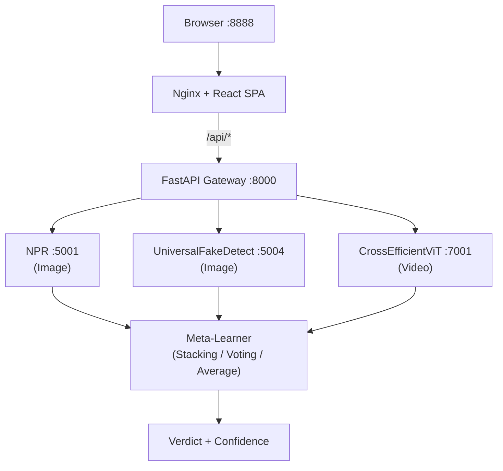

# 🧠 DeepFake

### Enterprise-grade deepfake detection across image, video, and audio

DeepFake is a **modular, production-ready platform** designed to detect synthetic media with high confidence. It combines multiple state-of-the-art detection models into a unified **ensemble intelligence system**.

Each model runs in an isolated Docker container, while a centralized **API Gateway** orchestrates inference, aggregates predictions, and produces a final verdict using advanced fusion strategies.

> ⚡ Add a new model in minutes. Retrain the entire ensemble in a single command.

---

<div align="center">
  
</div>

---

## 🚀 Why DeepFake?

- 🧩 **Plug-and-play architecture** — easily integrate new detection models  
- 🐳 **Fully containerized** — clean, scalable, production-ready  
- 🧠 **Ensemble intelligence** — stronger than any single model  
- ⚡ **Fast API gateway** — optimized orchestration with FastAPI  
- 🔁 **Continuous improvement** — retrain anytime with one command  

---

## 🏗️ Architecture



### 🧠 Core Idea

Each model exposes:
- `GET /health` → service health check  
- `POST /predict` → inference endpoint  

The gateway dynamically reads model configs and handles routing, aggregation, and response generation — **no manual wiring needed**.

---

## ⚡ Quick Start

```bash
git clone repo__
cd DeepFake
make start
```

| URL | Description |
|-----|------------|
| http://localhost:8888 | 🌐 Web dashboard |
| http://localhost:8000/docs | 📘 API (Swagger UI) |

---

## 🤖 Active Models

| Model | Type | Port | Description |
|------|------|------|-------------|
| **NPR Deepfake** | Image | 5001 | Detects subtle artifacts using neural patterns |
| **UniversalFakeDetect** | Image | 5004 | CLIP-based generalizable detector |
| **Cross-Efficient ViT** | Video | 7001 | Hybrid EfficientNet + Transformer |

> 📦 All model weights are mirrored on HuggingFace for reliability and fast access.

---

## 🧠 Ensemble Intelligence

DeepFake supports multiple fusion strategies:

| Method | Description |
|--------|------------|
| **Voting** | Majority decision across models |
| **Average** | Mean probability aggregation |
| **Stacking** | Meta-learner trained on model outputs |

Stacking uses trained artifacts stored in:
```
api/meta_model_artifacts/
```

Retrain anytime:
```bash
make retrain MEDIA_TYPE=image
```

---

## ➕ Add a New Model (2 Minutes Setup)

DeepFake provides an SDK that abstracts:
- HTTP serving  
- input decoding  
- thread safety  
- lifecycle management  

You only write inference logic.

### 🔧 Automated Setup

```bash
make add-model NAME=my_detector MEDIA_TYPE=image PORT=5008
make start
make retrain MEDIA_TYPE=image
```

### 🧩 Minimal Implementation

```python
import torch
from deepfake_sdk import ImageModel, PredictionResult

class MyDetector(ImageModel):
    def load(self):
        self.model = torch.load(self.weights_path("weights/model.pth"))
        self.model.eval()

    def predict(self, input_data: str, threshold: float) -> PredictionResult:
        image = self.decode_image(input_data)
        prob = self.run_inference(image)
        return self.make_result(probability=prob, threshold=threshold)
```

---

## 🔁 Retraining Pipeline

DeepFake includes a full training pipeline:

```bash
make retrain MEDIA_TYPE=image
```

Advanced tuning with Optuna:

```bash
make retrain MEDIA_TYPE=image OPTIMIZER=optuna TRIALS=100
```

What happens under the hood:

1. ✅ Health-check all models  
2. 📊 Run inference on benchmark dataset  
3. 🧮 Generate feature matrix  
4. 🤖 Train multiple classifiers:
   - Logistic Regression
   - Random Forest
   - Gradient Boosting
   - SVM, KNN, Naive Bayes
   - XGBoost, LightGBM  
5. 🏆 Select best performer automatically  

---

## 📊 Benchmark Dataset

Available on HuggingFace:

| Modality | Real | Fake | Total |
|----------|------|------|-------|
| Images | 2,000 | 2,000 | 4,000 |
| Audio | 1,000 | 1,000 | 2,000 |
| Video | 100 | 100 | 200 |

Supports **30+ generation techniques**, including:
- Stable Diffusion, Midjourney, DALL·E  
- Voice synthesis (HiFiGAN, WaveGlow)  
- Video generators (Sora, Gen-2, etc.)  

---

## 🔌 API Usage

### Predict (Base64)

```bash
curl -X POST http://localhost:8000/predict \
  -H "Content-Type: application/json" \
  -d '{"media_type": "image", "image_data": "<base64>", "ensemble_method": "voting"}'
```

### Upload File

```bash
curl -X POST http://localhost:8000/detect \
  -F "file=@photo.jpg" \
  -F "ensemble_method=stacking"
```

### Sample Response

```json
{
  "verdict": "fake",
  "confidence_in_verdict": 0.92,
  "ensemble_score_is_fake": 0.92,
  "ensemble_method_used": "stacking"
}
```

---

## 🔐 Authentication

```bash
# Register
curl -X POST http://localhost:8000/register

# Login
curl -X POST http://localhost:8000/token

# Access protected routes
curl -H "Authorization: Bearer <token>" http://localhost:8000/history
```

---

## 🛠️ Commands

```bash
make start         # Start services
make stop          # Stop services
make health        # Check model health
make test          # Run tests
make lint          # Code quality checks
make add-model     # Add new model
make retrain       # Retrain ensemble
make clean         # Cleanup containers
```

---

## 📁 Project Structure

```
DeepFake/
├── api/
├── models/
├── sdk/
├── docs/
├── docker/
└── ...
```

---

## 👨‍💻 Author

**Aryan Maurya (AMSR)**  
Full Stack Developer | AI Systems Builder  

> Building scalable AI platforms that move from research → production.

---

## 📜 License

MIT License — see `LICENSE`.

---

## 🙏 Credits

DeepFake integrates research from:

- NPR Deepfake Detection  
- UniversalFakeDetect  
- Cross-Efficient ViT  
- OpenAI CLIP  

---

## 📌 Citation

```bibtex
@misc{deepfake,
  author = {Aryan Maurya},
  title = {DeepFake: Enterprise-Grade Deepfake Detection Platform},
  year = {2026-27},
  publisher = {GitHub}
}
```

---

### ⭐ If you find this useful, consider giving it a star!